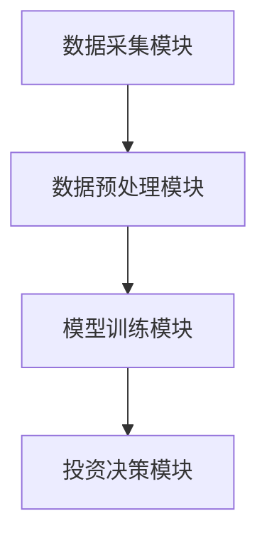
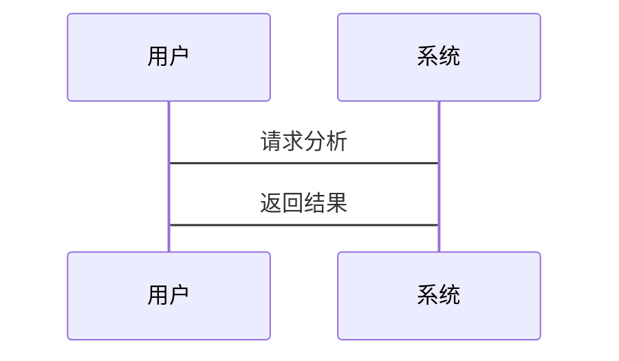

                 


# 价值投资中的生物启发型计算机架构前景

> 关键词：价值投资，生物启发计算，神经网络，遗传算法，投资组合优化

> 摘要：本文探讨了生物启发计算在价值投资中的应用前景，分析了神经网络、遗传算法等生物启发技术在投资决策中的潜力。通过系统架构设计和项目实战，展示了如何利用生物启发计算提升投资分析的准确性和效率。

---

## 第1章: 价值投资与生物启发计算概述

### 1.1 价值投资的基本概念

#### 1.1.1 价值投资的定义
价值投资是一种投资策略，通过分析企业的基本面，寻找市场价格低于其内在价值的投资机会。核心在于长期持有优质资产，追求长期稳定的收益。

#### 1.1.2 价值投资的核心原则
- 企业内在价值是关键：通过分析财务报表、行业地位等因素，评估企业的实际价值。
- 安全边际：买入价格低于内在价值，以降低风险。
- 长期持有：避免频繁交易，降低交易成本，关注企业的长期发展。

#### 1.1.3 价值投资与传统投资的区别
- **传统投资**：依赖市场趋势和技术分析，注重短期价格波动。
- **价值投资**：关注企业基本面，注重长期价值。

### 1.2 生物启发计算的基本概念

#### 1.2.1 生物启发计算的定义
生物启发计算是基于生物系统的结构和功能，模拟自然进化和适应机制，用于解决复杂计算问题的一种方法。

#### 1.2.2 生物启发计算的核心原理
- **神经网络**：模拟人脑神经网络，用于模式识别和数据分类。
- **遗传算法**：模拟生物进化，通过选择、交叉和变异优化解。
- **自适应系统**：根据环境变化自动调整系统行为。

#### 1.2.3 生物启发计算与传统计算的区别
- **传统计算**：基于确定性算法，解决结构化问题。
- **生物启发计算**：基于非确定性算法，解决复杂、动态问题。

### 1.3 价值投资与生物启发计算的交集

#### 1.3.1 价值投资中的计算问题
- 数据分析复杂：需处理大量非结构化数据。
- 预测市场行为：市场受多种因素影响，传统模型难以捕捉。
- 投资组合优化：需在多个变量间找到最优解。

#### 1.3.2 生物启发计算在投资中的应用潜力
- 神经网络用于市场情绪分析。
- 遗传算法优化投资组合。
- 自适应系统应对市场变化。

#### 1.3.3 价值投资与生物启发计算的结合点
- 数据分析：利用生物启发算法处理复杂数据。
- 模型构建：建立非线性模型预测市场走势。
- 投资决策：优化投资组合，提高收益。

---

## 第2章: 生物启发计算的核心概念与价值投资的联系

### 2.1 生物启发计算的核心概念

#### 2.1.1 神经网络与价值投资
- **神经网络的结构**：输入层、隐藏层、输出层，用于数据分类和回归。
- **神经网络的训练**：使用历史数据训练网络，预测市场走势。
- **神经网络的应用**：用于识别市场趋势和风险因素。

#### 2.1.2 遗传算法与投资组合优化
- **遗传算法的步骤**：初始化、选择、交叉、变异、评估。
- **遗传算法的优化目标**：最大化收益，最小化风险。
- **遗传算法的应用**：优化投资组合配置。

#### 2.1.3 生物自适应系统与动态市场分析
- **自适应系统的特征**：实时调整，适应市场变化。
- **自适应系统的应用**：动态调整投资策略。

### 2.2 价值投资中的关键要素

#### 2.2.1 企业基本面分析
- 财务指标：市盈率、市净率、ROE等。
- 行业地位：市场占有率、竞争环境。
- 管理团队：管理能力、战略规划。

#### 2.2.2 安全边际的概念
- 安全边际计算：买入价低于内在价值。
- 安全边际的作用：降低投资风险，提高收益稳定性。

#### 2.2.3 市场情绪与投资者心理
- 市场情绪波动：影响短期价格。
- 投资者心理：影响市场行为。

### 2.3 生物启发计算与价值投资的系统性联系

#### 2.3.1 生物启发计算在企业基本面分析中的应用
- 数据挖掘：利用神经网络分析财务数据。
- 风险评估：通过遗传算法识别潜在风险。

#### 2.3.2 神经网络在市场情绪预测中的作用
- 情绪分类：识别市场情绪的正负。
- 情绪预测：预测市场趋势。

#### 2.3.3 遗传算法在投资组合优化中的应用
- 组合优化：寻找最优资产配置。
- 风险控制：降低投资组合风险。

---

## 第3章: 生物启发计算的算法原理与数学模型

### 3.1 神经网络的基本原理

#### 3.1.1 神经网络的结构
- 输入层：接收输入数据。
- 隐藏层：处理数据，提取特征。
- 输出层：产生预测结果。

#### 3.1.2 神经网络的训练过程
- �正向传播：输入数据，计算输出。
- 反向传播：计算误差，调整权重。

#### 3.1.3 神经网络的数学模型
$$ y = \sigma(w x + b) $$
其中，$\sigma$ 是激活函数，$w$ 是权重，$x$ 是输入，$b$ 是偏置。

### 3.2 遗传算法的基本原理

#### 3.2.1 遗传算法的步骤
1. 初始化种群。
2. 计算适应度。
3. 选择优秀个体。
4. 交叉和变异。
5. 评估新种群。

#### 3.2.2 遗传算法的数学模型
$$ \text{适应度} = \sum w_i x_i $$
其中，$w_i$ 是权重，$x_i$ 是变量。

#### 3.2.3 遗传算法在投资组合优化中的应用
- 种群代表不同的投资组合。
- 适应度函数计算收益与风险。

### 3.3 生物启发计算的数学模型

#### 3.3.1 神经网络的数学
$$ \text{输出} = \sum w_{ij} a_j + b_i $$
其中，$a_j$ 是隐藏层激活值，$w_{ij}$ 是权重，$b_i$ 是偏置。

#### 3.3.2 遗传算法的数学
$$ \text{适应度} = \frac{\text{收益} - \text{风险}}{\text{标准差}} $$

---

## 第4章: 系统分析与架构设计方案

### 4.1 问题场景介绍
- 数据源：财务报表、市场数据、新闻情绪。
- 问题：如何利用生物启发计算优化投资决策。

### 4.2 项目介绍
- 目标：构建生物启发计算系统，辅助价值投资决策。
- 范围：企业基本面分析、市场情绪预测、投资组合优化。

### 4.3 系统功能设计
- 数据采集模块：收集企业数据和市场数据。
- 数据预处理模块：清洗和转换数据。
- 模型训练模块：训练神经网络和遗传算法模型。
- 投资决策模块：生成投资建议。

### 4.4 系统架构设计
- 分层架构：数据层、模型层、决策层。
- 模块化设计：各模块独立，便于维护。

#### 4.4.1 系统架构图


### 4.5 系统接口设计
- 数据接口：与数据库交互。
- 模型接口：与外部算法模块交互。
- 决策接口：输出投资建议。

### 4.6 系统交互设计
- 用户输入：选择企业进行分析。
- 系统处理：数据预处理、模型训练。
- 输出结果：投资建议和风险评估。

#### 4.6.1 系统交互图


---

## 第5章: 项目实战

### 5.1 环境安装
- Python：安装Anaconda。
- 库：安装numpy、pandas、keras、遗传算法库。

### 5.2 核心实现源代码

#### 5.2.1 神经网络实现
```python
import numpy as np

def sigmoid(x):
    return 1 / (1 + np.exp(-x))

def neural_network(train_x, train_y, test_x):
    np.random.seed(1)
    weights = 2 * np.random.random((input_dim, hidden_dim)) - 1
    weights_output = 2 * np.random.random((hidden_dim, output_dim)) - 1
    
    for _ in range(epochs):
        hidden = sigmoid(np.dot(train_x, weights))
        output = sigmoid(np.dot(hidden, weights_output))
        error = train_y - output
        weights_output -= np.dot(hidden.T, error) * learning_rate
        weights -= np.dot(train_x.T, error * sigmoid_derivative(output)) * learning_rate
    return sigmoid(np.dot(test_x, weights) @ weights_output)
```

#### 5.2.2 遗传算法实现
```python
def fitness(individual):
    return -sum(individual * (weights))

def genetic_algorithm(population_size, generations):
    population = initial_population()
    for _ in range(generations):
        fitness_scores = [fitness(individual) for individual in population]
        population = select_and_reproduce(population, fitness_scores)
    return population[0]
```

### 5.3 应用解读与分析
- 神经网络用于预测企业价值。
- 遗传算法优化投资组合。

### 5.4 案例分析
- 数据准备：收集企业财务数据和市场数据。
- 模型训练：训练神经网络和遗传算法模型。
- 结果分析：预测企业价值，优化投资组合。

---

## 第6章: 总结与展望

### 6.1 总结
生物启发计算在价值投资中具有巨大潜力，能够解决传统方法难以处理的复杂问题。

### 6.2 未来展望
- 更复杂的模型：深度学习、强化学习。
- 更多的应用场景：实时交易、动态风险管理。

### 6.3 投资与研究建议
- 关注技术进步：跟踪生物启发计算的发展。
- 保持学习：不断更新知识和技能。

---

通过以上结构，我们可以系统地探讨生物启发计算在价值投资中的应用前景，为投资者和研究者提供有价值的参考。

