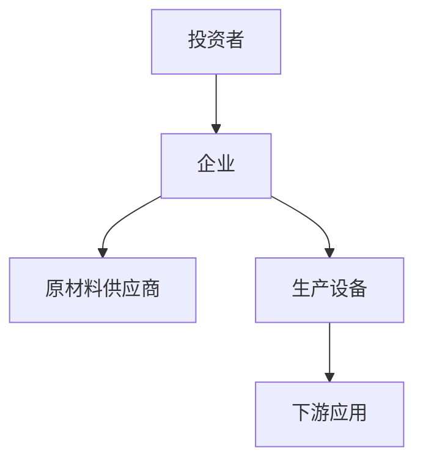
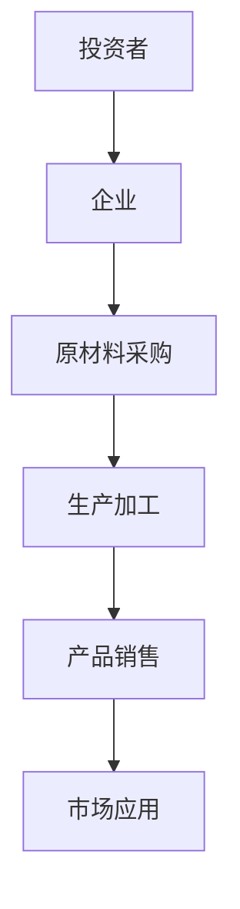
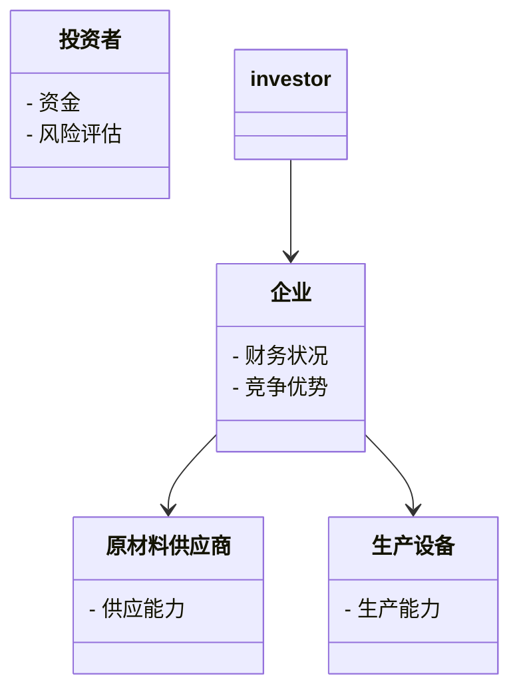

                 


# 《价值投资中的生物塑料产业链分析》

## 关键词：生物塑料，产业链，价值投资，市场分析，投资策略

## 摘要：本文深入分析生物塑料产业链的结构、各环节的关联性及价值投资的基本原理。通过市场现状、竞争格局和投资模型的分析，为投资者提供科学的决策依据。

---

# 第一部分：价值投资中的生物塑料产业链分析背景介绍

## 第1章：生物塑料产业链的基本概念

### 1.1 生物塑料的定义与分类

生物塑料是一种以可再生资源（如玉米淀粉、甘蔗）为原料，通过生物或化学方法制成的材料。常见的类型包括聚乳酸（PLA）和聚羟基脂肪酸酯（PHA），它们具有可降解性和环保性。

### 1.2 产业链的构成与环节

生物塑料产业链分为上游原材料供应、中游生产加工和下游应用三个环节：

1. **上游原材料**：如玉米、甘蔗，提供基础材料。
2. **中游生产**：通过聚合反应生产生物塑料。
3. **下游应用**：用于包装、纺织等领域。

### 1.3 价值投资的基本原理

价值投资强调寻找被市场低估的企业，关注其财务状况、行业地位和竞争优势。通过分析企业内在价值，识别投资机会。

---

## 第2章：生物塑料产业链的市场现状与趋势

### 2.1 市场发展现状

- **市场规模**：预计未来几年将以较快的速度增长，尤其在环保政策推动下。
- **区域分布**：欧盟、美国和中国是主要市场，中国增长最快。

### 2.2 产业链的竞争格局

- **领先企业**：如NatureWorks、BASF等，技术领先且市场份额大。
- **合作趋势**：企业间合作增多，形成产业链整合趋势。

### 2.3 技术与成本挑战

- **成本问题**：当前生产成本高于传统塑料，技术进步正在降低成本。
- **政策支持**：政府出台环保政策，推动生物塑料的应用。

---

# 第二部分：生物塑料产业链的核心概念与联系

## 第3章：产业链各环节的核心要素与关系

### 3.1 上游原材料的供应

- **原材料价格**：波动影响成本。
- **可持续性**：选择环保原材料提升企业形象。

### 3.2 中游生产加工

- **技术壁垒**：高技术要求导致进入门槛高。
- **生产效率**：直接影响成本和利润。

### 3.3 下游应用领域

- **多样化需求**：不同领域对生物塑料的需求差异大。
- **政策影响**：环保政策推动市场需求增长。

## 第4章：产业链的实体关系与流程图

### 4.1 实体关系图



### 4.2 主要流程图



---

# 第三部分：价值投资中的生物塑料产业链分析模型

## 第5章：投资分析模型的构建与原理

### 5.1 模型构建

- **输入变量**：企业财务状况、市场需求、政策环境。
- **输出结果**：企业投资价值评估。

### 5.2 算法原理

使用线性回归模型分析企业的价值：

$$ y = \beta_0 + \beta_1x_1 + \beta_2x_2 + \epsilon $$

其中，$y$ 是预测价值，$x_1$ 和 $x_2$ 是关键变量，$\epsilon$ 是误差项。

---

## 第6章：系统分析与架构设计

### 6.1 系统功能设计

- **领域模型**：展示企业、原材料、生产过程的关系。



### 6.2 系统架构设计

展示系统的分层架构：


### 6.3 接口与交互设计

展示投资者与企业之间的交互：

```mermaid
sequenceDiagram
investor ->> 企业： 提供资金
企业 ->> 投资者： 提供财务报告
investor ->> 企业： 调整投资策略
```

---

## 第7章：项目实战

### 7.1 环境安装

安装Python、Jupyter Notebook等工具。

### 7.2 核心代码实现

编写投资模型的代码：

```python
import pandas as pd
import numpy as np
from sklearn.linear_model import LinearRegression

# 导入数据
data = pd.read_csv('bioplastic_data.csv')

# 训练模型
model = LinearRegression()
model.fit(data[[' revenue', ' profit']], data[' value'])

# 预测投资价值
predicted_value = model.predict([[ new_revenue, new_profit ]])
```

### 7.3 案例分析

以NatureWorks为例，分析其在产业链中的优势，评估投资价值。

---

## 第8章：总结与建议

### 8.1 投资策略

- 关注技术领先、成本控制好的企业。
- 保持对环保政策的关注，抓住市场机会。

### 8.2 风险管理

- 分散投资，降低风险。
- 定期评估投资组合，及时调整策略。

---

通过以上分析，投资者可以更好地理解生物塑料产业链，识别投资机会，制定科学的投资策略。

