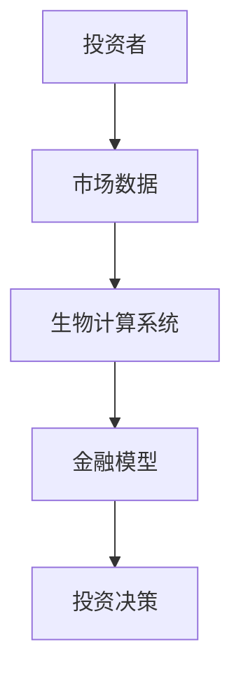
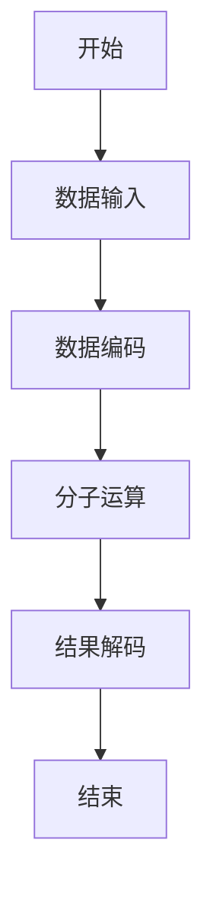
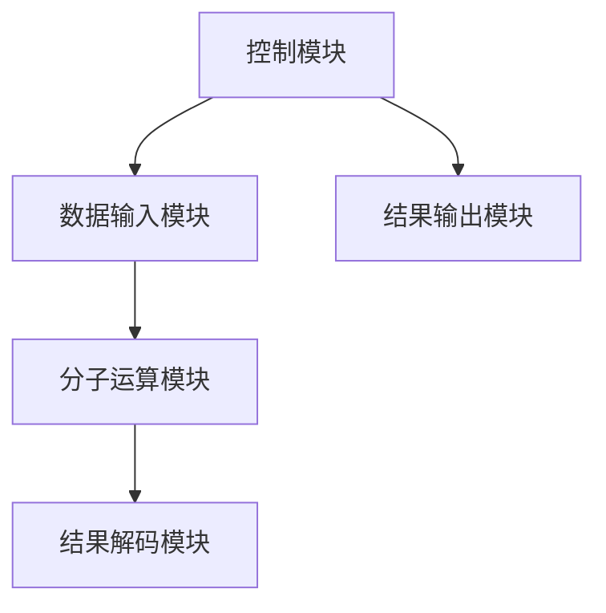

                 


# 价值投资中的生物计算机发展趋势

## 关键词：生物计算机，价值投资，投资趋势，算法模型，金融市场

## 摘要：  
随着科技的快速发展，生物计算机在金融领域的应用逐渐崭露头角。本文将探讨生物计算机如何在价值投资中发挥重要作用，分析其发展趋势，揭示其在市场预测、投资决策优化和风险管理中的潜力。通过结合生物计算的核心原理和价值投资的哲学，本文旨在为投资者提供一种全新的视角，利用生物计算机技术提升投资效率和准确性。

---

# 第一部分：价值投资中的生物计算机发展趋势概述

## 第1章：生物计算机与价值投资的背景介绍

### 1.1 生物计算机的基本概念

#### 1.1.1 生物计算的定义与特点
生物计算（Biocomputing）是指利用生物分子（如DNA、RNA、蛋白质）作为信息处理的基本单元，通过生物分子间的相互作用来实现信息存储、运算和传输的技术。与传统计算机相比，生物计算具有以下特点：
- **并行性**：生物分子可以在同一时间处理大量信息。
- **分子间作用**：生物分子通过化学反应和相互作用进行信息处理。
- **能耗低**：生物计算的能量消耗远低于传统电子计算机。

#### 1.1.2 生物计算与传统计算的对比
| 对比维度 | 生物计算 | 传统计算 |
|----------|----------|----------|
| 处理速度 | 极高（理论上可以达到量子计算的水平） | 较低（受限于电子信号传输） |
| 能耗     | 极低     | 较高     |
| 并行性   | 极高     | 较低     |
| 信息存储 | 高密度   | 较低密度 |

#### 1.1.3 生物计算在投资中的应用潜力
生物计算在金融领域的潜力主要体现在：
- **实时数据分析**：通过生物分子传感器实时监测市场数据。
- **复杂模型计算**：生物计算的并行性使其能够快速处理复杂的金融模型。
- **风险管理**：利用生物计算的高精度预测能力，优化投资组合的风险控制。

### 1.2 价值投资的基本原理

#### 1.2.1 价值投资的核心概念
价值投资是一种基于对公司内在价值评估的投资策略，核心在于寻找市场价格低于内在价值的股票。其核心理念包括：
- **安全边际**：买入价格低于内在价值。
- **长期视角**：关注公司的长期盈利能力。
- **基本面分析**：通过财务报表等数据评估公司价值。

#### 1.2.2 价值投资的哲学基础
价值投资的哲学基础可以概括为：
- **市场非有效**：市场并非总是合理定价，存在错配机会。
- **逆向思维**：在市场恐慌时寻找低估资产，在市场狂热时保持冷静。
- **长期主义**：关注公司的长期价值，而非短期波动。

#### 1.2.3 价值投资与现代金融的结合
现代金融学通过数学模型（如CAPM、APT）对市场进行分析，而价值投资则通过基本面分析和对公司治理的深入研究来寻找投资机会。生物计算的引入可以将两者结合起来，利用生物计算的强大计算能力优化传统金融模型。

---

## 第2章：生物计算机在价值投资中的核心概念与联系

### 2.1 生物计算的核心原理

#### 2.1.1 生物计算的数学模型
生物计算的数学模型可以通过以下步骤实现：
1. **数据编码**：将金融市场数据（如股票价格、财务指标）编码为生物分子的形式。
2. **信息处理**：利用生物分子的相互作用进行数据运算。
3. **结果解码**：将处理后的生物分子信号解码为可读的金融数据。

#### 2.1.2 生物计算的算法特征
生物计算的算法具有以下特征：
- **自适应性**：能够根据市场变化自动调整计算参数。
- **容错性**：生物分子的冗余性使其能够在部分错误的情况下继续计算。
- **可扩展性**：可以通过增加生物分子数量来扩展计算能力。

#### 2.1.3 生物计算的实体关系图
以下是生物计算在价值投资中的实体关系图：



### 2.2 生物计算与价值投资的联系

#### 2.2.1 生物计算在投资决策中的应用
生物计算可以用于以下投资决策场景：
- **股票筛选**：通过生物计算快速筛选出符合价值投资标准的股票。
- **风险评估**：利用生物计算对投资组合的风险进行实时评估。
- **市场预测**：基于生物计算的高精度预测能力，预测市场的短期波动。

#### 2.2.2 生物计算对市场预测的影响
生物计算在市场预测中的优势包括：
- **高精度**：生物计算的并行性和分子间作用使其能够捕捉市场的细微变化。
- **实时性**：生物分子传感器可以实时监测市场数据，实现即时预测。
- **复杂性**：能够处理传统金融模型难以应对的复杂市场环境。

#### 2.2.3 生物计算与投资策略的结合
生物计算可以通过以下方式优化投资策略：
- **动态调整**：根据市场变化动态调整投资组合。
- **风险管理**：通过生物计算的高精度预测能力优化风险控制。
- **个性化投资**：为投资者提供个性化的投资建议。

---

## 第3章：生物计算机的算法原理与数学模型

### 3.1 生物计算算法的基本原理

#### 3.1.1 生物计算算法的流程图
以下是生物计算算法的流程图：



#### 3.1.2 生物计算算法的实现步骤
1. **数据输入**：将金融市场数据输入生物计算系统。
2. **数据编码**：将数据编码为生物分子的形式。
3. **分子运算**：利用生物分子的相互作用进行数据运算。
4. **结果解码**：将处理后的生物分子信号解码为可读的金融数据。
5. **结果输出**：输出处理后的金融数据。

#### 3.1.3 生物计算算法的优化方法
生物计算算法的优化方法包括：
- **分子设计**：设计高效的生物分子以提高计算速度。
- **系统优化**：优化生物计算系统的结构以提高计算效率。
- **算法改进**：改进生物计算算法以提高计算精度。

### 3.2 生物计算的数学模型与公式

#### 3.2.1 生物计算的核心公式
以下是生物计算的核心公式：

$$
\text{价值} = \frac{\text{内在价值}}{\text{市场价格}} \times \text{安全边际}
$$

#### 3.2.2 生物计算模型的数学推导
生物计算模型的数学推导过程如下：

1. **数据编码**：将金融市场数据编码为生物分子的形式。
2. **分子运算**：利用生物分子的相互作用进行数据运算。
3. **结果解码**：将处理后的生物分子信号解码为可读的金融数据。

#### 3.2.3 生物计算模型的实例分析
以下是一个生物计算模型的实例分析：

假设我们要预测某只股票的价格，可以通过以下步骤进行：
1. **数据输入**：输入该股票的历史价格数据。
2. **数据编码**：将价格数据编码为生物分子的形式。
3. **分子运算**：利用生物分子的相互作用进行数据运算。
4. **结果解码**：将处理后的生物分子信号解码为可读的价格数据。
5. **结果输出**：输出预测的价格数据。

---

## 第4章：价值投资中的生物计算机系统分析与架构设计

### 4.1 问题场景与项目介绍

#### 4.1.1 价值投资中的问题场景
价值投资中的问题场景包括：
- **数据处理**：需要处理大量的金融市场数据。
- **计算效率**：需要高效的计算能力来处理复杂的金融模型。
- **风险管理**：需要实时的风险评估和优化。

#### 4.1.2 生物计算机在投资中的应用案例
生物计算机在投资中的应用案例包括：
- **股票筛选**：通过生物计算快速筛选出符合价值投资标准的股票。
- **风险评估**：利用生物计算对投资组合的风险进行实时评估。
- **市场预测**：基于生物计算的高精度预测能力，预测市场的短期波动。

#### 4.1.3 项目目标与范围
项目目标是利用生物计算技术优化价值投资策略，项目范围包括：
- **数据处理**：开发高效的生物计算系统处理金融市场数据。
- **计算效率**：优化生物计算系统的计算效率。
- **风险管理**：利用生物计算技术优化投资组合的风险控制。

### 4.2 系统功能设计

#### 4.2.1 系统功能模块划分
系统功能模块包括：
- **数据输入模块**：输入金融市场数据。
- **数据编码模块**：将数据编码为生物分子的形式。
- **分子运算模块**：利用生物分子的相互作用进行数据运算。
- **结果解码模块**：将处理后的生物分子信号解码为可读的金融数据。
- **结果输出模块**：输出处理后的金融数据。

#### 4.2.2 系统功能流程图
以下是系统功能流程图：


#### 4.2.3 系统功能的实现方法
系统功能的实现方法包括：
- **数据输入**：通过生物传感器实时采集金融市场数据。
- **数据编码**：将数据编码为生物分子的形式。
- **分子运算**：利用生物分子的相互作用进行数据运算。
- **结果解码**：将处理后的生物分子信号解码为可读的金融数据。
- **结果输出**：输出处理后的金融数据。

### 4.3 系统架构设计

#### 4.3.1 系统架构图
以下是系统架构图：



#### 4.3.2 系统模块之间的关系
系统模块之间的关系包括：
- **控制模块**：负责协调各模块的运行。
- **数据输入模块**：负责输入金融市场数据。
- **分子运算模块**：负责利用生物分子的相互作用进行数据运算。
- **结果解码模块**：负责将处理后的生物分子信号解码为可读的金融数据。
- **结果输出模块**：负责输出处理后的金融数据。

#### 4.3.3 系统架构的优化建议
系统架构的优化建议包括：
- **模块化设计**：将系统划分为多个功能模块，便于管理和优化。
- **并行处理**：利用生物计算的并行性提高计算效率。
- **容错设计**：设计容错机制以提高系统的可靠性。

---

## 第5章：价值投资中的生物计算机项目实战

### 5.1 环境安装与配置

#### 5.1.1 开发环境的搭建
开发环境的搭建包括：
- **操作系统**：选择适合的生物计算开发环境。
- **工具安装**：安装必要的开发工具和库。
- **数据源**：获取金融市场数据源。

#### 5.1.2 必要工具的安装
必要的工具包括：
- **生物传感器**：用于实时采集金融市场数据。
- **生物计算系统**：用于处理金融市场数据。
- **数据分析工具**：用于分析和解读处理后的数据。

#### 5.1.3 数据源的准备
数据源的准备包括：
- **股票价格数据**：获取目标股票的历史价格数据。
- **财务指标数据**：获取目标公司的财务指标数据。
- **市场新闻数据**：获取与目标公司相关的市场新闻数据。

### 5.2 核心算法实现

#### 5.2.1 生物计算算法的Python实现
以下是生物计算算法的Python实现代码：

```python
def bio_computation(data):
    # 数据编码
    encoded_data = encode(data)
    # 分子运算
    result = compute(encoded_data)
    # 结果解码
    decoded_result = decode(result)
    return decoded_result
```

#### 5.2.2 算法实现的代码解读
- **数据编码**：将金融市场数据编码为生物分子的形式。
- **分子运算**：利用生物分子的相互作用进行数据运算。
- **结果解码**：将处理后的生物分子信号解码为可读的金融数据。

#### 5.2.3 算法实现的优化建议
算法实现的优化建议包括：
- **优化编码方法**：选择高效的编码方法提高数据处理速度。
- **优化运算模块**：优化分子运算模块的计算效率。
- **优化解码方法**：选择高效的解码方法提高结果输出速度。

### 5.3 实际案例分析

#### 5.3.1 案例背景与数据准备
案例背景是某只股票的价格预测，数据准备包括：
- **股票价格数据**：目标股票的历史价格数据。
- **财务指标数据**：目标公司的财务指标数据。
- **市场新闻数据**：与目标公司相关的市场新闻数据。

#### 5.3.2 算法在案例中的应用
算法在案例中的应用包括：
- **数据编码**：将股票价格数据编码为生物分子的形式。
- **分子运算**：利用生物分子的相互作用进行数据运算。
- **结果解码**：将处理后的生物分子信号解码为可读的股票价格数据。

#### 5.3.3 案例分析的结果与解读
案例分析的结果包括：
- **预测股票价格**：通过生物计算算法预测的股票价格。
- **预测准确率**：算法的预测准确率。
- **误差分析**：对算法的误差进行分析并提出改进建议。

---

## 第6章：总结与展望

### 6.1 最佳实践与小结

#### 6.1.1 最佳实践
- **数据质量**：确保输入数据的准确性和完整性。
- **系统优化**：不断优化生物计算系统的结构和算法。
- **风险管理**：利用生物计算技术优化投资组合的风险控制。

#### 6.1.2 小结
生物计算在价值投资中的应用潜力巨大，可以通过以下方式优化投资策略：
- **提高计算效率**：利用生物计算的并行性提高数据处理速度。
- **优化投资决策**：通过生物计算的高精度预测能力优化投资决策。
- **降低投资风险**：利用生物计算技术优化投资组合的风险控制。

### 6.2 注意事项

#### 6.2.1 投资者注意事项
- **技术门槛**：生物计算技术的门槛较高，投资者需要具备一定的技术背景。
- **数据质量**：确保输入数据的准确性和完整性。
- **系统维护**：定期维护生物计算系统以确保其正常运行。

### 6.3 拓展阅读

#### 6.3.1 相关书籍
- 《生物计算入门》
- 《价值投资实战指南》

#### 6.3.2 相关论文
- 《生物计算在金融领域的应用研究》
- 《价值投资与现代金融的结合》

---

# 结语

生物计算作为一项新兴技术，正在逐步改变传统的金融行业。通过本文的分析，我们可以看到生物计算在价值投资中的巨大潜力。未来，随着生物计算技术的不断发展，其在金融领域的应用将更加广泛和深入，为投资者提供更加高效和准确的投资决策支持。

