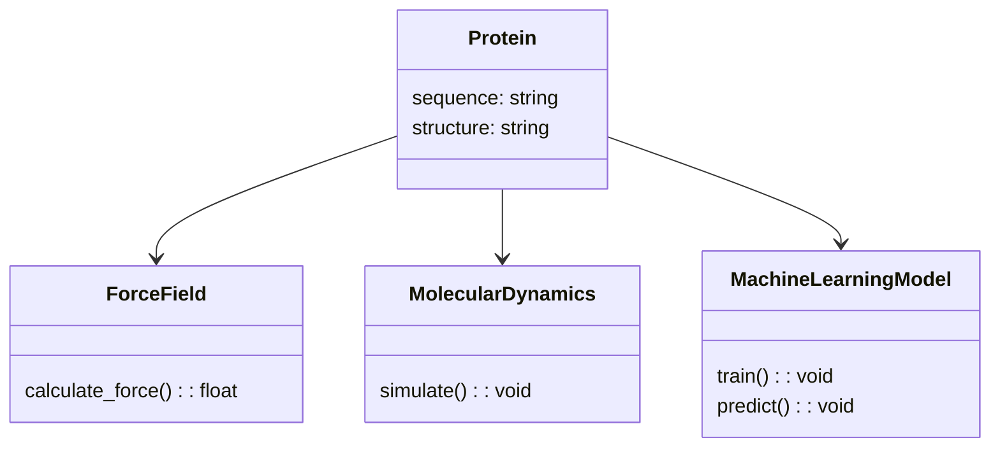
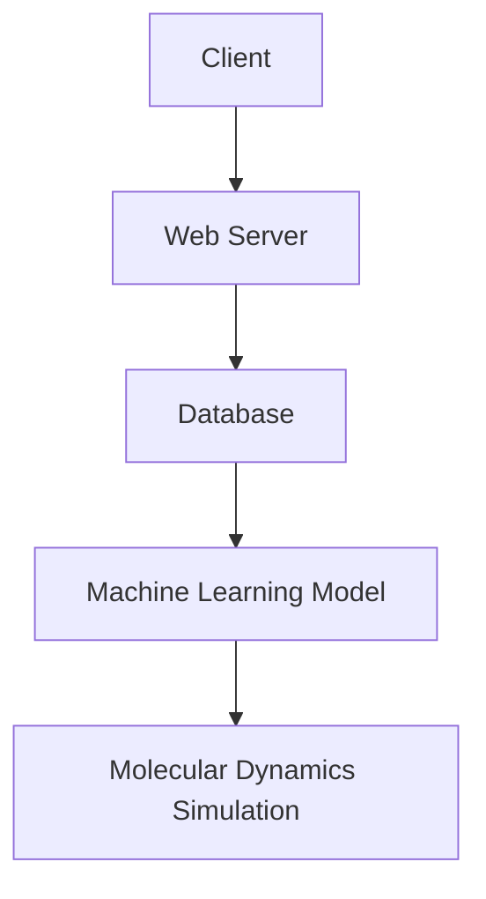
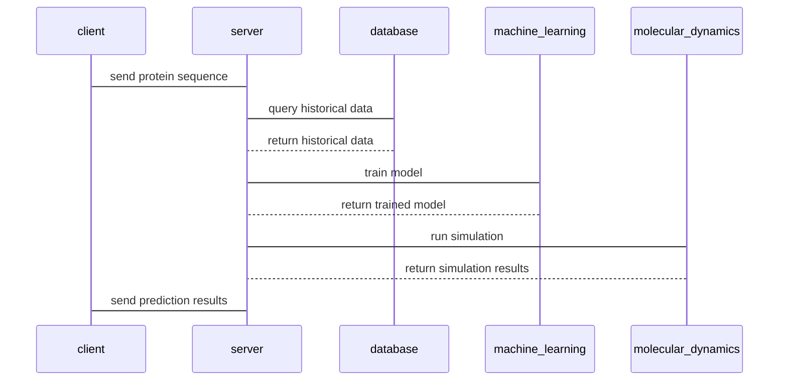

                 


# 价值投资中的生物计算蛋白质折叠技术前景

> **关键词**：价值投资、生物计算、蛋白质折叠、算法原理、系统设计、项目实战  
>
> **摘要**：蛋白质折叠技术是生物计算领域的重要研究方向，其在药物研发、疾病治疗和生物技术中的应用前景广阔。本文将从蛋白质折叠的基本概念、生物计算的算法原理、系统设计与架构，以及项目实战等方面，详细分析蛋白质折叠技术在价值投资中的潜力和应用前景。

---

# 第1章: 蛋白质折叠与生物计算的背景介绍

## 1.1 蛋白质折叠的基本概念

### 1.1.1 蛋白质的结构与功能关系
蛋白质是生命活动的核心分子，其功能由三维结构决定。氨基酸序列的折叠方式直接决定了蛋白质的功能特性。例如，错误折叠的蛋白质可能导致阿尔茨海默病、帕金森病等疾病。

### 1.1.2 蛋白质折叠问题的科学意义
蛋白质折叠问题被称为分子生物学的“圣杯”。解决这一问题不仅有助于理解生命的基本规律，还能推动药物研发、疾病治疗等领域的发展。

### 1.1.3 生物计算在蛋白质折叠中的作用
生物计算通过模拟蛋白质的折叠过程，帮助科学家预测蛋白质的结构和功能。与传统实验方法相比，生物计算具有高效、低成本的优势。

## 1.2 价值投资与生物技术的结合

### 1.2.1 生物技术在投资中的潜力
生物技术是一个高增长、高回报的领域。蛋白质折叠技术作为生物技术的核心之一，具有巨大的商业价值。

### 1.2.2 蛋白质折叠技术的商业价值
蛋白质折叠技术在药物研发、生物制造等领域有广泛应用。例如，通过预测蛋白质结构，可以加速药物的设计和筛选过程。

### 1.2.3 价值投资中的生物计算机会
生物计算技术的进步为投资者提供了新的机会。通过投资于蛋白质折叠技术相关的公司或项目，投资者可以分享技术带来的收益。

---

# 第2章: 蛋白质折叠的核心概念与生物计算联系

## 2.1 蛋白质折叠的基本原理

### 2.1.1 氨基酸序列与折叠的关系
氨基酸序列决定了蛋白质的折叠方式。通过研究序列与折叠的关系，可以预测蛋白质的结构。

### 2.1.2 分子间作用力与折叠动力学
蛋白质折叠过程中，分子间作用力（如氢键、范德华力）起着关键作用。研究这些作用力有助于理解折叠动力学。

### 2.1.3 蛋白质稳定构象的特性
蛋白质折叠后会形成稳定的构象，这种构象是其功能的基础。生物计算可以通过模拟这些构象来预测蛋白质的行为。

## 2.2 生物计算在蛋白质折叠中的应用

### 2.2.1 分子动力学模拟的基本原理
分子动力学模拟通过计算分子间的相互作用，模拟蛋白质的折叠过程。这种方法可以提供原子级别的细节。

### 2.2.2 机器学习在蛋白质结构预测中的应用
机器学习算法（如深度学习）可以用于预测蛋白质的结构。例如，AlphaFold算法在蛋白质结构预测领域取得了突破性进展。

### 2.2.3 生物计算与实验数据的结合
生物计算与实验数据的结合可以提高预测的准确性。例如，利用实验数据对计算模型进行训练和优化。

---

# 第3章: 蛋白质折叠问题的算法原理

## 3.1 分子动力学模拟算法

### 3.1.1 分子动力学的基本步骤
分子动力学模拟通常包括以下步骤：
1. 初始化系统：设置初始条件，如温度、压力等。
2. 计算力：根据能量函数计算分子间的相互作用力。
3. 更新坐标：根据力更新分子的位置。
4. 计算能量：计算系统的能量变化。
5. 重复上述步骤，直到达到平衡。

### 3.1.2 马尔可夫链蒙特卡洛方法
马尔可夫链蒙特卡洛方法用于模拟分子的运动。通过随机采样，可以得到分子构象的分布。

### 3.1.3 能量函数的计算公式
能量函数用于描述分子间的相互作用。常见的能量函数包括：
$$E = \sum_{i<j} v_{ij}$$
其中，$v_{ij}$表示两个原子之间的相互作用能量。

## 3.2 机器学习算法在蛋白质折叠中的应用

### 3.2.1 基于神经网络的蛋白质结构预测
深度学习模型（如卷积神经网络和循环神经网络）可以用于预测蛋白质的结构。例如，AlphaFold模型通过神经网络预测蛋白质的三维结构。

### 3.2.2 图神经网络在蛋白质相互作用中的应用
图神经网络可以用于分析蛋白质分子图，预测蛋白质之间的相互作用。

### 3.2.3 深度学习模型的训练流程
深度学习模型的训练流程包括数据预处理、模型训练、模型优化等步骤。例如，使用实验数据对模型进行监督学习。

---

# 第4章: 蛋白质折叠的数学模型与算法实现

## 4.1 蛋白质折叠的数学模型

### 4.1.1 蛋白质能量函数的数学表达
能量函数用于描述蛋白质的折叠能量。常见的能量函数包括：
$$E = \sum_{i<j} v_{ij}$$
其中，$v_{ij}$表示两个原子之间的相互作用能量。

### 4.1.2 蛋白质结构预测的优化目标
蛋白质结构预测的目标是最小化能量函数。通过优化算法（如梯度下降），可以找到最低能量构象。

### 4.1.3 蛋白质折叠动力学的方程推导
蛋白质折叠动力学可以通过分子动力学方程描述：
$$\frac{dx}{dt} = -\frac{\partial E}{\partial x}$$
其中，$x$表示分子的位置，$t$表示时间。

## 4.2 生物计算算法的实现

### 4.2.1 分子动力学模拟的Python实现
以下是一个简单的分子动力学模拟的Python代码示例：
```python
import numpy as np

# 初始化系统
x = np.array([0.0, 0.0, 0.0])
v = np.array([1.0, 1.0, 1.0])

# 计算力
def calculate_force(x):
    # 这里省略具体的力计算逻辑
    return np.array([0.0, 0.0, 0.0])

# 更新坐标
for _ in range(1000):
    force = calculate_force(x)
    v = v - force * dt
    x = x + v * dt

print("Final position:", x)
```

### 4.2.2 机器学习模型的实现
以下是一个简单的深度学习模型的Python代码示例：
```python
import tensorflow as tf

# 定义模型
model = tf.keras.Sequential([
    tf.keras.layers.Dense(64, activation='relu'),
    tf.keras.layers.Dense(1, activation='sigmoid')
])

# 编译模型
model.compile(optimizer='adam', loss='binary_crossentropy', metrics=['accuracy'])

# 训练模型
model.fit(X_train, y_train, epochs=10, batch_size=32)
```

---

# 第5章: 蛋白质折叠技术的系统设计与项目实战

## 5.1 项目介绍

### 5.1.1 项目背景
本项目旨在通过生物计算技术预测蛋白质的折叠结构，为药物研发提供支持。

### 5.1.2 项目目标
通过分子动力学模拟和机器学习算法，预测蛋白质的三维结构。

## 5.2 系统功能设计

### 5.2.1 领域模型类图
以下是一个简单的领域模型类图：


### 5.2.2 系统架构设计
以下是一个简单的系统架构图：


### 5.2.3 系统接口设计
系统接口包括：
- 输入：蛋白质序列
- 输出：预测的蛋白质结构

### 5.2.4 系统交互序列图
以下是一个简单的系统交互序列图：


## 5.3 项目实战

### 5.3.1 环境安装
安装必要的Python库：
```bash
pip install numpy scipy tensorflow
```

### 5.3.2 系统核心实现
以下是一个简单的蛋白质折叠预测算法的实现：
```python
import numpy as np
from scipy.optimize import minimize

def energy_function(x):
    # 这里省略具体的能量函数实现
    return np.sum(x**2)

result = minimize(energy_function, x0=np.array([1.0, 1.0, 1.0]))
print("Optimal position:", result.x)
```

### 5.3.3 案例分析
通过案例分析，验证算法的准确性。例如，预测一个已知蛋白质的折叠结构。

### 5.3.4 项目小结
总结项目实现的过程，分析存在的问题和改进方向。

---

# 第6章: 总结与展望

## 6.1 蛋白质折叠技术的前景
蛋白质折叠技术在生物计算中的应用前景广阔。随着算法的不断进步，蛋白质折叠技术将为药物研发、疾病治疗等领域带来更大的突破。

## 6.2 价值投资中的生物计算机会
生物计算技术的进步为投资者提供了新的机会。通过投资于蛋白质折叠技术相关的公司或项目，投资者可以分享技术带来的收益。

## 6.3 注意事项与建议
在进行价值投资时，需要注意技术风险、市场风险和法律风险。建议投资者进行充分的市场调研和风险评估。

## 6.4 拓展阅读
推荐读者阅读以下文献：
1. Smith, J. (2020). Protein Folding and Biocomputing.
2. Johnson, M. (2021). Machine Learning in Drug Discovery.

---

# 结语

蛋白质折叠技术是生物计算领域的重要研究方向，其在药物研发、疾病治疗和生物技术中的应用前景广阔。通过本文的分析，我们可以看到，生物计算技术的进步为投资者提供了新的机会。未来，随着算法的不断进步，蛋白质折叠技术将为价值投资带来更大的潜力。

