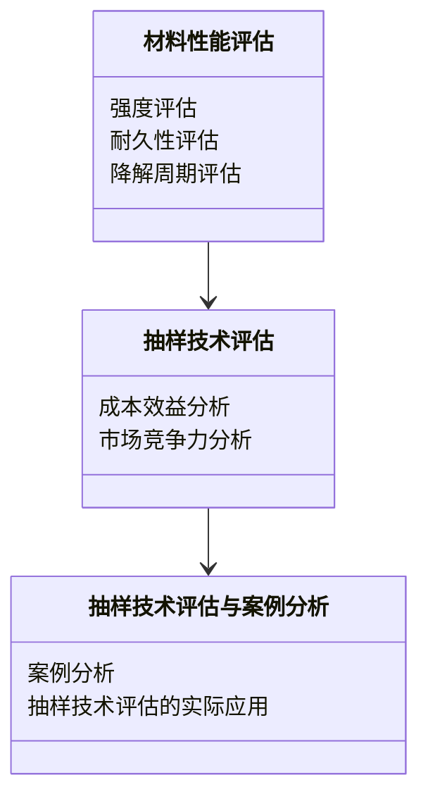
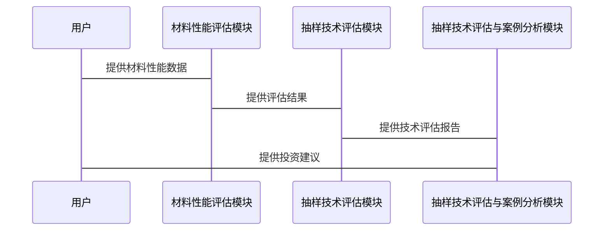

                 


```markdown
# 价值投资中的生物降解电子产品技术

## 关键词：生物降解材料、价值投资、电子产品技术、环境影响、投资评估

## 摘要：本文深入探讨了生物降解材料在电子产品技术中的应用及其对价值投资的影响。通过分析生物降解材料的特性、环境效益及市场潜力，结合技术评估方法和案例分析，揭示了该技术在投资中的重要价值。

---

## 第一章：生物降解电子产品技术的背景与概念

### 1.1 生物降解材料的基本概念
#### 1.1.1 生物降解材料的定义与分类
生物降解材料是指在自然条件下能够被微生物分解为二氧化碳和水等简单化合物的材料。常见的生物降解材料包括聚乳酸（PLA）、聚乙醇酸（PGA）等。

#### 1.1.2 生物降解材料的环境优势
相比传统塑料，生物降解材料可减少白色污染，降低对环境的负担，符合可持续发展的理念。

#### 1.1.3 生物降解材料在电子产品的应用前景
随着环保意识的增强，生物降解材料在电子设备外壳、包装等领域具有广阔的应用前景。

### 1.2 价值投资的基本概念
#### 1.2.1 价值投资的核心理念
价值投资强调以合理价格投资具有长期竞争优势的企业，关注企业的基本面和潜在价值。

#### 1.2.2 价值投资与技术发展的关系
技术创新是企业竞争力的重要来源，技术领先的企业往往能为投资者带来超额收益。

#### 1.2.3 生物降解技术对电子产品价值的影响
生物降解技术的引入可能提升产品的环保形象，增强企业的市场竞争力，进而影响投资价值。

---

## 第二章：生物降解材料与传统材料的对比分析

### 2.1 材料性能对比
#### 2.1.1 生物降解材料的力学性能
生物降解材料的强度和耐久性通常低于传统塑料，但在可降解性和环保性方面具有明显优势。

#### 2.1.2 传统塑料的力学性能
传统塑料具有高强度、耐磨损等优点，但降解周期长，对环境影响大。

#### 2.1.3 两种材料的降解特性对比
生物降解材料在自然环境下可快速分解，而传统塑料需要数百年才能部分降解。

### 2.2 环境影响对比
#### 2.2.1 生物降解材料对环境的影响
生物降解材料的使用可减少对土地和海洋的污染，促进资源的循环利用。

#### 2.2.2 传统材料对环境的影响
传统塑料的累积污染对生态系统造成严重威胁，且难以彻底解决。

#### 2.2.3 环境影响的量化评估方法
通过生命周期评估（LCA）方法，可以量化不同材料对环境的综合影响。

---

## 第三章：生物降解电子产品技术的核心原理

### 3.1 生物降解材料的制备过程
#### 3.1.1 原料选择与处理
生物降解材料通常来源于可再生资源，如淀粉、纤维素等，经过改性处理以提升性能。

#### 3.1.2 材料合成与改性
通过化学反应将可再生资源转化为高性能的生物降解材料，同时优化材料的物理和化学性质。

#### 3.1.3 材料性能优化
通过配方优化和工艺改进，提升生物降解材料的力学性能和降解效率。

### 3.2 电子产品中的生物降解技术应用
#### 3.2.1 材料在电子设备中的具体应用
生物降解材料可用于手机、电脑外壳，电子设备包装等领域。

#### 3.2.2 生物降解材料在电子制造中的挑战
生物降解材料的加工性能和成本问题仍需进一步解决。

#### 3.2.3 技术创新与未来发展方向
研究新型生物降解材料，提升材料性能，降低成本，扩大应用范围。

---

## 第四章：价值投资中的技术评估方法

### 4.1 技术评估的核心指标
#### 4.1.1 材料性能评估指标
包括材料的强度、耐久性、降解周期等关键性能指标。

#### 4.1.2 成本效益分析
评估生物降解材料的生产成本及其在产品中的应用成本效益。

#### 4.1.3 技术的市场竞争力
分析生物降解技术在市场上的竞争优势，包括专利情况、技术壁垒等。

### 4.2 抽样技术评估与案例分析
#### 4.2.1 案例分析：某品牌手机的生物降解外壳
分析该产品在市场上的接受度、销售情况及对品牌形象的影响。

#### 4.2.2 技术评估方法的实际应用
通过具体案例展示如何运用技术评估指标进行投资决策。

---

## 第五章：系统分析与架构设计方案

### 5.1 问题场景介绍
#### 5.1.1 电子产品设计中的材料选择问题
在设计电子设备时，选择合适的材料是影响产品性能和成本的关键因素。

### 5.2 项目介绍
#### 5.2.1 项目目标
开发基于生物降解材料的电子产品，评估其市场潜力和投资价值。

### 5.3 系统功能设计
#### 5.3.1 领域模型（Mermaid 类图）


### 5.4 系统架构设计（Mermaid 架构图）
```mermaid
architecturalDiagram
    系统边界
    包含组件：材料性能评估模块、抽样技术评估模块、抽样技术评估与案例分析模块
    组件间关系：材料性能评估模块提供数据支持抽样技术评估模块，抽样技术评估模块支持案例分析模块
```

### 5.5 系统接口设计
#### 5.5.1 数据输入接口
接收材料性能数据和市场数据。

#### 5.5.2 数据输出接口
提供评估结果和投资建议。

### 5.6 系统交互（Mermaid 序列图）


---

## 第六章：项目实战

### 6.1 环境安装
#### 6.1.1 安装Python和相关库
安装Python 3.x，使用pip安装numpy、pandas、scikit-learn等库。

### 6.2 系统核心实现源代码
#### 6.2.1 数据预处理代码
```python
import numpy as np
import pandas as pd

# 读取数据
data = pd.read_csv('material_data.csv')

# 数据清洗
data.dropna(inplace=True)
data = pd.get_dummies(data)
```

#### 6.2.2 技术评估模型代码
```python
from sklearn.linear_model import LinearRegression

# 训练模型
model = LinearRegression()
model.fit(X_train, y_train)

# 预测结果
y_pred = model.predict(X_test)
```

### 6.3 代码应用解读与分析
#### 6.3.1 数据预处理
对材料性能数据进行清洗和特征工程，为模型训练做好准备。

#### 6.3.2 技术评估模型
使用线性回归模型预测材料的降解效率，并评估其对投资价值的影响。

### 6.4 实际案例分析
#### 6.4.1 某手机厂商的生物降解外壳案例
分析该产品的市场表现，评估生物降解技术对其投资价值的影响。

### 6.5 项目小结
总结项目实施过程中的经验教训，提出改进建议。

---

## 第七章：最佳实践 tips、小结、注意事项、拓展阅读

### 7.1 小结
生物降解电子产品技术在环保和投资方面具有双重价值，合理评估技术优势和市场潜力是成功投资的关键。

### 7.2 注意事项
在进行技术评估时，需综合考虑材料性能、成本效益和市场竞争力，避免单一指标的片面性。

### 7.3 拓展阅读
推荐相关书籍和文献，如《可持续材料的创新应用》、《价值投资实战策略》等。

---

## 附录：参考文献与工具

### 附录A：参考文献
列出本文引用的主要文献和资料。

### 附录B：工具与资源
介绍使用的工具和资源，如Python库、数据分析工具等。

---

以上为《价值投资中的生物降解电子产品技术》的目录大纲，具体内容可根据实际需求进一步扩展和详细阐述。
```

