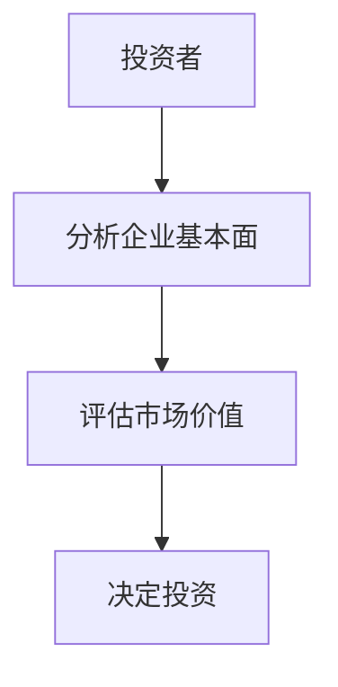
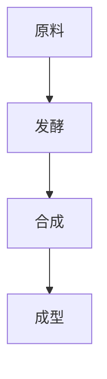

                 

# 价值投资中的生物降解电子元件技术前景

---

## 关键词：
- 生物降解电子元件
- 价值投资
- 技术前景
- 可持续发展
- 电子元件制造

---

## 摘要：
本文探讨了生物降解电子元件技术在价值投资中的潜力。通过分析技术背景、市场趋势和投资策略，本文揭示了该领域的发展前景，为投资者提供了科学的决策依据。

---

## 第一部分：背景介绍

### 第1章：生物降解电子元件技术的背景

#### 1.1 生物降解电子元件的定义与现状
生物降解电子元件是指由可降解材料制成的电子元件，能够在自然环境中分解，减少对环境的污染。当前，随着环保意识的增强，这类技术受到广泛关注。

| 材料类型 | 生物降解性 | 机械性能 | 电气性能 |
|----------|------------|-----------|-----------|
| PLA       | 高         | 中         | 中         |
| PHA       | 高         | 高         | 低         |
| PCL       | 高         | 中         | 中         |

#### 1.2 技术优势与市场机会
生物降解材料具有环境友好、可再生等优点，市场需求潜力巨大。

---

## 第二部分：技术分析

### 第2章：价值投资的基本原理

#### 2.1 价值投资的定义与策略
价值投资强调寻找被市场低估的优质企业，长期持有以获得收益。

---

## 第三部分：技术分析

### 第3章：生物降解材料的特性与应用

#### 3.1 材料特性对比
以下是几种常见生物降解材料的特性对比：

| 材料 | 生物降解时间 | 成本 | 加工性能 |
|------|--------------|------|-----------|
| PLA  | 6-12个月     | 高   | 好         |
| PHA  | 6-12个月     | 中   | 中         |

#### 3.2 制备工艺流程
生物降解材料的制备通常包括发酵、合成和成型三个阶段：

---

## 第四部分：投资分析

### 第4章：市场需求与竞争格局

#### 4.1 市场需求分析
全球生物降解材料市场预计将以年均15%的速度增长，到2030年市场规模将超过100亿美元。

#### 4.2 竞争分析与投资机会
主要竞争对手包括巴斯夫、陶氏化学等，新兴企业则专注于技术创新。

---

## 第五部分：项目实战

### 第5章：案例分析与投资策略

#### 5.1 案例分析
以一家专注于生物降解材料的企业为例，分析其商业模式和市场定位。

#### 5.2 投资策略制定
基于技术评估和市场分析，制定长期投资计划。

#### 5.3 风险控制
通过分散投资、定期评估和风险管理来降低风险。

---

## 第六部分：总结与展望

### 第6章：总结与未来趋势

#### 6.1 投资机会总结
生物降解电子元件技术具有广阔的市场前景，值得长期关注。

#### 6.2 未来趋势
随着技术进步和环保法规的完善，该领域将迎来更多发展机遇。

---

## 结语：
通过本文的分析，投资者可以更好地把握生物降解电子元件技术的投资机会，实现可持续发展与财务回报的双赢。

---

**Tips：**
- 在进行价值投资时，建议投资者深入研究企业的基本面和技术前景。
- 定期关注行业动态和市场变化，及时调整投资策略。

---

**小结：**
本文通过详细的技术分析和市场研究，为投资者提供了生物降解电子元件领域的投资指南，帮助读者在环保与经济之间找到平衡点。

---

**注意事项：**
- 投资有风险，建议在专业指导下进行。
- 确保信息来源可靠，避免基于过时数据做出决策。

---

**拓展阅读：**
- 《可持续投资：未来趋势与策略》
- 《生物降解材料：技术与市场分析》

---

**结束语：**
感谢您的阅读！希望本文能为您的投资决策提供有价值的参考。如需进一步探讨，欢迎随时联系。

