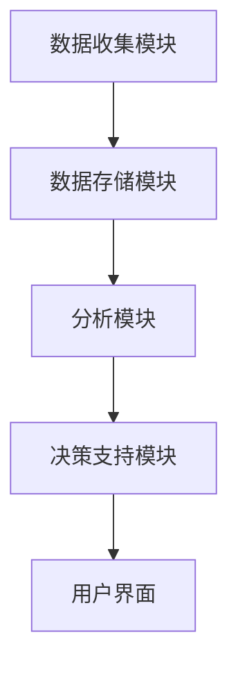
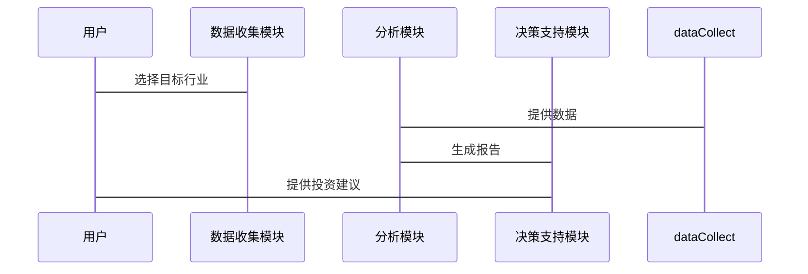

                 

# 价值投资中的碳中和技术机遇分析

> 关键词：价值投资、碳中和、技术创新、投资机会、可持续发展

> 摘要：本文将探讨碳中和目标下的技术投资机会，分析价值投资的核心理念与策略，结合碳中和技术领域的发展现状与未来趋势，构建价值评估模型，帮助投资者识别和把握碳中和背景下的技术投资机遇。

---

## 第1章：碳中和的目标与意义

### 1.1 碳中和的定义与目标

碳中和是指在一定时间内，通过减少温室气体排放和增加碳汇，使二氧化碳的净排放量为零。其目标是实现全球气候稳定，避免气候变化带来的灾难性影响。

- **碳中和的核心要素**：减少化石燃料使用、发展可再生能源、提高能源效率、碳汇（如森林和土壤吸收二氧化碳）。
- **全球目标与时间表**：许多国家承诺在2050年前实现碳中和，例如欧盟、美国、中国等。

### 1.2 价值投资的基本原理

价值投资是一种投资策略，强调以低于内在价值的价格购买优质资产。其核心理念是寻找被市场低估的企业，长期持有，获得超额收益。

- **价值投资的关键要素**：基本面分析、安全边际、长期视角。
- **价值投资的策略**：寻找低估值、高ROE（净资产收益率）、良好治理的企业。

### 1.3 碳中和与价值投资的结合

碳中和为价值投资提供了新的投资方向，特别是在可再生能源、储能、绿色交通等领域，这些领域不仅符合可持续发展的趋势，还具有较高的投资回报潜力。

- **碳中和对投资机会的影响**：政策支持、技术进步、市场需求增长。
- **碳中和对传统行业的颠覆性影响**：传统高碳行业面临转型压力，绿色技术行业迎来发展机遇。

---

## 第2章：碳中和技术的核心领域分析

### 2.1 可再生能源技术

#### 2.1.1 太阳能与风能技术的发展现状

- **太阳能**：光伏发电效率不断提高，成本持续下降，已成为最经济的能源之一。
- **风能**：陆上风电和海上风电技术成熟，装机容量持续增长。

#### 2.1.2 可再生能源的成本下降趋势

- **技术进步**：光伏组件效率提升、风电设备成本降低。
- **规模效应**：规模化生产降低了单位成本。

#### 2.1.3 可再生能源的投资机会与风险

- **投资机会**：政府补贴、市场需求增长。
- **风险**：政策变化、技术风险、市场竞争。

### 2.2 储能技术

#### 2.2.1 储能技术的基本原理与分类

- **物理储能**：抽水蓄能、压缩空气储能。
- **化学储能**：锂离子电池、铅酸电池。
- **其他储能**：钠离子电池、氢储能。

#### 2.2.2 储能技术的市场现状与未来趋势

- **市场需求**：可再生能源波动性增加，储能需求上升。
- **技术进步**：锂离子电池成本下降，新型储能技术（如钠离子电池）崛起。

#### 2.2.3 储能技术对能源结构的影响

- **能源转型**：储能技术使可再生能源更稳定，推动能源结构向低碳化转变。

### 2.3 绿色交通技术

#### 2.3.1 电动汽车与充电基础设施

- **电动汽车**：市场需求增长迅速，技术进步显著。
- **充电基础设施**：充电桩建设加速，支持电动汽车普及。

#### 2.3.2 智能交通系统与碳中和

- **智能交通**：通过优化交通流量减少碳排放。
- **共享经济**：减少私家车使用，降低碳排放。

#### 2.3.3 绿色交通的投资机会与挑战

- **投资机会**：电动汽车、充电设备、智能交通系统。
- **挑战**：技术竞争、政策不确定性。

### 2.4 碳捕获与封存技术

#### 2.4.1 碳捕获技术的基本原理

- **碳捕获**：通过化学反应或物理方法捕获二氧化碳。
- **封存技术**：将二氧化碳注入地下或利用其生产原材料（如混凝土）。

#### 2.4.2 碳封存技术的应用场景

- **工业应用**：化工、水泥、钢铁等行业。
- **能源领域**：燃煤电厂的碳捕获与封存。

#### 2.4.3 碳捕获与封存技术的商业化前景

- **技术成熟度**：仍需降低成本和提高效率。
- **政策支持**：政府补贴和税收优惠推动技术商业化。

---

## 第3章：价值投资的策略与方法

### 3.1 价值投资的核心逻辑

#### 3.1.1 确定投资目标

- **行业选择**：选择碳中和相关行业，如可再生能源、储能、绿色交通。
- **企业筛选**：寻找具有竞争优势、财务健康的企业。

#### 3.1.2 评估企业价值

- **基本面分析**：ROE、毛利率、资产负债率。
- **DCF模型**：现金流折现法评估企业内在价值。

#### 3.1.3 安全边际

- **价格折扣**：购买价格低于内在价值，降低投资风险。

### 3.2 碳中和技术领域的投资策略

#### 3.2.1 技术领先企业

- **技术优势**：拥有核心技术专利的企业更具投资价值。
- **市场地位**：行业龙头企业的市场份额稳定，风险较低。

#### 3.2.2 政策支持行业

- **政府补贴**：政策支持的行业更具投资潜力。
- **行业趋势**：政策推动下的行业需求增长。

### 3.3 投资风险管理

#### 3.3.1 宏观风险

- **政策变化**：碳中和政策变化可能影响行业。
- **经济周期**：经济波动可能影响企业业绩。

#### 3.3.2 企业风险

- **财务风险**：企业财务状况恶化可能影响股价。
- **技术风险**：技术失败可能导致企业价值下降。

---

## 第4章：系统分析与架构设计

### 4.1 系统分析

#### 4.1.1 问题场景

- **目标**：构建碳中和技术投资分析系统。
- **输入**：行业数据、企业数据、市场数据。
- **输出**：企业价值评估、投资建议。

#### 4.1.2 项目介绍

- **项目目标**：为投资者提供碳中和技术领域的投资分析工具。
- **项目范围**：涵盖可再生能源、储能、绿色交通等领域。

### 4.2 系统架构设计

#### 4.2.1 系统功能设计

- **数据收集模块**：收集行业数据、企业数据。
- **分析模块**：使用DCF模型、SWOT分析等方法进行评估。
- **决策支持模块**：提供投资建议和风险管理工具。

#### 4.2.2 系统架构图

### 4.3 系统交互设计

#### 4.3.1 交互流程

- **用户输入**：选择目标行业。
- **系统处理**：收集数据、分析数据、生成报告。
- **用户输出**：投资建议、风险提示。

#### 4.3.2 序列图

---

## 第5章：项目实战

### 5.1 投资机会分析

#### 5.1.1 案例分析

- **案例公司**：某电动汽车制造商。
- **分析步骤**：基本面分析、DCF模型评估、SWOT分析。
- **投资建议**：基于分析结果，给出买入、持有或卖出建议。

#### 5.1.2 环境影响评估

- **碳排放评估**：公司生产过程中的碳排放。
- **碳中和贡献**：公司技术对碳中和的贡献。

### 5.2 投资组合管理

#### 5.2.1 投资组合构建

- **资产配置**：根据风险承受能力分配资产。
- **再平衡**：定期调整投资组合，降低风险。

#### 5.2.2 风险管理

- **分散投资**：避免过度集中，降低风险。
- **止损策略**：设定止损点，避免重大损失。

---

## 第6章：最佳实践与未来展望

### 6.1 投资经验总结

#### 6.1.1 关键经验

- **长期视角**：碳中和是一个长期目标，投资需要耐心。
- **风险管理**：控制风险是投资成功的关键。

#### 6.1.2 投资技巧

- **关注政策**：政策变化对行业影响重大。
- **技术跟踪**：关注技术进步和市场趋势。

### 6.2 未来展望

#### 6.2.1 技术创新

- **新材料**：新型电池材料、高效光伏材料。
- **人工智能**：AI在能源管理、投资决策中的应用。

#### 6.2.2 市场趋势

- **全球合作**：国际合作推动碳中和。
- **绿色金融**：绿色债券、ESG投资成为主流。

### 6.3 投资建议

#### 6.3.1 短期建议

- **关注政策变化**：及时调整投资策略。
- **选择优质企业**：投资具有竞争优势的企业。

#### 6.3.2 长期建议

- **坚持价值投资**：长期持有优质资产。
- **持续学习**：关注行业动态和技术进步。

---

## 结语

碳中和不仅是全球性的挑战，也是投资机遇。通过价值投资的方法，投资者可以在碳中和技术领域找到优质投资标的，实现财富增值。未来，随着技术进步和政策支持，碳中和技术投资将更加重要，投资者需要持续学习和调整策略，抓住机遇，应对挑战。

