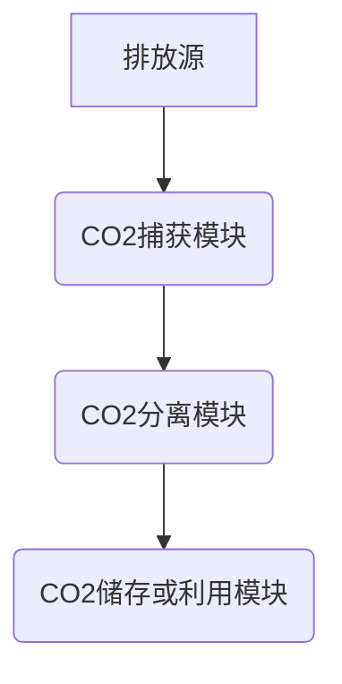
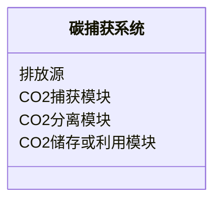

                 


# 价值投资中的碳捕获技术机遇

> 关键词：价值投资、碳捕获技术、投资机会、技术创新、可持续发展

> 摘要：随着全球对碳减排的需求日益迫切，碳捕获技术作为一种有效的碳中和手段，正逐渐成为投资者关注的焦点。本文将从碳捕获技术的背景、原理、算法优化、系统架构以及项目实战等多个方面，深入分析碳捕获技术在价值投资中的潜力与机遇，帮助投资者更好地把握这一领域的投资机会。

---

# 第一部分: 碳捕获技术与价值投资的背景

## 第1章: 碳捕获技术的背景与现状

### 1.1 碳捕获技术的基本概念

#### 1.1.1 碳捕获技术的定义
碳捕获技术（Carbon Capture Technology）是指通过物理或化学手段，从排放源中捕获二氧化碳（CO2），并将其储存或再利用的技术。碳捕获技术是实现碳中和目标的重要手段之一，能够有效减少大气中的温室气体浓度。

#### 1.1.2 碳捕获技术的分类
碳捕获技术主要分为以下几种类型：
- **燃烧后捕获（Post-Combustion Capture）**：在燃烧后气体中分离CO2，适用于燃煤电厂和天然气发电厂。
- **燃烧前捕获（Pre-Combustion Capture）**：在燃料燃烧前通过气化和气体分离技术捕获CO2，适用于煤气化联合循环系统。
- **氧气燃烧捕获（Oxy-Fuel Combustion）**：通过纯氧燃烧产生高浓度CO2，直接捕获。

#### 1.1.3 碳捕获技术的发展历程
碳捕获技术的研究始于20世纪70年代，但直到近年来，随着全球气候变化问题的加剧，碳捕获技术才逐渐得到广泛关注和应用。目前，碳捕获技术已经在电力、化工、钢铁等行业得到了一定的应用。

---

### 1.2 价值投资的基本概念

#### 1.2.1 价值投资的定义
价值投资是一种投资策略，旨在通过寻找市场价格低于其内在价值的资产，以实现长期稳定的收益。价值投资强调基本面分析，关注企业的盈利能力、财务状况、行业地位等因素。

#### 1.2.2 价值投资的核心理念
价值投资的核心理念是“买入低于内在价值的资产”。投资者通过深入分析企业的财务报表、市场地位、竞争优势等因素，寻找那些被市场低估的投资标的。

#### 1.2.3 价值投资的策略与方法
价值投资的策略主要包括：
1. **基本面分析**：通过分析企业的财务数据、行业地位等因素，评估其内在价值。
2. **安全边际**：买入价格低于内在价值的资产，以降低投资风险。
3. **长期持有**：价值投资强调长期持有，避免频繁交易。

---

### 1.3 碳捕获技术与价值投资的结合

#### 1.3.1 碳捕获技术的市场需求
随着全球碳减排目标的推进，碳捕获技术的需求日益增加。各国政府和企业纷纷加大对碳捕获技术的投入，特别是在电力、化工、钢铁等行业。

#### 1.3.2 碳捕获技术的成本与收益分析
碳捕获技术的初始投资成本较高，但随着技术进步和规模化应用，成本将逐步下降。同时，碳捕获技术能够带来显著的环境效益和经济效益，例如通过碳交易获得额外收益。

#### 1.3.3 碳捕获技术的商业化前景
碳捕获技术的商业化前景广阔，尤其是在碳交易市场中。通过捕获和储存CO2，企业可以获得碳配额，从而在碳交易市场中获利。

---

## 第2章: 碳捕获技术与价值投资的关系

### 2.1 碳捕获技术的经济价值

#### 2.1.1 碳捕获技术的市场需求
碳捕获技术是实现碳中和目标的重要手段，市场需求巨大。随着各国政府对碳减排的政策支持，碳捕获技术的市场空间将进一步扩大。

#### 2.1.2 碳捕获技术的成本与收益分析
尽管碳捕获技术的初始投资较高，但其长期收益潜力巨大。通过碳交易市场，企业可以将捕获的CO2转化为碳配额，从而获得额外收益。

#### 2.1.3 碳捕获技术的商业化前景
碳捕获技术的商业化前景广阔，尤其是在电力、化工、钢铁等行业。随着技术进步和成本下降，碳捕获技术将逐渐实现大规模应用。

---

### 2.2 碳捕获技术在价值投资中的应用

#### 2.2.1 碳捕获技术的行业影响
碳捕获技术将对多个行业产生深远影响，例如电力、化工、钢铁等行业。通过应用碳捕获技术，企业可以减少碳排放，提升市场竞争力。

#### 2.2.2 碳捕获技术的市场机会
碳捕获技术的市场机会主要集中在以下几个方面：
1. **碳交易市场**：通过碳捕获技术获得碳配额，参与碳交易市场。
2. **技术创新**：投资于碳捕获技术的研发和创新，抢占市场先机。
3. **政策支持**：利用政府政策支持，推动碳捕获技术的应用。

#### 2.2.3 碳捕获技术的长期投资价值
碳捕获技术的长期投资价值主要体现在其对碳中和目标的贡献和对企业的可持续发展支持。随着技术进步和政策支持，碳捕获技术的投资价值将逐步显现。

---

# 第二部分: 碳捕获技术的核心概念与联系

## 第3章: 碳捕获技术的核心原理

### 3.1 碳捕获技术的原理

#### 3.1.1 碳捕获技术的基本原理
碳捕获技术通过物理或化学手段，从排放源中捕获CO2，并将其储存或再利用。常见的捕获方法包括吸收法、吸附法和膜分离法。

#### 3.1.2 碳捕获技术的关键步骤
碳捕获技术的关键步骤包括：
1. **CO2捕获**：通过吸收剂或吸附剂捕获排放气体中的CO2。
2. **CO2分离**：将捕获的CO2与其他气体分离。
3. **CO2储存或利用**：将CO2储存地下或再利用于工业过程。

#### 3.1.3 碳捕获技术的优化方法
碳捕获技术的优化主要体现在提高捕获效率、降低能耗和成本。例如，通过改进吸收剂的性能或采用新型捕获技术，可以提高捕获效率并降低成本。

---

### 3.2 碳捕获技术的核心要素

#### 3.2.1 碳捕获技术的主要设备
碳捕获技术的主要设备包括吸收塔、再生器、压缩机等。这些设备在捕获、分离和储存CO2过程中发挥重要作用。

#### 3.2.2 碳捕获技术的材料选择
碳捕获技术的材料选择主要集中在吸收剂、吸附剂和膜材料等方面。不同材料的选择将直接影响捕获效率和成本。

#### 3.2.3 碳捕获技术的能量消耗
碳捕获技术的能量消耗主要集中在捕获和压缩CO2的过程中。通过优化技术设计，可以有效降低能量消耗。

---

## 第4章: 碳捕获技术与价值投资的关系

### 4.1 碳捕获技术对价值投资的影响

#### 4.1.1 碳捕获技术如何改变行业格局
碳捕获技术的应用将改变多个行业的竞争格局，例如电力、化工、钢铁等行业。通过应用碳捕获技术，企业可以减少碳排放，提升市场竞争力。

#### 4.1.2 碳捕获技术如何影响企业价值
碳捕获技术将直接影响企业的价值评估。通过减少碳排放和提高碳配额，企业可以获得更高的市场估值。

#### 4.1.3 碳捕获技术如何推动市场创新
碳捕获技术的广泛应用将推动市场的创新，例如新的碳交易模式、新的技术解决方案等。

---

### 4.2 价值投资对碳捕获技术的推动

#### 4.2.1 价值投资如何支持碳捕获技术的发展
价值投资者通过投资于碳捕获技术的研发和应用，可以推动该技术的商业化进程。

#### 4.2.2 价值投资者如何识别碳捕获技术的潜力
价值投资者需要深入分析碳捕获技术的市场需求、技术可行性和成本效益，识别其投资潜力。

#### 4.2.3 价值投资如何助力碳捕获技术的商业化
价值投资者通过长期持有碳捕获技术相关企业股票，可以支持该技术的商业化进程，同时获得长期收益。

---

# 第三部分: 碳捕获技术的算法原理与数学模型

## 第5章: 碳捕获技术的优化算法

### 5.1 碳捕获技术的优化目标

#### 5.1.1 碳捕获效率的优化
碳捕获效率的优化是碳捕获技术的核心目标之一。通过改进捕获技术和优化操作参数，可以提高碳捕获效率。

#### 5.1.2 碳捕获成本的优化
碳捕获成本的优化是碳捕获技术的另一个重要目标。通过降低设备投资和运营成本，可以提高碳捕获技术的经济性。

#### 5.1.3 碳捕获技术的可持续性优化
碳捕获技术的可持续性优化主要体现在减少能源消耗和提高资源利用效率方面。

---

### 5.2 碳捕获技术的优化算法

#### 5.2.1 碳捕获技术的数学建模
碳捕获技术的数学建模是优化算法的基础。通过建立数学模型，可以模拟碳捕获过程中的各种因素，例如吸收剂的性能、气体流速等。

#### 5.2.2 碳捕获技术的优化算法
碳捕获技术的优化算法主要包括：
1. **遗传算法**：通过模拟自然选择和遗传变异，优化碳捕获技术的参数。
2. **模拟退火算法**：通过模拟金属退火过程，寻找碳捕获技术的最优解。
3. **粒子群优化算法**：通过模拟粒子运动，优化碳捕获技术的参数。

#### 5.2.3 碳捕获技术的优化案例
通过具体案例分析，可以展示碳捕获技术优化算法的应用。例如，通过遗传算法优化吸收剂的性能，提高碳捕获效率。

---

### 5.3 碳捕获技术的数学模型

#### 5.3.1 碳捕获技术的数学模型
碳捕获技术的数学模型主要用于模拟碳捕获过程中的各种因素。例如，吸收法碳捕获的数学模型可以描述吸收剂与CO2的反应过程。

#### 5.3.2 碳捕获技术的优化公式
碳捕获技术的优化公式主要用于计算最优参数。例如，通过优化吸收剂的浓度和气体流速，可以提高碳捕获效率。

#### 5.3.3 碳捕获技术的数学模型实例
通过具体实例分析，可以展示碳捕获技术数学模型的应用。例如，通过建立吸收法碳捕获的数学模型，计算吸收剂的最优浓度和气体流速。

---

## 第6章: 价值投资中的碳捕获技术数学模型

### 6.1 价值投资中的碳捕获技术数学模型

#### 6.1.1 碳捕获技术的价值评估模型
碳捕获技术的价值评估模型主要用于评估碳捕获技术的投资价值。例如，通过评估碳捕获技术的成本、收益和风险，计算其净现值（NPV）和内部收益率（IRR）。

#### 6.1.2 碳捕获技术的价值评估公式
碳捕获技术的价值评估公式主要用于计算其投资回报率。例如，通过计算碳捕获技术的初始投资成本、运营成本和碳配额收益，评估其净现值。

#### 6.1.3 碳捕获技术的价值评估案例
通过具体案例分析，可以展示碳捕获技术价值评估模型的应用。例如，评估某燃煤电厂应用碳捕获技术的投资回报率。

---

# 第四部分: 碳捕获技术的系统架构与项目实战

## 第7章: 碳捕获技术的系统架构

### 7.1 碳捕获技术的系统架构设计

#### 7.1.1 碳捕获系统的功能模块
碳捕获系统的功能模块包括：
- **CO2捕获模块**：捕获排放气体中的CO2。
- **CO2分离模块**：将捕获的CO2与其他气体分离。
- **CO2储存或利用模块**：将CO2储存地下或再利用于工业过程。

#### 7.1.2 碳捕获系统的架构图
以下是碳捕获系统的架构图：



---

### 7.2 碳捕获技术的系统设计

#### 7.2.1 碳捕获系统的领域模型
以下是碳捕获系统的领域模型：



---

## 第8章: 价值投资中的碳捕获技术项目实战

### 8.1 碳捕获技术项目实战

#### 8.1.1 碳捕获技术项目介绍
某燃煤电厂计划投资于碳捕获技术，以减少碳排放并获得碳配额。

#### 8.1.2 碳捕获技术项目的环境安装
为了实现碳捕获技术的应用，需要安装碳捕获设备和相关控制系统。

#### 8.1.3 碳捕获技术项目的代码实现
以下是碳捕获技术项目的Python代码实现：

```python
class CarbonCaptureSystem:
    def __init__(self):
        self.absorbent = 100  # 吸收剂浓度
        self.co2_flow = 1000  # CO2流量
        self.cost = 1000000  # 初始投资成本

    def capture_co2(self):
        # 捕获CO2的过程
        self.absorbent = self.absorbent * 0.9  # 吸收剂浓度降低
        self.co2_flow = self.co2_flow * 0.8  # CO2流量减少

    def calculate_cost(self):
        # 计算碳捕获成本
        return self.cost + (self.absorbent * self.co2_flow) * 0.01

# 示例用法
system = CarbonCaptureSystem()
system.capture_co2()
print(system.calculate_cost())
```

---

### 8.2 价值投资中的碳捕获技术实战

#### 8.2.1 碳捕获技术的案例分析
通过具体案例分析，可以展示碳捕获技术在价值投资中的应用。例如，某投资者通过投资于碳捕获技术相关企业，获得长期收益。

#### 8.2.2 碳捕获技术的实战小结
碳捕获技术的投资价值取决于其市场需求、技术可行性和成本效益。通过深入分析，投资者可以识别出具有潜力的投资标的。

---

# 第五部分: 总结与展望

## 第9章: 总结与展望

### 9.1 碳捕获技术的总结

#### 9.1.1 碳捕获技术的核心要点
碳捕获技术的核心要点包括捕获效率、成本优化和可持续性。

#### 9.1.2 碳捕获技术的未来发展趋势
碳捕获技术的未来发展趋势主要体现在技术进步、成本下降和市场扩大。

---

### 9.2 价值投资中的碳捕获技术总结

#### 9.2.1 价值投资的核心要点
价值投资的核心要点包括基本面分析、安全边际和长期持有。

#### 9.2.2 价值投资中的碳捕获技术的未来展望
随着碳捕获技术的不断发展和市场的需求增加，其在价值投资中的潜力将逐渐显现。投资者应密切关注碳捕获技术的发展动态，抓住投资机遇。

---

## 第10章: 小结

### 10.1 价值投资中的碳捕获技术小结

#### 10.1.1 投资机会总结
碳捕获技术的投资机会主要体现在碳交易市场、技术创新和政策支持三个方面。

#### 10.1.2 投资策略总结
投资者应通过基本面分析、安全边际和长期持有，抓住碳捕获技术的投资机会。

---

## 第11章: 注意事项与拓展阅读

### 11.1 价值投资中的碳捕获技术注意事项

#### 11.1.1 投资风险
碳捕获技术的投资风险包括技术风险、市场风险和政策风险。

#### 11.1.2 技术风险
碳捕获技术的技术风险主要体现在技术可行性、成本控制和商业化能力方面。

#### 11.1.3 市场风险
碳捕获技术的市场风险主要体现在市场需求、竞争格局和价格波动方面。

---

### 11.2 拓展阅读

#### 11.2.1 碳捕获技术的最新研究
阅读相关学术论文和研究报告，了解碳捕获技术的最新进展。

#### 11.2.2 价值投资中的碳捕获技术书籍
阅读相关书籍，深入了解碳捕获技术在价值投资中的应用。

---

# 结语

随着全球对碳减排的需求日益增加，碳捕获技术在价值投资中的潜力将逐渐显现。投资者应密切关注碳捕获技术的发展动态，抓住投资机遇，实现长期稳定的收益。通过本文的分析，读者可以更好地理解碳捕获技术在价值投资中的机遇与挑战，为未来的投资决策提供参考。

