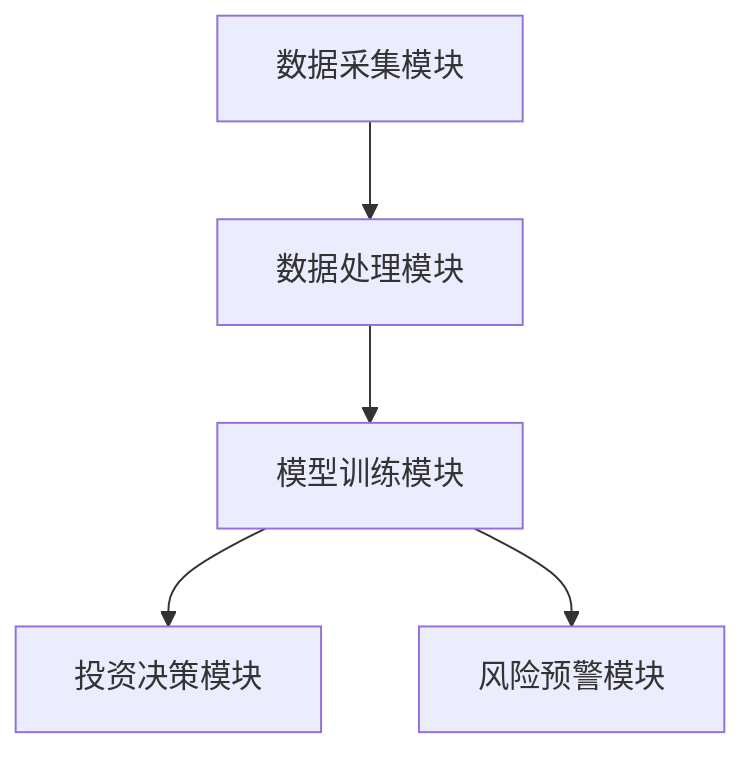
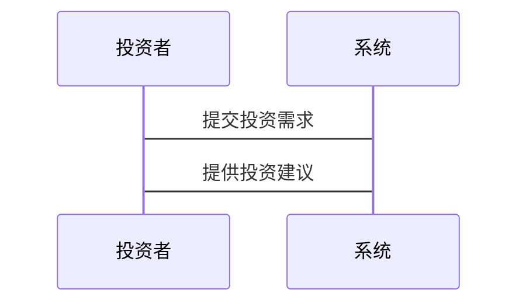

                 


# 价值投资中的神经科技前景分析

## 关键词：价值投资，神经科技，神经网络，投资决策，机器学习

## 摘要：随着神经科技的快速发展，人工智能在投资领域的应用越来越广泛。本文将探讨神经科技如何与价值投资结合，分析其在投资决策中的潜力和前景。通过介绍神经网络的基本原理、算法模型以及实际应用案例，本文为读者提供了从理论到实践的全面解析，展示了神经科技在价值投资中的巨大潜力。

---

# 第一部分: 价值投资中的神经科技背景与基础

# 第1章: 神经科技与价值投资概述

## 1.1 神经科学基础

### 1.1.1 神经科学的基本概念

神经科学是研究神经系统结构和功能的科学，主要关注大脑如何处理信息、产生行为和控制身体。神经系统通过神经元（神经细胞）之间的电化学信号传递信息，这些信号可以被看作是信息处理的基本单位。

在投资领域，神经科学可以帮助我们理解投资者的行为和决策过程。例如，投资者在面对不确定性和风险时，大脑中的特定区域（如前额叶皮层和杏仁核）会发挥作用，影响他们的决策。

### 1.1.2 神经科技的定义与研究领域

神经科技（Neurotechnology）是结合神经科学和工程技术的交叉学科，旨在通过技术手段研究和应用神经系统。其研究领域包括：

- **神经信号采集**：通过脑电图（EEG）、功能性磁共振成像（fMRI）等技术采集神经信号。
- **神经信号处理**：对采集到的神经信号进行分析和解读。
- **神经调控**：通过技术手段（如深部脑刺激）调控神经活动。
- **神经接口**：开发人机接口，使人类能够与计算机或机器直接交互。

### 1.1.3 神经科技与投资的结合点

神经科技与投资的结合主要体现在以下几个方面：

- **情绪分析**：通过分析投资者的情绪（如恐惧、贪婪）来预测市场行为。
- **认知偏差**：研究投资者的认知偏差（如过度自信、从众心理）并提出解决方案。
- **决策模型**：构建基于神经科学的决策模型，模拟投资者的决策过程。

## 1.2 价值投资的核心原理

### 1.2.1 价值投资的定义与历史

价值投资是一种投资策略，强调通过深入分析公司的基本面（如财务状况、行业地位、管理团队等），寻找被市场低估的投资机会。该策略由本杰明·格雷厄姆（Benjamin Graham）和戴维·多德（David Dodd）在20世纪初提出，并被沃伦·巴菲特（Warren Buffett）发扬光大。

### 1.2.2 价值投资的核心理念

价值投资的核心理念是寻找“市场价低于内在价值”的股票。投资者需要具备以下几个关键能力：

- **基本面分析**：深入研究公司的财务报表、行业地位、竞争优势等。
- **估值能力**：准确估算公司的内在价值。
- **长期视角**：关注公司的长期发展前景，而非短期市场波动。

### 1.2.3 价值投资与神经科技的关联

价值投资与神经科技的关联主要体现在以下几个方面：

- **投资者心理分析**：通过神经科技手段分析投资者的心理状态，帮助识别市场情绪。
- **决策优化**：利用神经科技优化投资决策过程，减少认知偏差的影响。
- **风险管理**：通过神经科技预测市场波动，优化投资组合的风险管理。

## 1.3 神经科技在价值投资中的应用前景

### 1.3.1 神经科技在投资决策中的作用

神经科技在投资决策中的作用主要体现在以下几个方面：

- **情绪识别**：通过分析投资者的情绪状态，预测市场的买卖行为。
- **认知偏差识别**：识别投资者的认知偏差，帮助投资者做出更理性的决策。
- **决策模拟**：通过神经网络模拟投资者的决策过程，优化投资策略。

### 1.3.2 神经科技如何提升投资效率

神经科技可以通过以下方式提升投资效率：

- **自动化分析**：利用神经网络自动化分析大量的市场数据，快速识别投资机会。
- **实时监控**：通过实时监控投资者的心理状态，及时调整投资策略。
- **个性化投资建议**：根据投资者的心理特征提供个性化的投资建议。

### 1.3.3 神经科技在投资风险管理中的潜力

神经科技在投资风险管理中的潜力主要体现在以下几个方面：

- **市场情绪预测**：通过分析市场整体的情绪状态，预测市场的波动。
- **个体风险评估**：通过分析投资者的心理特征，评估其风险承受能力。
- **风险预警系统**：建立基于神经科技的风险预警系统，提前防范潜在风险。

## 1.4 本章小结

本章介绍了神经科技与价值投资的基本概念及其结合点，分析了神经科技在投资决策中的作用、提升投资效率的潜力以及在风险管理中的应用前景。通过这些分析，我们可以看到神经科技在价值投资中的巨大潜力。

---

# 第2章: 神经科技的核心概念与原理

## 2.1 神经网络的基本结构

### 2.1.1 神经元模型

神经元是神经系统的基本单位，其工作原理可以通过数学模型进行模拟。最常见的神经元模型是霍奇金-赫胥黎模型（Hodgkin-Huxley model），它描述了神经元如何通过离子通道的开闭产生动作电位。

### 2.1.2 神经网络的层次结构

神经网络由多个层次组成，包括输入层、隐藏层和输出层。每个层次由多个神经元组成，神经元之间通过权重（weight）连接，信息通过激活函数（activation function）进行处理。

### 2.1.3 神经网络的学习机制

神经网络通过反向传播算法（backpropagation）进行学习。其核心思想是通过计算预测值与实际值之间的误差，调整权重以最小化误差。

## 2.2 神经科技在投资中的应用模型

### 2.2.1 情绪分析模型

情绪分析模型通过分析投资者的情绪状态，预测市场的买卖行为。常用的模型包括支持向量机（SVM）和长短期记忆网络（LSTM）。

### 2.2.2 认知偏差模型

认知偏差模型通过分析投资者的认知偏差，帮助投资者做出更理性的决策。常用的模型包括马尔可夫链（Markov chain）和贝叶斯网络（Bayesian network）。

### 2.2.3 投资决策模型

投资决策模型通过模拟投资者的决策过程，优化投资策略。常用的模型包括Q-learning算法和Actor-critic算法。

## 2.3 神经科技与投资决策的关系

### 2.3.1 神经信号与投资行为

神经信号与投资行为之间的关系可以通过以下步骤进行分析：

1. **采集神经信号**：通过脑电图（EEG）或功能性磁共振成像（fMRI）采集投资者的神经信号。
2. **分析神经信号**：通过信号处理技术（如傅里叶变换）分析神经信号的特征。
3. **关联神经信号与投资行为**：通过统计分析方法（如相关性分析）找出神经信号与投资行为之间的关联。

### 2.3.2 神经科技如何影响投资决策

神经科技通过以下方式影响投资决策：

1. **情绪识别**：通过分析投资者的情绪状态，预测其投资行为。
2. **认知偏差识别**：通过识别投资者的认知偏差，帮助其做出更理性的决策。
3. **决策模拟**：通过模拟投资者的决策过程，优化其投资策略。

### 2.3.3 神经科技在投资中的局限性

尽管神经科技在投资中具有巨大的潜力，但也存在一些局限性：

1. **数据采集难度**：神经信号的采集需要专业的设备和技术支持。
2. **数据隐私问题**：神经信号的采集涉及个人隐私问题。
3. **模型解释性**：神经网络模型的黑箱特性使得其决策过程难以解释。

## 2.4 本章小结

本章详细介绍了神经网络的基本结构和学习机制，并分析了神经科技在投资中的应用模型及其与投资决策的关系。同时，也探讨了神经科技在投资中的局限性。

---

# 第3章: 价值投资中的神经科技算法与模型

## 3.1 常用的神经网络模型

### 3.1.1 LSTM模型

长短期记忆网络（LSTM）是一种特殊的RNN，能够有效处理时间序列数据。其核心思想是通过记忆单元（memory cell）和门控机制（gate mechanism）来捕捉数据的长期依赖关系。

### 3.1.2 CNN模型

卷积神经网络（CNN）主要用于图像识别和分类。在投资中，CNN可以用于分析市场数据的时间序列特征。

### 3.1.3 Transformer模型

Transformer模型是一种基于注意力机制（attention mechanism）的深度学习模型，广泛应用于自然语言处理领域。在投资中，Transformer模型可以用于分析市场数据的全局依赖关系。

## 3.2 投资预测模型的构建

### 3.2.1 数据预处理与特征提取

数据预处理包括数据清洗、标准化和归一化。特征提取可以通过主成分分析（PCA）等方法进行。

### 3.2.2 模型训练与优化

模型训练可以通过随机梯度下降（SGD）或Adam优化器进行。模型优化包括调参和交叉验证。

### 3.2.3 模型评估与验证

模型评估可以通过均方误差（MSE）、准确率（accuracy）等指标进行。模型验证可以通过留出法或交叉验证进行。

## 3.3 神经科技算法的数学模型

### 3.3.1 神经网络的数学表达式

神经网络的数学表达式如下：

$$
y = f(xW + b)
$$

其中，\( x \) 是输入向量，\( W \) 是权重矩阵，\( b \) 是偏置向量，\( f \) 是激活函数。

### 3.3.2 损失函数与优化算法

常用的损失函数包括均方误差（MSE）和交叉熵损失（Cross-Entropy Loss）。常用的优化算法包括随机梯度下降（SGD）和Adam优化器。

### 3.3.3 神经网络的训练流程

神经网络的训练流程包括：

1. **数据预处理**：清洗和归一化数据。
2. **模型定义**：定义神经网络的结构。
3. **模型训练**：通过反向传播算法更新权重。
4. **模型评估**：评估模型的性能。

## 3.4 本章小结

本章介绍了常用的神经网络模型及其在投资预测中的应用，并详细讲解了神经科技算法的数学模型和训练流程。

---

# 第4章: 神经科技在价值投资中的系统架构设计

## 4.1 系统架构概述

### 4.1.1 系统目标与功能

系统目标：构建一个基于神经科技的价值投资分析系统，帮助投资者做出更科学的投资决策。

系统功能：包括数据采集、情绪分析、投资决策支持和风险预警等功能。

### 4.1.2 系统模块划分

系统模块包括：

- **数据采集模块**：采集市场数据和投资者心理数据。
- **数据处理模块**：对数据进行清洗和预处理。
- **模型训练模块**：训练神经网络模型。
- **投资决策模块**：基于模型输出的投资建议。
- **风险预警模块**：实时监控市场风险。

### 4.1.3 系统架构图



## 4.2 数据采集与处理

### 4.2.1 数据来源与类型

数据来源包括：

- **市场数据**：股票价格、成交量等。
- **投资者心理数据**：投资者的情绪、认知偏差等。

数据类型包括：

- **结构化数据**：表格数据。
- **非结构化数据**：文本数据、图像数据等。

### 4.2.2 数据清洗与预处理

数据清洗包括：

- **去除缺失值**：删除或填充缺失数据。
- **去除异常值**：识别并处理异常数据。

数据预处理包括：

- **标准化**：将数据归一化到同一范围。
- **特征提取**：提取关键特征。

### 4.2.3 数据存储与管理

数据存储可以采用数据库（如MySQL）或大数据平台（如Hadoop）。

## 4.3 系统功能实现

### 4.3.1 情绪分析模块

情绪分析模块通过分析投资者的情绪状态，预测市场的买卖行为。

### 4.3.2 投资决策模块

投资决策模块基于神经网络模型的输出，提供投资建议。

### 4.3.3 风险评估模块

风险评估模块通过实时监控市场数据和投资者心理数据，评估市场的整体风险。

## 4.4 系统接口与交互设计

### 4.4.1 系统接口定义

系统接口包括：

- **数据接口**：与数据源对接。
- **用户接口**：与投资者交互。

### 4.4.2 系统交互流程



## 4.5 本章小结

本章详细介绍了基于神经科技的价值投资分析系统的架构设计，包括系统模块划分、数据处理流程和系统功能实现。

---

# 第5章: 项目实战与案例分析

## 5.1 项目实战

### 5.1.1 环境搭建

项目实战需要以下环境：

- **编程语言**：Python
- **深度学习框架**：TensorFlow或Keras
- **数据处理工具**：Pandas、NumPy
- **可视化工具**：Matplotlib

### 5.1.2 核心实现

以下是基于LSTM模型的投资预测代码示例：

```python
import numpy as np
import pandas as pd
from keras.models import Sequential
from keras.layers import LSTM, Dense

# 数据预处理
data = pd.read_csv('stock_data.csv')
train_data = data[:800]
test_data = data[800:]

# 标准化
from sklearn.preprocessing import MinMaxScaler
scaler = MinMaxScaler()
train_scaled = scaler.fit_transform(train_data)
test_scaled = scaler.transform(test_data)

# 数据分割
X_train = []
y_train = []
for i in range(60, len(train_data)):
    X_train.append(train_scaled[i-60:i])
    y_train.append(train_scaled[i])

X_train = np.array(X_train)
y_train = np.array(y_train)

# 模型训练
model = Sequential()
model.add(LSTM(128, return_sequences=True, input_shape=(60, 1)))
model.add(LSTM(64, return_sequences=False))
model.add(Dense(1))

model.compile(optimizer='adam', loss='mean_squared_error')
model.fit(X_train, y_train, epochs=10, batch_size=32)

# 模型预测
testPredict = model.predict(X_test)
```

### 5.1.3 应用解读

上述代码示例展示了如何使用LSTM模型进行投资预测。通过训练模型，我们可以预测未来的股票价格走势，从而为投资者提供投资建议。

## 5.2 案例分析

### 5.2.1 案例背景

以特斯拉（Tesla）为例，我们可以通过分析其市场情绪和财务数据，预测其股票价格走势。

### 5.2.2 数据分析与预测

通过分析特斯拉的市场情绪数据和财务数据，我们可以使用神经网络模型预测其股票价格走势。

### 5.2.3 结果解读

预测结果可以为投资者提供以下信息：

- **短期走势预测**：未来1个月的股票价格走势。
- **长期走势预测**：未来1年的股票价格走势。
- **风险提示**：潜在的市场风险。

## 5.3 本章小结

本章通过项目实战和案例分析，展示了神经科技在价值投资中的实际应用。通过具体的代码示例和案例分析，读者可以更好地理解如何将神经科技应用于投资决策。

---

# 第6章: 价值投资中的神经科技未来展望

## 6.1 未来趋势

### 6.1.1 神经科技与人工智能的融合

未来，神经科技将与人工智能进一步融合，推动投资决策的智能化和自动化。

### 6.1.2 神经科技在量化投资中的应用

神经科技将在量化投资中发挥更大作用，帮助投资者捕捉市场中的微弱信号。

### 6.1.3 神经科技与区块链的结合

神经科技与区块链的结合将为投资领域带来新的可能性，如智能合约和去中心化金融（DeFi）。

## 6.2 总结

神经科技在价值投资中的应用前景广阔，其在情绪分析、认知偏差识别和投资决策优化等方面具有巨大潜力。随着技术的不断发展，神经科技将为投资者提供更科学、更精确的投资决策支持。

## 6.3 最佳实践 tips

- **持续学习**：投资者需要持续学习神经科技的相关知识，保持对新技术的敏感性。
- **风险管理**：在使用神经科技进行投资决策时，仍需注意风险管理。
- **结合传统方法**：神经科技应与传统投资方法相结合，而非完全替代。

---

# 附录: 神经科技与投资相关的工具与资源

## 附录1: 开源库与框架

- **TensorFlow**：Google开发的深度学习框架。
- **Keras**：基于TensorFlow的高级神经网络库。
- **PyTorch**：Facebook开发的深度学习框架。

## 附录2: 数据源

- **Yahoo Finance**：提供股票价格数据。
- **Twitter API**：提供社交媒体情绪数据。
- **AlphaSense**：提供市场情绪数据。

## 附录3: 推荐阅读

- **《Deep Learning》**：Ian Goodfellow等著。
- **《Neural Networks and Deep Learning》**：Andrew Ng著。
- **《Value Investing》**：本杰明·格雷厄姆著。

---

# 结语

神经科技在价值投资中的应用前景广阔，其在情绪分析、认知偏差识别和投资决策优化等方面具有巨大潜力。随着技术的不断发展，神经科技将为投资者提供更科学、更精确的投资决策支持。

