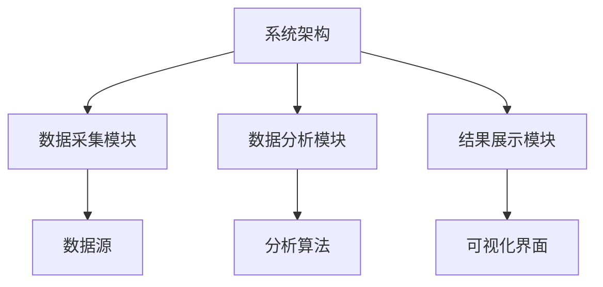
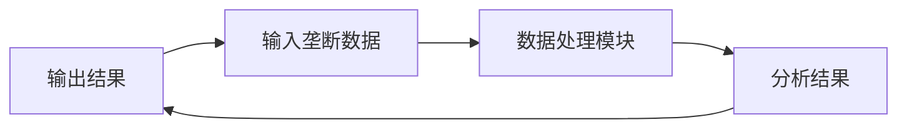

                 


# 价值投资中的科技巨头垄断分析

> 关键词：价值投资、科技巨头、垄断分析、市场结构、数学模型

> 摘要：本文深入探讨了科技巨头垄断现象对价值投资的影响，从理论分析到实际应用，结合数学模型和系统架构设计，详细解析了如何在垄断市场中进行价值投资分析。

---

## 第一部分: 价值投资中的科技巨头垄断分析基础

### 第1章: 背景介绍

#### 1.1 科技巨头垄断的背景与现状

##### 1.1.1 科技行业垄断的定义与特征
科技行业的垄断通常表现为一家或少数几家企业在某个市场领域占据绝对主导地位，具有市场支配地位。其主要特征包括：
- 市场份额集中：单个企业或少数企业占据大部分市场份额。
- 进入壁垒高：技术、资金、网络效应等使得新进入者难以竞争。
- 垄断利润：企业能够通过垄断地位获得高于市场平均水平的利润。

##### 1.1.2 当前科技巨头垄断的现状分析
近年来，科技行业（如互联网、人工智能、云计算等）出现了明显的垄断趋势。例如，美国的FAANG（Facebook、Apple、Amazon、Netflix、Google）企业在全球范围内占据了重要地位。中国的BAT（Baidu、Alibaba、Tencent）也在各自领域形成了垄断优势。

##### 1.1.3 垄断对市场和竞争的影响
- 垄断会扼杀竞争，限制创新，导致市场效率下降。
- 垄断企业可以通过价格操纵、市场分割等手段获取超额利润。
- 垄断可能对消费者利益造成损害，例如提高产品价格、降低产品质量。

#### 1.2 价值投资的核心概念

##### 1.2.1 价值投资的基本原理
价值投资是一种投资策略，强调以低于市场价值的价格购买优质资产。核心思想是寻找被市场低估的企业，长期持有，等待其价值回归。

##### 1.2.2 价值投资与科技行业的结合
科技行业的高成长性和高波动性为价值投资者提供了丰富的投资机会。然而，科技行业的垄断现象也给价值投资带来了新的挑战。

##### 1.2.3 垄断对价值投资的影响
- 垄断企业通常具有较高的市场份额和利润率，能够为投资者提供稳定的收益。
- 垄断可能限制行业的增长空间，导致企业的长期盈利能力下降。
- 垄断企业可能面临反垄断监管的风险，影响股价波动。

---

### 第2章: 科技巨头垄断与价值投资的核心概念

#### 2.1 垄断与竞争的理论分析

##### 2.1.1 垄断的经济学定义
在经济学中，垄断是指市场中唯一的卖方，能够控制价格和产量。垄断企业可以通过定价策略最大化利润，但会损害市场效率。

##### 2.1.2 垄断与市场结构的关系
市场结构决定企业的竞争环境。垄断市场是一个极端的市场结构，通常表现为CR4（前四大企业市场份额之和）接近100%。

##### 2.1.3 垄断对消费者和企业的双重影响
- 垄断企业可以提高产品价格，降低产品质量，损害消费者利益。
- 垄断企业能够通过市场支配地位巩固自身地位，但可能抑制行业创新。

#### 2.2 价值投资中的垄断分析框架

##### 2.2.1 垄断对企业价值的影响
- 垄断企业通常具有较高的利润率和市场份额，能够在短期内为投资者带来稳定收益。
- 垄断可能限制企业的长期增长空间，影响企业的可持续发展。

##### 2.2.2 价值投资中的垄断分析维度
- 市场集中度分析：通过计算市场集中度指标（如CR4、CR8）评估垄断程度。
- 企业盈利能力分析：分析垄断企业是否能够持续获得超额利润。
- 反垄断风险分析：评估企业是否面临反垄断监管的风险。

##### 2.2.3 垄断企业的财务特征分析
- 高利润率：垄断企业通常具有较高的净利率和毛利率。
- 高市场份额：垄断企业在市场中占据主导地位。
- 高资本支出：垄断企业通常需要大量的研发投入和资本支出来维持竞争优势。

---

### 第3章: 科技巨头垄断的数学模型与分析方法

#### 3.1 垄断市场的数学模型

##### 3.1.1 完全垄断市场的定价模型
在完全垄断市场中，企业能够通过调整价格和产量来实现利润最大化。垄断企业的定价公式为：
$$ P = MC + \text{Markup} $$
其中，$P$ 是价格，$MC$ 是边际成本，Markup 是加成比例。

##### 3.1.2 垄断企业的利润最大化分析
垄断企业通过调整产量和价格，使得边际收益等于边际成本：
$$ MR = MC $$

##### 3.1.3 垄断对市场效率的影响
垄断市场通常会导致资源配置效率低下，社会福利损失较大。社会福利损失可以用以下公式计算：
$$ \text{社会福利损失} = \frac{(P_{\text{ monopoly}} - P_{\text{ competitive}})^2 \times Q_{\text{ competitive}}}{2} $$

#### 3.2 科技巨头垄断指数的计算方法

##### 3.2.1 垄断指数的定义与计算公式
垄断指数（Herschman-Herschman Index，HHI）是一种常用的市场集中度指标。计算公式为：
$$ HHI = \sum_{i=1}^{n} s_i^2 $$
其中，$s_i$ 是第$i$个企业的市场份额，$n$ 是市场中企业的数量。

##### 3.2.2 市场集中度分析（CR4、CR8）
CR4和CR8分别表示前4大和前8大企业的市场份额之和。计算公式为：
$$ CR4 = \sum_{i=1}^{4} s_i $$
$$ CR8 = \sum_{i=1}^{8} s_i $$

##### 3.2.3 垄断对股价波动的影响模型
垄断企业的股价波动可以用以下模型分析：
$$ P = \beta \times R_f + \alpha \times \text{垄断指数} $$

---

### 第4章: 科技巨头垄断的系统分析与架构设计

#### 4.1 系统分析框架

##### 4.1.1 问题场景介绍
本文以分析某科技巨头的垄断情况为例，构建一个完整的分析框架。

##### 4.1.2 项目目标与范围
目标：分析某科技巨头的垄断指数及其对股价的影响。范围：包括数据采集、分析、可视化和报告生成。

##### 4.1.3 系统功能需求分析
- 数据采集：收集企业的市场份额、财务数据等。
- 数据分析：计算垄断指数，评估反垄断风险。
- 可视化：生成图表和报告，直观展示分析结果。

#### 4.2 系统架构设计

##### 4.2.1 系统架构图（Mermaid）


##### 4.2.2 系统接口设计
- 数据采集模块接口：从数据库或API获取数据。
- 数据分析模块接口：调用分析算法，返回结果。
- 可视化模块接口：接收分析结果，生成图表。

##### 4.2.3 系统交互流程图（Mermaid）


---

## 第五章: 项目实战——科技巨头垄断分析

### 5.1 环境安装与配置

#### 5.1.1 Python环境安装
安装Python 3.8及以上版本，推荐使用Anaconda。

#### 5.1.2 数据分析库安装
安装Pandas、NumPy、Matplotlib、Seaborn等库。

```bash
pip install pandas numpy matplotlib seaborn
```

---

### 5.2 系统核心实现源代码

#### 5.2.1 数据采集模块

```python
import pandas as pd

# 数据采集模块
def collect_data():
    # 示例数据：假设我们从CSV文件中读取数据
    data = pd.read_csv('market_share.csv')
    return data

# 示例数据：市场占有率数据
data = collect_data()
print(data.head())
```

---

#### 5.2.2 数据分析模块

```python
import pandas as pd
import matplotlib.pyplot as plt

def analyze_monopoly(data):
    # 计算HHI指数
    hhi = data['Market Share'].apply(lambda x: x**2).sum()
    print(f"HHI指数为：{hhi}")
    
    # 可视化市场份额分布
    data['Market Share'].plot(kind='bar')
    plt.title('市场份额分布')
    plt.show()

# 数据分析模块
analyze_monopoly(data)
```

---

#### 5.2.3 结果展示模块

```python
import pandas as pd
import matplotlib.pyplot as plt
import seaborn as sns

def visualize_results(data):
    # 绘制垄断指数趋势图
    sns.lineplot(x='Year', y='HHI指数', data=data)
    plt.title('垄断指数趋势图')
    plt.show()

# 结果展示模块
visualize_results(data)
```

---

### 5.3 项目小结

通过本项目的实施，我们成功构建了一个完整的科技巨头垄断分析系统。通过数据分析模块，我们可以准确计算垄断指数，并评估垄断对企业价值的影响。通过可视化模块，我们可以直观展示分析结果，为投资者提供决策支持。

---

## 总结

本文从理论到实践，详细分析了科技巨头垄断对价值投资的影响。通过数学模型和系统架构设计，我们为投资者提供了一个完整的分析框架。未来，随着科技行业的不断发展，垄断分析将成为价值投资中的重要环节，值得进一步深入研究。

---

**注意事项**：
- 本文分析基于假设数据，实际应用中需结合具体企业的实际数据进行分析。
- 垄断分析需遵守相关法律法规，尊重市场和消费者权益。
- 投资者在进行价值投资时，需综合考虑多种因素，本文仅提供分析框架，不构成投资建议。

**拓展阅读**：
- 《垄断经济学》
- 《价值投资实战》
- 《科技行业反垄断案例分析》

