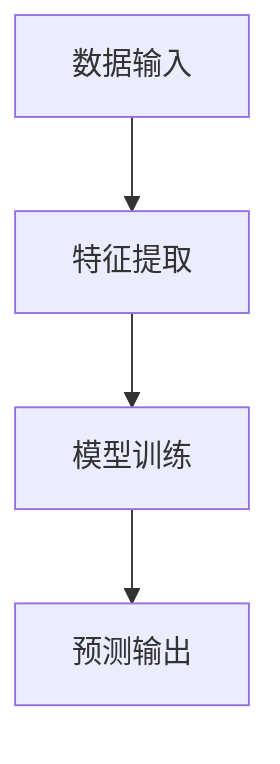
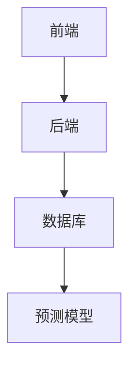
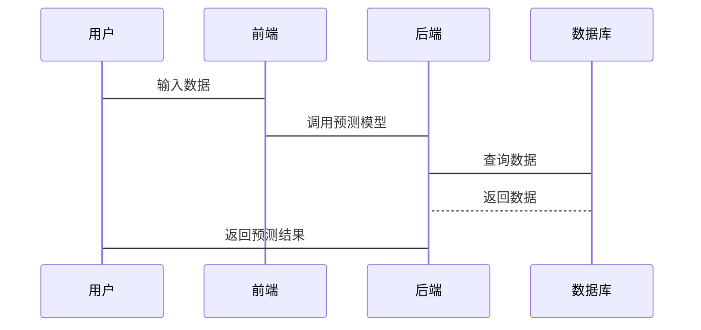

                 


# 价值投资中的精准医疗技术趋势

> 关键词：价值投资、精准医疗、技术趋势、算法原理、系统架构

> 摘要：本文探讨了价值投资在精准医疗技术中的应用趋势，分析了精准医疗的核心概念、算法原理、系统架构，并结合实际案例进行了详细解读。通过本文，读者可以了解如何将价值投资策略与精准医疗技术相结合，实现高效的投资决策和技术创新。

---

## 第一部分: 价值投资与精准医疗的背景介绍

### 第1章: 价值投资与精准医疗的背景介绍

#### 1.1 价值投资的核心概念
##### 1.1.1 价值投资的定义与核心思想
价值投资是一种长期投资策略，其核心思想是通过深入分析企业的基本面，寻找被市场低估的投资标的。这种策略强调长期持有优质资产，关注企业的内在价值，而非短期市场波动。

##### 1.1.2 价值投资在医疗领域的应用
医疗领域是一个高度依赖技术和数据的行业。价值投资在医疗领域的应用主要集中在对医疗企业的基本面分析，如企业盈利能力、市场地位、研发能力、管理团队等方面。

##### 1.1.3 精准医疗的定义与技术特点
精准医疗是指通过基因测序、大数据分析等技术，为患者提供个性化治疗方案的医疗模式。其特点在于高度依赖数据和技术，能够实现对疾病的精准诊断和治疗。

---

#### 1.2 精准医疗技术的趋势分析
##### 1.2.1 精准医疗的现状与发展趋势
随着基因测序技术的进步和人工智能的发展，精准医疗正在快速发展。未来，精准医疗将更加依赖于大数据和人工智能技术，实现更高效的诊断和治疗。

##### 1.2.2 精准医疗技术的核心领域
精准医疗的核心领域包括基因测序、靶向治疗、个性化诊断等。

##### 1.2.3 精准医疗与价值投资的结合点
精准医疗与价值投资的结合点在于通过技术手段提高医疗企业的估值能力和投资决策的准确性。

---

### 第2章: 精准医疗技术的核心概念与联系

#### 2.1 精准医疗技术的核心原理
##### 2.1.1 精准医疗的技术基础
精准医疗的技术基础包括基因测序、人工智能、大数据分析等。

##### 2.1.2 精准医疗的核心要素
精准医疗的核心要素包括患者的基因信息、临床数据、治疗方案等。

##### 2.1.3 精准医疗与传统医疗的区别
精准医疗注重个性化和数据驱动，而传统医疗更依赖医生的经验和通用治疗方案。

---

#### 2.2 精准医疗技术的属性特征对比
##### 2.2.1 精准医疗的特征分析
- 数据驱动
- 个性化
- 技术依赖性高

##### 2.2.2 价值投资的特征分析
- 长期性
- 价值导向
- 风险控制

##### 2.2.3 两者特征对比的表格
| 特性 | 精准医疗 | 价值投资 |
|------|----------|----------|
| 核心驱动力 | 数据和技术 | 企业基本面 |
| 时间跨度 | 短期见效 | 长期持有 |
| 风险控制 | 技术风险 | 市场风险 |

---

#### 2.3 ER实体关系图架构
##### 2.3.1 精准医疗技术的实体关系
```mermaid
er
  临床数据
  基因数据
  治疗方案
  患者信息
  医疗机构
```

##### 2.3.2 价值投资的实体关系
```mermaid
er
  投资标的
  财务数据
  管理团队
  市场地位
  投资者
```

##### 2.3.3 两者的实体关系对比
```mermaid
er
  精准医疗实体关系
  价值投资实体关系
```

---

### 第3章: 精准医疗技术的算法原理讲解

#### 3.1 精准医疗技术的核心算法
##### 3.1.1 机器学习在精准医疗中的应用
机器学习算法在精准医疗中的应用包括疾病预测、治疗方案优化等。

##### 3.1.2 算法流程图（使用mermaid）


##### 3.1.3 算法实现的Python代码
```python
import pandas as pd
from sklearn.model import LinearRegression

# 数据加载
data = pd.read_csv('medical_data.csv')

# 特征提取
features = data[['age', 'gender', 'symptoms']]
target = data['disease']

# 模型训练
model = LinearRegression()
model.fit(features, target)

# 预测输出
predictions = model.predict(features)
```

#### 3.2 算法的数学模型与公式
##### 3.2.1 算法原理的数学模型
$$ y = \beta_0 + \beta_1x_1 + \beta_2x_2 + \ldots + \beta_nx_n $$

##### 3.2.2 具体公式
$$ y = f(x) $$

---

### 第4章: 价值投资与精准医疗的系统分析与架构设计

#### 4.1 系统分
##### 4.1.1 问题场景介绍
精准医疗系统的应用场景包括疾病诊断、治疗方案制定等。

##### 4.1.2 项目介绍
本项目旨在构建一个基于价值投资的精准医疗技术分析系统。

##### 4.1.3 系统功能设计（领域模型mermaid类图）


##### 4.1.4 系统架构设计mermaid架构图


##### 4.1.5 系统接口设计
系统接口包括数据输入接口、模型调用接口等。

##### 4.1.6 系统交互mermaid序列图


---

## 第五章: 项目实战

### 5.1 环境安装
#### 5.1.1 安装Python环境
使用Anaconda安装Python 3.8及以上版本。

#### 5.1.2 安装依赖库
安装pandas、scikit-learn等库。

### 5.2 系统核心实现源代码
#### 5.2.1 数据加载与预处理
```python
import pandas as pd
data = pd.read_csv('medical_data.csv')
```

#### 5.2.2 特征提取与模型训练
```python
from sklearn.model import LinearRegression
model = LinearRegression()
model.fit(features, target)
```

#### 5.2.3 模型预测与结果分析
```python
predictions = model.predict(features)
print('预测结果:', predictions)
```

### 5.3 案例分析与详细解读
#### 5.3.1 案例背景
分析一家医疗企业的基本面和技术能力。

#### 5.3.2 数据分析与建模
使用机器学习模型进行预测和分析。

#### 5.3.3 结果解读
解读模型预测结果，评估企业的投资价值。

---

## 第六章: 最佳实践与总结

### 6.1 小结
通过本文的分析，我们可以看到价值投资与精准医疗的结合是一种创新的思路，能够为医疗行业带来更高的效率和准确性。

### 6.2 注意事项
在实际应用中，需要注意数据的准确性和模型的可解释性。

### 6.3 拓展阅读
建议读者进一步学习机器学习和价值投资的相关知识，以便更好地理解两者的结合。

---

通过以上内容，我们可以看到，价值投资中的精准医疗技术趋势是一个复杂但充满潜力的领域。通过技术与策略的结合，我们可以实现更高效的投资决策和技术创新。

