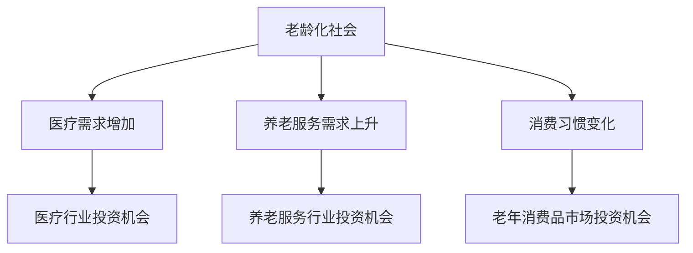

                 


```markdown
# 价值投资中的老龄化社会机遇

---

## 关键词
价值投资，老龄化社会，投资机会，投资策略，经济影响，社会投资

---

## 摘要
老龄化社会是全球面临的重大挑战，但也带来了巨大的投资机遇。本文从价值投资的角度，分析老龄化社会的经济和社会影响，探讨医疗、科技养老、消费等领域的投资机会，构建价值投资模型，并设计相应的投资策略。通过实际案例分析和系统架构图的展示，为投资者提供科学的指导。

---

# 第1章: 考虑老龄化社会的背景与现状

## 1.1 老龄化社会的定义与特征

### 1.1.1 老龄化社会的定义
老龄化社会是指65岁及以上人口占总人口比例超过7%的社会。这一定义由联合国提出，是衡量一个国家或地区是否进入老龄化的标准。

### 1.1.2 老龄化社会的主要特征
- 人口结构变化：年轻人比例下降，老年人比例上升。
- 劳动力市场萎缩：老龄化导致劳动年龄人口减少，影响经济增长。
- 社会保障压力：老龄化增加了养老金、医疗支出等社会保障压力。

### 1.1.3 老龄化社会的全球分布与发展趋势
- 全球老龄化趋势明显，发达国家老龄化程度较高，发展中国家也在加速老龄化。
- 未来几十年，全球老年人口将大幅增加，带来深远的社会和经济影响。

## 1.2 老龄化社会的经济与社会影响

### 1.2.1 老龄化对经济结构的影响
- 劳动力减少，经济增长放缓。
- 企业用工成本上升，影响企业竞争力。
- 消费需求变化，医疗、养老等需求增加。

### 1.2.2 老龄化对劳动力市场的冲击
- 劳动年龄人口减少，企业面临用工短缺。
- 高龄劳动力比例上升，劳动效率可能下降。
- 青年就业压力减轻，但高龄劳动者可能面临就业歧视。

### 1.2.3 老龄化对社会保障体系的压力
- 养老金支出增加，社会保障基金压力加大。
- 医疗支出上升，社会保障资源紧张。
- 养老服务需求增加，社会服务系统需要扩容。

## 1.3 价值投资的基本概念与原则

### 1.3.1 价值投资的定义
价值投资是一种投资策略，强调以低于市场价值的价格买入优质资产，长期持有，等待价值回归。

### 1.3.2 价值投资的核心原则
- 买入低估资产：寻找市场价格低于内在价值的标的。
- 长期持有：避免短期波动，关注长期价值。
- 高质量企业：选择具有竞争优势、良好治理的企业。

### 1.3.3 价值投资与老龄化社会的关联
- 老龄化社会中，医疗、养老等需求增加，相关行业具有长期增长潜力。
- 价值投资者可以通过分析老龄化社会的结构性变化，寻找被低估的投资标的。

---

# 第2章: 老龄化社会中的投资机会

## 2.1 老龄化社会的投资机遇

### 2.1.1 医疗健康领域的投资机会
- 医疗需求增加：老龄化社会中，医疗支出占GDP比重上升。
- 健康管理兴起：预防性医疗、健康管理服务需求增长。
- 医疗科技发展：智能医疗设备、远程医疗等领域具有投资潜力。

### 2.1.2 养老服务与智能家居的投资潜力
- 养老服务需求增加：专业养老服务机构、社区养老等模式受欢迎。
- 智能家居市场：适老化智能家居产品需求上升。
- 养老地产：养老社区、康养地产等投资机会。

### 2.1.3 老龄化社会下的消费趋势分析
- 老年人口增加，带动老年消费市场增长。
- 老年人消费习惯：注重健康、安全、便利。
- 老年消费品市场：保健品、适老化产品等需求增加。

## 2.2 价值投资视角下的老龄化社会分析

### 2.2.1 老龄化社会中的低估值企业识别
- 寻找被市场低估的医疗、养老相关企业。
- 分析企业财务状况，评估其内在价值。
- 关注企业竞争优势，选择具有长期增长潜力的标的。

### 2.2.2 老龄化社会中企业的核心竞争力评估
- 企业是否具备满足老龄化需求的核心能力。
- 企业财务健康状况，盈利能力是否稳定。
- 企业市场地位，是否在老龄化相关领域具有领先地位。

### 2.2.3 老龄化社会中的长期投资策略
- 长期持有优质资产，避免短期波动干扰。
- 选择具有持续增长潜力的企业，分享老龄化红利。
- 分散投资风险，构建多元化的投资组合。

---

# 第3章: 老龄化社会与价值投资的核心概念

## 3.1 老龄化社会中的价值投资模型

### 3.1.1 价值投资模型的构建
- 确定投资目标：寻找老龄化社会中的投资机会。
- 选择指标：市盈率、市净率、股息率等。
- 评估内在价值：基于企业基本面分析，估算内在价值。

### 3.1.2 老龄化社会中的企业估值方法
- 相对估值法：基于可比公司进行估值。
- 绝对估值法：基于现金流折现法等方法进行估值。
- 综合分析：结合行业特点和企业具体情况，选择合适的估值方法。

### 3.1.3 老龄化社会中的投资组合优化
- 确定投资比例：根据风险承受能力和收益目标，合理配置资产。
- 选择标的：结合老龄化社会的分析，选择具有长期增长潜力的标的。
- 定期调整：根据市场变化和企业情况，动态调整投资组合。

## 3.2 老龄化社会与价值投资的联系

### 3.2.1 老龄化社会对价值投资的影响
- 老龄化社会中，医疗、养老等行业的长期增长潜力为价值投资提供了优质标的。
- 老龄化社会中，低估值企业可能因行业需求增加而获得重估机会。

### 3.2.2 价值投资在老龄化社会中的应用
- 通过基本面分析，寻找老龄化社会中的投资机会。
- 长期持有优质资产，分享老龄化红利。
- 通过价值投资策略，实现稳健的长期收益。

### 3.2.3 老龄化社会中的价值投资风险与收益分析
- 收益：老龄化社会中，医疗、养老等行业的增长潜力为价值投资提供了收益机会。
- 风险：老龄化社会中，部分行业可能面临政策、竞争等风险。

---

# 第4章: 老龄化社会中的投资策略设计

## 4.1 投资策略的制定与实施

### 4.1.1 投资目标的设定
- 确定投资期限：长期投资更适合价值投资。
- 确定收益目标：根据自身需求，设定合理的收益目标。
- 确定风险承受能力：评估自身对风险的承受能力。

### 4.1.2 投资策略的制定
- 行业选择：重点关注医疗、养老等与老龄化相关的行业。
- 标的选择：选择具有竞争优势、财务健康的企业。
- 投资组合配置：根据风险偏好，合理配置资产。

### 4.1.3 投资策略的实施与监控
- 定期评估投资组合表现。
- 依据市场变化和企业情况，调整投资策略。
- 关注行业动态，及时捕捉投资机会。

## 4.2 投资组合的构建与优化

### 4.2.1 投资组合的构建原则
- 分散投资：避免过度集中，降低风险。
- 长期持有：价值投资强调长期持有，避免短期波动干扰。
- 选择优质标的：重点关注具有长期增长潜力的企业。

### 4.2.2 老龄化社会中的投资组合优化方法
- 根据市场变化，动态调整投资组合。
- 关注行业轮动，抓住老龄化社会中的投资机会。
- 优化资产配置，平衡风险与收益。

### 4.2.3 投资组合的风险管理
- 设定止损点：避免重大损失。
- 定期评估投资组合：及时发现和解决问题。
- 关注宏观经济变化，调整投资策略。

---

# 第5章: 价值投资中的老龄化社会机遇

## 5.1 老龄化社会中的价值投资案例分析

### 5.1.1 医疗行业投资案例
- 某医疗企业基本面分析：财务状况、市场地位等。
- 估值分析：市盈率、市净率等指标。
- 投资建议：长期持有，分享行业增长红利。

### 5.1.2 智能养老设备投资案例
- 某智能养老设备企业分析：技术优势、市场前景等。
- 估值分析：现金流折现法等方法。
- 投资策略：重点关注技术领先、市场潜力大的企业。

## 5.2 系统架构图展示



## 5.3 投资实战：如何选择标的

### 5.3.1 确定投资目标
- 选择医疗、养老等与老龄化相关的行业。
- 确定投资期限：长期投资更适合价值投资。

### 5.3.2 分析企业基本面
- 财务状况：关注企业的盈利能力、资产负债情况等。
- 市场地位：企业是否在行业内具有领先地位。
- 竞争优势：企业是否有独特的竞争优势。

### 5.3.3 估值分析
- 相对估值法：市盈率、市净率等指标。
- 绝对估值法：现金流折现法等方法。
- 综合分析：结合行业特点和企业具体情况，选择合适的估值方法。

## 5.4 投资策略优化

### 5.4.1 定期评估投资组合
- 关注行业动态，及时调整投资策略。
- 依据市场变化和企业情况，动态优化投资组合。

### 5.4.2 关注宏观经济变化
- 经济政策变化：如财政政策、货币政策等。
- 行业政策变化：如医疗、养老等行业政策调整。

### 5.4.3 风险管理
- 设定止损点，避免重大损失。
- 分散投资，降低风险。
- 定期评估投资组合，及时发现问题。

---

## 结语

老龄化社会既是挑战，也是机遇。通过价值投资，投资者可以抓住老龄化社会中的投资机会，实现稳健的长期收益。本文从背景、概念、策略、案例等多个方面，全面分析了老龄化社会中的投资机会，并提出了科学的投资策略。希望本文能为投资者提供有价值的参考，帮助他们在老龄化社会中找到成功的投资路径。

---

## 最佳实践 Tips

1. **长期持有优质资产**：价值投资强调长期持有，避免短期波动干扰。
2. **关注基本面分析**：选择具有竞争优势、财务健康的企业。
3. **分散投资，降低风险**：避免过度集中，合理配置资产。
4. **关注行业动态**：及时捕捉老龄化社会中的投资机会。
5. **风险管理**：设定止损点，定期评估投资组合，及时调整策略。

---

## 小结

通过本文的分析，我们可以看到，老龄化社会为价值投资提供了丰富的投资机会。投资者需要结合老龄化社会的特征，分析医疗、养老等行业的投资潜力，选择具有竞争优势的企业，制定科学的投资策略，实现长期稳健的收益。

---

## 注意事项

- 投资有风险，需谨慎决策。
- 本文分析基于当前信息，未来市场变化可能影响投资结果。
- 投资者需结合自身情况，制定合理的投资策略。

---

## 拓展阅读

1. 《价值投资入门》：深入理解价值投资的基本概念和原则。
2. 《老龄化社会的挑战与机遇》：全面分析老龄化社会的经济和社会影响。
3. 《医疗行业投资分析》：详细探讨医疗行业的投资机会和策略。

---

通过本文的分析和指导，投资者可以更好地把握老龄化社会中的投资机会，实现财富的长期稳健增长。
```

