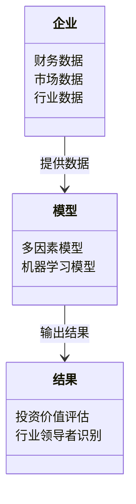
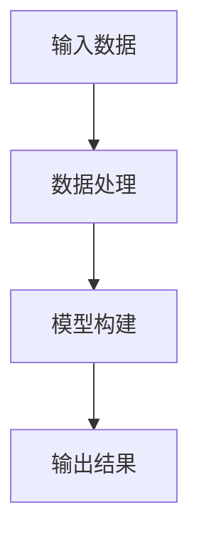

                 


# 价值投资中的行业领导者识别

> 关键词：价值投资、行业领导者、竞争优势、财务指标、多因素模型、机器学习、系统分析

> 摘要：本文系统地探讨了在价值投资中识别行业领导者的方法和策略。通过分析行业领导者的核心特征、竞争优势、财务指标，结合多因素模型和机器学习算法，提出了一套行业领导者识别的系统架构和实战方案。文章内容包括背景介绍、核心概念、算法原理、系统分析、项目实战等多个部分，为读者提供了一套完整的行业领导者识别框架。

---

## 第一章: 行业领导者识别的背景与概念

### 1.1 价值投资的核心理念
价值投资是一种长期投资策略，强调以低于内在价值的价格买入优质资产。行业领导者作为市场中的优质资产，具有较强的竞争优势和持续的盈利能力，是价值投资者的重要目标。本节将从价值投资的定义、核心理念出发，探讨行业领导者在价值投资中的重要性。

#### 1.1.1 价值投资的定义与特点
- **定义**：价值投资是一种投资策略，强调通过深入分析企业的基本面，寻找市场价格低于内在价值的投资机会。
- **特点**：
  - 长期投资：关注企业的长期价值，而非短期价格波动。
  - 低估值：寻找市场价格低于内在价值的企业。
  - 高质量：选择具有强大竞争优势和良好管理的企业。

#### 1.1.2 行业领导者在价值投资中的重要性
行业领导者是指在行业内具有领先地位、市场份额和竞争优势的企业。它们通常具有较强的盈利能力、品牌影响力和抗风险能力。在价值投资中，行业领导者是优质资产的核心代表，具有较高的投资价值和长期增长潜力。

#### 1.1.3 行业领导者识别的解决方法
- **行业分析**：通过分析行业的竞争格局、市场结构和增长潜力，识别具有竞争优势的企业。
- **财务分析**：通过分析企业的财务指标，评估企业的盈利能力、财务健康状况和估值水平。
- **竞争优势分析**：分析企业的核心竞争力，包括技术优势、成本优势、品牌优势等。

#### 1.1.4 行业领导者识别的边界与外延
- **边界**：行业领导者通常是指行业内排名靠前的企业，但并非所有行业领导者都适合价值投资。需要结合企业的财务状况、竞争优势和市场环境进行综合评估。
- **外延**：行业领导者识别不仅关注企业的当前表现，还需要预测企业的未来增长潜力和竞争优势的可持续性。

### 1.2 行业领导者的定义与特征
#### 1.2.1 行业领导者的定义
行业领导者是指在行业内具有显著竞争优势、市场份额和品牌影响力的企业。它们通常具有较高的市场地位、较强的盈利能力和发展潜力。

#### 1.2.2 行业领导者的核心特征对比
以下是行业领导者与其他企业的主要特征对比：

| 特征维度       | 行业领导者               | 普通企业               |
|----------------|--------------------------|------------------------|
| 市场地位         | 高市场份额               | 低市场份额或无          |
| 竞争优势       | 强大的技术、成本或品牌优势 | 竞争优势较弱           |
| 盈利能力       | 高利润率                 | 利润率较低             |
| 市场影响力       | 领导地位                 | 跟随地位               |
| 抗风险能力     | 强大                   | 较弱                  |

#### 1.2.3 行业领导者与普通企业的区别
- **市场地位**：行业领导者通常占据行业的主要市场份额，而普通企业则处于次要地位。
- **竞争优势**：行业领导者具有显著的技术、成本或品牌优势，而普通企业则缺乏这些优势。
- **盈利能力**：行业领导者通常具有较高的利润率和稳定的收益能力，而普通企业则可能面临较低的利润率和不稳定的收益。

### 1.3 行业领导者识别的必要性与意义
#### 1.3.1 识别行业领导者的必要性
- **投资收益**：行业领导者通常具有较高的投资回报率和增长潜力。
- **风险控制**：行业领导者具有较强的抗风险能力，能够在市场波动中保持稳定。
- **竞争优势**：行业领导者具有显著的竞争优势，能够在行业中长期保持领先地位。

#### 1.3.2 识别行业领导者的意义
- **优化投资组合**：通过识别行业领导者，投资者可以构建高质量的投资组合，降低投资风险，提高投资收益。
- **长期价值投资**：行业领导者具有长期增长潜力，适合价值投资者的长期投资策略。
- **行业趋势分析**：通过识别行业领导者，投资者可以更好地把握行业发展趋势，抓住投资机会。

---

## 第二章: 行业领导者识别的核心概念与联系

### 2.1 行业分析与竞争格局
#### 2.1.1 行业分析的基本方法
行业分析是识别行业领导者的重要步骤。以下是行业分析的基本方法：

1. **行业生命周期分析**：分析行业的生命周期阶段，判断行业是否处于成长期或成熟期。
2. **市场结构分析**：分析行业的市场结构，判断行业的竞争程度和市场集中度。
3. **行业趋势分析**：分析行业的未来发展趋势，判断行业的增长潜力和风险。

#### 2.1.2 行业竞争格局的分析框架
行业竞争格局的分析框架包括以下几个方面：

- **市场集中度**：分析行业内主要企业的市场份额，判断行业的市场集中度。
- **竞争态势**：分析行业内主要企业的竞争策略和竞争优势，判断行业的竞争态势。
- **潜在进入者**：分析行业内潜在进入者的威胁，判断行业的竞争压力。

#### 2.1.3 行业领导者在竞争中的地位
行业领导者通常在行业内具有显著的竞争优势，能够在竞争中占据领先地位。以下是行业领导者在竞争中的主要地位：

- **市场份额**：行业领导者通常占据行业内较大的市场份额。
- **品牌影响力**：行业领导者通常具有较强的品牌影响力，能够吸引更多的客户。
- **技术优势**：行业领导者通常具有较强的技术优势，能够保持产品的竞争力。

### 2.2 企业竞争优势的构成
#### 2.2.1 核心竞争力的定义
核心竞争力是指企业在市场上能够提供独特价值的能力。核心竞争力是企业竞争优势的核心来源。

#### 2.2.2 企业竞争优势的构成要素
以下是企业竞争优势的主要构成要素：

- **技术优势**：企业具有领先的技术水平，能够提供创新的产品或服务。
- **成本优势**：企业具有较低的生产成本，能够提供具有竞争力的价格。
- **品牌优势**：企业具有强大的品牌影响力，能够吸引更多的客户。
- **管理优势**：企业具有高效的管理水平，能够优化资源配置，提高运营效率。
- **市场网络**：企业具有广泛的市场网络，能够拓展销售渠道，扩大市场份额。

#### 2.2.3 企业竞争优势与行业领导力的关系
企业竞争优势是行业领导力的核心来源。以下是企业竞争优势与行业领导力的关系：

- **竞争优势决定市场地位**：企业竞争优势越强，市场地位越高，行业领导力越显著。
- **竞争优势决定增长潜力**：企业竞争优势越强，未来增长潜力越大，行业领导力越持久。
- **竞争优势决定抗风险能力**：企业竞争优势越强，抗风险能力越强，能够在市场波动中保持领先地位。

### 2.3 财务指标与企业价值评估
#### 2.3.1 财务指标在行业领导者识别中的作用
财务指标是评估企业价值的重要工具，也是识别行业领导者的重要依据。以下是财务指标在行业领导者识别中的主要作用：

- **评估盈利能力**：通过分析企业的净利润率、ROE等指标，评估企业的盈利能力。
- **评估财务健康状况**：通过分析企业的资产负债率、流动比率等指标，评估企业的财务健康状况。
- **评估估值水平**：通过分析企业的市盈率、市净率等指标，评估企业的估值水平。

#### 2.3.2 主要财务指标的分析与对比
以下是主要财务指标的分析与对比：

| 财务指标       | 定义与计算公式                           | 作用与意义               |
|----------------|----------------------------------------|--------------------------|
| 净利润率       | 净利润 / 收入                           | 评估企业的盈利能力       |
| 资产负债率     | 负债总额 / 资产总额                     | 评估企业的财务风险       |
| 流动比率       | 流动资产 / 流动负债                     | 评估企业的短期偿债能力   |
| 市盈率         | 每股价格 / 每股收益                     | 评估企业的估值水平       |
| 市净率         | 每股价格 / 每股净资产                     | 评估企业的估值水平       |
| ROE（净资产收益率）| 净利润 / 净资产                         | 评估企业的投资回报率     |

#### 2.3.3 财务健康状况与企业价值的关系
企业的财务健康状况是影响企业价值的重要因素。以下是财务健康状况与企业价值的关系：

- **财务健康状况决定企业稳定性**：财务健康的企业能够保持稳定的经营，抵御市场风险。
- **财务健康状况决定企业增长潜力**：财务健康的企业具有较强的资金实力，能够进行投资和扩张。
- **财务健康状况决定企业估值水平**：财务健康的企业通常具有较高的估值水平，吸引更多的投资者。

### 2.4 核心概念与联系的总结
#### 2.4.1 行业分析与竞争优势的关系
行业分析是识别行业领导者的基础，而竞争优势是行业领导力的核心来源。通过行业分析，可以识别行业中的潜在领导者，再通过竞争优势分析，可以评估企业的核心竞争力。

#### 2.4.2 财务指标与企业价值的综合评估
财务指标是评估企业价值的重要工具，也是识别行业领导者的重要依据。通过综合分析财务指标，可以评估企业的盈利能力、财务健康状况和估值水平，从而判断企业的投资价值。

#### 2.4.3 行业领导者识别的系统性框架
行业领导者识别的系统性框架包括以下几个步骤：

1. **行业分析**：分析行业的生命周期、市场结构和竞争格局，识别行业的潜在领导者。
2. **竞争优势分析**：分析企业的核心竞争力，评估企业的竞争优势和市场地位。
3. **财务指标分析**：分析企业的财务指标，评估企业的盈利能力、财务健康状况和估值水平。
4. **综合评估**：结合行业分析、竞争优势分析和财务指标分析，综合评估企业的投资价值，识别行业领导者。

---

## 第三章: 行业领导者识别的算法原理与数学模型

### 3.1 行业领导者识别的算法概述
#### 3.1.1 多因素模型在行业领导者识别中的应用
多因素模型是一种常用的金融模型，用于评估资产的预期收益和风险。在行业领导者识别中，多因素模型可以用于分析企业的财务指标和市场因素，评估企业的投资价值。

#### 3.1.2 机器学习算法的适用性分析
机器学习算法是一种基于数据的分析方法，能够从大量的数据中发现规律和模式。在行业领导者识别中，机器学习算法可以用于分析企业的历史数据和市场数据，预测企业的未来表现。

#### 3.1.3 数据挖掘在行业领导者识别中的应用
数据挖掘是一种从大量数据中提取有用信息的技术，能够帮助投资者发现潜在的行业领导者。通过数据挖掘技术，可以分析企业的财务数据、市场数据和行业数据，识别具有竞争优势和增长潜力的企业。

### 3.2 多因素模型的数学公式
#### 3.2.1 多因素模型的基本公式
多因素模型的基本公式如下：
$$ R_i = \alpha_i + \beta_i (R_m - R_f) + \beta_i^s Size + \beta_i^t Profitability + \epsilon $$

其中：
- $R_i$：企业i的预期收益率
- $\alpha_i$：企业i的截距项
- $\beta_i$：企业i的市场风险溢价系数
- $R_m$：市场收益率
- $R_f$：无风险收益率
- $\beta_i^s$：企业i的规模因子系数
- $\beta_i^t$：企业i的盈利能力因子系数
- $\epsilon$：误差项

#### 3.2.2 各变量的解释与权重分配
- **$\alpha_i$**：截距项，表示企业i在无风险收益率下的预期收益率。
- **$\beta_i$**：市场风险溢价系数，表示企业i的收益对市场风险的敏感程度。
- **$\beta_i^s$**：规模因子系数，表示企业i的收益对规模因子的敏感程度。
- **$\beta_i^t$**：盈利能力因子系数，表示企业i的收益对盈利能力因子的敏感程度。

#### 3.2.3 模型的优缺点分析
- **优点**：
  - 能够同时考虑多个因素对企业收益的影响。
  - 可以通过调整权重，反映不同因素对企业收益的影响程度。
- **缺点**：
  - 模型假设可能存在偏差，如假设市场风险溢价系数和规模因子系数是常数。
  - 模型的预测能力可能受到数据质量和数量的限制。

### 3.3 基于机器学习的行业领导者识别流程
#### 3.3.1 数据预处理与特征选择
- **数据预处理**：清洗数据，处理缺失值和异常值。
- **特征选择**：选择对企业收益和风险有显著影响的特征，如财务指标、市场指标和行业指标。

#### 3.3.2 模型训练与优化
- **模型选择**：选择适合的机器学习算法，如线性回归、随机森林等。
- **模型训练**：利用训练数据训练模型，优化模型参数。
- **模型验证**：通过交叉验证评估模型的性能，调整模型参数。

#### 3.3.3 模型评估与验证
- **评估指标**：使用均方误差（MSE）、R²等指标评估模型的预测能力。
- **验证方法**：通过回测和实证分析验证模型的有效性。

### 3.4 算法原理的总结与应用
#### 3.4.1 多因素模型的实际应用案例
通过多因素模型，可以分析企业的财务指标和市场因素，评估企业的投资价值。例如，可以通过多因素模型分析企业的规模因子和盈利能力因子，预测企业的未来收益。

#### 3.4.2 机器学习算法的潜在应用场景
机器学习算法可以应用于行业领导者识别的多个方面，如市场趋势预测、竞争对手分析和投资组合优化等。

#### 3.4.3 算法选择的注意事项与优化建议
- **数据质量**：确保数据的准确性和完整性，避免数据偏差。
- **模型选择**：根据数据特点和分析目标选择合适的算法，避免盲目使用复杂模型。
- **模型解释性**：选择具有较高解释性的模型，便于分析结果的解读。

---

## 第四章: 行业领导者识别的系统分析与架构设计

### 4.1 系统分析与问题场景介绍
#### 4.1.1 行业领导者识别的系统目标
行业领导者识别系统的目标是通过分析企业的财务数据、市场数据和行业数据，识别具有竞争优势和增长潜力的企业。

#### 4.1.2 问题场景介绍
- **数据获取**：如何获取企业的财务数据和市场数据。
- **数据处理**：如何清洗和处理数据，提取有用的特征。
- **模型构建**：如何构建多因素模型和机器学习模型，预测企业的投资价值。
- **结果展示**：如何将分析结果可视化，便于投资者理解和决策。

### 4.2 项目介绍
#### 4.2.1 项目目标
项目目标是开发一个行业领导者识别系统，帮助投资者识别具有竞争优势和增长潜力的企业。

#### 4.2.2 项目范围
项目范围包括数据获取、数据处理、模型构建和结果展示四个部分。

### 4.3 系统功能设计
#### 4.3.1 领域模型
以下是行业领导者识别系统的领域模型：



#### 4.3.2 系统架构设计
以下是行业领导者识别系统的架构设计：



#### 4.3.3 系统接口设计
以下是系统接口设计的描述：

- **输入接口**：接收企业的财务数据、市场数据和行业数据。
- **输出接口**：输出企业的投资价值评估结果和行业领导者识别结果。

#### 4.3.4 系统交互设计
以下是系统交互设计的描述：

- **用户输入**：用户输入企业的数据，包括财务数据、市场数据和行业数据。
- **数据处理**：系统对输入数据进行清洗和处理，提取有用的特征。
- **模型构建**：系统构建多因素模型和机器学习模型，预测企业的投资价值。
- **结果展示**：系统输出企业的投资价值评估结果和行业领导者识别结果。

### 4.4 系统优化与扩展
#### 4.4.1 系统优化建议
- **数据处理**：优化数据处理流程，提高数据处理效率。
- **模型优化**：优化模型参数，提高模型的预测能力。
- **结果展示**：优化结果展示界面，提高用户体验。

#### 4.4.2 系统扩展方向
- **数据来源**：增加更多的数据来源，如企业新闻、社交媒体数据等。
- **模型扩展**：引入更多的机器学习算法，如深度学习算法，提高模型的预测能力。
- **应用场景**：扩展系统的应用场景，如风险评估、投资组合优化等。

---

## 第五章: 行业领导者识别的项目实战

### 5.1 环境安装与配置
#### 5.1.1 环境要求
- **操作系统**：Windows 10 或更高版本，macOS 10.15 或更高版本。
- **Python版本**：Python 3.8 或更高版本。
- **依赖库**：Pandas、NumPy、Scikit-learn、Matplotlib。

#### 5.1.2 安装依赖库
```bash
pip install pandas numpy scikit-learn matplotlib
```

### 5.2 系统核心实现
#### 5.2.1 数据获取与处理
```python
import pandas as pd
import numpy as np

# 获取数据
data = pd.read_csv('data.csv')

# 数据清洗
data.dropna(inplace=True)
data = data[~data['revenue'].isin([0])]
```

#### 5.2.2 模型构建与训练
```python
from sklearn.linear_model import LinearRegression
from sklearn.model_selection import train_test_split

# 特征选择
features = ['revenue', 'profit', 'market_share']
target = 'value'

X = data[features]
y = data[target]

# 数据分割
X_train, X_test, y_train, y_test = train_test_split(X, y, test_size=0.2, random_state=42)

# 模型训练
model = LinearRegression()
model.fit(X_train, y_train)

# 模型预测
y_pred = model.predict(X_test)
```

#### 5.2.3 结果展示与分析
```python
import matplotlib.pyplot as plt

plt.scatter(y_test, y_pred)
plt.xlabel('Actual Value')
plt.ylabel('Predicted Value')
plt.title('Value Prediction')
plt.show()
```

### 5.3 项目小结
#### 5.3.1 项目实现的关键点
- **数据处理**：数据清洗和特征选择是项目成功的关键。
- **模型选择**：选择合适的算法和模型是项目成功的核心。
- **结果展示**：清晰的结果展示是项目成功的重要组成部分。

#### 5.3.2 项目实现的难点
- **数据质量**：数据的质量直接影响模型的预测能力。
- **模型优化**：模型的优化需要大量的实验和调整。
- **结果解释**：结果的解释需要结合业务背景和实际需求。

---

## 第六章: 行业领导者识别的最佳实践与总结

### 6.1 最佳实践 tips
#### 6.1.1 数据质量的重要性
数据质量是行业领导者识别的核心，确保数据的准确性和完整性是项目成功的关键。

#### 6.1.2 模型选择的注意事项
选择合适的模型和算法是项目成功的重要因素，需要结合数据特点和分析目标进行选择。

#### 6.1.3 结果解释的重要性
结果的解释需要结合业务背景和实际需求，避免盲目依赖模型的预测结果。

### 6.2 小结
#### 6.2.1 行业领导者识别的核心要点
- **行业分析**：分析行业的生命周期、市场结构和竞争格局。
- **竞争优势分析**：分析企业的核心竞争力，评估企业的竞争优势和市场地位。
- **财务指标分析**：分析企业的财务指标，评估企业的盈利能力、财务健康状况和估值水平。
- **综合评估**：结合行业分析、竞争优势分析和财务指标分析，综合评估企业的投资价值，识别行业领导者。

#### 6.2.2 项目总结
通过本文的系统分析和实战案例，读者可以掌握行业领导者识别的核心方法和工具，能够独立完成行业领导者识别的系统设计和实现。

### 6.3 注意事项
- **数据隐私**：在处理企业数据时，需要注意数据隐私和合规性。
- **模型解释性**：在选择模型时，需要注意模型的解释性，便于结果的解读和分析。
- **持续优化**：在项目完成后，需要持续优化模型和系统，提高项目的实用性和可扩展性。

### 6.4 拓展阅读
- **《投资学》**：深入理解价值投资的核心理念和方法。
- **《机器学习实战》**：学习机器学习算法的应用和实现。
- **《行业分析与竞争策略》**：掌握行业的分析方法和竞争策略。

---

通过本文的系统分析和实战案例，读者可以掌握行业领导者识别的核心方法和工具，能够独立完成行业领导者识别的系统设计和实现。

