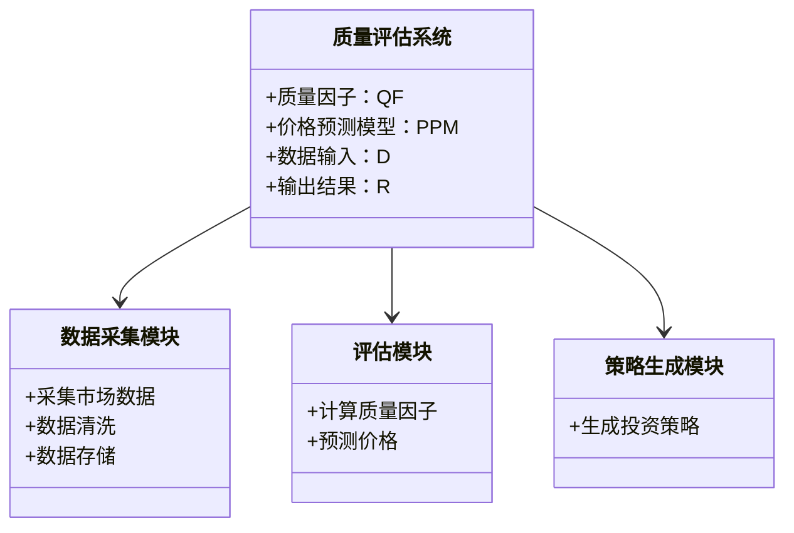

                 

# 价值投资中的质量vs价格权衡

> 关键词：价值投资、质量评估、价格预测、权衡策略、数学模型、系统架构

> 摘要：本文探讨了价值投资中质量与价格之间的权衡问题，通过定义和分析质量与价格的特征，提出了三种权衡策略：质量优先、价格优先和综合平衡。同时，构建了质量评估和价格预测的数学模型，并通过系统架构设计展示了如何将理论应用于实践。最后，通过一个实际案例分析了苹果公司的投资策略，总结了最佳实践和注意事项。

---

## 第一部分: 质量与价格的定义与特征

### 1.1 质量的定义与衡量标准

质量在价值投资中通常指企业的基本面因素，包括盈利能力、财务健康状况、管理团队、行业地位等。以下是质量的几个关键衡量标准：

#### 1.1.1 盈利能力
- **净利润率**：衡量企业赚取利润的能力。
- **ROE（净资产收益率）**：衡量企业使用股东资金的效率。
- **毛利率**：衡量企业在生产过程中的效率。

#### 1.1.2 财务健康状况
- **资产负债率**：衡量企业的负债水平。
- **现金流**：衡量企业的资金流动性。
- **应收账款周转率**：衡量企业收回账款的能力。

#### 1.1.3 管理团队与行业地位
- **管理团队的经验与声誉**。
- **行业龙头地位**：行业排名靠前的企业通常更具竞争优势。

### 1.2 价格的定义与波动特征

价格是指企业在市场上的股票价格或其他资产价格。价格的波动性主要受市场情绪、宏观经济环境、行业趋势和公司基本面等因素影响。

#### 1.2.1 市场情绪
- **投资者情绪**：市场情绪高涨时，价格可能被高估；反之，情绪低落时，价格可能被低估。
- **市场参与度**：高参与度的市场通常波动较大。

#### 1.2.2 宏观经济环境
- **利率水平**：低利率环境通常会推高资产价格。
- **通货膨胀**：高通胀可能导致价格波动加剧。
- **经济周期**：经济周期的不同阶段会影响价格走势。

#### 1.2.3 行业趋势
- **行业生命周期**：行业处于成长期时，价格可能波动较大；处于成熟期时，价格波动可能较小。
- **政策影响**：行业政策的变化会影响价格走势。

---

## 第二部分: 质量与价格的权衡策略

### 2.1 质量优先策略

质量优先策略强调长期投资，注重企业的基本面因素，认为高质量的企业即使在价格暂时被低估时，长期来看也会表现优异。

#### 2.1.1 适用场景
- 市场低迷时，高质量企业可能被低估，适合买入。
- 长期投资者选择。

#### 2.1.2 优缺点
- **优点**：长期回报稳定，风险较低。
- **缺点**：短期内价格可能持续低迷，需要耐心等待价值回归。

### 2.2 价格优先策略

价格优先策略注重短期价格波动，寻找价格被低估的资产进行投资。

#### 2.2.1 适用场景
- 市场短期回调时，价格可能被低估，适合短线投资者。
- 高波动性市场中，价格波动带来的收益机会较多。

#### 2.2.2 优缺点
- **优点**：短期收益可能较高，适合灵活投资者。
- **缺点**：需要密切关注市场波动，风险较高。

### 2.3 综合平衡策略

综合平衡策略结合质量和价格两个因素，寻找高质量且价格被低估的资产进行投资。

#### 2.3.1 适用场景
- 市场正常波动时，寻找性价比高的资产。
- 长期投资者希望在控制风险的前提下获得稳定收益。

#### 2.3.2 优缺点
- **优点**：结合了质量和价格的优势，风险和收益较为平衡。
- **缺点**：需要同时关注质量和价格两个方面，对投资者的要求较高。

---

## 第三部分: 数学模型与公式

### 3.1 质量评估模型

#### 3.1.1 质量评估因子的选取

质量评估因子通常包括盈利能力、财务健康状况、管理团队和行业地位等方面。以下是具体的因子选取和权重分配：

| 因子 | 权重（%） |
|------|-----------|
| 净利润率 | 30       |
| ROE   | 25        |
| 财务健康状况 | 20       |
| 管理团队 | 15        |
| 行业地位 | 10        |

#### 3.1.2 质量评估的数学公式

$$ Q = \sum_{i=1}^{n} w_i \cdot F_i $$
其中：
- $Q$ 表示质量评估值。
- $w_i$ 表示第 $i$ 个因子的权重。
- $F_i$ 表示第 $i$ 个因子的评估值。

例如，假设某企业的质量评估值计算如下：
$$ Q = 0.3 \cdot 80 + 0.25 \cdot 70 + 0.2 \cdot 90 + 0.15 \cdot 85 + 0.1 \cdot 95 $$
$$ Q = 24 + 17.5 + 18 + 12.75 + 9.5 $$
$$ Q = 81.75 $$

---

### 3.2 价格预测模型

#### 3.2.1 基于质量的定价模型

价格预测模型通常基于质量评估值和市场环境因素。以下是基于质量的定价模型：

$$ P = a \cdot Q + b \cdot M + c \cdot E + \epsilon $$
其中：
- $P$ 表示预测价格。
- $Q$ 表示质量评估值。
- $M$ 表示市场情绪指数。
- $E$ 表示宏观经济环境指数。
- $a$、$b$、$c$ 为回归系数。
- $\epsilon$ 表示误差项。

例如，假设回归系数为：
$$ a = 1.5, b = 0.8, c = 0.3 $$

---

## 第四部分: 系统分析与架构设计

### 4.1 问题场景介绍

在价值投资中，投资者需要同时考虑企业的质量和市场价格。为了更好地进行投资决策，我们可以构建一个系统，实时监控企业的质量和市场价格，并根据模型生成投资策略。

### 4.2 系统功能设计（领域模型 Mermaid 类图）

---

## 第五部分: 项目实战

### 5.1 苹果公司投资策略分析

#### 5.1.1 背景介绍

苹果公司（Apple Inc.）是一家全球知名的科技公司，其产品包括iPhone、Mac、iPad、Apple Watch等。以下是苹果公司的部分财务数据：

| 项目           | 2022年数据 |
|----------------|------------|
| 净利润率       | 23%        |
| ROE           | 28%        |
| 财务健康状况   | 偿债能力强 |
| 管理团队       | 乔布斯、库克等 |
| 行业地位       | 全球第一大科技公司 |

#### 5.1.2 投资策略分析

根据质量评估模型，苹果公司的质量评估值 $Q$ 计算如下：

$$ Q = 0.3 \cdot 85 + 0.25 \cdot 90 + 0.2 \cdot 80 + 0.15 \cdot 95 + 0.1 \cdot 88 $$
$$ Q = 25.5 + 22.5 + 16 + 14.25 + 8.8 $$
$$ Q = 87.05 $$

根据价格预测模型，假设当前苹果公司的价格为 $P$，市场情绪指数 $M$ 为 0.8，宏观经济环境指数 $E$ 为 0.7，回归系数 $a = 1.5, b = 0.8, c = 0.3$：

$$ P = 1.5 \cdot 87.05 + 0.8 \cdot 0.8 + 0.3 \cdot 0.7 $$
$$ P = 130.575 + 0.64 + 0.21 $$
$$ P = 131.425 $$

根据综合平衡策略，苹果公司的质量评估值 $Q = 87.05$，预测价格 $P = 131.425$，当前价格为 $128.5$。由于当前价格低于预测价格，且质量评估值较高，适合买入。

---

## 第六部分: 最佳实践与注意事项

### 6.1 投资注意事项

- **分散投资**：避免将所有资金投入到单一资产中，分散投资可以降低风险。
- **定期复盘**：定期检查投资组合，根据市场变化和企业基本面调整投资策略。
- **长期视角**：价值投资需要长期视角，避免被短期市场波动影响。

### 6.2 未来研究方向

- **动态调整模型**：根据市场变化动态调整回归系数。
- **引入机器学习**：利用机器学习算法提高预测精度。
- **多因子模型**：引入更多因子，如技术分析因子，进一步优化模型。

---

## 结语

价值投资中的质量与价格权衡是一个复杂但重要的问题。通过定义和分析质量与价格的特征，提出三种权衡策略，并构建数学模型和系统架构设计，可以帮助投资者更好地进行投资决策。实际案例分析和最佳实践建议为投资者提供了实用的指导。未来，随着技术的进步和市场的发展，价值投资的理论和实践将不断优化。

