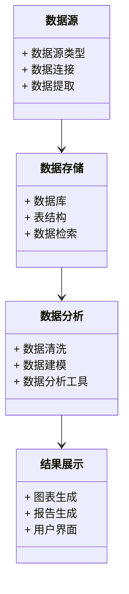
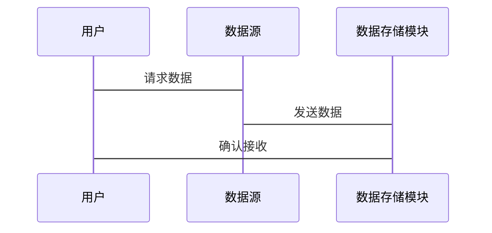

                 


# 价值投资中的超级计算机发展趋势

> 关键词：价值投资，超级计算机，人工智能，大数据分析，金融建模，投资决策

> 摘要：随着科技的进步，超级计算机在金融领域的应用越来越广泛，尤其是在价值投资中，超级计算机的强大计算能力和数据分析能力为投资者提供了更精准的决策支持。本文将详细探讨超级计算机在价值投资中的作用、核心概念、算法原理、系统架构以及实际应用，分析其发展趋势，并展望未来可能的创新方向。

---

# 第一部分：价值投资中的超级计算机发展趋势概述

## 第1章：超级计算机与价值投资的背景介绍

### 1.1 超级计算机的发展历程

#### 1.1.1 超级计算机的定义与特点
超级计算机是指具有极强计算能力的计算机，通常用于处理复杂的科学计算、大数据分析和人工智能任务。其特点包括：
- **高性能**：能够在短时间内处理海量数据。
- **高扩展性**：支持分布式计算和并行处理。
- **高能效**：在保证计算能力的同时，优化能源消耗。

#### 1.1.2 超级计算机在金融领域的应用
金融领域是超级计算机的重要应用场景之一，主要包括：
- **金融建模**：用于模拟市场行为、风险评估和投资策略优化。
- **实时交易**：支持高频交易和算法交易，确保交易速度和准确性。
- **大数据分析**：处理来自全球市场的海量数据，提取有价值的信息。

#### 1.1.3 超级计算机与价值投资的关联
价值投资是一种以基本面分析为基础的投资策略，依赖于对财务数据、市场趋势和公司基本面的深入分析。超级计算机通过其强大的计算能力，帮助投资者快速处理和分析这些数据，从而提升投资决策的准确性和效率。

### 1.2 价值投资的基本概念

#### 1.2.1 价值投资的定义与核心理念
价值投资是一种长期投资策略，强调购买价格低于其内在价值的资产。其核心理念包括：
- **安全边际**：买入价格低于内在价值，以降低风险。
- **长期视角**：关注企业的长期盈利能力，而非短期市场波动。
- **基本面分析**：通过分析财务报表、行业地位等因素评估企业的价值。

#### 1.2.2 价值投资的三大原则
1. **价格与价值的分离**：市场价格与内在价值的差异为投资机会。
2. **安全边际**：买入价格低于内在价值，以确保安全 margins。
3. **长期视角**：关注企业的长期成长潜力，而非短期波动。

#### 1.2.3 价值投资与技术分析的对比
价值投资与技术分析的主要区别在于：
- **价值投资**：基于企业的基本面，寻找被市场低估的机会。
- **技术分析**：基于价格和成交量的历史数据，预测未来的市场走势。

---

## 第2章：超级计算机在价值投资中的核心作用

### 2.1 超级计算机在金融数据处理中的应用

#### 2.1.1 超级计算机的数据处理能力
超级计算机能够处理海量的金融数据，包括股票价格、成交量、财务报表等，帮助投资者发现潜在的投资机会。

#### 2.1.2 超级计算机在金融建模中的应用
金融建模是价值投资的核心工具之一。超级计算机通过复杂的数学模型，模拟市场行为，评估投资组合的风险和收益。

#### 2.1.3 超级计算机在风险控制中的作用
超级计算机能够实时监控市场风险，帮助投资者制定有效的风险管理策略，减少潜在的损失。

### 2.2 超级计算机对价值投资决策的影响

#### 2.2.1 超级计算机在市场预测中的优势
超级计算机通过分析历史数据和市场趋势，提供更准确的市场预测，帮助投资者做出更明智的决策。

#### 2.2.2 超级计算机在投资组合优化中的应用
超级计算机能够根据市场变化和企业基本面，优化投资组合，提高收益，降低风险。

#### 2.2.3 超级计算机在实时交易中的作用
超级计算机支持高频交易和算法交易，确保交易的快速和准确，提升投资效率。

---

## 第3章：价值投资中的超级计算机发展趋势

### 3.1 超级计算机技术的演进对投资的影响

#### 3.1.1 从传统计算机到超级计算机的转变
传统计算机在处理复杂金融数据时效率较低，而超级计算机通过其强大的计算能力，显著提升了金融数据分析的效率。

#### 3.1.2 新一代超级计算机的特点与优势
新一代超级计算机采用分布式计算和人工智能技术，能够处理更复杂的数据和模型，提供更精准的分析结果。

#### 3.1.3 超级计算机技术对投资决策的深远影响
超级计算机的应用使得价值投资更加依赖于数据分析和技术驱动，推动投资决策向更科学化、数据化的方向发展。

### 3.2 价值投资中的技术趋势分析

#### 3.2.1 人工智能在价值投资中的应用
人工智能技术（如机器学习和深度学习）在价值投资中的应用越来越广泛，帮助投资者发现潜在的投资机会。

#### 3.2.2 大数据分析在价值投资中的作用
通过分析海量数据，超级计算机能够发现市场中的隐藏趋势和模式，为投资者提供更全面的分析结果。

#### 3.2.3 云计算与分布式计算对投资的影响
云计算和分布式计算技术为价值投资提供了更强大的数据处理能力，支持更大规模的金融建模和分析。

---

# 第二部分：超级计算机在价值投资中的核心概念与联系

## 第4章：超级计算机与价值投资的核心概念

### 4.1 超级计算机的性能指标与价值投资需求

#### 4.1.1 超级计算机的计算能力与投资数据处理
超级计算机的计算能力直接影响其处理金融数据的能力，更高的计算能力意味着更快的分析速度和更精准的结果。

#### 4.1.2 超级计算机的存储容量与金融数据管理
金融数据的存储需求巨大，超级计算机的高存储容量能够支持海量数据的管理和分析。

#### 4.1.3 超级计算机的网络能力与实时交易支持
超级计算机的网络能力确保了实时交易的高效性和稳定性，支持投资者在瞬息万变的市场中快速做出决策。

### 4.2 价值投资的核心概念与超级计算机的结合

#### 4.2.1 价值投资中的数据驱动决策
超级计算机通过数据驱动的方法，帮助投资者发现市场中的价值洼地，优化投资决策。

#### 4.2.2 超级计算机在投资决策中的角色
超级计算机不仅是数据处理工具，更是投资决策的核心支持系统，通过提供实时数据和分析结果，辅助投资者制定策略。

#### 4.2.3 价值投资中的技术边界与外延
超级计算机的应用推动了价值投资的技术边界向外扩展，使得投资决策更加依赖于技术手段，同时也为价值投资提供了更多的可能性。

---

## 第5章：超级计算机与价值投资的核心要素分析

### 5.1 超级计算机在价值投资中的核心要素

#### 5.1.1 数据获取与处理能力
超级计算机能够快速获取和处理来自全球市场的金融数据，为投资者提供实时支持。

#### 5.1.2 模型构建与优化能力
超级计算机通过复杂的数学模型，优化投资组合，提高收益，降低风险。

#### 5.1.3 实时计算与决策支持
超级计算机支持实时计算，为投资者提供快速的决策支持，确保在市场变化中抓住机会。

### 5.2 价值投资中的技术与业务结合点

#### 5.2.1 超级计算机在金融建模中的应用
超级计算机通过金融建模，帮助投资者评估企业的内在价值，发现被低估的投资机会。

#### 5.2.2 超级计算机在风险管理中的作用
超级计算机能够实时监控市场风险，帮助投资者制定有效的风险管理策略，减少潜在的损失。

#### 5.2.3 超级计算机在投资组合优化中的应用
超级计算机通过优化算法，帮助投资者构建最优的投资组合，平衡风险与收益。

---

# 第三部分：超级计算机在价值投资中的算法与系统架构

## 第6章：超级计算机与价值投资的算法原理

### 6.1 蒙特卡洛模拟算法

#### 6.1.1 算法原理
蒙特卡洛模拟是一种通过随机采样来估计概率分布的方法，广泛应用于金融建模和风险评估。

#### 6.1.2 算法实现
以下是一个简单的蒙特卡洛模拟的Python代码示例：

```python
import numpy as np
import matplotlib.pyplot as plt

# 假设资产的年化收益率和标准差
mu = 0.12
sigma = 0.2
n_trials = 10000

# 生成随机收益
returns = np.random.normal(mu, sigma, n_trials)

# 计算最终收益
final_returns = np.exp(returns)

# 绘制直方图
plt.hist(final_returns, bins=50)
plt.title('Monte Carlo Simulation of Asset Returns')
plt.xlabel('Return')
plt.ylabel('Frequency')
plt.show()
```

#### 6.1.3 应用场景
蒙特卡洛模拟可用于评估投资组合的风险和收益，帮助投资者制定更稳健的投资策略。

### 6.2 回归分析

#### 6.2.1 算法原理
回归分析是一种统计学方法，用于分析变量之间的关系，广泛应用于金融建模和预测。

#### 6.2.2 算法实现
以下是一个简单线性回归的Python代码示例：

```python
import numpy as np
from sklearn.linear_model import LinearRegression

# 生成数据
X = np.array([1, 2, 3, 4, 5])
y = np.array([2, 4, 5, 4, 6])

# 拟合线性回归模型
model = LinearRegression()
model.fit(X.reshape(-1, 1), y)

# 预测结果
print("斜率：", model.coef_)
print("截距：", model.intercept_)
```

#### 6.2.3 应用场景
回归分析可用于分析股票价格与市场指数之间的关系，帮助投资者制定投资策略。

---

## 第7章：超级计算机在价值投资中的系统架构设计

### 7.1 金融数据分析系统的功能需求

#### 7.1.1 数据采集
系统需要能够从多个数据源（如股票交易所、财务报表）采集实时数据。

#### 7.1.2 数据存储
数据存储系统需要支持海量数据的高效存储和快速检索。

#### 7.1.3 数据分析
系统需要提供多种数据分析工具和算法，支持金融建模和投资决策。

#### 7.1.4 结果展示
系统需要能够将分析结果以图表形式展示，方便投资者理解和决策。

### 7.2 系统架构设计

#### 7.2.1 领域模型
以下是金融数据分析系统的领域模型类图：



#### 7.2.2 系统架构
以下是系统的整体架构图：


### 7.3 系统接口设计

#### 7.3.1 数据接口
数据接口用于与外部数据源（如股票交易所）进行数据交换，通常采用API的方式。

#### 7.3.2 用户接口
用户接口是投资者与系统交互的界面，支持数据输入、分析结果查看等功能。

### 7.4 系统交互设计

#### 7.4.1 数据采集流程
以下是数据采集流程的交互图：



---

## 第8章：超级计算机在价值投资中的项目实战

### 8.1 环境安装与配置

#### 8.1.1 软件安装
需要安装Python、NumPy、Pandas、Matplotlib等数据分析库，以及超级计算机的相关计算框架。

#### 8.1.2 硬件配置
建议配置高性能计算服务器，支持多核处理器和大内存，以满足超级计算机的计算需求。

### 8.2 系统核心实现

#### 8.2.1 数据采集与预处理
以下是数据预处理的Python代码示例：

```python
import pandas as pd
import requests

# 从互联网获取数据
url = "https://example.com/stock_data.csv"
data = pd.read_csv(url)

# 数据清洗
data.dropna(inplace=True)
data = data[~data['price'].isnull()]
```

#### 8.2.2 模型训练与优化
以下是股票价格预测的机器学习模型实现：

```python
from sklearn.model_selection import train_test_split
from sklearn.ensemble import RandomForestRegressor
import pandas as pd

# 加载数据
data = pd.read_csv('stock_data.csv')

# 数据分割
X = data[['open', 'high', 'low', 'volume']]
y = data['close']
X_train, X_test, y_train, y_test = train_test_split(X, y, test_size=0.2)

# 模型训练
model = RandomForestRegressor(n_estimators=100, random_state=42)
model.fit(X_train, y_train)

# 模型预测
predictions = model.predict(X_test)
print('预测结果：', predictions)
```

### 8.3 案例分析与解读

#### 8.3.1 案例分析
以某股票的历史数据为例，分析其价格走势和内在价值，利用超级计算机进行数据建模和预测。

#### 8.3.2 详细解读
通过模型分析，发现该股票被市场低估，具有较大的投资潜力，建议投资者关注。

### 8.4 项目小结

通过超级计算机的强大计算能力，我们能够更准确地分析市场数据，发现投资机会，优化投资决策。

---

## 第9章：超级计算机在价值投资中的最佳实践

### 9.1 最佳实践

#### 9.1.1 数据质量管理
确保数据的准确性和完整性，是超级计算机分析的基础。

#### 9.1.2 模型优化
通过不断优化模型参数和算法，提升分析结果的准确性和可靠性。

#### 9.1.3 风险管理
在投资过程中，始终关注市场风险，制定有效的风险管理策略。

### 9.2 小结

超级计算机在价值投资中的应用，不仅提升了数据分析的效率和准确性，还为投资者提供了更科学的投资决策支持。

### 9.3 注意事项

- **数据隐私**：在处理金融数据时，必须遵守相关法律法规，保护数据隐私。
- **模型局限性**：超级计算机的应用也有其局限性，需要结合实际情况，避免过度依赖技术手段。
- **市场变化**：市场环境不断变化，投资者需要灵活调整策略，结合技术分析和基本面分析，做出更明智的决策。

### 9.4 拓展阅读

- 推荐阅读《超级计算机与金融建模》、《价值投资实战指南》等书籍，深入了解超级计算机在金融领域的更多应用。

---

# 结语

超级计算机在价值投资中的应用，不仅提升了数据分析的效率和准确性，还为投资者提供了更科学的投资决策支持。随着技术的不断进步，超级计算机在价值投资中的作用将更加重要，推动投资决策向更科学化、数据化的方向发展。

