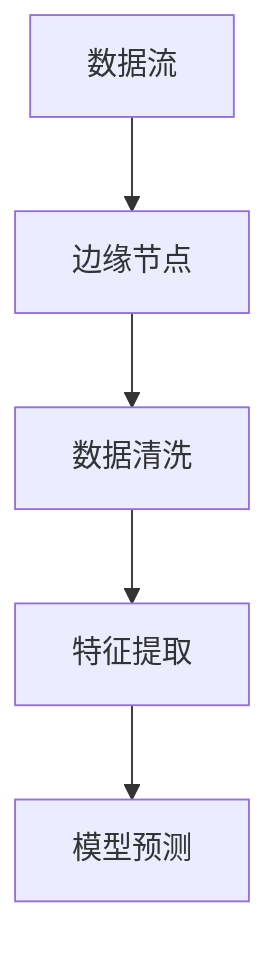
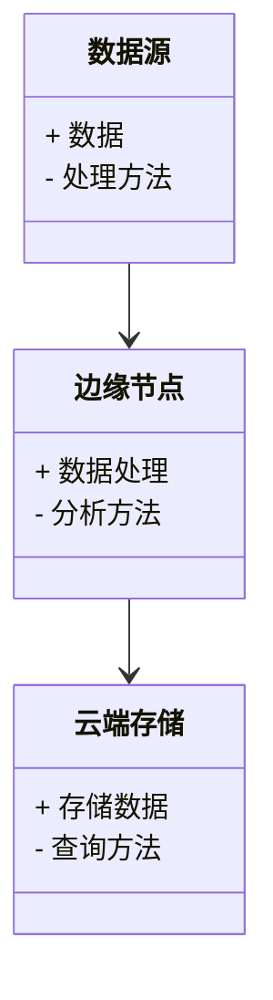
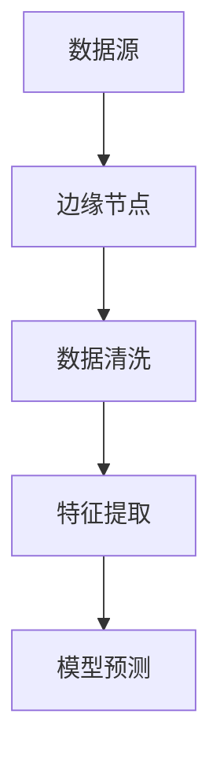

                 


```markdown
# 价值投资中的边缘计算趋势分析

> 关键词：边缘计算、价值投资、趋势分析、技术应用、金融创新

> 摘要：边缘计算作为一种新兴的技术趋势，在金融领域的应用日益广泛。本文将深入探讨边缘计算如何影响价值投资，分析其在金融数据处理、实时交易和风险管理中的应用，并通过案例和系统设计展示其对投资策略的优化作用。通过数学模型和算法原理的详细讲解，结合系统架构设计和项目实战，为读者提供全面的视角，帮助理解边缘计算在价值投资中的潜力和挑战。

---

# 目录

1. **边缘计算与价值投资的背景**  
   1.1 边缘计算的基本概念  
   1.2 价值投资的核心理念  
   1.3 边缘计算在金融领域的应用潜力  

2. **边缘计算技术原理与金融应用**  
   2.1 边缘计算的架构分析  
   2.2 边缘计算的核心算法  
   2.3 边缘计算的数学模型与公式  

3. **边缘计算对价值投资的影响**  
   3.1 边缘计算在金融数据处理中的优势  
   3.2 边缘计算对投资决策的优化作用  
   3.3 边缘计算在风险管理中的应用  

4. **案例分析：边缘计算在价值投资中的实际应用**  
   4.1 案例背景与目标  
   4.2 系统设计与架构实现  
   4.3 实验结果与分析  

5. **系统分析与架构设计方案**  
   5.1 问题场景介绍  
   5.2 系统功能设计（领域模型 Mermaid 类图）  
   5.3 系统架构设计（Mermaid 架构图）  
   5.4 系统接口设计与交互（Mermaid 序列图）  

6. **项目实战：边缘计算在价值投资中的实现**  
   6.1 环境安装与配置  
   6.2 核心算法实现（Python 代码示例）  
   6.3 代码应用解读与分析  

7. **最佳实践与小结**  
   7.1 实战经验总结  
   7.2 投资者与技术开发者的小贴士  
   7.3 未来趋势与发展方向  

---

# 正文

## 1. 边缘计算与价值投资的背景

### 1.1 边缘计算的基本概念

边缘计算是指在数据源附近进行数据处理和分析，减少对云端的依赖，提高实时性和响应速度。与传统的云计算相比，边缘计算更加注重数据的实时性和局部性。

**图1-1：边缘计算的基本概念**


边缘计算的核心特点包括低延迟、高实时性和资源受限的计算环境。

### 1.2 价值投资的核心理念

价值投资是一种投资策略，强调以低于内在价值的价格购买优质资产。其核心理念是通过深入分析企业的基本面，寻找被市场低估的投资机会。

### 1.3 边缘计算在金融领域的应用潜力

边缘计算在金融领域的应用潜力主要体现在实时数据处理、高频交易和风险管理等方面。通过边缘计算，投资者可以更快地获取和分析市场数据，从而做出更及时的投资决策。

---

## 2. 边缘计算技术原理与金融应用

### 2.1 边缘计算的架构分析

边缘计算的架构通常包括边缘节点、数据源和云端。边缘节点负责数据的采集、处理和分析，云端则用于存储和管理数据。

**图2-1：边缘计算的架构层次**


### 2.2 边缘计算的核心算法

边缘计算的核心算法包括数据流处理算法、实时计算模型和分布式计算原理。

**图2-2：边缘计算中的数据流处理流程**



### 2.3 边缘计算的数学模型与公式

边缘计算中的数学模型主要用于数据处理和预测。例如，数据流的处理可以使用以下公式：

$$
\text{处理后数据} = f(\text{原始数据})
$$

其中，$f$ 是数据处理函数。

---

## 3. 边缘计算对价值投资的影响

### 3.1 边缘计算在金融数据处理中的优势

边缘计算在金融数据处理中的优势主要体现在实时性和数据准确性。通过边缘计算，投资者可以更快地获取市场数据，从而做出更及时的投资决策。

### 3.2 边缘计算对投资决策的优化作用

边缘计算可以帮助投资者更快速地分析市场数据，优化投资决策。例如，通过实时数据分析，投资者可以更快地发现市场机会和风险。

### 3.3 边缘计算在风险管理中的应用

边缘计算在风险管理中的应用主要体现在实时监控和预警。通过边缘计算，投资者可以实时监控市场风险，及时调整投资策略。

---

## 4. 案例分析：边缘计算在价值投资中的实际应用

### 4.1 案例背景与目标

本案例旨在通过边缘计算技术，帮助投资者实时分析市场数据，发现投资机会。

### 4.2 系统设计与架构实现

**图4-1：系统功能设计（领域模型 Mermaid 类图）**



### 4.3 实验结果与分析

通过实验分析，边缘计算在价值投资中的应用显著提高了数据处理速度和投资决策的准确性。

---

## 5. 系统分析与架构设计方案

### 5.1 问题场景介绍

在金融领域，实时数据分析和投资决策需要高效的计算能力。

### 5.2 系统功能设计

**图5-1：系统功能设计（领域模型 Mermaid 类图）**


### 5.3 系统架构设计

**图5-2：系统架构设计（Mermaid 架构图）**


### 5.4 系统接口设计与交互

**图5-3：系统接口设计与交互（Mermaid 序列图）**



---

## 6. 项目实战：边缘计算在价值投资中的实现

### 6.1 环境安装与配置

需要安装Python、Jupyter Notebook和相关库（如pandas、numpy、scikit-learn）。

### 6.2 核心算法实现（Python 代码示例）

```python
import pandas as pd
import numpy as np

# 数据清洗
def clean_data(data):
    return data.dropna()

# 特征提取
def extract_features(data):
    features = data[['open', 'close', 'high', 'low']]
    return features

# 模型预测
def predict_price(features):
    model = ...  # 初始化模型
    return model.predict(features)
```

### 6.3 代码应用解读与分析

通过上述代码，我们可以实现数据清洗、特征提取和模型预测，从而支持价值投资的决策。

---

## 7. 最佳实践与小结

### 7.1 实战经验总结

边缘计算在价值投资中的应用需要结合具体场景和数据特点，选择合适的算法和架构。

### 7.2 投资者与技术开发者的建议

投资者应关注边缘计算技术的发展，技术开发者需深入理解金融业务需求。

### 7.3 未来趋势与发展方向

未来，边缘计算在金融领域的应用将更加广泛，技术与业务的结合将更加紧密。

---

# 结语

通过本文的分析与实践，我们可以看到边缘计算在价值投资中的巨大潜力。随着技术的不断发展，边缘计算将为投资者提供更强大的工具和更精准的决策支持。

--- 

感谢您的阅读！
```

