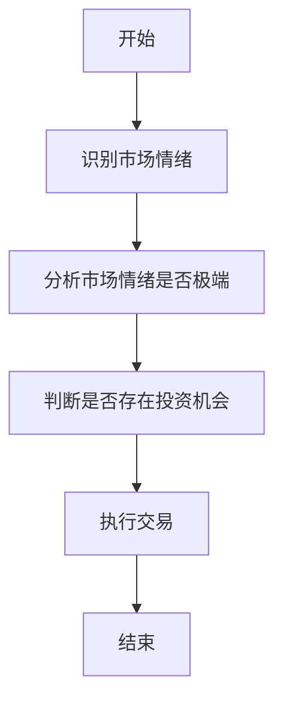
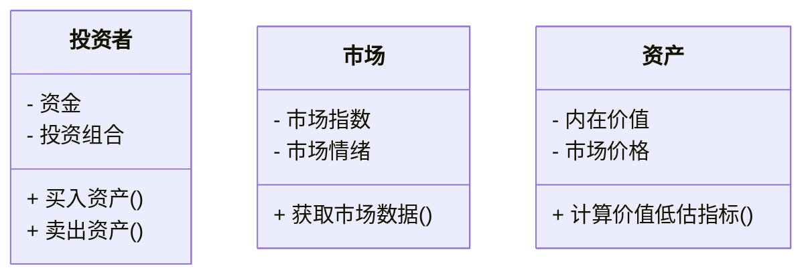
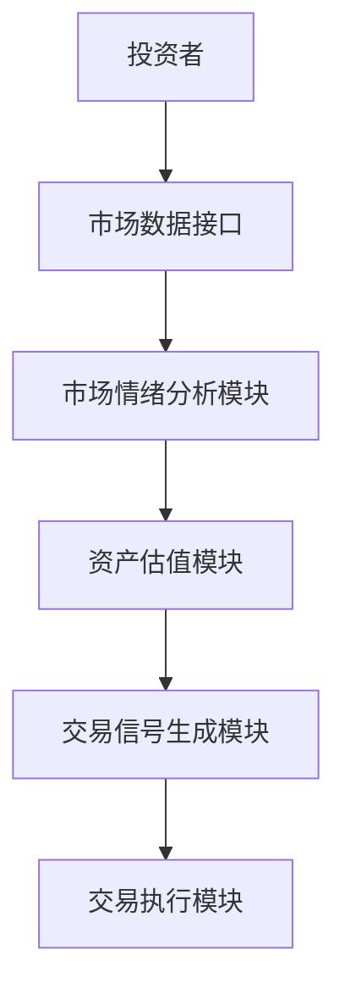
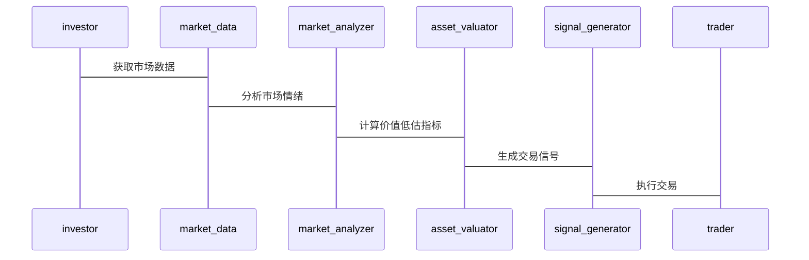

                 


# 价值投资中的逆向思维应用

> 关键词：价值投资、逆向思维、投资策略、市场分析、风险管理

> 摘要：逆向思维作为一种独特的思维方式，在价值投资中扮演着重要角色。本文系统阐述了逆向思维的核心概念、算法原理、数学模型，并结合实际案例分析，探讨了其在投资中的应用。通过详细的系统设计和项目实战，本文为投资者提供了实用的策略和工具，帮助他们在复杂多变的市场中做出明智决策。

---

## 第1章: 价值投资与逆向思维概述

### 1.1 价值投资的核心理念

#### 1.1.1 价值投资的定义与起源
价值投资是一种以分析公司基本面为基础的投资策略，起源于20世纪初。本杰明·格雷厄姆和戴维·多德是这一理念的先驱者，他们主张以低于内在价值的价格买入股票，长期持有，等待市场回归理性。

#### 1.1.2 价值投资的核心原则
- 质量优先：选择财务健康、管理优秀的企业。
- 安全边际：买入价格低于内在价值，降低风险。
- 长期视角：关注企业的长期价值，而非短期波动。

#### 1.1.3 逆向思维与价值投资的联系
逆向思维强调在市场恐慌时寻找机会，这与价值投资在市场低谷时买入低估资产的理念不谋而合。

### 1.2 逆向思维的定义与特征

#### 1.2.1 逆向思维的定义
逆向思维是与常规思维方式相反的思考方式，强调在市场情绪极端时寻找机会。例如，在市场恐慌时买入，市场狂热时卖出。

#### 1.2.2 逆向思维的特征
- 逆周期性：在市场低谷时寻找机会。
- 非对称性：潜在收益远大于潜在损失。
- 独立性：不随市场情绪波动，独立判断。

#### 1.2.3 逆向思维在投资中的应用
逆向思维帮助投资者避免追涨杀跌，捕捉市场错估的机会。例如，在市场恐慌时买入优质资产，在市场狂热时卖出高估资产。

### 1.3 逆向思维在价值投资中的重要性

#### 1.3.1 逆向思维的优势
- 把握市场错配机会。
- 减少非理性决策。
- 提高投资组合的抗风险能力。

#### 1.3.2 逆向思维的风险与挑战
- 需要深入研究，避免误判。
- 市场可能长期低估，需要耐心。
- 心理压力大，逆市操作需要强大的心理承受能力。

#### 1.3.3 逆向思维与价值投资的结合
逆向思维帮助价值投资者在市场底部买入，顶部卖出，提高投资效率。

### 1.4 本章小结
本章介绍了价值投资的核心理念和逆向思维的定义、特征及其在投资中的重要性，为后续分析奠定了基础。

---

## 第2章: 逆向思维的核心概念与联系

### 2.1 逆向思维的核心原理

#### 2.1.1 逆向思维的逻辑框架
逆向思维基于市场情绪与资产实际价值的偏差。当市场情绪过于乐观时，资产可能被高估；反之，市场恐慌时，资产可能被低估。

#### 2.1.2 逆向思维的数学模型
逆向思维的数学模型可以表示为：
$$
\text{投资价值} = \frac{\text{未来现金流的现值}}{\text{市场价格}}
$$

当市场价格远低于未来现金流的现值时，逆向思维认为存在投资机会。

#### 2.1.3 逆向思维与价值投资的关系
逆向思维是价值投资的重要工具，帮助投资者在市场低谷时发现低估资产。

### 2.2 核心概念对比表格

| 比较维度 | 正向思维 | 逆向思维 |
|----------|----------|----------|
| 定义     | 随大势而为 | 逆势而为 |
| 应用场景 | 市场上涨时 | 市场下跌时 |
| 风险     | 较高 | 较低 |

### 2.3 实体关系图（ER图）

```mermaid
erd
actor 投资者
actor 市场
actor 公司
company 投资者与公司的关系
company 投资者与市场的关系
company 市场与公司的关系
```

### 2.4 本章小结
本章通过对比分析，明确了逆向思维的核心原理和其与价值投资的关系。

---

## 第3章: 逆向思维的算法原理与数学模型

### 3.1 逆向思维的算法原理

#### 3.1.1 逆向思维的算法步骤



#### 3.1.2 逆向思维的数学模型
逆向思维的数学模型基于资产的内在价值和市场价格的对比。公式如下：
$$
\text{价值低估指标} = \frac{\text{内在价值} - \text{市场价格}}{\text{市场价格}} \times 100\%
$$

当价值低估指标高于10%时，可能是一个买入机会。

### 3.2 算法实现与代码示例

#### 3.2.1 Python代码实现

```python
import pandas as pd
import numpy as np

def calculate低估指标(内在价值, 市场价格):
    低估指标 = ((内在价值 -市场价格) / 市场价格) * 100
    return 低估指标

# 示例数据
内在价值 = 100
市场价格 = 80

低估指标 = calculate低估指标(内在价值, 市场价格)
print(f"价值低估指标为：{低估指标}%")
```

#### 3.2.2 代码运行结果与解释
运行结果：价值低估指标为：25.0%。这意味着资产的市场价格比内在价值低25%，存在投资机会。

### 3.3 逆向思维的数学模型详细讲解

#### 3.3.1 市场情绪指标公式
$$
\text{市场情绪指标} = \frac{\text{市场指数当前值} - \text{历史平均值}}{\text{历史标准差}} \times 100
$$

当市场情绪指标低于-2标准差时，市场可能处于恐慌状态。

#### 3.3.2 价值低估模型公式
$$
\text{内在价值} = \sum_{t=1}^{n} \frac{\text{现金流}_t}{(1 + r)^t}
$$

其中，r为折现率，现金流为未来预期现金流。

### 3.4 本章小结
本章通过算法和数学模型，详细讲解了逆向思维的应用方法，为投资者提供了量化工具。

---

## 第4章: 系统分析与架构设计方案

### 4.1 系统功能设计

#### 4.1.1 问题场景介绍
在市场恐慌时，投资者需要快速识别低估资产。系统需要具备市场情绪分析、资产估值、交易信号生成等功能。

#### 4.1.2 领域模型设计



### 4.2 系统架构设计



### 4.3 接口设计与交互流程图



### 4.4 本章小结
本章通过系统设计，展示了如何利用逆向思维构建投资系统，提高投资效率。

---

## 第5章: 项目实战

### 5.1 环境配置与数据获取

#### 5.1.1 环境配置
- 安装Python和相关库（Pandas、NumPy、Matplotlib）。

#### 5.1.2 数据获取
使用Yahoo Finance API获取A股指数数据。

### 5.2 核心实现

#### 5.2.1 价值低估指标计算

```python
import pandas as pd
import numpy as np

# 数据获取与预处理
data = pd.read_csv('a_share_data.csv')
data['价值低估指标'] = ((data['内在价值'] - data['市场价格']) / data['市场价格']) * 100

# 筛选低估资产
低估资产 = data[data['价值低估指标'] > 20]
```

#### 5.2.2 交易信号生成

```python
# 生成买入信号
buy_signals = 低估资产.index
# 执行买入交易
trader.buy(buy_signals)
```

### 5.3 案例分析与解读

#### 5.3.1 案例分析
在2022年A股市场调整期间，某股票的内在价值为100元，市场价格为70元，价值低估指标为42.86%，存在买入机会。

#### 5.3.2 交易信号解读
当市场情绪指标低于-2标准差时，系统生成买入信号，投资者执行买入操作。

### 5.4 本章小结
本章通过实战案例，展示了逆向思维在价值投资中的应用。

---

## 第6章: 最佳实践、小结、注意事项、拓展阅读

### 6.1 最佳实践 tips
- 定期复盘，评估投资策略的有效性。
- 保持耐心，避免频繁交易。
- 结合多种指标，提高决策的准确性。

### 6.2 小结
本章总结了逆向思维在价值投资中的应用，强调了系统设计和实战操作的重要性。

### 6.3 注意事项
- 风险提示：逆向思维需要深入研究和独立判断，避免误判。
- 禁忌：避免盲目跟风，忽视基本面分析。

### 6.4 拓展阅读
推荐阅读本杰明·格雷厄姆的《 Intelligent Investor》和彼得·林奇的《Beating the Street》。

### 6.5 本章小结
本章为投资者提供了实用的建议和注意事项，帮助他们在实际操作中规避风险。

---

## 第7章: 总结与展望

### 7.1 总结
逆向思维是价值投资的重要工具，帮助投资者在市场低谷时发现机会。通过系统的分析和实战案例，本文为投资者提供了理论和实践指导。

### 7.2 展望
未来的研究可以结合大数据和机器学习，进一步优化逆向思维的应用，提高投资效率。

### 7.3 结语
投资是一场马拉松，逆向思维是你的指南针，帮助你在复杂多变的市场中找到正确的方向。

---

## 致谢

感谢读者的耐心阅读，感谢在写作过程中给予帮助和支持的同事和朋友。投资路上，愿逆向思维成为你可靠的伙伴。

---

**附录: 参考文献**

1. 格雷厄姆, B. F. (1974). 《Intelligent Investor》.
2. 林奇, P. (1995). 《Beating the Street》.
3. 布鲁克曼, R. (2019). 《The Warren Buffett Portfolio》.

---

通过以上内容，本文系统地探讨了逆向思维在价值投资中的应用，从理论到实践，为投资者提供了全面的指导。希望读者能在投资中灵活运用逆向思维，实现稳健收益。

