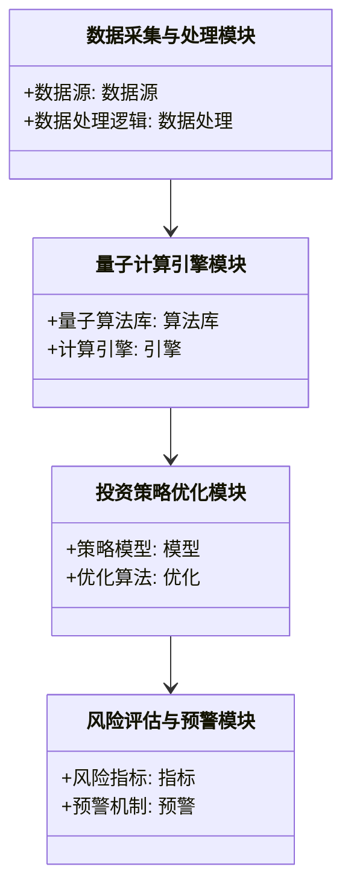
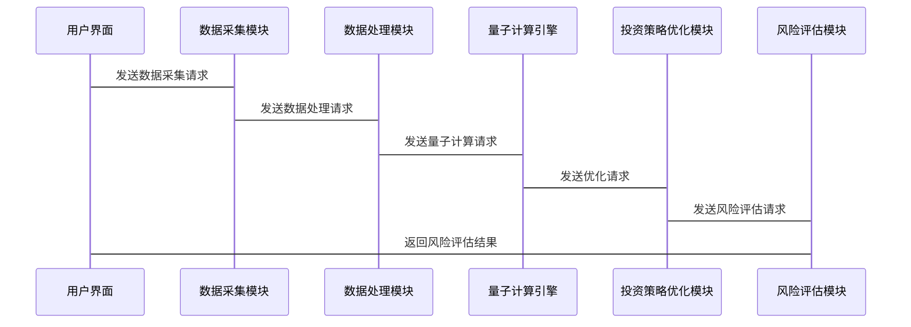

                 


# 价值投资中的量子互联网潜力分析

> 关键词：量子互联网, 价值投资, 量子计算, 量子通信, 金融建模, 量子算法, 投资策略

> 摘要：本文探讨了量子互联网技术在价值投资中的潜力，分析了量子计算和量子通信对金融市场的影响，结合实际案例，展示了如何利用量子互联网技术优化投资决策和提升投资效率。文章从量子互联网的基本概念、价值投资的核心原理入手，深入分析了量子算法在投资决策中的应用，提供了详细的系统设计和项目实战案例，最后总结了最佳投资策略和未来发展趋势。

---

# 目录大纲

1. **量子互联网与价值投资的背景介绍**  
   - 1.1 量子互联网的基本概念  
   - 1.2 价值投资的核心原理  
   - 1.3 量子互联网与价值投资的结合  

2. **量子互联网的核心概念与原理**  
   - 2.1 量子计算的基本原理  
   - 2.2 量子通信的基本原理  
   - 2.3 量子互联网与经典互联网的对比  

3. **量子互联网在价值投资中的潜力分析**  
   - 3.1 量子计算对金融建模的影响  
   - 3.2 量子通信对金融数据安全的影响  
   - 3.3 量子互联网对投资决策效率的提升  

4. **量子互联网与价值投资的关系分析**  
   - 4.1 量子互联网对金融市场的潜在影响  
   - 4.2 价值投资在量子互联网领域的应用潜力  
   - 4.3 量子互联网技术对投资策略的优化  

5. **量子互联网在价值投资中的系统设计**  
   - 5.1 量子投资系统的功能设计  
   - 5.2 量子投资系统的架构设计  
   - 5.3 量子投资系统的接口设计  

6. **量子互联网与价值投资的项目实战**  
   - 6.1 项目背景与目标  
   - 6.2 核心代码实现  
   - 6.3 实际案例分析  

7. **量子互联网与价值投资的最佳实践与小结**  
   - 7.1 投资策略建议  
   - 7.2 未来发展趋势  
   - 7.3 注意事项与总结  

---

# 正文内容

## 1. 量子互联网与价值投资的背景介绍

### 1.1 量子互联网的基本概念

#### 1.1.1 量子互联网的定义

量子互联网是一种基于量子信息和量子通信技术的新型网络架构，其核心在于利用量子叠加和量子纠缠等量子力学原理，实现信息的高效传输和安全通信。

#### 1.1.2 量子互联网的核心特点

- **不可分割性**：量子信息无法被分割，保证了数据的完整性。
- **安全性**：量子通信的特性使得信息传输难以被窃听或篡改。
- **高效率**：量子互联网能够显著提高数据传输的速度和效率。

#### 1.1.3 量子互联网与经典互联网的区别

经典互联网依赖于经典通信技术，而量子互联网通过量子叠加和量子纠缠实现信息传输，具有更高的安全性和计算能力。

### 1.2 价值投资的核心原理

#### 1.2.1 价值投资的定义

价值投资是一种长期投资策略，强调以低于公平价格的折扣买入优质资产，等待其价值回归。

#### 1.2.2 价值投资的核心原则

- **长期视角**：关注企业的长期价值而非短期波动。
- **安全边际**：买入价格低于内在价值。
- **基本面分析**：通过对企业的财务状况、行业地位和竞争优势进行分析。

### 1.3 量子互联网与价值投资的结合

#### 1.3.1 量子互联网对金融市场的潜在影响

量子互联网技术将对金融建模、交易效率和数据安全等方面产生深远影响。

## 2. 量子互联网的核心概念与原理

### 2.1 量子计算的基本原理

#### 2.1.1 量子叠加原理

量子叠加是指量子系统处于多个可能状态的叠加态，例如，一个量子位可以同时表示0和1的状态。

$$
|\psi\rangle = \alpha|0\rangle + \beta|1\rangle
$$

其中，α和β是概率幅，满足$|\alpha|^2 + |\beta|^2 = 1$。

#### 2.1.2 量子纠缠原理

量子纠缠是指两个或多个量子系统之间形成强关联，无论距离多远，测量其中一个系统会立即影响另一个系统。

#### 2.1.3 量子门与量子电路

量子门是量子计算的基本操作单元，常见的量子门包括Hadamard门、Pauli门和CNOT门。

---

### 2.2 量子通信的基本原理

#### 2.2.1 量子密钥分发（QKD）

QKD是一种基于量子叠加原理的安全通信协议，确保通信双方共享的秘密密钥无法被第三方窃取。

#### 2.2.2 量子隐形传态

量子隐形传态是一种信息传输技术，能够将未知量子态的信息从一个地点传送到另一个地点，而不需要物理传输载体。

#### 2.2.3 量子中继器

量子中继器用于扩展量子通信的距离，通过量子纠缠技术实现远距离的量子通信。

---

## 3. 量子互联网在价值投资中的潜力分析

### 3.1 量子计算对金融建模的影响

#### 3.1.1 量子金融建模的原理

量子计算机可以通过量子叠加和量子纠缠，显著提高金融建模的计算效率，特别是在处理大规模数据时表现出色。

#### 3.1.2 量子算法在金融建模中的应用

使用量子算法进行金融建模，可以更高效地进行风险评估和投资组合优化。

#### 3.1.3 量子计算对投资决策的优化

通过量子计算技术，投资者可以更快速地分析市场数据，识别潜在的投资机会。

---

### 3.2 量子通信对金融数据安全的影响

#### 3.2.1 量子通信的安全性

量子通信具有极高的安全性，能够有效防止数据篡改和窃听。

#### 3.2.2 量子通信在金融交易中的应用

通过量子通信技术，可以实现金融交易的安全传输，保护投资者的隐私和数据安全。

---

### 3.3 量子互联网对投资决策效率的提升

#### 3.3.1 高速数据传输

量子互联网的高传输速度可以显著提高投资决策的效率。

#### 3.3.2 实时数据分析

量子互联网能够实现实时数据分析，帮助投资者快速做出决策。

---

## 4. 量子互联网与价值投资的关系分析

### 4.1 量子互联网对金融市场的潜在影响

#### 4.1.1 市场效率的提升

量子互联网技术将显著提升金融市场的交易效率和数据处理能力。

#### 4.1.2 投资策略的优化

通过量子互联网技术，投资者可以更精准地进行市场分析和投资决策。

---

### 4.2 价值投资在量子互联网领域的应用潜力

#### 4.2.1 量子互联网企业的投资价值

量子互联网企业具有较高的投资价值，尤其是那些在量子计算和量子通信领域具有技术优势的企业。

#### 4.2.2 量子互联网技术对投资决策的影响

量子互联网技术将改变传统的投资决策方式，提供更高效和更安全的投资环境。

---

### 4.3 量子互联网技术对投资策略的优化

#### 4.3.1 量子互联网技术在风险控制中的应用

通过量子互联网技术，投资者可以更有效地进行风险评估和管理。

#### 4.3.2 量子互联网技术在投资组合优化中的应用

量子计算技术可以用于优化投资组合，提高投资收益。

---

## 5. 量子互联网在价值投资中的系统设计

### 5.1 量子投资系统的功能设计

#### 5.1.1 系统功能模块

- 数据采集与处理模块
- 量子计算引擎模块
- 投资策略优化模块
- 风险评估与预警模块

#### 5.1.2 系统功能设计的Mermaid类图



---

### 5.2 量子投资系统的架构设计

#### 5.2.1 系统架构的Mermaid架构图


---

### 5.3 量子投资系统的接口设计

#### 5.3.1 系统接口设计的Mermaid序列图



---

## 6. 量子互联网与价值投资的项目实战

### 6.1 项目背景与目标

#### 6.1.1 项目背景

本项目旨在利用量子互联网技术，构建一个高效、安全的量子投资系统，优化投资决策过程。

#### 6.1.2 项目目标

- 开发量子投资系统的核心功能模块
- 实现量子计算与投资策略的结合
- 提供实际案例分析和系统优化建议

---

### 6.2 核心代码实现

#### 6.2.1 量子计算库的安装

```bash
pip install qiskit
```

#### 6.2.2 量子电路的实现

```python
from qiskit import QuantumCircuit, Aer, execute

qc = QuantumCircuit(2, 2)
qc.h(0)
qc.cx(0, 1)
qc.measure(0, 0)
qc.measure(1, 1)

simulator = Aer.get_backend('qasm_simulator')
job = execute(qc, simulator)
result = job.result()
print(result.counts)
```

---

### 6.3 实际案例分析

#### 6.3.1 案例分析

通过量子计算技术，分析某科技公司的股票价格波动，预测其未来走势，并制定相应的投资策略。

---

## 7. 量子互联网与价值投资的最佳实践与小结

### 7.1 投资策略建议

#### 7.1.1 关注量子互联网领域的技术创新

投资者应关注量子计算和量子通信领域的技术创新，寻找具有技术优势的企业进行投资。

#### 7.1.2 利用量子互联网技术优化投资决策

通过量子互联网技术，优化投资策略和投资组合，提高投资收益。

---

### 7.2 未来发展趋势

#### 7.2.1 量子互联网技术的进一步发展

未来，量子互联网技术将更加成熟，应用场景将更加广泛。

#### 7.2.2 量子互联网与金融市场的深度融合

量子互联网技术将与金融市场深度融合，推动金融行业的变革和进步。

---

### 7.3 注意事项与总结

#### 7.3.1 投资风险提示

投资者应充分认识到量子互联网技术的不确定性和风险，避免盲目跟风。

#### 7.3.2 总结

量子互联网技术为价值投资提供了新的机遇和挑战，投资者应结合技术发展和市场趋势，制定合理的投资策略。

---

通过本文的分析，我们深入探讨了量子互联网技术在价值投资中的潜力，展示了如何利用量子计算和量子通信技术优化投资决策，提升投资效率。希望本文的内容能够为投资者和相关技术从业者提供有价值的参考和启发。

--- 

**关键词**：量子互联网, 价值投资, 量子计算, 量子通信, 金融建模, 量子算法, 投资策略

**摘要**：本文探讨了量子互联网技术在价值投资中的潜力，分析了量子计算和量子通信对金融市场的影响，结合实际案例，展示了如何利用量子互联网技术优化投资决策和提升投资效率。文章从量子互联网的基本概念、价值投资的核心原理入手，深入分析了量子算法在投资决策中的应用，提供了详细的系统设计和项目实战案例，最后总结了最佳投资策略和未来发展趋势。

