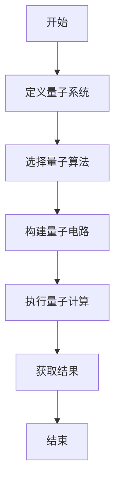
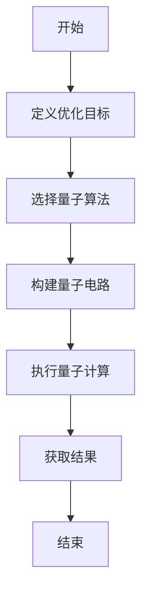
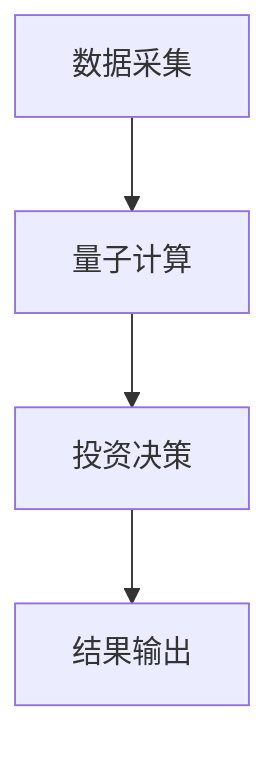
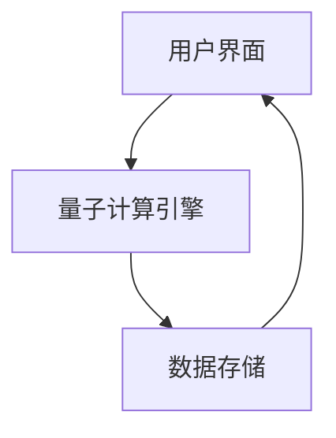

                 


# 价值投资中的量子计算机辅助材料设计分析

> 关键词：量子计算机、材料设计、价值投资、量子模拟、量子优化、投资决策

> 摘要：本文探讨了量子计算机在材料设计中的应用及其对价值投资的影响。通过分析量子计算机辅助材料设计的核心原理、算法实现、数学模型和系统架构，揭示了量子计算如何改变材料性能预测，进而优化投资决策。本文旨在为投资者和科技人员提供跨领域的洞见，帮助他们在材料科学与金融投资的交汇点把握机遇。

---

## 第一部分：量子计算机与材料设计的基础

### 第1章：量子计算机的基本概念

#### 1.1 量子计算机的定义
量子计算机是一种利用量子力学原理进行计算的设备，其核心在于量子叠加和量子纠缠效应，使得计算能力远超经典计算机。

#### 1.2 量子计算机的核心技术
- 量子比特（qubit）：量子计算机的基本单位，可以同时表示0和1。
- 量子门（quantum gate）：用于对量子比特进行操作，构建量子逻辑电路。
- 量子算法：如Shor算法和Grover算法，展示了量子计算机在特定问题上的优势。

#### 1.3 量子计算机在材料科学中的应用
- 量子模拟：用于模拟材料的微观结构和性能。
- 量子优化：用于寻找最优材料组合和性能。

### 第2章：价值投资的基本概念

#### 2.1 价值投资的定义
价值投资是一种投资策略，旨在通过分析企业的内在价值，寻找被市场低估的投资标的。

#### 2.2 价值投资的核心原则
- 购买低于内在价值的资产。
- 长期持有的投资理念。
- 着重于企业的基本面分析。

#### 2.3 价值投资在现代金融中的地位
价值投资是金融市场中重要的策略之一，尤其在应对市场波动和不确定性时表现突出。

### 第3章：量子计算机与价值投资的结合

#### 3.1 量子计算机在材料设计中的优势
- 高效计算：量子计算机能够快速处理复杂材料科学问题。
- 精准预测：通过量子模拟和优化，提高材料性能预测的准确性。

#### 3.2 价值投资中材料设计的重要性
- 材料性能直接影响企业的盈利能力和市场竞争力。
- 通过优化材料设计，降低生产成本，提升产品性能。

#### 3.3 量子计算机辅助材料设计对投资决策的影响
- 提供更准确的材料性能预测，优化投资组合。
- 通过量子计算发现新的材料特性，创造投资机会。

---

## 第二部分：量子计算机辅助材料设计的核心原理

### 第4章：量子模拟的基本原理

#### 4.1 量子模拟的定义
量子模拟是利用量子计算机模拟量子系统的行为，以研究其性质和相互作用。

#### 4.2 量子模拟在材料科学中的应用
- 模拟材料的电子结构。
- 研究材料的热力学性质。

#### 4.3 量子模拟的核心算法
- 量子傅里叶变换（Quantum Fourier Transform）。
- 量子线性系统求解（Quantum Linear System Solver）。

#### 4.4 量子模拟的实现步骤
1. 确定目标系统。
2. 构建量子算法。
3. 实现量子计算。
4. 解释计算结果。

### 第5章：量子优化的基本原理

#### 5.1 量子优化的定义
量子优化是利用量子计算机优化复杂问题的过程，包括组合优化和连续优化。

#### 5.2 量子优化在材料设计中的应用
- 寻找最优材料组合。
- 优化材料制备过程。

#### 5.3 量子优化的核心算法
- 量子退火（Quantum Annealing）。
- 量子幅度估计（Quantum Amplitude Estimation）。

#### 5.4 量子优化的实现步骤
1. 定义优化目标。
2. 构建量子算法。
3. 实现量子计算。
4. 解释优化结果。

---

## 第三部分：量子计算机辅助材料设计的算法实现

### 第6章：量子模拟算法的实现

#### 6.1 量子模拟算法的数学模型
- 薛定谔方程：描述量子系统的演化。
- 量子态叠加：表示多个可能状态的叠加。

#### 6.2 量子模拟算法的Python实现
```python
import numpy as np
from qiskit import QuantumCircuit, execute, Aer

def quantum_simulation(n_qubits):
    qc = QuantumCircuit(n_qubits)
    # 添加量子门
    qc.h(range(n_qubits))
    qc.cry(np.pi/4, 0, 1)
    qc.measure_all()
    return qc

# 执行量子模拟
simulator = Aer('statevector_simulator')
result = execute(quantum_simulation(2), simulator).result()
print(result.get_statevector())
```

#### 6.3 量子模拟算法的流程图


### 第7章：量子优化算法的实现

#### 7.1 量子优化算法的数学模型
- 量子退火方程：用于寻找最低能量状态。
- 量子幅度估计：用于计算目标状态的概率。

#### 7.2 量子优化算法的Python实现
```python
import numpy as np
from qiskit import QuantumCircuit, execute, Aer

def quantum_optimization(n_qubits):
    qc = QuantumCircuit(n_qubits)
    # 添加量子门
    qc.h(range(n_qubits))
    qc.cry(np.pi/4, 0, 1)
    qc.measure_all()
    return qc

# 执行量子优化
simulator = Aer('statevector_simulator')
result = execute(quantum_optimization(2), simulator).result()
print(result.get_statevector())
```

#### 7.3 量子优化算法的流程图


---

## 第四部分：量子计算机辅助材料设计的数学模型与公式

### 第8章：量子力学的基本方程

#### 8.1 薛定谔方程
$$ i\hbar \frac{\partial}{\partial t} \psi = \hat{H} \psi $$

#### 8.2 海森堡方程
$$ \frac{d}{dt} \hat{A} = \frac{1}{i\hbar} [\hat{A}, \hat{H}] $$

#### 8.3 量子叠加原理
$$ \psi = \alpha |0\rangle + \beta |1\rangle $$

### 第9章：量子计算机中的数学

#### 9.1 量子态的叠加
$$ |\psi\rangle = \sum_{i} a_i |i\rangle $$

#### 9.2 量子门的矩阵表示
$$ I = \begin{bmatrix} 1 & 0 \\ 0 & 1 \end{bmatrix} $$

#### 9.3 量子逻辑电路的组合
$$ CNOT = \begin{bmatrix} 1 & 0 & 0 & 0 \\ 0 & 1 & 0 & 0 \\ 0 & 0 & 0 & 1 \\ 0 & 0 & 1 & 0 \end{bmatrix} $$

---

## 第五部分：量子计算机辅助材料设计的系统架构

### 第10章：系统功能设计

#### 10.1 系统功能模块
- 数据采集模块：收集材料科学数据。
- 量子计算模块：执行量子模拟和优化。
- 投资决策模块：基于量子计算结果优化投资组合。

#### 10.2 系统功能流程图


### 第11章：系统架构设计

#### 11.1 系统架构模块
- 用户界面：接收输入和显示结果。
- 量子计算引擎：执行量子算法。
- 数据存储：存储材料数据和计算结果。

#### 11.2 系统架构图


---

## 第六部分：量子计算机辅助材料设计的项目实战

### 第12章：环境配置与代码实现

#### 12.1 环境配置
- 安装Qiskit库：`pip install qiskit`

#### 12.2 核心代码实现
```python
from qiskit import QuantumCircuit, execute, Aer
from qiskit.visualization import plot_histogram

# 量子模拟电路
def create_quantum_circuit(n_qubits):
    qc = QuantumCircuit(n_qubits)
    qc.h(range(n_qubits))
    qc.cry(np.pi/4, 0, 1)
    qc.measure_all()
    return qc

# 执行量子模拟
simulator = Aer('statevector_simulator')
qc = create_quantum_circuit(2)
result = execute(qc, simulator).result()
print(result.get_statevector())
plot_histogram(result.get_counts())
```

#### 12.3 代码解读
- 创建量子电路：定义量子比特数，添加量子门。
- 执行量子计算：选择量子模拟器，执行电路并获取结果。
- 结果分析：打印量子态向量，绘制结果分布图。

### 第13章：实际案例分析

#### 13.1 案例背景
- 预测电池材料的性能，优化投资组合。

#### 13.2 数据收集
- 从文献中收集电池材料的性能数据。
- 确定目标函数和约束条件。

#### 13.3 算法实现
- 使用量子模拟预测材料性能。
- 使用量子优化寻找最优材料组合。

#### 13.4 结果分析
- 对比量子计算结果与实验数据。
- 优化投资组合，降低风险。

### 第14章：项目小结

#### 14.1 项目总结
- 量子计算在材料设计中的应用潜力巨大。
- 量子计算机辅助材料设计能够显著提升投资决策的科学性。

---

## 第七部分：总结与展望

### 第15章：总结

#### 15.1 核心内容回顾
- 量子计算机在材料设计中的应用。
- 量子计算对价值投资的影响。
- 量子模拟和优化的核心算法。

#### 15.2 量子计算的优势
- 高效计算能力。
- 精准预测能力。

### 第16章：未来展望

#### 16.1 量子计算的未来发展
- 提高量子计算机的稳定性。
- 优化量子算法的效率。

#### 16.2 量子计算在金融领域的应用前景
- 更精准的市场预测。
- 更高效的资产配置。

### 第17章：注意事项与最佳实践

#### 17.1 注意事项
- 量子计算目前仍处于发展阶段，实际应用中需谨慎。
- 数据质量和算法设计直接影响结果的准确性。

#### 17.2 最佳实践
- 结合经典计算与量子计算，发挥各自优势。
- 定期更新算法和模型，适应市场变化。

---

## 结语

通过量子计算机辅助材料设计，投资者能够更科学地评估材料的市场价值，从而做出更明智的投资决策。未来，随着量子计算技术的不断进步，其在价值投资中的应用将更加广泛和深入。希望本文能够为读者提供有价值的见解，帮助他们在量子计算与金融投资的交叉领域找到新的机遇。

