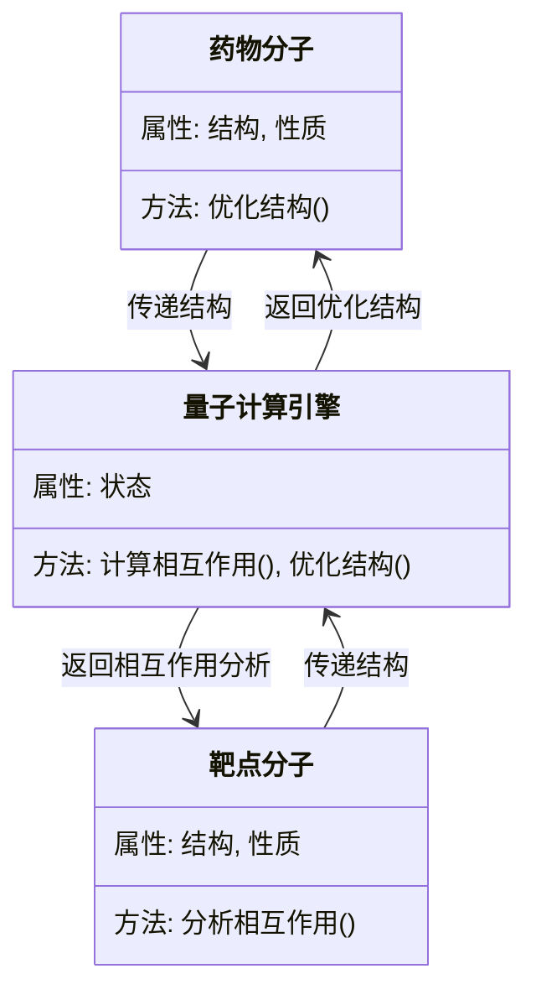
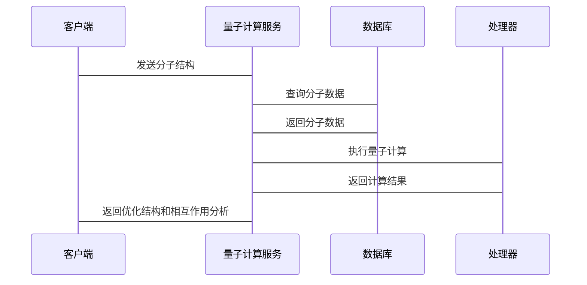

                 


# 价值投资中的量子计算机辅助药物设计分析

> **关键词**: 价值投资, 量子计算机, 药物设计, 算法, 系统架构, 数学模型

> **摘要**: 本文探讨了量子计算机在药物设计中的应用及其对价值投资策略的影响。通过分析量子计算机辅助药物设计的核心原理、数学模型和系统架构，结合实际案例，展示了如何利用量子计算加速药物开发，进而为投资者提供更精准的决策支持。本文还总结了量子计算机辅助药物设计的挑战和未来发展方向，为价值投资者提供了新的视角和工具。

---

## 第1章: 价值投资与量子计算机辅助药物设计的背景介绍

### 1.1 价值投资的核心概念

#### 1.1.1 价值投资的定义与核心思想
价值投资是一种长期投资策略，强调以低于市场价值的价格购买优质资产，通过企业的成长实现收益。其核心思想是寻找具有持续竞争优势和良好治理的企业，注重基本面分析和长期价值。

#### 1.1.2 价值投资的基本原理
价值投资基于以下几个基本原理：
1. **市场先生**：市场情绪波动会影响资产价格，但长期来看，价格会回归其内在价值。
2. **安全边际**：购买价格低于内在价值，以降低投资风险。
3. **竞争优势**：投资具有独特竞争优势的企业，以确保长期收益。

#### 1.1.3 价值投资在现代投资中的地位
价值投资在现代投资中占据重要地位，尤其是在不确定性较高的市场环境中。通过深入分析企业基本面，价值投资帮助投资者规避短期市场波动，实现长期稳健收益。

### 1.2 量子计算机辅助药物设计的背景

#### 1.2.1 药物设计的传统方法与局限性
传统药物设计依赖实验和计算化学方法，周期长、成本高且效率低。传统方法难以处理复杂的分子相互作用和构象变化，限制了新药开发的速度和效率。

#### 1.2.2 量子计算在药物设计中的优势
量子计算具有处理复杂分子系统的能力，能够快速优化分子结构，预测药物与靶点的相互作用，显著缩短药物开发周期，降低研发成本。

#### 1.2.3 量子计算机辅助药物设计的现状
目前，量子计算机辅助药物设计尚处于初期阶段，但已在某些领域取得突破，如小分子药物设计和材料科学。随着量子计算技术的成熟，其应用前景广阔。

### 1.3 价值投资与量子计算机辅助药物设计的结合

#### 1.3.1 量子计算机辅助药物设计对医药行业的潜在影响
量子计算将加速药物开发，提高新药上市速度，降低研发成本，为医药企业创造更大价值。

#### 1.3.2 量子计算机辅助药物设计对投资决策的潜在影响
通过量子计算，投资者能够更准确地评估药物开发的潜力和风险，优化投资组合，提高投资收益。

#### 1.3.3 价值投资视角下的量子计算机辅助药物设计分析框架
本文提出了一种分析框架，从企业竞争优势、技术研发能力和市场前景三个维度，评估量子计算机辅助药物设计对企业的价值影响。

### 1.4 本章小结
本章介绍了价值投资和量子计算机辅助药物设计的基本概念，分析了它们的结合对投资决策的潜在影响，并提出了分析框架。

---

## 第2章: 量子计算机辅助药物设计的核心概念与原理

### 2.1 量子计算机的基本原理

#### 2.1.1 量子位与量子叠加
量子位（qubit）是量子计算的基本单位，利用量子叠加原理，量子位可以同时表示0和1的状态。

#### 2.1.2 量子纠缠与量子通信
量子纠缠是量子系统中粒子之间的特殊关联，使得对一个粒子的测量会影响另一个粒子的状态，这是量子通信和量子计算的基础。

#### 2.1.3 量子计算的基本操作与算法
量子计算的基本操作包括量子门操作和量子算法设计。著名的量子算法包括Shor算法和Grover算法。

### 2.2 药物设计的基本原理

#### 2.2.1 药物分子的结构与活性关系
药物分子的结构直接影响其与靶点的结合能力，从而决定药物的疗效和副作用。

#### 2.2.2 分子动力学与药物设计
分子动力学模拟通过计算分子的运动轨迹，分析药物分子与靶点的相互作用，为药物设计提供理论依据。

#### 2.2.3 药物筛选与优化的传统方法
传统药物筛选依赖高通量筛选技术，但效率有限，难以处理复杂的分子相互作用。

### 2.3 量子计算机辅助药物设计的核心原理

#### 2.3.1 量子化学计算在药物设计中的应用
量子化学计算通过模拟分子的量子态，精确计算药物分子与靶点的相互作用，优化分子结构。

#### 2.3.2 量子计算机辅助药物设计的算法与模型
量子计算机辅助药物设计的核心算法包括量子模拟算法和量子优化算法，用于分子结构优化和相互作用预测。

#### 2.3.3 量子计算机辅助药物设计的优势与挑战
量子计算的优势在于处理复杂分子系统的能力，但目前面临的技术挑战包括量子位稳定性、算法优化和计算成本。

---

## 第3章: 量子计算机辅助药物设计的数学模型与算法

### 3.1 量子计算机辅助药物设计的数学模型

#### 3.1.1 药物分子的量子态表示
药物分子的量子态表示通过量子位和量子叠加原理，将分子结构编码为量子态。

#### 3.1.2 分子间相互作用的量子计算模型
分子间相互作用的量子计算模型基于量子化学原理，计算分子间的相互作用能量。

#### 3.1.3 药物设计中的能量计算与优化
能量计算通过量子化学方法，计算药物分子与靶点的结合能，优化分子结构。

### 3.2 量子计算机辅助药物设计的算法

#### 3.2.1 变量分解算法
变量分解算法通过分解分子结构，简化计算复杂度，提高计算效率。

#### 3.2.2 量子模拟算法
量子模拟算法利用量子计算机的特性，模拟分子的量子态，预测药物分子的相互作用。

#### 3.2.3 量子优化算法
量子优化算法通过量子搜索优化分子结构，找到最优的药物分子构型。

### 3.3 量子计算机辅助药物设计的数学公式

#### 3.3.1 药物分子的量子态表示公式
$$ | \psi \rangle = \alpha |0\rangle + \beta |1\rangle $$
其中，$\alpha$ 和 $\beta$ 是复数，表示量子态的幅度。

#### 3.3.2 分子间相互作用的量子计算公式
$$ E = \sum_{i<j} \frac{1}{r_{ij}} $$
其中，$r_{ij}$ 是分子间距离。

#### 3.3.3 药物设计中的能量计算公式
$$ E_{\text{total}} = \sum_{i=1}^{N} E_i $$
其中，$N$ 是分子数量，$E_i$ 是第$i$个分子的能量。

### 3.4 本章小结
本章详细介绍了量子计算机辅助药物设计的数学模型和算法，包括量子态表示、分子间相互作用计算和能量优化方法。

---

## 第4章: 量子计算机辅助药物设计的系统分析与架构设计

### 4.1 系统分析

#### 4.1.1 问题场景介绍
量子计算机辅助药物设计系统主要用于优化药物分子结构，预测药物与靶点的相互作用，辅助药物开发。

#### 4.1.2 项目介绍
本项目旨在开发一个基于量子计算的药物设计系统，提供高效的分子结构优化和相互作用预测功能。

#### 4.1.3 系统功能设计（领域模型mermaid类图）


### 4.2 系统架构设计

#### 4.2.1 系统架构设计mermaid架构图


#### 4.2.2 系统接口设计
系统接口包括输入接口（接收药物分子和靶点分子结构）和输出接口（返回优化结构和相互作用分析结果）。

#### 4.2.3 系统交互mermaid序列图


### 4.3 本章小结
本章详细分析了量子计算机辅助药物设计系统的功能和架构设计，展示了系统的整体结构和交互流程。

---

## 第5章: 量子计算机辅助药物设计的项目实战

### 5.1 环境安装

#### 5.1.1 量子计算机的硬件环境要求
需要高性能量子计算机或量子计算模拟器，以及相应的量子计算软件开发工具。

#### 5.1.2 量子计算机的软件环境配置
安装量子计算开发框架，如Qiskit或Cirq，配置量子计算环境。

#### 5.1.3 药物设计相关工具的安装
安装分子模拟软件，如Gaussian或GROMOS，配置量子化学计算环境。

### 5.2 系统核心实现源代码

#### 5.2.1 量子计算机辅助药物设计的核心算法实现
```python
def quantum_optimization(molecule):
    # 初始化量子态
    qubits = qiskit.QuantumRegister(len(molecule))
    circuit = qiskit.Circuit(qubits)
    # 执行量子优化操作
    circuit.append(GroverOperator(), qubits)
    # 返回优化结果
    return circuit
```

#### 5.2.2 药物分子的量子态表示代码
```python
def create_quantum_state(molecule):
    # 创建量子态
    qubit = qiskit.QuantumRegister(1)
    state = qiskit.ClassicalRegister(1)
    circuit = qiskit.Circuit(qubit, state)
    # 执行量子叠加
    circuit.h(qubit)
    circuit.measure(qubit, state)
    return circuit
```

#### 5.2.3 分子间相互作用的量子计算代码
```python
def calculate_interaction(molecule1, molecule2):
    # 计算相互作用能量
    energy = 0
    for i in range(len(molecule1)):
        for j in range(len(molecule2)):
            distance = molecule1[i].distance(molecule2[j])
            energy += 1 / distance
    return energy
```

### 5.3 代码应用解读与分析

#### 5.3.1 核心算法的实现细节
量子优化算法通过Grover算法实现分子结构的优化，提高计算效率。

#### 5.3.2 代码的优化与扩展
代码可以进一步优化，例如通过并行计算减少计算时间，或者引入更复杂的量子算法提高计算精度。

### 5.4 本章小结
本章通过实际案例展示了量子计算机辅助药物设计的实现过程，包括环境配置、核心算法实现和代码优化。

---

## 第6章: 结论与展望

### 6.1 本章总结
本文详细探讨了量子计算机辅助药物设计的核心原理、数学模型和系统架构，分析了其对价值投资策略的潜在影响。

### 6.2 未来展望
未来，随着量子计算技术的成熟，量子计算机辅助药物设计将在新药开发中发挥重要作用，为价值投资者提供更精准的投资决策支持。

### 6.3 最佳实践 tips
- 投资者应关注量子计算技术的发展，了解其在药物设计中的应用。
- 选择具有量子计算研发能力的医药企业，作为长期投资目标。
- 在投资决策中，结合量子计算的预测结果，优化投资组合。

### 6.4 本章小结
本文总结了量子计算机辅助药物设计的研究进展，展望了其未来发展方向，并为投资者提供了实用建议。

---

通过以上内容，本文系统地分析了量子计算机辅助药物设计的核心原理、数学模型和系统架构，并探讨了其对价值投资策略的潜在影响。希望本文能够为投资者和研究人员提供有价值的参考和启发。

