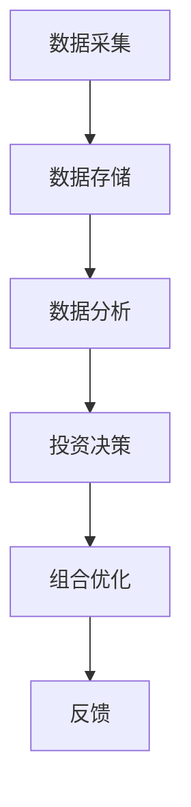

                 

# 价值投资中的长期主义思维

## 关键词：价值投资、长期主义、投资策略、心态管理、风险管理

## 摘要：  
价值投资是一种以基本面分析为基础的投资策略，强调长期持有优质资产，而非短期市场波动。长期主义思维是价值投资的核心理念之一，它要求投资者超越短期市场的噪声，关注企业的长期价值和可持续发展。本文将从价值投资的理论基础、长期主义的实践策略、数学模型的应用以及实际案例分析等方面，深入探讨长期主义思维在价值投资中的重要性及其应用方法。

---

## 第1章: 价值投资与长期主义概述

### 1.1 价值投资的核心概念

#### 1.1.1 价值投资的定义与背景  
价值投资是一种投资策略，强调以低于企业内在价值的价格买入优质资产，并长期持有。其核心思想是寻找市场中被低估的企业，通过时间的积累实现超额收益。  
价值投资的起源可以追溯到本杰明·格雷厄姆和戴维·多德的工作，他们提出了“安全边际”和“内在价值”的概念。  

#### 1.1.2 长期主义的内涵与外延  
长期主义是指在投资过程中，关注企业的长期价值和可持续发展，而非短期市场波动。它要求投资者具备耐心和纪律性，能够在市场低迷时坚持持有优质资产。  

#### 1.1.3 价值投资与长期主义的联系与区别  
价值投资和长期主义密切相关，但也有区别：  
- 联系：两者都强调长期视角，注重企业的基本面和内在价值。  
- 区别：价值投资更注重价格与价值的偏差，而长期主义更注重时间的积累和企业的长期发展。

---

### 1.2 价值投资的基本原理

#### 1.2.1 市场与价值的偏差  
市场的短期波动往往会导致价格偏离企业的内在价值。价值投资者通过分析企业的财务数据和行业地位，找到那些价格低于内在价值的企业。  

#### 1.2.2 安全边际的概念  
安全边际是指买入价格与内在价值之间的差距。通过预留安全边际，投资者可以在市场波动中降低风险，并为未来的价格波动提供缓冲空间。  

#### 1.2.3 股票的价值评估方法  
股票的内在价值可以通过多种方法进行评估，如现金流折现法（DCF）、市盈率法（P/E）和市净率法（P/B）等。每种方法都有其优缺点，投资者需要结合具体情况选择合适的方法。

---

### 1.3 长期主义在投资中的重要性

#### 1.3.1 长期主义与短期波动的对比  
短期波动往往受到市场情绪的影响，而长期价值则取决于企业的基本面。长期主义者能够忽略短期波动，专注于企业的长期发展。  

#### 1.3.2 长期主义对投资收益的影响  
长期主义者通过长期持有优质资产，能够获得复利效应带来的超额收益。与短期交易相比，长期投资更有可能实现财富的稳定增长。  

#### 1.3.3 长期主义在不同市场环境下的表现  
在牛市中，长期主义者能够享受市场的上涨；在熊市中，他们能够以更低的价格买入优质资产，为未来的上涨做好准备。无论市场如何波动，长期主义的策略都能帮助投资者实现长期目标。

---

## 第2章: 价值投资的核心理念与策略

### 2.1 质量、估值与长期增长

#### 2.1.1 质量：企业的核心竞争力  
企业的核心竞争力是其长期发展的基础。投资者需要关注企业的盈利能力、管理团队和行业地位，选择那些具备竞争优势的企业。  

#### 2.1.2 估值：找到市场的低估点  
估值是价值投资的核心。通过比较市场价格与内在价值，投资者可以找到那些被市场低估的企业。  

#### 2.1.3 长期增长：企业的可持续发展性  
企业的长期增长潜力是其内在价值的重要组成部分。投资者需要关注企业的增长模式和未来发展的可行性。

---

### 2.2 价值投资的选股策略

#### 2.2.1 寻找具备护城河的企业  
护城河是指企业在行业中具备的竞争优势，如品牌、技术、成本和市场地位等。具备护城河的企业能够抵御竞争，实现长期增长。  

#### 2.2.2 分析财务报表的关键指标  
财务报表是评估企业基本面的重要工具。投资者需要关注企业的收入、利润、现金流和资产负债情况，选择那些财务健康的企业。  

#### 2.2.3 评估管理团队的能力与诚信  
管理团队是企业发展的关键。投资者需要评估管理团队的能力和诚信，选择那些能够带领企业持续发展的管理团队。

---

### 2.3 长期投资的组合管理

#### 2.3.1 投资组合的构建原则  
投资组合的构建需要遵循分散化原则，避免过度集中于某一行业或资产。同时，投资者需要根据自身的风险承受能力和投资目标进行调整。  

#### 2.3.2 风险分散与资产配置  
通过资产配置和分散化投资，投资者可以降低投资组合的整体风险。长期主义者需要根据市场变化和企业基本面，定期调整投资组合。  

#### 2.3.3 定期复盘与动态调整  
定期复盘是长期投资的重要环节。投资者需要回顾投资组合的表现，评估企业的基本面变化，并根据市场环境进行动态调整。

---

## 第3章: 长期主义的数学模型与分析

### 3.1 价值投资的数学模型

#### 3.1.1 股票内在价值的计算公式  
股票的内在价值可以通过现金流折现模型（DCF）进行计算。公式如下：  
$$ V = \frac{CF_1}{(1+r)^1} + \frac{CF_2}{(1+r)^2} + \cdots + \frac{CF_n}{(1+r)^n} $$  
其中，\( V \) 是股票的内在价值，\( CF_i \) 是第 \( i \) 年的现金流，\( r \) 是折现率。

#### 3.1.2 现金流折现模型（DCF）  
DCF模型是评估企业内在价值的重要工具。通过预测企业的未来现金流，并以合理的折现率进行折现，投资者可以估算出企业的内在价值。

#### 3.1.3 市盈率与市净率的比较分析  
市盈率（P/E）和市净率（P/B）是常用的估值指标。市盈率适用于盈利稳定的公司，而市净率适用于资产密集型行业。投资者可以根据具体情况选择合适的指标。

---

### 3.2 长期投资的收益预测

#### 3.2.1 复利计算公式  
复利是长期投资的重要概念。公式如下：  
$$ A = P \times (1 + r)^n $$  
其中，\( A \) 是终值，\( P \) 是本金，\( r \) 是年化收益率，\( n \) 是投资时间。

#### 3.2.2 长期增长率的估算方法  
长期增长率可以通过企业的历史增长率、行业增长趋势和管理能力进行估算。投资者需要结合具体情况，选择合适的方法进行估算。

#### 3.2.3 风险调整后的预期收益模型  
为了降低风险，投资者可以通过调整折现率或引入风险溢价来估算风险调整后的预期收益。

---

### 3.3 数学模型的实践应用

#### 3.3.1 使用DCF模型评估企业价值  
以某公司为例，假设未来5年的现金流分别为100万、120万、140万、160万和180万，折现率为10%。  
根据DCF模型，企业的内在价值为：  
$$ V = \frac{100}{1.1} + \frac{120}{1.1^2} + \frac{140}{1.1^3} + \frac{160}{1.1^4} + \frac{180}{1.1^5} \approx 423.73 \text{万元} $$  

#### 3.3.2 市盈率与市净率的交叉验证  
假设某公司的市盈率为15，市净率为2，行业平均市盈率为20，行业平均市净率为3。  
根据市盈率和市净率的比较，该公司的估值低于行业平均水平，可能具备投资价值。

---

## 第4章: 长期主义的系统架构与投资策略

### 4.1 投资系统的整体架构

#### 4.1.1 系统目标  
系统的目标是帮助投资者实现长期稳健的收益。  

#### 4.1.2 系统输入  
系统的输入包括市场数据（如股价、成交量）和企业数据（如财务报表）。  

#### 4.1.3 系统输出  
系统的输出包括投资决策（如买入、卖出）和组合优化建议。

---

### 4.2 投资策略的系统实现

#### 4.2.1 系统功能模块  
系统功能模块包括数据采集、分析、决策和反馈。  

#### 4.2.2 系统架构图  
以下是系统的架构图：

#### 4.2.3 系统接口设计  
系统接口设计需要考虑数据输入和输出的标准化，确保模块之间的高效交互。

---

### 4.3 系统的动态调整与优化

#### 4.3.1 定期评估与调整策略  
投资者需要定期评估投资组合的表现，并根据市场变化进行动态调整。  

#### 4.3.2 风险管理模块的优化  
风险管理是长期投资的重要环节。投资者需要通过分散化和止损策略来降低整体风险。  

#### 4.3.3 系统的可扩展性与适应性  
系统需要具备良好的可扩展性和适应性，能够应对市场的变化和投资者的需求。

---

## 第5章: 价值投资中的长期主义实战案例

### 5.1 案例分析：巴菲特的长期投资策略

#### 5.1.1 巴菲特的投资理念  
巴菲特强调长期持有优质资产，关注企业的内在价值和长期增长潜力。  

#### 5.1.2 巴菲特的经典投资案例  
以可口可乐为例，巴菲特长期持有该公司的股票，受益于其稳定的现金流和强大的品牌影响力。

---

### 5.2 实战分析：如何选择长期持有的企业

#### 5.2.1 企业分析：以茅台为例  
茅台作为白酒行业的龙头企业，具备强大的品牌影响力和稳定的现金流。其内在价值较高，具备长期投资价值。  

#### 5.2.2 财务分析：如何评估企业  
通过分析茅台的财务报表，评估其盈利能力、现金流和资产负债情况，确认其具备长期增长潜力。

---

## 总结  
价值投资中的长期主义思维是一种以基本面分析为基础的投资策略，强调长期持有优质资产，关注企业的内在价值和可持续发展。通过科学的数学模型和系统的投资策略，投资者可以在复杂的市场环境中实现长期稳健的收益。长期主义者需要具备耐心和纪律性，能够在市场波动中保持冷静，并坚持自己的投资理念。未来，随着市场环境的变化，长期主义思维将继续在价值投资中发挥重要作用，帮助投资者实现财富的长期增长。

--- 

# 完

