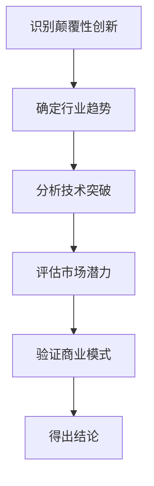
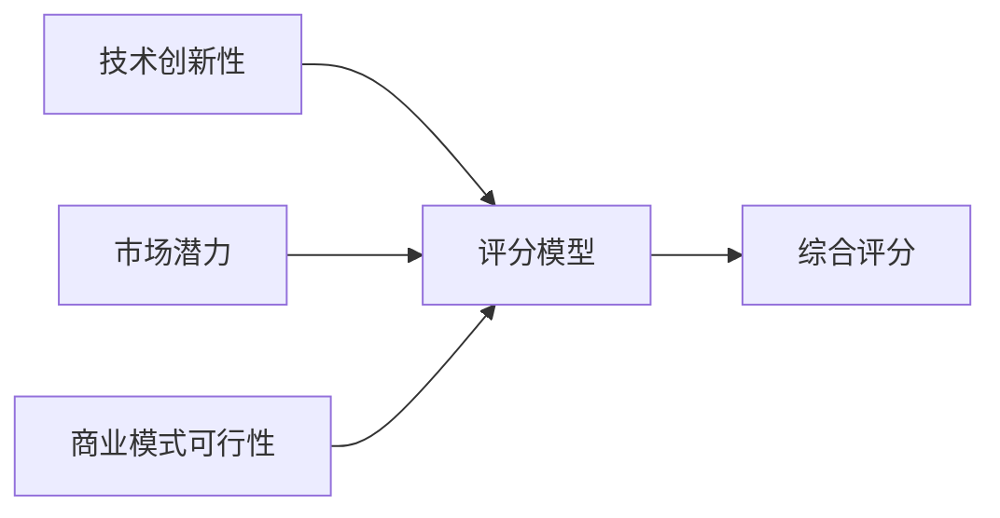

                 


# 《价值投资中的颠覆性创新识别》

---

## 关键词：
- 价值投资
- 颠覆性创新
- 创新识别
- 投资策略
- 机器学习
- 数学模型

---

## 摘要：
本文系统地探讨了如何在价值投资中识别颠覆性创新。通过分析颠覆性创新的核心概念、识别方法、数学模型和实际案例，本文为投资者提供了从技术创新到投资机会的全链路分析框架。文章结合定量与定性分析方法，提出了基于机器学习的颠覆性创新识别算法，并通过实际案例验证了模型的有效性。最后，本文总结了价值投资中颠覆性创新识别的关键要点，并为投资者提供了实践建议。

---

# 第1章: 颠覆性创新的基本概念

## 1.1 颠覆性创新的定义与特征

### 1.1.1 颠覆性创新的定义
颠覆性创新是指通过引入新的技术、商业模式或市场策略，从根本上改变行业现状或用户需求的创新行为。与延续性创新不同，颠覆性创新通常会对现有市场格局产生根本性影响，创造新的价值主张或市场机会。

### 1.1.2 颠覆性创新的核心特征
颠覆性创新的核心特征包括：
1. **技术突破性**：引入了全新的技术或方法，打破了传统技术的瓶颈。
2. **市场颠覆性**：通过改变市场结构或用户行为，重新定义了行业竞争规则。
3. **价值重构**：颠覆性创新通常会降低成本、提高效率或创造新的用户体验。

### 1.1.3 颠覆性创新与延续性创新的区别
| 特性                | 颠覆性创新                     | 延续性创新                     |
|---------------------|-------------------------------|-------------------------------|
| 目标                | 改变行业规则，创造新价值       | 改进现有产品或服务             |
| 技术基础            | 依赖新兴技术                   | 依赖现有技术                   |
| 市场定位            | 针对新兴市场或未满足的需求     | 针对现有市场需求               |

---

## 1.2 颠覆性创新的类型与分类

### 1.2.1 技术驱动型颠覆性创新
技术驱动型创新通过引入新技术或新方法，彻底改变行业的技术基础。例如，电动汽车的普及颠覆了传统燃油车的主导地位。

### 1.2.2 商业模式驱动型颠覆性创新
商业模式驱动型创新通过改变企业盈利方式或用户付费模式，重新定义行业的价值传递方式。例如，Netflix通过订阅模式颠覆了传统影视行业的分发方式。

### 1.2.3 市场驱动型颠覆性创新
市场驱动型创新通过针对特定市场或用户群体的需求，推出差异化的产品或服务。例如，拼多多通过低价策略颠覆了传统电商的市场格局。

---

## 1.3 颠覆性创新的背景与现状

### 1.3.1 数字化时代的颠覆性创新趋势
随着数字化技术的快速发展，颠覆性创新的频率和范围都在不断增加。人工智能、大数据、区块链等新兴技术为颠覆性创新提供了新的工具和可能性。

### 1.3.2 颠覆性创新在各行业的应用实例
- **科技行业**：人工智能技术的突破（如OpenAI的GPT模型）。
- **医疗行业**：远程医疗和基因编辑技术的应用。
- **金融行业**：区块链技术的应用（如加密货币）。

### 1.3.3 颠覆性创新的未来发展方向
未来的颠覆性创新将更加依赖于跨学科的技术融合，例如AI+生物技术、AI+能源等。

---

## 1.4 颠覆性创新与价值投资的关系

### 1.4.1 颠覆性创新对投资价值的影响
颠覆性创新通常伴随着巨大的市场潜力和高增长空间，能够为投资者带来超额收益。例如，投资于颠覆性创新企业（如特斯拉、苹果）通常会带来长期的资本增值。

### 1.4.2 价值投资者如何识别颠覆性创新
价值投资者需要具备敏锐的行业洞察力和长期视角，通过分析企业的技术创新、商业模式和市场定位，识别潜在的颠覆性创新机会。

### 1.4.3 颠覆性创新的长期投资价值分析
颠覆性创新通常伴随着行业的长期结构性变化，能够为投资者带来持续的收益。例如，电动汽车行业的崛起正在重塑全球汽车市场格局。

---

## 1.5 本章小结
本章系统介绍了颠覆性创新的基本概念、类型和背景，重点分析了颠覆性创新与价值投资之间的关系。通过对比延续性创新，明确了颠覆性创新的核心特征和投资价值。

---

# 第2章: 颠覆性创新的识别方法

## 2.1 颠覆性创新的识别框架

### 2.1.1 颠覆性创新识别的关键要素
颠覆性创新的识别需要关注以下关键要素：
1. **技术创新性**：技术是否具有突破性或开创性。
2. **市场潜力**：创新是否能够满足未被满足的市场需求。
3. **商业模式**：创新是否能够通过新的商业模式实现商业化。

### 2.1.2 颠覆性创新识别的步骤与流程


---

## 2.2 颠覆性创新的定量分析方法

### 2.2.1 颠覆性创新潜力的量化指标
颠覆性创新潜力可以通过以下指标进行量化：
1. **技术成熟度**：技术的成熟程度和商业化潜力。
2. **市场渗透率**：创新技术在目标市场的潜在渗透率。
3. **竞争格局**：市场的竞争程度和创新的差异化程度。

### 2.2.2 颠覆性创新评分模型的设计


### 2.2.3 数据驱动的颠覆性创新识别算法
```python
def disruptiveness_score(technology, market_potential, business_model):
    # 计算技术创新性评分
    tech_score = (technology - baseline_technology) / (max_technology - baseline_technology) * 0.4
    # 计算市场潜力评分
    market_score = (market_potential - baseline_market) / (max_market - baseline_market) * 0.4
    # 计算商业模式可行性评分
    business_score = (business_model - baseline_business) / (max_business - baseline_business) * 0.2
    # 综合评分
    total_score = tech_score + market_score + business_score
    return total_score
```

---

## 2.3 颠覆性创新的定性分析方法

### 2.3.1 行业专家意见法
通过咨询行业专家，获取颠覆性创新的潜在机会和风险。

### 2.3.2 市场需求分析法
通过市场调研和用户反馈，分析市场需求的变化趋势。

### 2.3.3 竞争对手分析法
通过分析竞争对手的创新动态，识别潜在的颠覆性创新机会。

---

## 2.4 颠覆性创新的综合分析方法

### 2.4.1 定量与定性分析的结合
综合分析方法通过将定量和定性分析相结合，提高颠覆性创新识别的准确性。

### 2.4.2 数据挖掘与机器学习在颠覆性创新识别中的应用


---

## 2.5 本章小结
本章重点介绍了颠覆性创新的识别方法，包括定量分析、定性分析和综合分析。通过结合技术、市场和商业模式的多维度分析，投资者可以更准确地识别颠覆性创新机会。

---

接下来的章节将继续深入探讨颠覆性创新的数学模型与算法、系统架构设计、项目实战以及最佳实践等内容。

