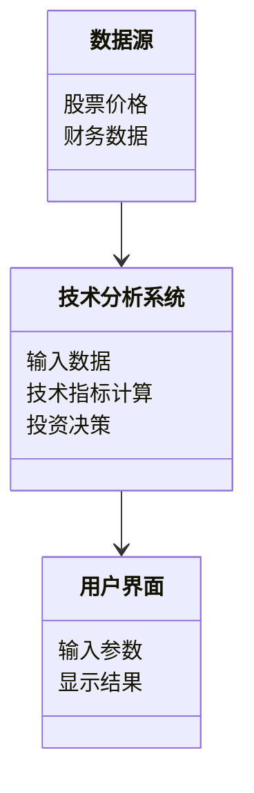
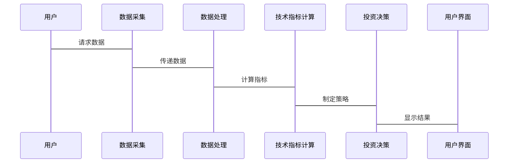

                 


# 《价值投资中的颠覆性技术分析》

> **关键词**：价值投资、技术分析、颠覆性技术、股票分析、投资策略、技术指标  
>
> **摘要**：本文从价值投资与技术分析的结合出发，探讨如何利用颠覆性技术分析的方法，通过技术指标和数学模型，对企业的长期价值和市场趋势进行预测和评估。文章详细分析了技术分析的核心指标（如移动平均线、相对强弱指数、MACD等）的算法原理和系统架构，并通过实际案例展示了如何将技术分析应用于价值投资决策中。最后，文章总结了技术分析在投资中的最佳实践和注意事项。

---

## 第1章：价值投资与颠覆性技术分析概述

### 1.1 价值投资的基本概念

#### 1.1.1 价值投资的定义与核心理念
价值投资是一种以基本面分析为基础的投资策略，强调以低于内在价值的价格买入优质资产，并长期持有。其核心理念包括：
1. **安全边际**：买入价格低于内在价值，以降低投资风险。
2. **长期视角**：关注企业的长期盈利能力，而非短期价格波动。
3. **价值发现**：通过深入分析企业基本面，发现市场低估的投资机会。

#### 1.1.2 投资者与投机者的区别
- **投资者**：注重长期价值，追求稳定的收益。
- **投机者**：关注短期价格波动，追求快速获利。
- **区别**：投资者注重基本面，而投机者注重市场情绪和技术指标。

#### 1.1.3 价值投资的历史与发展
价值投资由本杰明·格雷厄姆提出，经过沃伦·巴菲特等投资者的发展，逐渐成为一种成熟的投资策略。其核心在于通过对企业财务状况、行业地位和竞争优势的分析，寻找具有长期增长潜力的企业。

### 1.2 颠覆性技术的基本概念

#### 1.2.1 颠覆性技术的定义与特征
颠覆性技术是指能够改变现有市场格局，创造新的商业模式或产品，从而对企业价值产生根本性影响的技术。其特征包括：
1. **创新性**：打破传统技术的限制。
2. **市场颠覆性**：改变行业竞争格局。
3. **长期影响**：对企业的长期价值和市场地位产生深远影响。

#### 1.2.2 颠覆性技术对企业价值的影响
颠覆性技术可以通过降低成本、提高效率或创造新的市场需求，提升企业的竞争优势和盈利能力。例如，人工智能技术的颠覆性应用可以显著提高企业的运营效率和客户体验。

#### 1.2.3 颠覆性技术的识别与评估
识别颠覆性技术的关键在于分析其创新性和市场潜力。评估颠覆性技术时，需要考虑：
1. **技术可行性**：技术是否成熟且可大规模应用。
2. **市场接受度**：市场是否愿意接受新技术。
3. **竞争优势**：新技术是否能显著提升企业的竞争力。

### 1.3 价值投资与颠覆性技术的结合

#### 1.3.1 价值投资中的技术分析需求
技术分析可以帮助投资者识别市场趋势和企业估值的波动。在价值投资中，技术分析主要用于确认买入和卖出时机，以及评估市场的短期波动风险。

#### 1.3.2 颠覆性技术对企业长期价值的影响
颠覆性技术的出现可能改变企业的商业模式和竞争优势，从而影响其长期价值。例如，电动汽车技术的颠覆性应用可能改变传统汽车行业的格局。

#### 1.3.3 技术分析在价值投资中的作用
技术分析通过识别市场趋势和估值波动，帮助投资者更好地把握买入和卖出时机，降低投资风险。同时，技术分析还可以与基本面分析结合，形成更加全面的投资决策。

---

## 第2章：技术分析的核心指标

### 2.1 移动平均线（MA）

#### 2.1.1 MA的定义与计算公式
移动平均线是将一定时期内的价格数据进行平均，用于平滑价格波动，反映价格趋势。常见的移动平均线包括简单移动平均线（SMA）和指数移动平均线（EMA）。

- **简单移动平均线（SMA）公式**：
  $$ SMA = \frac{P_1 + P_2 + \cdots + P_n}{n} $$
  其中，$P_i$ 是第$i$天的价格，$n$ 是计算的天数。

- **指数移动平均线（EMA）公式**：
  $$ EMA_t = P_t + \alpha P_{t-1} $$
  其中，$\alpha$ 是衰减因子，通常取 $0.5$ 或 $0.2$。

#### 2.1.2 MA的类型与应用
- **短期MA**：用于识别短期趋势。
- **中期MA**：用于识别中期趋势。
- **长期MA**：用于识别长期趋势。
- **应用**：识别价格支撑位和阻力位，判断市场趋势。

#### 2.1.3 MA在价值投资中的意义
移动平均线可以帮助投资者识别市场的长期趋势，确认买入和卖出时机。例如，当价格突破长期MA时，可能预示着趋势的改变。

### 2.2 相对强弱指数（RSI）

#### 2.2.1 RSI的定义与计算公式
相对强弱指数是衡量价格走势强弱的指标，用于判断市场的超买或超卖状态。

- **RSI公式**：
  $$ RSI = \frac{\text{上涨幅度}}{\text{上涨幅度} + \text{下跌幅度}} \times 100 $$

#### 2.2.2 RSI的解读与应用
- **超买状态**：RSI > 70。
- **超卖状态**：RSI < 30。
- **应用**：识别市场的短期波动，确认买入和卖出时机。

#### 2.2.3 RSI在价值投资中的作用
RSI可以帮助投资者识别市场的短期波动风险，避免在超买状态下追高，或在超卖状态下低位买入。

### 2.3 MACD指标

#### 2.3.1 MACD的定义与计算公式
MACD指标是通过短期和长期移动平均线的差异，反映市场的短期和长期趋势。

- **MACD公式**：
  $$ MACD = EMA_{12} - EMA_{26} $$

#### 2.3.2 MACD的解读与应用
- **MACD线**：用于判断趋势。
- **MACD柱状图**：用于判断趋势的强度。
- **应用**：确认趋势的改变，识别市场的顶点和底部。

#### 2.3.3 MACD在价值投资中的意义
MACD可以帮助投资者识别市场的趋势变化，确认买入和卖出时机。例如，当MACD线交叉时，可能预示着趋势的改变。

---

## 第3章：技术分析与价值投资的结合

### 3.1 技术分析与价值投资的结合模型

#### 3.1.1 模型构建思路
将技术分析指标（如MA、RSI、MACD）与基本面分析相结合，构建一个综合的投资决策模型。

#### 3.1.2 模型的数学表示
$$ \text{综合评分} = \alpha \times \text{技术指标} + \beta \times \text{基本面指标} $$

其中，$\alpha$ 和 $\beta$ 是权重系数，根据具体情况调整。

### 3.2 技术分析在投资组合中的应用

#### 3.2.1 投资组合的构建
根据技术分析和基本面分析的结果，构建一个包含不同资产的投资组合。

#### 3.2.2 投资组合的优化
通过技术分析识别市场的短期波动风险，优化投资组合的配置。

---

## 第4章：系统分析与架构设计

### 4.1 系统功能设计

#### 4.1.1 领域模型（Mermaid 类图）


### 4.2 系统架构设计

#### 4.2.1 系统架构（Mermaid 架构图）


### 4.3 系统交互设计

#### 4.3.1 交互流程（Mermaid 序列图）


---

## 第5章：项目实战

### 5.1 环境安装

#### 5.1.1 安装Python
- 使用Anaconda安装Python环境。

#### 5.1.2 安装技术分析库
- 使用`pandas`和`numpy`进行数据处理。
- 使用`ta-lib`进行技术指标计算。

### 5.2 核心实现

#### 5.2.1 移动平均线（MA）的实现
```python
import pandas as pd
import numpy as np

def calculate_ma(data, window):
    return data['Close'].rolling(window).mean()
```

#### 5.2.2 相对强弱指数（RSI）的实现
```python
def calculate_rsi(data, window):
    diff = data['Close'].diff()
    up = diff.where(diff > 0, 0)
    down = diff.where(diff < 0, 0)
    rs = up.rolling(window).sum() / down.rolling(window).sum()
    rsi = 100 - 100 / (1 + rs)
    return rsi
```

#### 5.2.3 MACD指标的实现
```python
def calculate_macd(data):
    ema12 = data['Close'].ewm(span=12, min_periods=12).mean()
    ema26 = data['Close'].ewm(span=26, min_periods=26).mean()
    macd = ema12 - ema26
    signal = macd.ewm(span=9, min_periods=9).mean()
    return macd, signal
```

### 5.3 应用解读与分析

#### 5.3.1 案例分析
以苹果公司为例，使用上述代码计算其股价的技术指标，并结合基本面分析，评估其长期投资价值。

#### 5.3.2 分析结果
- 移动平均线显示苹果股价处于上升趋势。
- RSI显示苹果股价处于超买状态，可能需要调整。
- MACD显示短期和长期趋势一致，但需关注信号线的变化。

### 5.4 项目小结

---

## 第6章：最佳实践与注意事项

### 6.1 小结

### 6.2 注意事项

#### 6.2.1 技术分析的局限性
- 技术分析仅反映市场情绪，不能完全预测市场走势。
- 技术指标可能在某些市场环境下失效。

#### 6.2.2 价值投资的风险
- 长期投资可能面临市场波动和经济周期的风险。
- 企业基本面的变化可能影响其长期价值。

### 6.3 拓展阅读

#### 6.3.1 推荐书籍
- 《价值投资实战》
- 《技术分析的真谛》

#### 6.3.2 在线资源
- 技术分析论坛
- 价值投资社区

---

## 结语

通过本文的分析，我们可以看到，价值投资与技术分析的结合为企业评估和投资决策提供了更加全面的视角。然而，投资者在实际操作中需要注意技术分析的局限性和市场风险，合理配置资产，实现长期稳健的投资收益。

