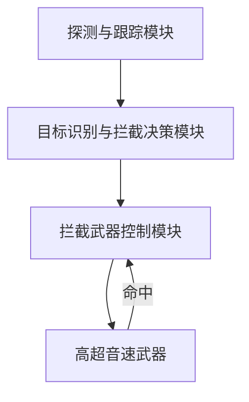
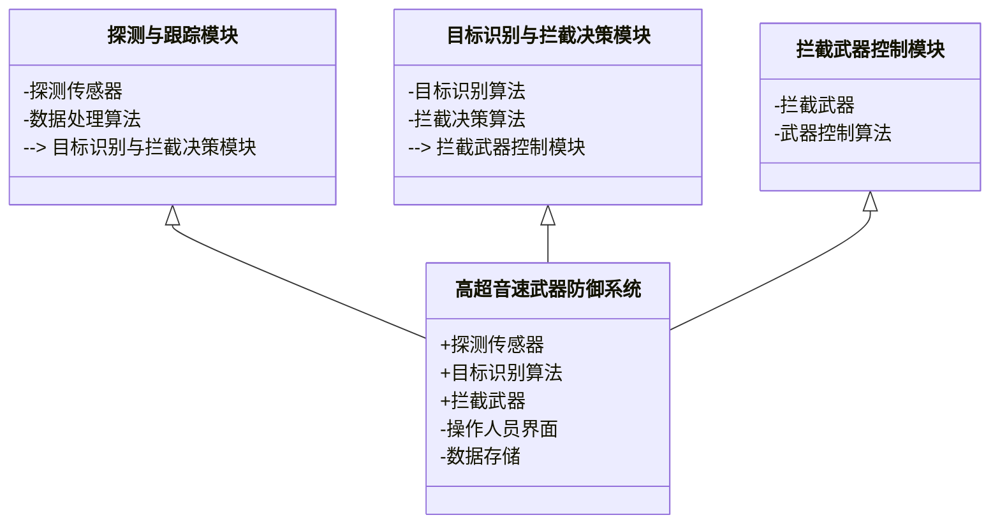

                 

<think>
好的，我将按照您的要求逐步构建《价值投资中的高超音速武器防御系统前景》的技术博客文章。首先，我会先理解这个主题的核心概念，然后逐步展开每个部分的内容。

1. **文章标题**：价值投资中的高超音速武器防御系统前景

2. **关键词**：价值投资、高超音速武器、防御系统、前景、技术博客

3. **摘要**：本文探讨了在价值投资领域中，高超音速武器防御系统的技术前景。通过分析高超音速武器防御系统的核心概念、算法原理和系统架构，结合价值投资的基本原则，提出了在高超音速武器防御系统领域的投资策略。文章旨在为投资者和技术专家提供有价值的参考，帮助他们在新兴领域中做出明智的投资决策。

---

# 价值投资中的高超音速武器防御系统前景

## 关键词：价值投资、高超音速武器、防御系统、前景、技术博客

## 摘要：本文探讨了在价值投资领域中，高超音速武器防御系统的技术前景。通过分析高超音速武器防御系统的核心概念、算法原理和系统架构，结合价值投资的基本原则，提出了在高超音速武器防御系统领域的投资策略。文章旨在为投资者和技术专家提供有价值的参考，帮助他们在新兴领域中做出明智的投资决策。

---

# 第1章: 高超音速武器防御系统的背景与价值投资的结合

## 1.1 高超音速武器防御系统的背景

### 1.1.1 高超音速武器的定义与特点

高超音速武器是指速度超过5马赫（约6174公里/小时）的飞行武器，具有以下特点：
- **极高的速度**：能够在短时间内覆盖 vast 的地理区域。
- **极强的机动性**：能够进行复杂的飞行轨迹调整。
- **极高的突防能力**：能够突破现有的防空和反导系统。

### 1.1.2 高超音速武器防御系统的必要性

随着高超音速武器的快速发展，各国对防御系统的需求日益迫切。高超音速武器防御系统的主要目标是：
- 拦截和摧毁敌方的高超音速武器。
- 保护重要目标（如城市、军事基地等）免受攻击。

### 1.1.3 高超音速武器防御系统的技术现状

目前，高超音速武器防御系统仍处于研发和试验阶段，主要技术难点包括：
- 高速目标的探测与跟踪。
- 短时间内的目标识别与拦截决策。
- 高精度的拦截武器控制。

## 1.2 价值投资的基本概念与原则

### 1.2.1 价值投资的定义

价值投资是一种投资策略，强调以低于内在价值的价格买入优质资产。其核心理念是“买便宜货”，即寻找市场价格低于其内在价值的资产。

### 1.2.2 价值投资的核心原则

- **安全边际**：买入价格低于内在价值，确保有一定的安全空间。
- **长期视角**：关注企业的长期盈利能力，而非短期市场波动。
- **优质资产**：选择具有强大竞争优势和良好管理的企业。

### 1.2.3 价值投资与现代金融市场的结合

在现代金融市场中，价值投资通过分析企业的财务数据、行业地位和竞争优势，帮助投资者在波动的市场中找到稳定的投资机会。

## 1.3 高超音速武器防御系统与价值投资的结合

### 1.3.1 高超音速武器防御系统的市场价值

高超音速武器防御系统的研发和部署具有重要的军事和战略意义，同时也是一个巨大的市场机会。随着国际安全环境的变化，各国对高超音速武器防御系统的需求不断增加。

### 1.3.2 价值投资在高超音速武器防御系统中的应用前景

通过分析高超音速武器防御系统的技术、市场和企业基本面，价值投资者可以在这一领域找到潜在的投资机会。

### 1.3.3 高超音速武器防御系统对投资决策的影响

高超音速武器防御系统的研发周期长、投入大，但一旦成功，具有极高的战略价值和市场回报。这为投资者提供了长期的价值投资机会。

---

# 第2章: 高超音速武器防御系统的核心概念与价值投资的关联

## 2.1 高超音速武器防御系统的核心概念

### 2.1.1 高超音速武器的性能指标

- **速度**：5马赫以上。
- **射程**：能够覆盖敌方关键目标。
- **机动性**：能够在飞行中进行复杂 maneuver。

### 2.1.2 高超音速武器防御系统的组成结构

高超音速武器防御系统通常包括以下组成部分：
- **探测与跟踪系统**：如雷达、光电传感器等。
- **目标识别与拦截决策系统**：基于人工智能和大数据分析。
- **拦截武器系统**：如高能激光武器、导弹等。

### 2.1.3 高超音速武器防御系统的战术特点

- **快速反应能力**：能够在极短时间内做出拦截决策。
- **高度智能化**：依赖先进的 AI 和自动化技术。
- **抗干扰能力**：能够应对复杂的电子战环境。

## 2.2 价值投资中的核心概念

### 2.2.1 股票的内在价值

股票的内在价值是基于企业未来现金流的现值。价值投资者通过分析企业的盈利能力、成长潜力和行业地位来评估其内在价值。

### 2.2.2 市场价值与内在价值的差异

市场价值是股票在市场上的交易价格，内在价值是基于企业基本面的理论价值。当市场价值低于内在价值时，是价值投资的机会。

### 2.2.3 价值投资中的安全边际

安全边际是买入价格与内在价值之间的差额。通过保持足够的安全边际，投资者可以降低投资风险。

## 2.3 高超音速武器防御系统与价值投资的关联

### 2.3.1 高超音速武器防御系统的市场地位

随着各国对高超音速武器防御系统的研发投入增加，相关企业（如军工企业、技术供应商）的市场地位逐渐提升。

### 2.3.2 高超音速武器防御系统的投资价值

具有技术优势和市场前景的企业，其股票具有较高的投资价值。

### 2.3.3 价值投资在高超音速武器防御系统中的应用策略

- **选择具有技术优势的企业**。
- **关注企业的财务状况和管理团队**。
- **评估行业的长期发展前景**。

## 2.4 本章小结

---

# 第3章: 高超音速武器防御系统的算法原理与数学模型

## 3.1 高超音速武器防御系统的算法原理

### 3.1.1 高超音速武器轨迹预测算法

高超音速武器的轨迹预测需要考虑其速度、机动性和环境因素。常用算法包括：
- **卡尔曼滤波**：用于实时跟踪和预测目标轨迹。
- **神经网络预测模型**：利用历史数据训练神经网络进行预测。

### 3.1.2 高超音速武器拦截算法

拦截算法的核心是计算拦截武器的轨迹和时机，以确保准确命中目标。常用算法包括：
- **最优化控制算法**：通过数学优化确定最佳拦截路径。
- **实时反馈控制算法**：根据实时数据调整拦截策略。

### 3.1.3 高超音速武器防御系统的优化算法

优化算法用于提高防御系统的效率和准确性。例如：
- **遗传算法**：用于优化防御系统的参数配置。
- **粒子群优化算法**：用于优化拦截武器的发射点和时间。

## 3.2 价值投资中的数学模型

### 3.2.1 股票估值模型

股票估值模型通常基于 discounted cash flow (DCF) 方法，计算企业未来现金流的现值。公式如下：

$$
\text{内在价值} = \sum_{t=1}^{n} \frac{\text{现金流}_t}{(1 + r)^t}
$$

其中，$r$ 是折现率，$n$ 是预测年数。

### 3.2.2 资产配置模型

资产配置模型用于确定投资组合中各类资产的权重。常用模型包括：
- **现代投资组合理论（MPT）**：通过优化资产配置降低风险。
- **均值-方差优化模型**：在给定风险下最大化收益。

### 3.2.3 风险评估模型

风险评估模型用于量化投资风险。常用模型包括：
- **VaR模型**：计算在一定置信水平下的潜在损失。
- **CVaR模型**：计算在 VaR 基础上的条件风险值。

## 3.3 高超音速武器防御系统与价值投资的数学模型结合

### 3.3.1 高超音速武器防御系统的数学建模

高超音速武器防御系统的数学建模通常涉及多目标优化问题，例如：

$$
\text{目标} = \min \text{拦截时间} + \text{拦截成本} + \text{拦截概率}
$$

### 3.3.2 价值投资中的数学模型应用

在价值投资中，数学模型用于评估企业的内在价值和市场风险。例如：

$$
\text{安全边际} = \text{内在价值} - \text{市场价格}
$$

### 3.3.3 高超音速武器防御系统与价值投资模型的结合案例

假设某高超音速武器防御系统企业的内在价值为 $100 亿元，市场价格为 $80 亿元，则安全边际为 $20 亿元。这表明该企业具有较高的投资价值。

## 3.4 本章小结

---

# 第4章: 高超音速武器防御系统的系统架构与价值投资策略

## 4.1 高超音速武器防御系统的系统架构

### 4.1.1 高超音速武器防御系统的组成模块

高超音速武器防御系统通常包括以下模块：
- **探测与跟踪模块**：负责发现和跟踪高超音速武器。
- **目标识别与拦截决策模块**：基于探测数据进行目标识别和拦截决策。
- **拦截武器控制模块**：控制拦截武器的发射和轨迹调整。

### 4.1.2 高超音速武器防御系统的数据流图



### 4.1.3 高超音速武器防御系统的功能架构



## 4.2 价值投资策略

### 4.2.1 价值投资在高超音速武器防御系统中的应用

- **选择具有技术优势的企业**。
- **关注企业的财务状况和管理团队**。
- **评估行业的长期发展前景**。

### 4.2.2 高超音速武器防御系统的投资风险

- **技术风险**：高超音速武器防御系统的技术难度较高，研发失败的可能性较大。
- **政策风险**：政府政策的变化可能影响行业的前景。
- **市场风险**：高超音速武器防御系统市场的波动性较大。

### 4.2.3 价值投资中的风险管理策略

- **分散投资**：通过投资不同企业降低风险。
- **保持安全边际**：确保买入价格低于内在价值。
- **长期持有**：避免短期市场波动的影响。

## 4.3 本章小结

---

# 第5章: 高超音速武器防御系统的项目实战

## 5.1 项目背景

随着高超音速武器的快速发展，各国对防御系统的需求不断增加。本项目旨在通过价值投资的方式，选择具有技术优势和市场前景的企业进行投资。

## 5.2 系统核心实现源代码

以下是一个简单的价值投资分析模型的 Python 代码：

```python
def calculate_intrinsic_value(enterprise, market_price):
    # 计算内在价值
    intrinsic_value = enterprise / (1 + 0.1)  # 假设折现率为10%
    if intrinsic_value > market_price:
        return "买入"
    else:
        return "卖出"

# 示例
enterprise_value = 100  # 企业价值（亿元）
market_price = 80       # 市场价格（亿元）
result = calculate_intrinsic_value(enterprise_value, market_price)
print(result)  # 输出：买入
```

## 5.3 代码应用解读与分析

上述代码通过计算企业的内在价值与市场价格的差异，判断是否具有投资价值。如果内在价值高于市场价格，则建议买入；否则建议卖出。

## 5.4 实际案例分析

以某高超音速武器防御系统企业为例，假设其企业价值为 100 亿元，市场价格为 80 亿元。根据上述模型，该企业具有较高的投资价值。

## 5.5 项目小结

---

# 第6章: 高超音速武器防御系统的最佳实践与小结

## 6.1 最佳实践

- **选择具有技术优势的企业**。
- **关注企业的财务状况和管理团队**。
- **评估行业的长期发展前景**。
- **保持安全边际**。
- **长期持有**。

## 6.2 小结

高超音速武器防御系统是一个充满挑战和机遇的领域。通过价值投资的方式，投资者可以在这一领域找到潜在的投资机会。然而，高超音速武器防御系统的研发周期长、投入大，具有较高的技术风险和市场风险。因此，投资者需要具备专业的知识和长期的投资视角。

---

# 参考文献

（此处可以列出相关的技术文献、书籍和研究报告）

---

通过以上结构和内容，您可以撰写一篇关于《价值投资中的高超音速武器防御系统前景》的详细技术博客文章。希望这个目录和内容安排对您有所帮助！

