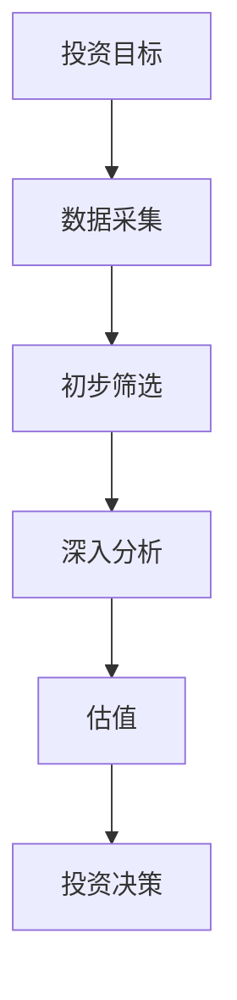

                 

# 价值投资原则：在估值差异中寻找机会

## 关键词
- 价值投资
- 内在价值
- 安全边际
- 股票估值
- 投资策略

## 摘要
价值投资是一种以基本面分析为核心的长期投资策略，旨在通过识别市场中的估值差异，投资于具有持续竞争优势和良好管理的公司，以实现长期稳定的收益。本文从价值投资的基本概念出发，详细探讨了内在价值的分析方法、安全边际的重要性、市场情绪的影响、投资组合的构建以及价值投资的系统化框架。通过结合理论与实际案例，本文为投资者提供了一套系统化的价值投资方法论，帮助他们在复杂的市场环境中识别低估的投资机会，实现稳健的投资回报。

---

## 第1章: 价值投资的概述

### 1.1 价值投资的基本概念

#### 1.1.1 价值投资的定义
价值投资是一种以基本面分析为核心的长期投资策略，强调以低于内在价值的价格买入优质资产。其核心理念是通过深入分析企业的财务状况、行业地位和竞争优势，识别市场中的估值差异，从而在价格波动中实现超额收益。

#### 1.1.2 价值投资的核心理念
- **长期主义**：关注企业的长期价值，而非短期价格波动。
- **安全边际**：买入价格应低于企业的内在价值，以降低投资风险。
- **逆向思维**：在市场恐慌时买入，在市场狂热时卖出。

#### 1.1.3 价值投资与投机的区别
| 方面 | 价值投资 | 投机 |
|------|----------|------|
| 标的 | 具有持续竞争优势的企业 | 短期价格波动 |
| 方法 | 基本面分析 | 市场情绪分析 |
| 时间 | 长期持有 | 短期交易 |

### 1.2 价值投资的历史与发展

#### 1.2.1 价值投资的起源
价值投资的起源可以追溯到20世纪初，本杰明·格雷厄姆和菲利普·费雪是这一投资理念的奠基人。格雷厄姆提出了“安全边际”和“内在价值”等核心概念，而费雪则强调了企业的成长性和竞争优势。

#### 1.2.2 格雷厄姆与多德的价值投资体系
格雷厄姆的学生彼得·林奇进一步发展了价值投资理论，提出了“彼得林奇投资法”，即通过分析企业的财务状况和行业地位，寻找具有低估潜力的股票。

#### 1.2.3 现代价值投资的发展
现代价值投资在传统理论的基础上，结合量化分析和大数据技术，发展出了更加系统化的投资方法，如因子投资和多因子模型。

### 1.3 价值投资的核心原则

#### 1.3.1 市场先生理论
市场先生是格雷厄姆提出的一个比喻，指市场情绪的波动会影响股票价格，但价格并不等于价值。投资者应利用市场先生的“疯狂”和“恐慌”来寻找低估和高估的机会。

#### 1.3.2 安全边际的概念
安全边际是买入价格与内在价值之间的差额，用于缓冲市场波动和企业经营中的不确定性。计算公式为：
$$
\text{安全边际} = \text{内在价值} - \text{买入价格}
$$

#### 1.3.3 股价与内在价值的关系
股价围绕内在价值波动，但长期来看，股价会回归内在价值。因此，投资者应关注企业的内在价值，而非短期价格波动。

---

## 第2章: 内在价值的分析方法

### 2.1 现金流贴现模型（DCF）

#### 2.1.1 自由现金流的定义与计算
自由现金流是指企业在扣除所有费用和投资支出后的剩余现金，是企业的真实盈利表现。计算公式为：
$$
\text{自由现金流} = \text{营业收入} - \text{运营费用} - \text{资本支出}
$$

#### 2.1.2 贴现率的确定方法
贴现率反映了资金的时间价值和风险溢价。常用的方法包括CAPM（资本资产定价模型）和WACC（加权平均资本成本）。例如：
$$
r = r_f + \beta \times (r_m - r_f)
$$

#### 2.1.3 终值的计算与调整
终值是企业未来现金流的现值，计算公式为：
$$
\text{终值} = \frac{\text{自由现金流} \times (1 + g)}{r - g}
$$
其中，$g$为增长率，$r$为贴现率。

### 2.2 财务报表分析

#### 2.2.1 收入、利润与现金流的分析
收入是企业的营业收入，利润是净利润，现金流是企业实际的现金流入和流出。三者共同反映了企业的财务健康状况。

#### 2.2.2 资产负债表的关键指标
- **流动比率**：流动资产/流动负债，衡量企业的短期偿债能力。
- **资产负债率**：负债/资产，衡量企业的财务杠杆。

#### 2.2.3 现金流量表的解读
现金流量表分为经营活动、投资活动和筹资活动三部分，反映了企业现金的流入和流出情况。

### 2.3 相对估值法

#### 2.3.1 市盈率（P/E）分析
市盈率是股票价格与每股收益的比率，计算公式为：
$$
\text{P/E} = \frac{\text{股价}}{\text{每股收益}}
$$

#### 2.3.2 市净率（P/B）分析
市净率是股票价格与每股净资产的比率，计算公式为：
$$
\text{P/B} = \frac{\text{股价}}{\text{每股净资产}}
$$

#### 2.3.3 市销率（P/S）分析
市销率是股票价格与每股销售额的比率，计算公式为：
$$
\text{P/S} = \frac{\text{股价}}{\text{每股销售额}}
$$

---

## 第3章: 安全边际与投资组合

### 3.1 安全边际的定义与作用

#### 3.1.1 安全边际的计算方法
安全边际是买入价格与内在价值之间的差额，计算公式为：
$$
\text{安全边际} = \text{内在价值} - \text{买入价格}
$$

#### 3.1.2 安全边际与投资风险的关系
安全边际越大，投资风险越小。因此，投资者应优先选择具有较大安全边际的投资标的。

#### 3.1.3 安全边际在不同市场环境下的应用
在牛市中，应降低安全边际的要求；在熊市中，应提高安全边际的要求。

### 3.2 投资组合的构建

#### 3.2.1 资产配置的基本原则
- **分散投资**：避免将所有资金投入到单一资产中。
- **长期持有**：避免频繁交易，减少交易成本和税收支出。

#### 3.2.2 股票与债券的配比
根据市场环境和个人风险偏好，合理配置股票和债券的比例。例如：
- **保守型投资者**：债券占比60%，股票占比40%。
- **进取型投资者**：债券占比30%，股票占比70%。

#### 3.2.3 分散投资的重要性
通过分散投资，可以降低非系统性风险，提高投资组合的稳定性。

---

## 第4章: 市场情绪与行为金融学

### 4.1 市场情绪的周期性

#### 4.1.1 市场情绪的波动规律
市场情绪通常呈现周期性波动，从乐观到悲观，再从悲观到乐观。投资者应关注市场情绪的周期性变化，避免盲目跟风。

#### 4.1.2 投资者心理与市场行为
投资者心理通常存在过度自信、从众心理和损失厌恶等偏差，这些偏差会影响投资决策。

#### 4.1.3 市场情绪对估值的影响
市场情绪高涨时，股票估值可能过高；市场情绪低迷时，股票估值可能过低。

### 4.2 行为金融学与价值投资

#### 4.2.1 行为偏差对投资决策的影响
行为偏差包括确认偏差、 hindsight bias 和过度交易偏差等，这些偏差会影响投资者的决策。

#### 4.2.2 如何克服心理偏差
- **制定投资计划**：避免情绪化决策。
- **分散投资**：降低心理压力。
- **定期复盘**：反思和调整投资策略。

#### 4.2.3 市场情绪与安全边际的关系
市场情绪高涨时，安全边际较小；市场情绪低迷时，安全边际较大。

---

## 第5章: 价值投资的系统化框架

### 5.1 价值投资的系统化流程

#### 5.1.1 确定投资目标与策略
- **投资目标**：明确投资期限、风险承受能力和收益目标。
- **投资策略**：制定具体的投资计划，包括资产配置、选股标准和交易策略。

#### 5.1.2 数据采集与初步筛选
- **数据来源**：包括财务报表、行业报告和市场数据等。
- **初步筛选**：通过估值指标（如P/E、P/B）筛选出具有低估潜力的股票。

#### 5.1.3 深入分析与估值
- **财务分析**：分析企业的盈利能力、财务状况和现金流。
- **竞争优势分析**：评估企业的行业地位和竞争优势。
- **内在价值计算**：使用DCF模型计算企业的内在价值。

### 5.2 价值投资的系统化框架

#### 5.2.1 系统架构图

#### 5.2.2 系统功能设计
- **数据采集模块**：收集企业的财务数据和市场数据。
- **初步筛选模块**：通过估值指标筛选出具有低估潜力的股票。
- **深入分析模块**：分析企业的财务状况和竞争优势。
- **估值模块**：计算企业的内在价值。
- **投资决策模块**：根据分析结果制定投资策略。

---

## 附录

### 术语表
- **内在价值**：企业未来现金流的现值。
- **安全边际**：买入价格与内在价值之间的差额。
- **DCF模型**：现金流贴现模型，用于计算企业的内在价值。

### 扩展阅读
- 格雷厄姆的《证券分析》
- 费雪的《怎样选择成长股》
- 彼得·林奇的《彼得林奇投资法》

---

通过以上系统化的价值投资方法论，投资者可以在复杂的市场环境中识别低估的投资机会，实现稳健的投资回报。价值投资不仅是一种投资策略，更是一种长期持有的投资哲学，强调对企业基本面的深入分析和对市场情绪的理性判断。

