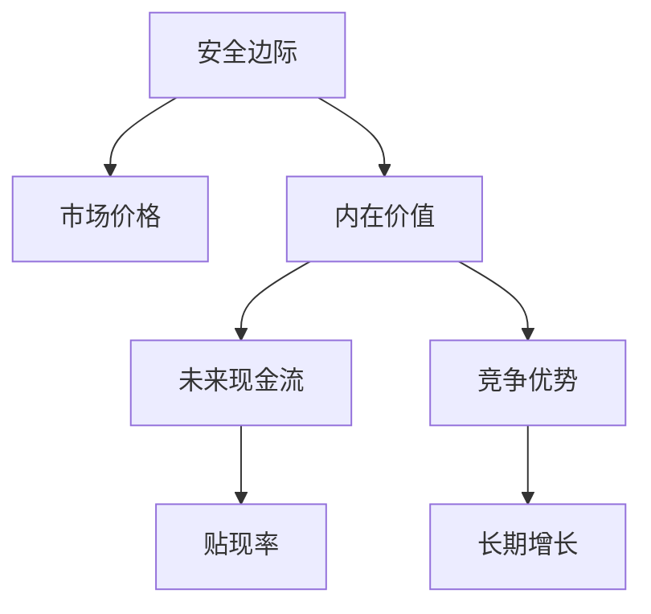
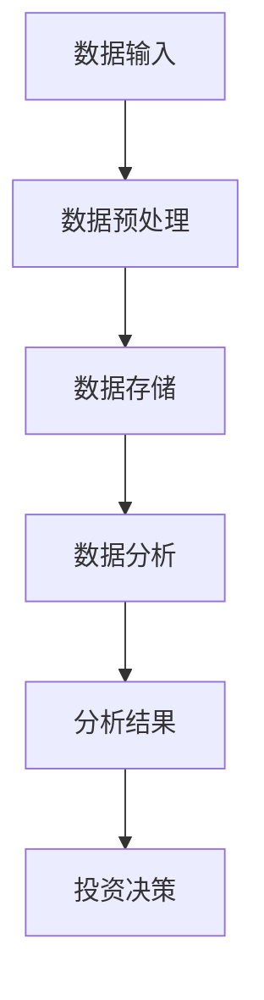

                 


# 价值投资在不同行业的应用

## 关键词

- 价值投资
- 行业分析
- 内在价值
- 财务分析
- 投资策略

## 摘要

价值投资是一种长期投资策略，强调基于企业的基本面分析来寻找被市场低估的投资标的。本文详细探讨了价值投资的核心概念、数学模型、系统架构设计以及在不同行业的实际应用。通过分析安全边际、内在价值、竞争优势等关键维度，结合DCF模型和量化分析方法，本文为投资者提供了一套系统化的价值投资框架，并通过消费行业的实战案例，展示了如何将理论应用于实际投资决策。

---

## 第1章: 价值投资的背景与核心概念

### 1.1 价值投资的起源与发展

价值投资的起源可以追溯到20世纪初，本杰明·格雷厄姆和戴维·多德是这一投资理念的奠基人。他们提出的“安全边际”和“内在价值”概念奠定了价值投资的基础。与短期投机不同，价值投资强调长期持有优质资产，关注企业的基本面而非市场波动。

### 1.2 价值投资的核心思想

价值投资的核心思想是寻找市场定价低于其内在价值的企业。内在价值是指企业在未来现金流的现值，与市场价格的差异即为安全边际。投资者通过分析企业的财务状况、行业地位和竞争优势，识别出那些具有长期增长潜力但被市场低估的企业。

### 1.3 价值投资的主要方法

价值投资的主要方法包括基本面分析、财务指标评估和行业分析。通过分析企业的收入、利润、现金流和资产负债表，投资者可以评估企业的盈利能力和成长潜力。同时，行业分析帮助企业识别出具有竞争优势和长期增长潜力的行业。

---

## 第2章: 价值投资的核心维度分析

### 2.1 价值投资的五个关键维度

价值投资涉及多个关键维度，包括安全边际、内在价值、市场先生、竞争优势和长期视角。每个维度都对投资决策产生重要影响。

#### 2.1.1 安全边际

安全边际是指市场价格低于内在价值的部分。它为企业提供了一定的缓冲空间，确保投资者在市场波动中不会遭受重大损失。

#### 2.1.2 内在价值

内在价值是企业在未来现金流的现值。计算内在价值需要考虑企业的盈利能力和成长潜力，以及贴现率等因素。

#### 2.1.3 市场先生

市场先生是格雷厄姆提出的一个比喻，代表市场的波动性和不确定性。投资者应避免被市场情绪左右，而是专注于企业的基本面。

#### 2.1.4 竞争优势

竞争优势是指企业在行业中相对于竞争对手的独特优势，例如成本优势、品牌影响力或技术壁垒。具有竞争优势的企业更可能实现长期增长。

#### 2.1.5 长期视角

价值投资强调长期持有优质资产，避免短期市场波动的干扰。长期视角使投资者能够捕捉企业的成长潜力。

### 2.2 核心维度对比分析

#### 2.2.1 关键维度属性对比表

| 维度       | 定义描述                                   | 影响因素                           |
|------------|------------------------------------------|------------------------------------|
| 安全边际   | 市场价格与内在价值的差额                 | 市场价格、内在价值                 |
| 内在价值   | 未来现金流的现值                         | 收入、利润、现金流、贴现率         |
| 市场先生   | 市场的波动性和不确定性                   | 市场情绪、投资者心理               |
| 竞争优势   | 企业相对于竞争对手的独特优势           | 成本、品牌、技术                   |
| 长期视角   | 长期持有优质资产，避免短期波动           | 投资策略、市场波动                 |

#### 2.2.2 维度之间的关系图



---

## 第3章: 价值投资的数学模型与公式

### 3.1 内在价值计算公式

内在价值的计算是价值投资的核心，通常使用现金流折现模型（DCF）进行估算。

#### 3.1.1 现金流折现模型（DCF）

$$ \text{内在价值} = \sum_{t=1}^{n} \frac{\text{现金流}_t}{(1 + r)^t} + \frac{\text{残值}}{(1 + r)^n} $$

其中，$r$ 是折现率，$n$ 是预测期数，现金流$_t$ 是第$t$年的现金流。

#### 3.1.2 市盈率与市净率分析

市盈率（P/E）和市净率（P/B）是常用的估值指标：

$$ \text{市盈率} = \frac{\text{股价}}{\text{每股收益}} $$

$$ \text{市净率} = \frac{\text{股价}}{\text{每股净资产}} $$

#### 3.1.3 股东权益收益率（ROE）

$$ \text{ROE} = \frac{\text{净利润}}{\text{股东权益}} $$

### 3.2 投资组合优化公式

#### 3.2.1 马科维茨均值-方差模型

$$ \text{最小方差组合} = \argmin_w \left( w^T \Sigma w \right) $$
$$ \text{约束条件}：w^T \mu = \mu_p, \quad w^T 1 = 1 $$

其中，$\Sigma$ 是协方差矩阵，$\mu$ 是收益向量，$w$ 是权重向量。

#### 3.2.2 资本资产定价模型（CAPM）

$$ \text{预期收益} = r_f + \beta (r_m - r_f) $$

其中，$r_f$ 是无风险利率，$r_m$ 是市场预期收益，$\beta$ 是β系数，衡量资产的系统性风险。

---

## 第4章: 价值投资在不同行业的应用策略

### 4.1 行业分析方法

#### 4.1.1 行业生命周期分析

行业生命周期包括导入期、成长期、成熟期和衰退期。在成熟期和衰退期，企业可能面临更大的竞争压力，但在导入期和成长期，企业可能具有较高的增长潜力。

#### 4.1.2 行业竞争结构分析

根据迈克尔·波特的五力模型，行业竞争结构包括新进入者的威胁、替代品的威胁、供应商的议价能力、买家的议价能力和现有企业的竞争程度。

#### 4.1.3 行业财务指标分析

行业财务指标包括收入增长率、利润率、资产负债率等。通过分析这些指标，可以评估行业的健康状况和企业的盈利能力。

### 4.2 不同行业的价值投资策略

#### 4.2.1 银行业

银行业的价值投资需要关注资产质量、资本充足率和净息差。选择资本充足、资产质量良好且净息差稳定的银行。

#### 4.2.2 制造业

制造业的价值投资需要关注成本控制、市场份额和技术创新。选择具有成本优势和技术创新能力的企业。

#### 4.2.3 科技行业

科技行业的价值投资需要关注研发能力、技术壁垒和市场前景。选择具有强大研发能力和市场前景的企业。

#### 4.2.4 消费行业

消费行业的价值投资需要关注品牌影响力、市场份额和客户忠诚度。选择具有强大品牌影响力和稳定市场份额的企业。

#### 4.2.5 公用事业

公用事业的价值投资需要关注收入稳定性、利润率和政策风险。选择收入稳定、利润率较高的企业。

---

## 第5章: 价值投资的系统化分析与架构设计

### 5.1 价值投资分析系统的功能模块

#### 5.1.1 数据采集模块

数据采集模块负责收集企业的财务数据、市场数据和行业数据。数据来源包括财务报表、行业报告和市场新闻。

#### 5.1.2 财务分析模块

财务分析模块对企业的财务数据进行分析，包括盈利能力、偿债能力、运营能力和成长能力。

#### 5.1.3 估值模型模块

估值模型模块使用DCF模型、市盈率和市净率等模型对企业的内在价值进行估算。

#### 5.1.4 风险评估模块

风险评估模块评估企业的市场风险、流动性风险和信用风险。

#### 5.1.5 投资决策模块

投资决策模块根据分析结果生成投资建议，包括买入、持有或卖出的决策。

### 5.2 系统架构设计

#### 5.2.1 模块化架构图

```mermaid
graph TD
A[数据采集模块] --> B[数据存储模块]
B --> C[财务分析模块]
B --> D[估值模型模块]
B --> E[风险评估模块]
C, D, E --> F[投资决策模块]
```

#### 5.2.2 数据流分析图



---

## 第6章: 价值投资的项目实战

### 6.1 实战环境搭建

#### 6.1.1 数据源选择

选择消费行业的企业数据，包括财务报表和市场数据。

#### 6.1.2 工具安装与配置

安装Python、Pandas、NumPy和Matplotlib等工具，并配置数据接口。

### 6.2 系统核心实现源代码

#### 6.2.1 数据采集代码

```python
import pandas as pd
import requests

url = 'https://example.com/financial_data.csv'
response = requests.get(url)
data = pd.read_csv(url)
print(data.head())
```

#### 6.2.2 估值模型代码

```python
def calculate_intrinsic_value(FCF, WACC):
    # 简单DCF模型
    intrinsic_value = FCF / (WACC - growth_rate)
    return intrinsic_value

FCF = 100000000
WACC = 0.1
growth_rate = 0.05
print(calculate_intrinsic_value(FCF, WACC))
```

### 6.3 实战案例分析

#### 6.3.1 消费行业分析

选择消费行业的龙头企业，分析其财务状况、竞争优势和市场前景。通过DCF模型估算其内在价值，并结合市场价格制定投资策略。

#### 6.3.2 投资决策

根据分析结果，制定买入、持有或卖出的决策，并进行风险评估和投资组合优化。

---

## 第7章: 最佳实践与小结

### 7.1 小结

价值投资是一种长期投资策略，强调基本面分析和长期视角。通过分析企业的内在价值、竞争优势和行业前景，投资者可以在不同行业中找到具有长期增长潜力的优质资产。

### 7.2 注意事项

投资者在进行价值投资时，需要注意市场波动、企业风险和经济周期的影响。同时，应保持对企业的持续跟踪和分析，及时调整投资策略。

### 7.3 拓展阅读

建议投资者阅读本杰明·格雷厄姆的《证券分析》和彼得·林奇的《选股的艺术》，深入理解价值投资的理论和实践。

---

通过以上章节的详细分析，读者可以全面理解价值投资的核心概念、数学模型、系统架构设计以及在不同行业的实际应用。结合实战案例和系统化的分析框架，投资者可以更好地应用价值投资策略，实现长期稳健的投资回报。

