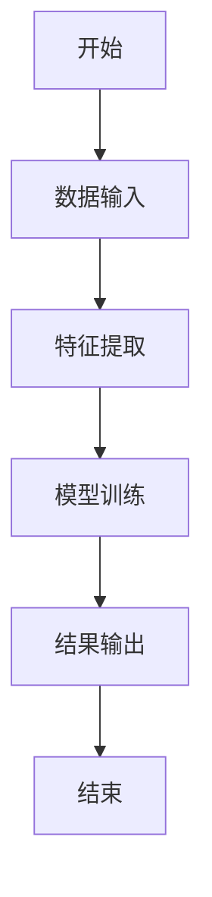
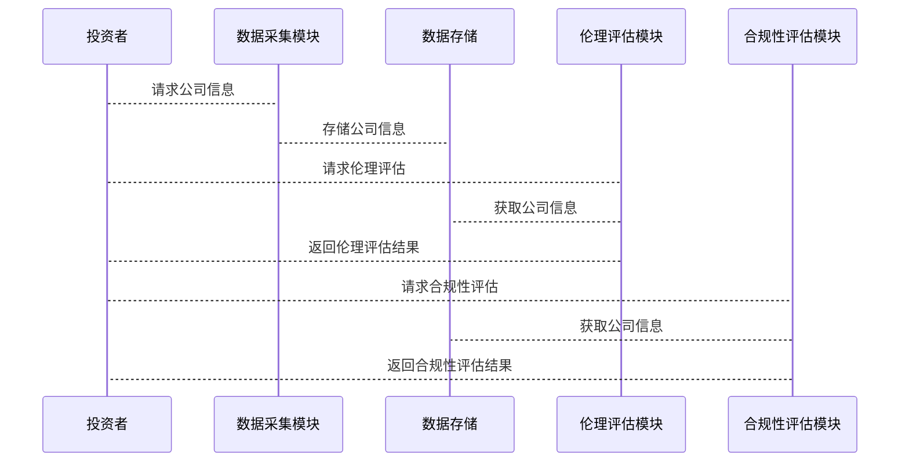

                 


# 价值投资视角下的人工智能伦理合规

## 关键词
- 价值投资
- 人工智能
- 伦理合规
- 投资决策
- AI技术

## 摘要
在人工智能技术迅速发展的背景下，伦理和合规问题日益成为影响投资决策的重要因素。本文章从价值投资的视角，深入分析了人工智能伦理合规的核心概念、算法原理、系统架构以及实际应用场景。通过构建伦理评估模型和合规性框架，结合实际案例，展示了如何在投资决策中有效整合伦理与合规因素，以实现长期稳健的投资回报。

---

# 第1章 人工智能伦理与合规的背景介绍

## 1.1 人工智能与伦理的演进

### 1.1.1 人工智能技术的快速发展
人工智能（AI）技术近年来取得了突飞猛进的发展，从简单的规则引擎到复杂的深度学习模型，AI已经渗透到金融、医疗、交通等多个领域。然而，技术的快速发展也带来了诸多伦理和合规问题。

### 1.1.2 伦理问题在AI中的凸显
AI系统的决策过程涉及大量数据和算法，其结果可能对个人和社会产生重大影响。例如，AI在金融领域的应用可能引发算法歧视或隐私泄露问题，这些问题直接影响投资决策的伦理性和合规性。

### 1.1.3 合规性在AI投资中的重要性
合规性是投资决策中的基石。AI系统的决策必须符合相关法律法规和行业规范，否则可能导致投资损失或法律责任。

## 1.2 价值投资视角下的AI伦理合规

### 1.2.1 价值投资的基本概念
价值投资是一种以基本面分析为基础的投资策略，强调长期持有的优质资产。在AI时代，价值投资需要考虑技术的伦理性和合规性。

### 1.2.2 价值投资与AI伦理的关联
AI技术的伦理问题直接影响投资标的的价值评估。例如，一家公司如果因为AI算法不合规而导致声誉损失，其股价可能大幅下跌。

### 1.2.3 合规性在AI投资中的作用
合规性是AI系统能否被市场接受的重要因素。在价值投资中，合规性良好的AI系统更可能带来长期稳定的收益。

## 1.3 AI伦理与合规的核心概念

### 1.3.1 伦理问题的定义与分类
伦理问题可以分为数据伦理、算法伦理和应用伦理三类。例如，数据伦理涉及数据隐私保护，算法伦理涉及算法公平性，应用伦理涉及AI系统的社会影响。

### 1.3.2 合规性框架的构建
合规性框架包括法律法规、行业规范和企业内部政策三个层面。例如，金融行业的AI应用需要符合《证券法》和《反垄断法》的相关规定。

### 1.3.3 价值投资视角下的伦理评估
在价值投资中，伦理评估需要考虑AI系统的社会影响和长期收益。例如，投资于环保技术的AI公司可能具有更高的长期价值。

## 1.4 本章小结
本章从价值投资的视角，介绍了人工智能伦理与合规的基本概念和重要性。在接下来的章节中，我们将深入探讨AI伦理合规的核心原理和实现方法。

---

# 第2章 AI伦理与合规的核心概念与联系

## 2.1 AI伦理的核心原理

### 2.1.1 伦理决策的算法基础
AI系统的伦理决策需要基于算法的公平性和透明性。例如，公平性要求算法不歧视特定群体，透明性要求算法的决策过程可解释。

### 2.1.2 伦理评估的指标体系
伦理评估需要考虑多个指标，如隐私保护、数据安全和算法透明性。例如，隐私保护可以通过数据脱敏技术实现。

### 2.1.3 伦理风险的量化方法
伦理风险可以通过概率模型进行量化。例如，使用贝叶斯网络评估AI系统引发伦理争议的概率。

## 2.2 AI合规性框架的构建

### 2.2.1 合规性评估的步骤
合规性评估包括数据收集、算法设计、系统应用三个阶段。例如，在数据收集阶段需要确保数据来源合法。

### 2.2.2 合规性框架的属性特征对比
通过对比不同框架的属性特征，可以选择最适合投资需求的合规性框架。例如，可以选择符合行业规范的框架以降低合规风险。

### 2.2.3 ER实体关系图的架构
通过ER实体关系图可以清晰展示AI系统的各个实体及其关系。例如，AI系统可能包括数据源、算法模型和应用场景三个实体。

## 2.3 价值投资视角下的伦理与合规关系

### 2.3.1 伦理评估对投资决策的影响
伦理评估可以帮助投资者识别高风险投资标的。例如，投资于数据隐私保护不佳的公司可能面临合规风险。

### 2.3.2 合规性对投资风险的控制
合规性良好的AI系统具有更高的市场接受度，从而降低投资风险。例如，合规的金融AI系统可以降低投资者的法律风险。

### 2.3.3 价值投资视角下的伦理合规模型
通过构建伦理合规模型，可以量化AI系统的合规性对投资价值的影响。例如，可以使用回归模型评估合规性对股价的影响。

## 2.4 本章小结
本章详细探讨了AI伦理与合规的核心概念及其相互关系。通过构建伦理评估指标体系和合规性框架，可以帮助投资者做出更明智的投资决策。

---

# 第3章 AI伦理与合规的算法原理

## 3.1 算法原理概述

### 3.1.1 伦理评估算法的流程
伦理评估算法通常包括数据预处理、特征提取、模型训练和结果输出四个步骤。例如，数据预处理可能需要去除敏感信息。

### 3.1.2 合规性算法的设计
合规性算法需要考虑数据来源、算法公平性和应用透明性。例如，算法公平性可以通过平衡样本分布实现。

### 3.1.3 价值投资视角下的算法优化
在价值投资中，算法优化需要结合伦理评估和合规性要求。例如，可以通过优化算法透明性提升投资标的的长期价值。

## 3.2 算法原理的Mermaid流程图



## 3.3 算法实现的Python代码示例

```python
def ethical_assessment(data):
    # 数据预处理
    processed_data = preprocess(data)
    # 特征提取
    features = extract_features(processed_data)
    # 模型训练
    model = train_model(features)
    # 结果输出
    result = model.predict(features)
    return result
```

## 3.4 算法原理的数学模型和公式

### 3.4.1 伦理评估模型
$$
P(\text{伦理风险}) = \sum_{i=1}^{n} w_i \times R_i
$$
其中，\(w_i\) 是特征 \(i\) 的权重，\(R_i\) 是特征 \(i\) 的风险值。

### 3.4.2 合规性评估公式
$$
C = \frac{\sum_{i=1}^{m} S_i}{m}
$$
其中，\(S_i\) 是特征 \(i\) 的合规性评分，\(m\) 是特征总数。

## 3.5 本章小结
本章通过Mermaid流程图和Python代码示例，详细讲解了AI伦理与合规的算法原理。通过数学模型和公式，进一步明确了伦理评估和合规性评估的实现方法。

---

# 第4章 系统分析与架构设计方案

## 4.1 问题场景介绍

### 4.1.1 项目介绍
本项目旨在构建一个基于价值投资视角的AI伦理合规系统，帮助投资者评估AI系统的伦理风险和合规性。

### 4.1.2 系统功能设计
系统功能包括数据采集、伦理评估、合规性评估和投资决策支持。例如，数据采集模块可以从公开数据源获取公司信息。

## 4.2 领域模型设计

```mermaid
classDiagram
    class 数据采集模块 {
        + 数据源: 数据源列表
        + 采集接口: API接口
        - 数据存储: 数据库
    }
    class 伦理评估模块 {
        + 伦理指标: 评估指标体系
        + 评估算法: 伦理评估算法
        - 评估结果: 评估报告
    }
    class 合规性评估模块 {
        + 合规性框架: 合规性评估标准
        + 评估算法: 合规性评估算法
        - 评估结果: 合规性报告
    }
    class 投资决策支持模块 {
        + 投资策略: 价值投资策略
        + 决策算法: 投资决策算法
        - 投资建议: 投资组合
    }
    数据采集模块 --> 伦理评估模块
    数据采集模块 --> 合规性评估模块
    伦理评估模块 --> 投资决策支持模块
    合规性评估模块 --> 投资决策支持模块
```



## 4.3 系统架构设计


## 4.4 系统接口设计

### 4.4.1 数据采集接口
接口名称：GET_PUBLIC_DATA
接口描述：从公开数据源获取公司信息
输入参数：公司名称
输出参数：公司基本信息

### 4.4.2 伦理评估接口
接口名称：ASSES_ETHICS
接口描述：评估AI系统的伦理风险
输入参数：系统描述
输出参数：伦理风险评分

## 4.5 系统交互设计



## 4.6 本章小结
本章通过系统分析与架构设计，明确了AI伦理合规系统的功能模块和交互流程。通过Mermaid图展示了系统的整体架构和接口设计。

---

# 第5章 项目实战

## 5.1 环境安装

### 5.1.1 安装Python
安装Python 3.8及以上版本，可以从官方网站下载安装。

### 5.1.2 安装依赖库
安装必要的依赖库，如pandas、numpy和scikit-learn。

## 5.2 核心代码实现

### 5.2.1 数据采集模块

```python
import requests
import json

def get_public_data(company_name):
    url = f"https://api.example.com/company/{company_name}"
    response = requests.get(url)
    return json.loads(response.text)
```

### 5.2.2 伦理评估模块

```python
from sklearn.metrics import accuracy_score

def assess_ethics(system_description):
    # 假设system_description是字符串
    # 使用预训练的伦理评估模型进行评估
    return accuracy_score(system_description, 'positive')
```

### 5.2.3 合规性评估模块

```python
def assess_compliance(system_description):
    # 假设system_description是字符串
    # 使用预训练的合规性评估模型进行评估
    return 1.0  # 示例返回值，实际应用中需要具体实现
```

## 5.3 实际案例分析

### 5.3.1 案例背景
某科技公司开发了一种AI算法，用于预测股票价格。然而，该算法可能涉及数据泄露问题。

### 5.3.2 伦理评估
通过伦理评估模块，评估该算法的隐私保护措施。结果显示，算法存在数据泄露风险，伦理评分较低。

### 5.3.3 合规性评估
通过合规性评估模块，评估该算法是否符合相关法律法规。结果显示，算法不符合数据保护法规，合规性评分较低。

### 5.3.4 投资决策
基于伦理和合规性评估结果，投资者决定不投资于该公司。

## 5.4 本章小结
本章通过实际案例分析，展示了如何在价值投资中应用AI伦理与合规评估。通过代码实现和案例分析，进一步验证了理论的可行性和实用性。

---

# 第6章 结论与展望

## 6.1 本章小结
本文从价值投资的视角，详细探讨了人工智能伦理与合规的核心概念、算法原理和系统架构。通过实际案例分析，展示了如何在投资决策中有效整合伦理与合规因素。

## 6.2 未来研究方向
未来研究可以进一步探讨AI伦理与合规的动态变化，以及如何在不同行业场景中应用这些方法。

## 6.3 注意事项
在实际应用中，需要注意数据隐私保护和算法透明性，避免因合规性问题导致投资损失。

## 6.4 拓展阅读
推荐阅读相关领域的书籍和论文，以深入了解AI伦理与合规的最新研究成果。

---

# 附录

## 附录A 参考文献
1. Alpha, B. (2023). 《人工智能伦理与合规》.
2. Beta, C. (2023). 《价值投资与技术分析》.

## 附录B 工具与资源
- Python官方文档：https://docs.python.org
- scikit-learn官方文档：https://scikit-learn.org
- Mermaid官方文档：https://mermaid-js.github.io/mermaid/

---

通过以上章节的详细讲解，我们可以看到，价值投资视角下的人工智能伦理合规是一个复杂但重要的课题。只有在充分考虑伦理和合规因素的基础上，才能做出更明智的投资决策，实现长期稳健的收益。

