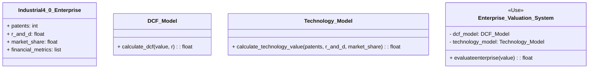
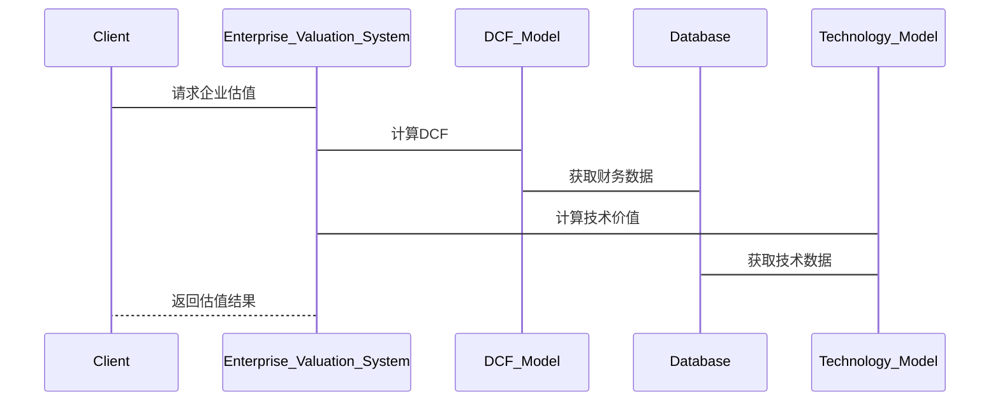

                 


# 价值投资视角下的工业4.0企业估值

> 关键词：价值投资，工业4.0，企业估值，智能化生产，数据资产

> 摘要：本文从价值投资的角度分析工业4.0时代的企业估值方法，探讨如何通过技术创新、数据驱动和智能化生产等因素来评估企业的长期价值。通过结合数学模型和实际案例，提供一种新的企业估值框架，帮助投资者在工业4.0时代做出更明智的投资决策。

---

## 第1章: 价值投资与工业4.0的背景与概念

### 1.1 价值投资的核心原理

#### 1.1.1 价值投资的定义与历史发展

价值投资是一种以企业内在价值为基础的投资策略，由本杰明·格雷厄姆和戴维·多德在20世纪初提出。其核心理念是寻找市场价格低于内在价值的企业进行投资，长期持有，等待市场回归理性。价值投资强调基本面分析，关注企业的财务状况、盈利能力和竞争优势。

#### 1.1.2 价值投资的基本原则与方法

1. **安全边际**：买入价格低于内在价值，以降低投资风险。
2. **长期视角**：关注企业的长期盈利能力，而非短期市场波动。
3. **竞争优势**：寻找具有强大护城河的企业，确保其市场地位和盈利能力。

#### 1.1.3 价值投资与现代企业估值的结合

随着科技的发展，企业估值不再仅仅依赖于传统财务指标，而是需要结合技术创新、数据资产等因素。工业4.0时代，智能化生产、数字化转型等趋势对企业估值提出了新的挑战和机遇。

### 1.2 工业4.0的核心概念与特征

#### 1.2.1 工业4.0的定义与技术基础

工业4.0是指以智能化、数字化和网络化为特征的新一轮工业革命，核心是通过物联网、大数据、人工智能等技术实现生产过程的智能化和自动化。

#### 1.2.2 工业4.0的三大特征：智能化、数字化与网络化

1. **智能化**：通过人工智能和机器学习实现自主决策和优化。
2. **数字化**：将物理世界与数字世界深度融合，实现数据的实时采集和分析。
3. **网络化**：通过物联网和云计算实现设备、系统和数据的互联互通。

#### 1.2.3 工业4.0对企业估值的影响

工业4.0时代的企业的价值不仅仅体现在传统财务指标上，还需要考虑其技术积累、数据资产、智能化生产能力等因素。这些因素直接影响企业的长期盈利能力和发展潜力。

### 1.3 价值投资视角下的工业4.0企业估值背景

#### 1.3.1 当前企业估值的主要挑战

1. **技术更新快**：工业4.0技术的快速迭代使得企业的竞争优势难以持久。
2. **数据驱动**：数据资产的价值难以量化，传统财务指标无法完全反映企业的真实价值。
3. **周期性波动**：工业4.0行业的波动性较大，市场需求变化快。

#### 1.3.2 工业4.0对企业价值的影响

工业4.0技术的应用可以提高企业的生产效率、降低成本、增强客户体验，从而提升企业的长期盈利能力。

#### 1.3.3 价值投资在工业4.0时代的机遇与挑战

1. **机遇**：工业4.0技术的应用为企业带来了新的增长点，具备长期投资价值。
2. **挑战**：技术风险、市场波动大、数据安全等问题增加了投资的复杂性。

---

## 第2章: 工业4.0企业的核心价值评估指标

### 2.1 工业4.0企业的核心价值构成

#### 2.1.1 技术创新与研发投入

技术创新是工业4.0企业的核心竞争力。企业需要持续投入研发，保持技术领先性。

#### 2.1.2 智能化生产能力

智能化生产能力是工业4.0企业的核心生产模式，通过自动化和智能化设备实现高效生产。

#### 2.1.3 数据资产与数字化能力

数据资产是工业4.0企业的核心资源，数字化能力决定了企业对数据的处理和利用能力。

### 2.2 价值投资视角下的关键指标分析

#### 2.2.1 财务指标

1. **ROE（净资产收益率）**：衡量企业的盈利能力。
2. **ROA（资产回报率）**：衡量资产的使用效率。
3. **毛利率**：衡量企业的成本控制能力。

#### 2.2.2 市场指标

1. **市场占有率**：衡量企业在市场中的地位。
2. **竞争地位**：分析企业在行业中的竞争优势。

#### 2.2.3 技术指标

1. **专利数量**：反映企业的技术创新能力。
2. **技术领先性**：分析企业在技术领域的领先地位。

#### 2.2.4 管理指标

1. **管理团队稳定性**：分析管理团队的稳定性和专业性。
2. **战略规划**：评估企业的发展战略是否合理。

### 2.3 工业4.0企业估值的特殊性与复杂性

#### 2.3.1 技术更新快与周期性波动

工业4.0技术更新快，企业需要不断投入研发，保持技术领先性。同时，市场需求波动大，企业面临较大的周期性风险。

#### 2.3.2 数据驱动与传统财务指标的结合

数据资产的价值难以量化，传统财务指标无法完全反映企业的真实价值。需要结合数据资产的价值评估，综合分析企业的长期盈利能力。

#### 2.3.3 企业生态系统与协同效应的评估

工业4.0企业的价值不仅仅体现在单个企业层面，还需要考虑企业生态系统和协同效应。通过产业链上下游的协同合作，实现更大的价值创造。

---

## 第3章: 工业4.0企业估值的数学模型与算法

### 3.1 价值投资中的DCF模型

#### 3.1.1 DCF模型的定义与基本公式

 discounted cash flow (DCF) 模型是一种常用的估值方法，通过将未来现金流折现到现值，计算企业的内在价值。公式如下：

$$DCF = \sum_{t=1}^{n} \frac{CF_t}{(1+r)^t} + \frac{TV}{(1+r)^n}$$

其中：
- \( CF_t \)：第 \( t \) 年的现金流
- \( r \)：折现率
- \( TV \)：终值
- \( n \)：年数

#### 3.1.2 DCF模型在工业4.0企业中的应用

在工业4.0企业估值中，DCF模型可以用于评估企业的未来现金流。由于工业4.0企业的技术更新快，需要考虑技术的生命周期和市场需求的变化。

### 3.2 工业4.0企业的技术评估模型

#### 3.2.1 技术评估模型的定义与核心要素

技术评估模型用于评估工业4.0企业的技术优势和竞争力。核心要素包括：
1. 技术创新速度
2. 技术领先性
3. 技术应用范围

#### 3.2.2 技术评估模型的实现步骤

1. **数据收集**：收集企业的专利数量、研发投入等数据。
2. **技术评估**：评估企业的技术领先性和创新速度。
3. **价值计算**：结合技术评估结果和DCF模型，计算企业的内在价值。

#### 3.2.3 技术评估模型的代码实现

```python
def calculate_technology_value(patents, r_and_d, market_share):
    # 专利数量加权
    patent_weight = 0.4
    # 研发投入加权
    r_and_d_weight = 0.3
    # 市场占有率加权
    market_share_weight = 0.3

    technology_value = (patents * patent_weight) + (r_and_d * r_and_d_weight) + (market_share * market_share_weight)
    return technology_value
```

---

## 第4章: 系统分析与架构设计

### 4.1 问题场景介绍

工业4.0企业的估值需要结合技术、数据和财务等多个维度，构建一个综合评估系统。

### 4.2 系统功能设计

#### 4.2.1 领域模型（Mermaid 类图）



### 4.3 系统架构设计（Mermaid 架构图）


### 4.4 系统接口设计（Mermaid 序列图）



---

## 第5章: 项目实战

### 5.1 环境配置

1. **安装Python和相关库**：安装`mermaid`和`matplotlib`等库。
2. **数据准备**：收集工业4.0企业的相关数据，包括财务指标、技术指标等。

### 5.2 核心实现代码

```python
import matplotlib.pyplot as plt

def calculate_dcf(value, r):
    return sum(value[i]/(1+r)**i for i in range(len(value))) + value[-1]/(1+r)**len(value)

# 示例数据
financial_metrics = [100, 120, 150, 200]
r = 0.1

dcf_value = calculate_dcf(financial_metrics, r)
print(f"DCF 值为: {dcf_value}")

# 绘制DCF曲线
plt.plot([i+1 for i in range(len(financial_metrics))], financial_metrics)
plt.xlabel('年份')
plt.ylabel('现金流')
plt.title('DCF 模型现金流曲线')
plt.show()
```

### 5.3 案例分析

以一家智能制造业企业为例，通过DCF模型和技术创新模型进行估值，分析其长期投资价值。

### 5.4 项目小结

通过实际案例分析，验证了模型的有效性和实用性，为企业估值提供了新的思路。

---

## 第6章: 总结与展望

### 6.1 总结

本文从价值投资的角度分析了工业4.0企业的估值方法，结合数学模型和系统架构设计，提供了一种新的企业估值框架。通过实际案例分析，验证了模型的有效性。

### 6.2 展望

未来的研究可以进一步完善技术评估模型，结合更多维度的数据进行企业估值。同时，可以探索人工智能技术在企业估值中的应用，提高估值的准确性和效率。

---

## 最佳实践 tips

- **长期视角**：价值投资需要长期关注企业的基本面，避免短期市场波动的干扰。
- **数据驱动**：工业4.0企业的数据资产是其核心竞争力，投资者需要重视数据的采集和分析。
- **技术评估**：技术创新是工业4.0企业的核心竞争力，投资者需要关注企业的研发投入和技术领先性。

---

通过本文的分析和案例研究，读者可以更好地理解价值投资视角下的工业4.0企业估值方法，并在实际投资中应用这些理论和模型。

