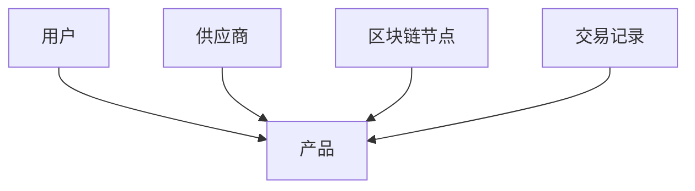
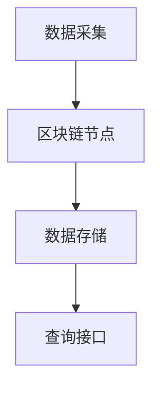
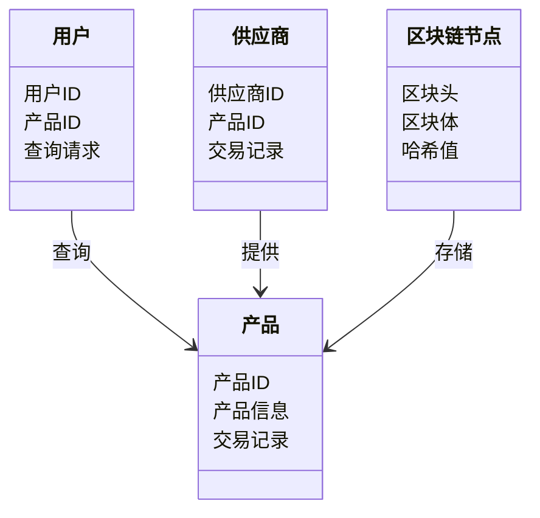

                 


# 价值投资视角下的智慧农业区块链溯源系统

## 关键词：区块链，智慧农业，溯源系统，价值投资，智能合约

## 摘要：本文从价值投资的角度深入分析了智慧农业区块链溯源系统的构建与应用。通过详细阐述区块链技术的核心原理、系统架构设计、算法实现以及实际案例，展示了区块链如何为农业供应链管理带来透明化和价值提升。文章结合理论与实践，为投资者和技术开发者提供了全面的技术解析和投资建议。

---

## 第1章 背景介绍与问题背景

### 1.1 智慧农业的发展现状

#### 1.1.1 智慧农业的概念与内涵

智慧农业是通过物联网、大数据、人工智能等技术，实现农业生产、管理、销售等环节的智能化和数据化。其核心目标是提高农业生产效率、降低成本、增加产品附加值，同时保障农产品的质量和安全。

#### 1.1.2 当前智慧农业面临的主要问题

尽管智慧农业在提高效率方面有显著优势，但其在实际应用中仍面临诸多挑战：

- **数据孤岛**：不同环节的数据分散在各个系统中，缺乏统一的数据标准和共享机制。
- **信任缺失**：消费者对农产品的质量和来源缺乏信任，特别是在供应链复杂的情况下。
- **成本高昂**：传统溯源系统依赖中心化机构，运营成本高且容易被篡改。

#### 1.1.3 区块链技术在农业中的应用潜力

区块链技术以其去中心化、不可篡改和透明性等特点，为智慧农业提供了新的解决方案。通过区块链，可以实现农产品的全生命周期追踪，确保数据的真实性和可靠性，从而增强消费者信任，提升产品价值。

---

## 第2章 核心概念与系统架构

### 2.1 区块链溯源系统的原理

#### 2.1.1 区块链溯源系统的组成要素

区块链溯源系统通常包括以下几个关键组成部分：

- **数据采集层**：通过物联网设备（如传感器、RFID标签）收集农产品的生产、运输和销售数据。
- **区块链节点**：分布式节点负责存储和验证数据块。
- **智能合约**：自动执行预定义的规则和交易。
- **查询接口**：用户或系统通过该接口查询溯源信息。

#### 2.1.2 区块链溯源系统的实现机制

区块链溯源系统通过以下步骤实现数据的可信记录和追踪：

1. 数据采集：物联网设备采集农产品的生产环境、运输条件等数据。
2. 数据上链：数据被加密并打包成区块，通过共识机制加入区块链。
3. 智能合约：自动执行合同条款，如支付、认证等。
4. 查询追踪：用户通过区块链浏览器或API查询产品信息。

#### 2.1.3 价值投资视角下的系统价值评估

从价值投资的角度来看，区块链溯源系统能够为农业带来显著的经济和社会价值：

- **提升产品信任度**：消费者对产品来源的信任增强，提高品牌忠诚度。
- **降低运营成本**：通过去中心化减少对中间机构的依赖，降低成本。
- **增加产品附加值**：优质产品能够通过溯源系统获得更高的市场价。

---

### 2.2 实体关系图与系统架构

#### 2.2.1 ER实体关系图

以下是一个简化的ER实体关系图，展示了区块链溯源系统中的主要实体及其关系：



#### 2.2.2 系统架构图

以下是一个简化的系统架构图，展示了区块链溯源系统的整体架构：



---

## 第3章 区块链溯源系统的算法原理

### 3.1 区块链共识机制

#### 3.1.1 共识机制的定义与分类

共识机制是区块链的核心组件，用于确保所有节点达成一致。常见的共识机制包括：

- **PoW（工作量证明）**：通过计算找到哈希值来证明工作量，安全性高但能耗大。
- **PoS（权益证明）**：根据节点持有的代币数量分配记账权，能耗低但可能有“富者愈富”的风险。
- **DPOS（ delegated proof of stake）**：通过选举代表节点来记账，效率高但依赖选举机制。

#### 3.1.2 适用于农业溯源的共识机制选择

在农业溯源场景中，推荐使用PoS或DPOS机制，因为它们能耗低且适合小型分布式系统。例如，一个小型农业合作社可以采用DPOS机制，选举几个代表节点来维护区块链。

#### 3.1.3 共识机制的数学模型

以DPOS机制为例，节点的记账概率与其持有的股份（代币数量）成正比。记账概率的计算公式如下：

$$ P_i = \frac{S_i}{\sum_{j=1}^{n} S_j} $$

其中，$P_i$ 是第 $i$ 个节点的记账概率，$S_i$ 是第 $i$ 个节点持有的股份，$\sum_{j=1}^{n} S_j$ 是所有节点股份的总和。

---

### 3.2 智能合约的实现原理

#### 3.2.1 智能合约的定义与特点

智能合约是部署在区块链上的自动执行程序，用于定义和执行交易规则。其特点包括：

- **自动执行**：一旦触发条件，合约自动执行。
- **不可篡改**：代码一旦部署，无法修改。
- **透明可信**：所有交易记录在区块链上公开透明。

#### 3.2.2 智能合约的执行流程

以下是一个简单的智能合约执行流程：

1. 用户提交交易请求。
2. 合约触发条件（如支付完成）。
3. 合约自动执行预定义规则（如转移资金或更新状态）。
4. 交易记录写入区块链。

#### 3.2.3 智能合约在农业溯源中的应用

在农业溯源中，智能合约可以用于自动执行供应链中的各项交易。例如，当农产品到达某个节点时，智能合约自动更新该产品的状态并通知相关方。

---

## 第4章 数学模型与公式解析

### 4.1 区块链中的哈希函数

#### 4.1.1 哈希函数的定义与作用

哈希函数是将任意长度的数据映射为固定长度的字符串（哈希值）的函数。在区块链中，哈希函数用于确保数据的完整性和唯一性。

#### 4.1.2 哈希函数的数学模型

以常见的SHA-256哈希函数为例，其数学模型可以表示为：

$$ H(x) = \text{SHA-256}(x) $$

其中，$H(x)$ 表示输入 $x$ 的哈希值。

#### 4.1.3 哈希函数在区块链中的应用

哈希函数用于生成区块的唯一标识符（哈希值），确保每个区块的唯一性和完整性。

---

### 4.2 加密算法与签名机制

#### 4.2.1 加密算法的数学原理

加密算法通过将明文转换为密文来保护数据安全。常见的加密算法包括AES和RSA。

#### 4.2.2 数字签名的实现过程

数字签名通过公钥加密和私钥解密实现。签名过程如下：

1. 用户用私钥对数据进行签名。
2. 签名数据通过区块链网络传播。
3. 其他节点用公钥验证签名的有效性。

#### 4.2.3 数学公式与实际应用案例

数字签名的验证公式如下：

$$ \text{Verify}(M, S, P) = 1 \text{ 如果 } S \text{ 是 } M \text{ 的有效签名，否则 } 0 $$

其中，$M$ 是明文，$S$ 是签名，$P$ 是公钥。

---

## 第5章 系统分析与架构设计

### 5.1 问题场景分析

#### 5.1.1 农业供应链管理中的痛点

农业供应链管理中存在以下痛点：

- 数据分散：各环节数据分散在不同系统中，缺乏统一管理。
- 信任缺失：消费者对产品来源和质量缺乏信任。
- 成本高昂：传统溯源系统依赖中心化机构，运营成本高。

#### 5.1.2 区块链溯源系统如何解决这些问题

区块链溯源系统通过去中心化和不可篡改的特性，解决了数据分散和信任缺失的问题。同时，通过智能合约降低了运营成本。

#### 5.1.3 边界与外延

区块链溯源系统的边界包括数据采集、存储和查询，而其外延可能涉及供应链金融、保险等其他领域。

---

### 5.2 系统功能设计

#### 5.2.1 领域模型设计

以下是一个简化的领域模型：



#### 5.2.2 系统架构设计

以下是一个简化的系统架构图：


---

## 第6章 项目实战

### 6.1 环境安装

#### 6.1.1 安装Python与区块链框架

以下是安装Python和Hyperledger Fabric的步骤：

1. 安装Python：
   ```bash
   apt-get install python3
   ```
2. 安装Hyperledger Fabric：
   ```bash
   curl -L https://github.com/hyperledger/fabric/releases/download/v2.2.0/hyperledger-fabric-linux-amd64-2.2.0.tar.gz
   ```

#### 6.1.2 配置开发环境

设置GOPATH和 PATH 环境变量：
```bash
export GOPATH=$GOPATH:$(pwd)
export PATH=$PATH:$GOPATH/bin
```

### 6.2 核心代码实现

#### 6.2.1 数据采集模块

以下是数据采集模块的代码示例：

```python
import json
from datetime import datetime

def collect_data(product_id, parameter):
    timestamp = datetime.now().isoformat()
    data = {
        'product_id': product_id,
        'timestamp': timestamp,
        'value': parameter
    }
    return json.dumps(data)
```

#### 6.2.2 区块链节点创建

以下是Hyperledger Fabric的节点创建命令：

```bash
docker-compose up -d
```

#### 6.2.3 数据查询模块

以下是数据查询模块的代码示例：

```python
import requests

def query_data(hash_value):
    response = requests.get(f'http://localhost:3000/api/hash/{hash_value}')
    return response.json()
```

---

### 6.3 实际案例分析

#### 6.3.1 案例背景

某农业合作社希望通过区块链溯源系统追踪其有机蔬菜的生产过程。

#### 6.3.2 实施步骤

1. 数据采集：在种植基地安装传感器，采集温度、湿度等数据。
2. 数据上链：将数据加密并打包成区块，通过共识机制加入区块链。
3. 智能合约：自动记录每批次产品的生产、运输和销售信息。
4. 数据查询：消费者通过区块链浏览器查询产品的详细信息。

#### 6.3.3 实施效果

- 提高了消费者对产品的信任度。
- 减少了中间机构的干预，降低了成本。
- 提高了供应链的透明度和效率。

---

## 第7章 最佳实践

### 7.1 小结

通过本文的分析，我们可以看到区块链技术在智慧农业中的巨大潜力。区块链溯源系统不仅能够提高供应链的透明度，还能增强消费者信任，从而提升产品的市场价值。

### 7.2 注意事项

- 数据隐私：确保敏感数据的安全性和隐私性。
- 系统性能：优化区块链网络的性能，确保快速响应。
- 合规性：遵守相关法律法规，确保系统的合法性。

### 7.3 拓展阅读

- 《区块链：分布式应用的落地指南》
- 《智慧农业：技术与商业模式创新》
- 《价值投资：发现伟大企业的秘密》

---

## 结语

区块链技术为智慧农业带来了新的机遇和挑战。通过构建区块链溯源系统，农业企业可以实现数据的可信记录和追踪，从而提高产品价值和市场竞争力。对于投资者而言，这也是一个值得长期关注的领域，因为区块链技术的广泛应用将推动农业产业的全面升级。

