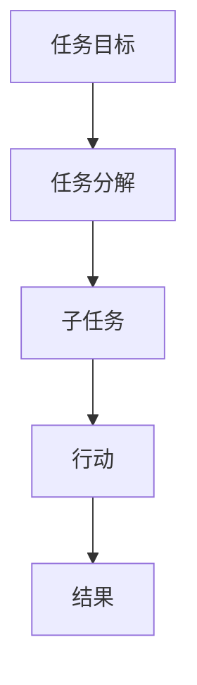
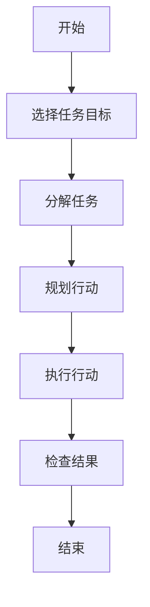
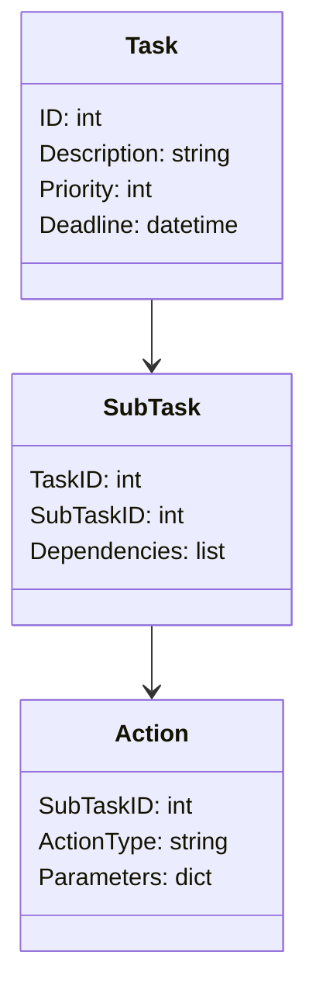
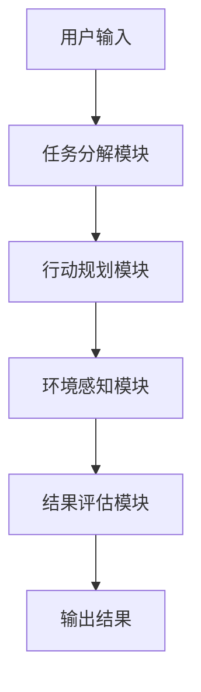
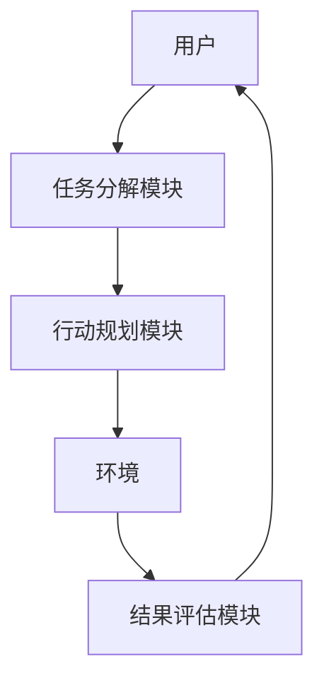

                 


# 任务规划与分解：提高AI Agent的问题解决能力

> 关键词：任务规划，分解方法，AI Agent，问题解决，算法原理，系统架构

> 摘要：任务规划与分解是AI Agent解决问题的核心能力，通过系统地分解复杂问题，AI Agent能够高效地完成任务。本文从背景介绍、核心概念、算法原理、系统架构到项目实战，全面解析任务规划与分解的实现方法，帮助读者提升AI Agent的问题解决能力。

---

# 第一部分: 任务规划与分解的基础概念

## 第1章: 任务规划与分解的背景介绍

### 1.1 问题背景
#### 1.1.1 任务规划与分解的定义
任务规划是指AI Agent根据环境信息和目标，制定一系列行动步骤的过程。任务分解则是将复杂问题拆解为多个子任务，每个子任务相对简单，便于逐个解决。

#### 1.1.2 任务规划与分解的重要性
在AI Agent中，任务规划与分解能够帮助系统在复杂环境中找到最优解决方案，提升问题解决的效率和准确性。例如，在自动驾驶中，任务分解可以将“到达目的地”拆解为路径规划、避障等子任务。

#### 1.1.3 任务规划与分解的应用场景
任务规划与分解广泛应用于机器人、自动驾驶、智能助手等领域。例如，智能助手需要将用户的复杂请求分解为多个简单任务，逐步完成。

### 1.2 问题描述
#### 1.2.1 问题的复杂性
复杂问题通常涉及多个目标和约束条件，例如在物流调度中，需要考虑时间、成本、路径等多种因素。

#### 1.2.2 问题的分解方法
任务分解方法包括层次分解、贪心分解和随机采样分解等。层次分解将问题按层次拆解，贪心分解则逐步选择最优子任务。

#### 1.2.3 问题的优先级排序
优先级排序是任务分解的重要步骤，通过评估子任务的重要性，AI Agent能够优先处理关键任务。

### 1.3 问题解决方法
#### 1.3.1 知识表示与推理
知识表示是任务规划的基础，通过构建知识图谱，AI Agent能够理解任务之间的关系和约束条件。

#### 1.3.2 行动规划与执行
行动规划是任务规划的核心，通过算法生成具体的行动序列，并实时调整以应对环境变化。

#### 1.3.3 目标导向的任务分解
目标导向分解方法通过设定中间目标，逐步逼近最终目标，确保任务分解的连贯性和高效性。

### 1.4 任务规划与分解的边界与外延
#### 1.4.1 任务规划的边界
任务规划的边界包括目标、环境和约束条件。超出这些范围的任务不在规划范围内。

#### 1.4.2 任务分解的范围
任务分解的范围包括全局任务、局部任务和原子任务。不同范围的任务分解方法和策略有所不同。

#### 1.4.3 与其他AI技术的关系
任务规划与分解与其他AI技术如知识表示、逻辑推理、机器学习密切相关，共同构建AI Agent的智能决策能力。

### 1.5 概念结构与核心要素组成
#### 1.5.1 任务目标的层次结构
任务目标通常分为高层目标和底层目标，高层目标是整体方向，底层目标是具体行动。

#### 1.5.2 任务分解的逻辑关系
任务分解的逻辑关系包括并行、串行和混合结构。并行分解适用于多个子任务可以同时执行的情况，串行分解适用于子任务必须按顺序执行的情况。

#### 1.5.3 核心要素的组成
任务规划与分解的核心要素包括目标、行动、约束、优先级和环境信息。

---

## 第2章: 任务规划与分解的核心概念

### 2.1 核心概念原理
#### 2.1.1 任务规划的基本原理
任务规划的基本原理包括目标识别、环境感知、行动选择和结果评估。目标识别是任务规划的起点，环境感知是任务规划的基础，行动选择是任务规划的核心，结果评估是任务规划的反馈。

#### 2.1.2 任务分解的逻辑模型
任务分解的逻辑模型包括目标层次模型、行动序列模型和约束条件模型。目标层次模型将任务分解为多个层次的目标，行动序列模型将任务分解为多个步骤的行动，约束条件模型将任务分解为多个满足约束的子任务。

#### 2.1.3 任务优先级的确定方法
任务优先级的确定方法包括基于时间、资源和风险的评估。优先级高的任务应优先处理，以确保整体目标的实现。

### 2.2 核心概念属性特征对比
#### 2.2.1 不同任务分解方法的对比
| 分解方法      | 基于层次 | 基于贪心 | 基于随机 |
|---------------|----------|----------|----------|
| 优点          | 结构清晰 | 简单高效 | 创新性强 |
| 缺点          | 计算复杂 | 可能次优 | 不可控制 |

#### 2.2.2 不同任务规划算法的对比
| 算法名称      | A*算法 | 分层任务分解 | 随机采样方法 |
|---------------|--------|-------------|-------------|
| 适用场景      | 精确路径规划 | 复杂任务分解 | 创新任务探索 |
| 优势          | 最短路径 | 可扩展性高 | 创新性强 |
| 缺点          | 计算资源消耗大 | 可能次优 | 不可控制 |

#### 2.2.3 核心要素的属性特征
任务分解的核心要素包括目标、行动、约束、优先级和环境信息。目标是任务的核心，行动是任务的实现手段，约束是任务的限制条件，优先级是任务的处理顺序，环境信息是任务执行的背景。

### 2.3 ER实体关系图


---

## 第3章: 任务规划与分解的算法原理

### 3.1 算法原理讲解
#### 3.1.1 A*算法在任务规划中的应用
A*算法是一种经典的路径规划算法，通过评估节点的优先级，优先探索最有潜力的路径。其优先级函数为：
$$f(n) = g(n) + h(n)$$
其中，\( g(n) \) 是从起点到节点n的实际成本，\( h(n) \) 是从节点n到目标的估计成本。

#### 3.1.2 分层任务分解方法
分层任务分解方法将任务分解为多个层次，每个层次的任务分解为更细的子任务。例如，将“完成任务”分解为“准备资源”、“分配任务”、“执行任务”三个层次。

#### 3.1.3 随机采样方法
随机采样方法通过随机选择任务分解的路径，探索新的解决方案。例如，在路径规划中，随机采样方法可以用于避免局部最优解。

### 3.2 算法流程图


### 3.3 算法实现代码
```python
import heapq

def a_star_search(start, goal, heuristic):
    open_list = []
    heapq.heappush(open_list, (0, start))
    g_score = {start: 0}
    f_score = {start: heuristic(start, goal)}
    
    while open_list:
        current = heapq.heappop(open_list)
        current_cost, node = current
        
        if node == goal:
            return node
        
        for neighbor in node.neighbors:
            tentative_g = g_score.get(node) + neighbor.weight
            
            if tentative_g < g_score.get(neighbor, float('inf')):
                g_score[neighbor] = tentative_g
                f_score[neighbor] = tentative_g + heuristic(neighbor, goal)
                heapq.heappush(open_list, (f_score[neighbor], neighbor))
    
    return None
```

### 3.4 数学模型和公式
#### 3.4.1 优先级函数
$$f(n) = g(n) + h(n)$$
其中，\( g(n) \) 是从起点到节点n的实际成本，\( h(n) \) 是从节点n到目标的估计成本。

#### 3.4.2 启发函数
$$h(n) = \text{曼哈顿距离}(n, goal)$$
其中，曼哈顿距离是网格环境中常用的启发函数。

---

## 第4章: 系统分析与架构设计

### 4.1 项目背景与需求分析
本项目旨在通过任务规划与分解算法，提高AI Agent在复杂环境中的问题解决能力。项目需求包括任务分解、行动规划、环境感知和结果评估。

### 4.2 系统功能设计
#### 4.2.1 领域模型


#### 4.2.2 系统架构


#### 4.2.3 接口设计
系统接口包括任务输入接口、任务分解接口、行动规划接口和结果输出接口。

#### 4.2.4 交互流程图


---

## 第5章: 项目实战

### 5.1 环境安装
安装Python和必要的库，如numpy、pandas、scipy和matplotlib。

### 5.2 系统核心实现
#### 5.2.1 任务分解代码
```python
class TaskDecomposer:
    def decompose(self, task):
        subtasks = []
        for condition in task.conditions:
            subtask = SubTask(condition)
            subtasks.append(subtask)
        return subtasks
```

#### 5.2.2 行动规划代码
```python
class ActionPlanner:
    def plan_actions(self, subtasks):
        actions = []
        for subtask in subtasks:
            action = self.select_action(subtask)
            actions.append(action)
        return actions
```

### 5.3 代码应用解读与分析
通过代码实现任务分解和行动规划，展示AI Agent如何在实际问题中应用这些算法。

### 5.4 实际案例分析
以物流调度为例，展示任务分解和行动规划在实际中的应用，分析算法的优缺点。

### 5.5 项目小结
总结项目成果，提出改进建议，展望未来的研究方向。

---

## 第6章: 最佳实践与小结

### 6.1 最佳实践
#### 6.1.1 小结
任务规划与分解是AI Agent解决问题的核心能力，通过系统地分解复杂问题，AI Agent能够高效地完成任务。

#### 6.1.2 注意事项
在实际应用中，需要注意任务分解的粒度、算法的选择和环境的动态变化。

#### 6.1.3 拓展阅读
推荐学习相关领域的书籍和论文，深入了解任务规划与分解的最新研究成果。

---

## 附录

### 附录A: 任务分解工具
推荐使用一些任务分解工具，如MindManager、Lucidchart等。

### 附录B: 参考文献
列出文章中引用的书籍和论文。

---

通过本文的系统讲解，读者可以全面理解任务规划与分解的实现方法，提升AI Agent的问题解决能力。

