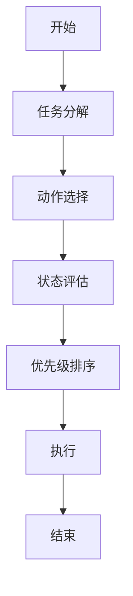
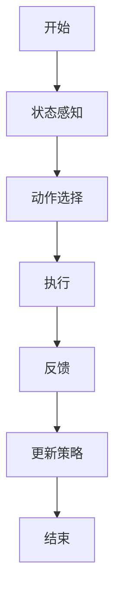

                 


# 任务规划与执行：AI Agent的行动决策机制

> 关键词：任务规划、AI Agent、行动决策、数学模型、系统架构、强化学习

> 摘要：  
本文深入探讨任务规划与执行的核心机制，重点分析AI Agent在行动决策中的作用。通过详细解析任务分解、优先级排序、状态评估等关键环节，结合数学模型与算法原理，揭示AI Agent如何实现高效的任务执行。文章内容涵盖理论分析、算法实现、系统设计和实际案例，帮助读者全面理解任务规划与执行的内在逻辑和应用实践。

---

# 第一部分: 任务规划与执行的背景与概念

# 第1章: 任务规划与执行的背景介绍

## 1.1 问题背景与问题描述

### 1.1.1 任务规划的基本概念  
任务规划（Task Planning）是AI Agent在复杂环境中完成目标的核心能力。它涉及将目标分解为一系列具体任务，并选择合适的动作和路径以实现目标。任务规划的关键在于如何在动态变化的环境中快速做出决策，确保任务执行的高效性和可靠性。

### 1.1.2 AI Agent在任务规划中的作用  
AI Agent通过感知环境、分析任务需求、选择最优动作，从而实现任务的自动化执行。其行动决策机制是任务规划的核心，决定了Agent如何在复杂环境中做出正确的选择。

### 1.1.3 当前任务规划的主要挑战  
- 动态环境中的不确定性：环境的变化可能导致任务目标或条件的变化，需要实时调整规划。  
- 多目标冲突：任务之间可能存在冲突，需要优先级排序和权衡。  
- 高效计算需求：复杂任务的规划需要高效的算法支持，以满足实时性要求。

---

## 1.2 问题解决与边界定义

### 1.2.1 任务规划的核心问题  
- 如何将复杂目标分解为可执行的任务。  
- 如何在动态环境中选择最优动作。  
- 如何评估状态并实时调整规划。

### 1.2.2 任务规划的边界与外延  
任务规划的边界包括：  
- 输入：任务目标、环境状态、可用动作。  
- 输出：执行动作序列或任务分解结果。  
- 外延：与任务执行、环境交互、结果评估等环节密切相关。

### 1.2.3 任务规划与执行的关联性分析  
任务规划是执行的基础，执行是规划的延续。两者的协同决定了任务完成的质量和效率。

---

## 1.3 核心概念结构与组成

### 1.3.1 任务规划的基本要素  
- **任务目标**：明确的行动目标，如“完成文件上传”。  
- **任务分解**：将复杂目标分解为简单任务，如“登录系统”、“上传文件”。  
- **动作选择**：根据当前状态选择最优动作，如“使用Chrome浏览器登录”。  
- **状态评估**：评估当前状态是否接近目标，如“登录成功”。  

### 1.3.2 AI Agent的决策机制  
AI Agent的决策机制包括感知、推理、规划和执行四个环节：  
1. **感知**：通过传感器或API获取环境信息。  
2. **推理**：分析信息，生成可能的动作序列。  
3. **规划**：选择最优动作，生成执行计划。  
4. **执行**：根据计划执行动作，反馈结果。

### 1.3.3 任务规划与执行的系统架构  
任务规划与执行的系统架构包括以下三个模块：  
- **任务分解模块**：将复杂目标分解为简单任务。  
- **动作选择模块**：根据当前状态选择最优动作。  
- **状态评估模块**：实时评估状态，调整规划。

---

## 1.4 本章小结  
本章从任务规划的基本概念出发，分析了AI Agent在任务规划中的作用，探讨了任务规划的核心问题和边界条件，并总结了任务规划的基本要素和系统架构。

---

# 第二部分: AI Agent的行动决策机制

# 第2章: 任务规划的核心概念与联系

## 2.1 核心概念原理

### 2.1.1 任务分解与优先级排序  
任务分解是将复杂目标拆解为简单任务的过程。优先级排序则根据任务的重要性和紧急性进行排序，确保关键任务优先执行。

### 2.1.2 状态空间与动作空间的定义  
- **状态空间**：所有可能的状态集合，如“登录成功”、“文件上传完成”。  
- **动作空间**：所有可能的动作集合，如“登录”、“上传文件”。  

### 2.1.3 目标导向的决策模型  
目标导向的决策模型以任务目标为导向，通过状态评估和动作选择，逐步接近目标状态。

---

## 2.2 核心概念属性对比

### 2.2.1 任务分解的粒度与层次  
任务分解的粒度决定了任务的复杂性和分解的深度。例如：  
- **粗粒度分解**：将目标分解为大任务，如“完成报告”。  
- **细粒度分解**：将目标分解为小任务，如“收集数据”、“分析数据”。  

### 2.2.2 动作选择的策略与优化  
动作选择策略包括：  
- **贪心策略**：选择当前最优动作，不考虑长期影响。  
- **规划策略**：综合考虑长期影响，选择全局最优动作。  

### 2.2.3 状态评估的指标与权重  
状态评估指标包括：  
- **完成度**：任务完成的百分比。  
- **时间成本**：任务执行所需的时间。  
- **资源消耗**：任务执行所需的资源，如CPU、内存。  

权重根据任务需求动态调整，优先完成高权重任务。

---

## 2.3 实体关系图

### 2.3.1 任务分解与动作选择的关系  
任务分解为动作选择提供了任务列表，动作选择根据当前状态选择最优动作。


### 2.3.2 状态评估与优先级排序的关系  
状态评估为优先级排序提供依据，优先级排序为任务分解提供指导。

---

## 2.4 本章小结  
本章详细分析了任务规划的核心概念，包括任务分解、优先级排序、状态空间和动作空间。通过对比分析和实体关系图，揭示了这些概念之间的联系。

---

# 第三部分: 任务规划的算法原理

# 第3章: 任务规划算法原理

## 3.1 算法原理概述

### 3.1.1 基于搜索的规划算法  
基于搜索的规划算法通过搜索状态空间，找到从初始状态到目标状态的最优路径。常用算法包括广度优先搜索（BFS）和深度优先搜索（DFS）。

### 3.1.2 基于模型的规划算法  
基于模型的规划算法依赖于环境模型，通过模型推理选择最优动作。常用算法包括有限状态机（FSM）和马尔可夫决策过程（MDP）。

### 3.1.3 基于强化学习的规划算法  
基于强化学习的规划算法通过试错学习，逐步优化动作选择策略。常用算法包括Q-learning和Deep Q-Network（DQN）。

---

## 3.2 算法流程图

### 3.2.1 基于搜索的规划算法流程图



### 3.2.2 基于强化学习的规划算法流程图



---

## 3.3 算法实现代码

### 3.3.1 基于搜索的规划算法实现

```python
def bfs_planning(initial_state, goal_state):
    from collections import deque
    visited = set()
    queue = deque([(initial_state, [])])
    
    while queue:
        current_state, actions = queue.popleft()
        if current_state == goal_state:
            return actions
        if current_state in visited:
            continue
        visited.add(current_state)
        for action in possible_actions(current_state):
            next_state = transition(current_state, action)
            new_actions = actions + [action]
            queue.append((next_state, new_actions))
    return None
```

### 3.3.2 基于强化学习的规划算法实现

```python
def reinforcement_learning_agent(observation_space, action_space):
    import numpy as np
    Q = np.zeros((observation_space, action_space))
    alpha = 0.1  # 学习率
    gamma = 0.9  # 折扣因子
    
    def choose_action(observation):
        if np.random.random() < 0.9:  # 探索与利用策略
            return np.argmax(Q[observation])
        else:
            return np.random.randint(action_space)
    
    def learn(observation, action, reward, next_observation):
        Q[observation][action] += alpha * (reward + gamma * np.max(Q[next_observation]) - Q[observation][action])
    
    return choose_action, learn
```

---

## 3.4 数学模型与公式

### 3.4.1 状态空间表示  
$$ S = \{ s_1, s_2, ..., s_n \} $$  

### 3.4.2 动作空间表示  
$$ A = \{ a_1, a_2, ..., a_m \} $$  

### 3.4.3 状态转移函数  
$$ P(s', s, a) = \text{概率从状态} s \text{执行动作} a \text{转移到状态} s' $$  

### 3.4.4 优先级函数  
$$ Prio(t) = \sum_{i=1}^{n} w_i \cdot f_i(t) $$  
其中，$w_i$ 是权重，$f_i(t)$ 是任务特征函数。

---

## 3.5 本章小结  
本章详细介绍了任务规划的三种主要算法：基于搜索的规划算法、基于模型的规划算法和基于强化学习的规划算法。通过流程图和代码实现，展示了这些算法的工作原理和实现步骤。

---

接下来的部分将涵盖数学模型与公式、系统架构设计、项目实战以及总结。由于篇幅限制，后续内容将逐步展开。

