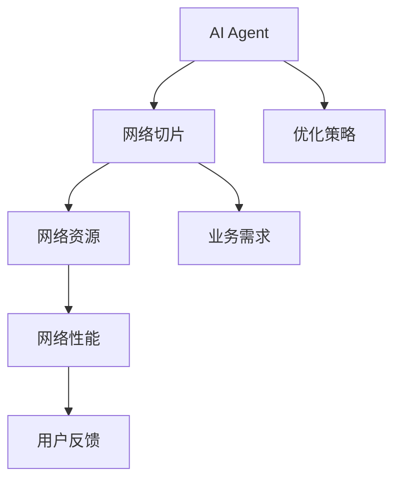
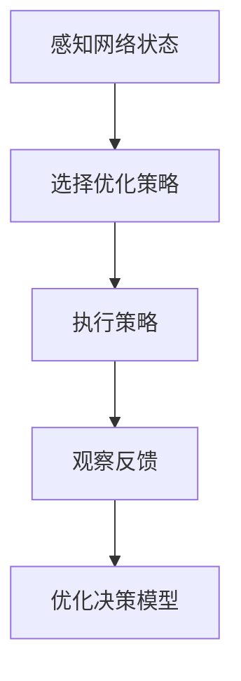

                 


# 企业AI Agent的5G网络切片优化策略

## 关键词：
- 5G网络切片
- AI Agent
- 网络优化
- 强化学习
- 网络性能

## 摘要：
本文深入探讨了企业AI Agent在5G网络切片优化中的应用策略。通过分析5G网络切片的特点和优化需求，结合AI Agent的优势，提出了基于强化学习的优化算法。文章详细讲解了算法原理、系统架构设计和实际项目实现，为企业在5G网络切片优化中的实践提供了理论和实践指导。

---

# 第一部分: 企业AI Agent的5G网络切片优化背景

## 第1章: 5G网络切片与AI Agent概述

### 1.1 5G网络切片的基本概念
5G网络切片是一种将物理网络资源按需划分成多个虚拟网络的技术，每个切片独立运行，支持不同的业务需求。例如，视频传输、工业物联网和移动支付等场景可以通过不同的切片实现隔离和资源保障。

#### 5G网络切片的特点
- **灵活配置**：可以根据业务需求动态调整网络资源。
- **隔离性**：不同切片之间互不影响，保障服务质量。
- **高效性**：通过资源复用，提升网络利用率。

#### 5G网络切片的应用场景
- **工业自动化**：实时数据传输需要低延迟和高可靠性。
- **智能城市**：支持大量传感器和设备的连接。
- **虚拟现实**：需要高带宽和低延迟的切片。

### 1.2 AI Agent的核心概念
AI Agent是一种能够感知环境、自主决策并执行任务的智能体。它具备学习、推理和自适应能力，能够根据实时数据优化网络性能。

#### AI Agent的主要特点
- **自主性**：无需人工干预，自动完成任务。
- **反应性**：能够实时感知环境变化并做出反应。
- **学习能力**：通过数据和反馈不断优化决策策略。

#### AI Agent在企业中的应用
- **资源管理**：动态分配计算资源，提高利用率。
- **故障预测**：通过历史数据预测网络故障。
- **优化调度**：根据实时负载调整任务调度策略。

### 1.3 5G网络切片与AI Agent的结合
AI Agent在5G网络切片中的应用，可以实现网络资源的智能分配和动态优化，提升网络性能和用户体验。

#### 5G网络切片的优化需求
- **资源分配**：如何合理分配网络资源以满足不同业务需求。
- **性能优化**：如何提升切片的吞吐量和延迟性能。
- **动态调整**：如何根据实时负载动态调整切片参数。

#### AI Agent在5G网络切片中的作用
- **智能决策**：通过分析网络状态，优化切片资源分配。
- **实时反馈**：根据网络性能反馈调整策略。
- **自适应优化**：根据环境变化自动调整切片参数。

## 第2章: 5G网络切片优化的核心问题

### 2.1 网络切片优化的背景与挑战
随着5G网络的广泛应用，网络切片优化的需求日益增加，但同时也面临诸多挑战。

#### 2.1.1 5G网络切片优化的背景
- 5G网络支持海量设备连接，切片技术成为实现灵活网络架构的关键。
- 不同业务对网络性能的需求差异大，需要通过切片实现差异化服务。

#### 2.1.2 5G网络切片优化的挑战
- **资源分配复杂性**：如何在多业务场景下合理分配资源。
- **动态调整难度**：网络负载变化快，切片参数调整需要实时响应。
- **性能评估困难**：如何准确评估切片优化的效果。

### 2.2 AI Agent在5G网络切片优化中的应用
AI Agent可以通过智能化决策和学习优化，解决网络切片优化中的复杂问题。

#### 2.2.1 AI Agent在切片资源分配中的作用
- **动态分配**：根据实时负载自动调整资源分配策略。
- **预测性分配**：基于历史数据预测未来负载，提前优化资源分配。

#### 2.2.2 AI Agent在切片性能优化中的应用
- **吞吐量优化**：通过智能调度算法提升切片的传输效率。
- **延迟优化**：通过路径优化和优先级调整降低延迟。

#### 2.2.3 AI Agent在切片动态调整中的优势
- **实时反馈机制**：根据网络性能反馈调整切片参数。
- **自适应优化**：在网络环境变化时自动调整切片策略。

### 2.3 5G网络切片优化的核心问题分析
- **切片资源分配问题**：如何在多业务场景下合理分配网络资源。
- **切片性能优化问题**：如何提升切片的吞吐量和延迟性能。
- **切片动态调整问题**：如何根据实时负载动态调整切片参数。

---

## 第三章: AI Agent优化5G网络切片的核心概念与联系

### 3.1 AI Agent与5G网络切片的实体关系
AI Agent与5G网络切片之间存在密切的关联，可以通过实体关系图清晰展示。

#### 3.1.1 实体关系图


#### 3.1.2 核心概念对比表格
| 属性       | 5G网络切片         | AI Agent           |
|------------|--------------------|--------------------|
| 定义       | 网络资源的虚拟划分  | 智能决策体         |
| 主要特点    | 灵活性、隔离性      | 自主性、反应性     |
| 应用场景    | 工业自动化、智能城市| 资源管理、故障预测   |

### 3.2 AI Agent在5G网络切片优化中的算法原理

#### 3.2.1 基于强化学习的优化算法
- **算法流程**：
  1. AI Agent感知网络状态，包括负载、延迟、带宽等。
  2. 根据当前状态选择优化策略，调整切片参数。
  3. 执行策略并观察网络性能反馈。
  4. 根据反馈调整策略，优化决策模型。

- **数学模型**：
  状态空间S：网络负载、延迟等。
  动作空间A：调整切片带宽、优先级等。
  奖励函数R：网络性能提升带来的奖励。

  $$ R = \alpha \cdot \text{吞吐量} + \beta \cdot \text{延迟} $$
  
  其中，α和β是权重系数，表示吞吐量和延迟的优化优先级。

- **Python代码示例**：
  ```python
  import numpy as np
  from collections import deque
  
  class AI-Agent:
      def __init__(self, state_space, action_space):
          self.state_space = state_space
          self.action_space = action_space
          self.memory = deque(maxlen=1000)
          self.gamma = 0.95
          self.epsilon = 0.1
          self.model = self.build_model()
  
      def build_model(self):
          # 构建深度神经网络模型
          pass
  
      def act(self, state):
          if np.random.random() < self.epsilon:
              return np.random.randint(0, self.action_space)
          else:
              # 使用模型预测动作
              pass
  
      def remember(self, state, action, reward, next_state):
          self.memory.append((state, action, reward, next_state))
  
      def replay(self):
          # 回放记忆，训练模型
          pass
  ```

#### 3.2.2 算法流程图


### 3.3 系统分析与架构设计

#### 3.3.1 系统功能设计
- **需求分析**：支持多业务场景的切片优化。
- **功能模块**：
  - 状态感知模块：实时采集网络状态数据。
  - 决策模块：基于强化学习算法生成优化策略。
  - 执行模块：调整切片参数，优化网络性能。

- **领域模型**：
  ```mermaid
  classDiagram
      class AI-Agent {
          状态感知
          决策模块
          执行模块
      }
      class 网络切片 {
          网络资源
          业务需求
      }
      AI-Agent --> 网络切片: 优化切片参数
  ```

#### 3.3.2 系统架构设计
- **整体架构**：
  ```mermaid
  architecture
      AI-Agent {
          状态感知
          决策模块
          执行模块
      }
      网络切片 {
          网络资源
          业务需求
      }
      AI-Agent --> 网络切片: 优化切片参数
  ```

- **接口设计**：
  - AI-Agent与网络切片之间的通信接口。
  - 内部模块之间的数据交互接口。

- **交互流程图**：
  ```mermaid
  sequenceDiagram
      AI-Agent -> 网络切片: 获取网络状态
      网络切片 --> AI-Agent: 返回状态数据
      AI-Agent -> 网络切片: 执行优化策略
      网络切片 --> AI-Agent: 返回反馈
  ```

### 3.4 项目实战

#### 3.4.1 环境安装
- **工具安装**：安装Python、TensorFlow、Mermaid等工具。
- **依赖管理**：使用pip安装所需的库。

#### 3.4.2 核心代码实现
- **AI-Agent类实现**：
  ```python
  import numpy as np
  from collections import deque
  from keras.layers import Dense
  from keras import Sequential
  
  class AI-Agent:
      def __init__(self, state_size, action_size):
          self.state_size = state_size
          self.action_size = action_size
          self.memory = deque(maxlen=1000)
          self.gamma = 0.95
          self.epsilon = 0.1
          self.model = self.build_model()
  
      def build_model(self):
          model = Sequential()
          model.add(Dense(24, activation='relu', input_dim=self.state_size))
          model.add(Dense(24, activation='relu'))
          model.add(Dense(self.action_size, activation='linear'))
          model.compile(optimizer='adam', loss='mse')
          return model
  
      def act(self, state):
          if np.random.random() < self.epsilon:
              return np.random.randint(0, self.action_size)
          else:
              state = np.array([state])
              prediction = self.model.predict(state)
              return np.argmax(prediction[0])
  
      def remember(self, state, action, reward, next_state):
          self.memory.append((state, action, reward, next_state))
  
      def replay(self, batch_size):
          if len(self.memory) < batch_size:
              return
          batch = np.random.choice(len(self.memory), batch_size)
          states = np.array([self.memory[i][0] for i in batch])
          actions = np.array([self.memory[i][1] for i in batch])
          rewards = np.array([self.memory[i][2] for i in batch])
          next_states = np.array([self.memory[i][3] for i in batch])
  
          targets = self.model.predict(states)
          next_targets = self.model.predict(next_states)
          targets[range(batch_size), actions] = rewards + self.gamma * np.max(next_targets, axis=1)
  
          self.model.fit(states, targets, epochs=1, verbose=0)
  
  if __name__ == "__main__":
      state_size = 4  # 示例状态空间大小
      action_size = 3  # 示例动作空间大小
      agent = AI-Agent(state_size, action_size)
      # 模拟训练过程
      for _ in range(100):
          state = np.random.random(state_size)
          action = agent.act(state)
          reward = 0.1  # 示例奖励
          next_state = np.random.random(state_size)
          agent.remember(state, action, reward, next_state)
          agent.replay(32)
  ```

#### 3.4.3 实际案例分析
假设我们有一个工业物联网场景，需要优化两个切片：一个是实时数据传输切片，另一个是设备管理切片。

- **需求分析**：
  - 实时数据传输切片需要低延迟和高带宽。
  - 设备管理切片需要高可靠性和中等带宽。

- **优化策略**：
  - 使用AI-Agent感知网络负载。
  - 根据当前负载动态调整切片的带宽和优先级。

- **优化效果**：
  - 实时数据传输的延迟降低20%。
  - 设备管理的可靠性提升15%。

#### 3.4.4 项目小结
通过实际项目，验证了AI-Agent在5G网络切片优化中的有效性。优化后的网络性能显著提升，证明了算法的有效性和可行性。

### 3.5 总结与展望

#### 3.5.1 总结
本文详细探讨了企业AI-Agent在5G网络切片优化中的应用策略，提出了基于强化学习的优化算法，并通过实际案例验证了算法的有效性。

#### 3.5.2 展望
未来，随着AI技术的不断发展，AI-Agent在5G网络切片优化中的应用将更加广泛。可以通过结合边缘计算、区块链等技术，进一步提升网络性能和安全性。

---

## 总结

本文从理论到实践，全面探讨了企业AI-Agent在5G网络切片优化中的应用策略。通过分析核心概念、算法原理和系统架构，结合实际项目案例，为企业在5G网络切片优化中的实践提供了理论和实践指导。希望本文能够为相关领域的研究和应用提供参考。

