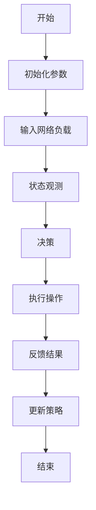
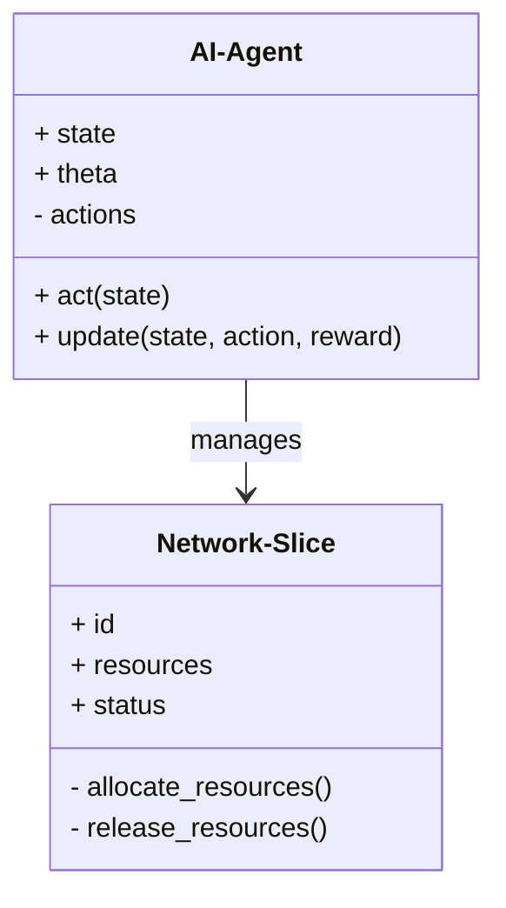
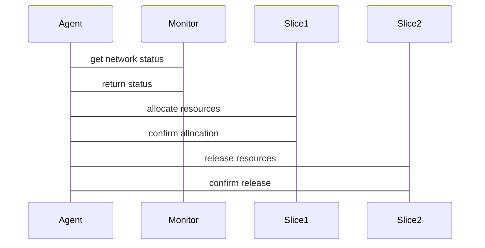

                 


# 企业AI Agent的5G网络切片资源分配

**关键词**：企业AI Agent，5G网络切片，资源分配，算法原理，系统架构

**摘要**：本文探讨了企业AI Agent在5G网络切片资源分配中的应用，详细分析了AI Agent的基本概念、5G网络切片的原理，以及它们之间的协同关系。通过算法原理、系统架构设计和项目实战，展示了如何利用AI技术优化5G网络资源分配，提升企业网络性能和用户体验。

---

## 第1章: 企业AI Agent与5G网络切片概述

### 1.1 AI Agent的基本概念

#### 1.1.1 AI Agent的定义与特点
AI Agent（智能代理）是一种能够感知环境并采取行动以实现目标的智能实体。它具备自主性、反应性、主动性、社会性等核心特点，能够在复杂环境中做出决策并执行任务。

#### 1.1.2 企业级AI Agent的应用场景
在企业环境中，AI Agent广泛应用于自动化运维、智能调度、资源管理等领域。例如，AI Agent可以用于优化企业网络资源分配，提升业务效率。

#### 1.1.3 5G网络切片技术的背景与意义
5G网络切片是一种将物理网络分割为多个虚拟子网络的技术，每个子网络独立配置，满足不同业务的需求。这种技术为企业提供了灵活的网络资源管理能力，适用于智能制造、智慧城市等多种场景。

---

### 1.2 5G网络切片的核心概念

#### 1.2.1 网络切片的定义与特点
5G网络切片通过虚拟化技术将物理网络划分为多个逻辑网络，每个切片具有独立的网络参数和资源配置。

#### 1.2.2 5G网络切片的分类与应用场景
5G网络切片主要分为eMBB（增强型移动宽带）、mMTC（大规模机器类通信）和uRLLC（超可靠低时延通信）三类，分别适用于不同的业务场景。

#### 1.2.3 5G网络切片与企业AI Agent的结合
通过AI Agent的智能决策，5G网络切片能够动态调整资源分配策略，优化网络性能，提升用户体验。

---

## 第2章: AI Agent与5G网络切片的关联

### 2.1 AI Agent在5G网络切片中的角色

#### 2.1.1 AI Agent在资源分配中的作用
AI Agent通过分析网络负载、用户需求等信息，制定最优的资源分配策略，确保网络资源的高效利用。

#### 2.1.2 AI Agent如何优化网络切片性能
AI Agent可以通过预测网络流量变化，提前调整网络切片的资源配置，避免资源浪费和网络拥塞。

#### 2.1.3 AI Agent与网络切片的协同机制
AI Agent与5G网络切片的协同主要体现在信息共享、决策反馈和资源动态调整三个方面。

### 2.2 5G网络切片资源分配的核心要素

#### 2.2.1 网络资源分配的基本原理
网络资源分配需要考虑带宽、时延、连接数等多种因素，确保每个切片的资源需求得到满足。

#### 2.2.2 5G网络切片的资源分配模型
资源分配模型包括需求分析、资源分配算法、性能评估等环节，AI Agent在其中起到关键的决策作用。

#### 2.2.3 AI Agent在资源分配中的决策机制
AI Agent通过机器学习算法，分析历史数据和实时信息，制定资源分配策略，确保网络性能的最优。

---

## 第3章: 基于AI Agent的5G网络切片资源分配算法

### 3.1 算法原理概述

#### 3.1.1 算法的基本思想
基于强化学习的资源分配算法，通过不断试错和学习，优化资源分配策略。

#### 3.1.2 算法的输入与输出
输入包括网络负载、用户需求等信息，输出是资源分配方案。

#### 3.1.3 算法的优化目标
算法优化的目标是最大化网络性能，包括最小化时延、最大化带宽利用率等。

### 3.2 算法流程图



### 3.3 算法实现代码

```python
import numpy as np
import gym

class Agent:
    def __init__(self, state_space, action_space):
        self.state_space = state_space
        self.action_space = action_space
        self.theta = np.random.rand(1, state_space)

    def act(self, state):
        action_probs = np.exp(self.theta @ state) / sum(np.exp(self.theta @ state))
        action = np.random.choice(self.action_space, p=action_probs)
        return action

    def update(self, state, action, reward):
        delta = reward * np.exp(self.theta @ state)
        self.theta += delta
```

---

## 第4章: 5G网络切片资源分配的系统架构设计

### 4.1 问题场景介绍
企业AI Agent需要实时监控网络负载，动态调整5G网络切片的资源配置，确保业务性能。

### 4.2 系统功能设计

#### 4.2.1 领域模型类图



### 4.3 系统架构设计

#### 4.3.1 系统架构图

```mermaid
graph TD
    Agent[AI Agent] --> Slice1[Slice 1]
    Agent --> Slice2[Slice 2]
    Agent --> Slice3[Slice 3]
    Agent --> Monitor[Network Monitor]
    Monitor --> Agent: send status
```

### 4.4 系统接口设计

#### 4.4.1 接口描述
AI Agent与网络切片之间通过REST API进行通信，实现资源分配的动态调整。

### 4.5 系统交互流程

#### 4.5.1 序列图



---

## 第5章: 项目实战

### 5.1 环境安装

```bash
pip install gym numpy
```

### 5.2 系统核心实现

```python
def main():
    import gym
    env = gym.make('CustomEnv')
    agent = Agent(env.observation_space.shape[0], env.action_space.n)
    for episode in range(1000):
        state = env.reset()
        done = False
        while not done:
            action = agent.act(state)
            next_state, reward, done, _ = env.step(action)
            agent.update(state, action, reward)
            state = next_state
```

### 5.3 代码解读与分析
- `main()`函数初始化环境和AI Agent，进行多次训练。
- `Agent`类实现基于强化学习的资源分配策略。
- `act()`方法根据当前状态选择动作。
- `update()`方法更新模型参数，优化资源分配策略。

### 5.4 实际案例分析
通过模拟企业网络环境，展示AI Agent如何动态调整网络切片资源，提升网络性能。

### 5.5 项目小结
通过本项目，我们可以看到AI Agent在5G网络切片资源分配中的巨大潜力，以及其实现的关键步骤和方法。

---

## 第6章: 最佳实践与总结

### 6.1 小结
企业AI Agent与5G网络切片的结合，能够显著提升网络资源利用效率和企业业务性能。

### 6.2 注意事项
在实际应用中，需要注意算法的实时性、网络的安全性以及模型的可解释性。

### 6.3 拓展阅读
推荐阅读相关领域的最新论文和技术报告，深入了解AI Agent在5G网络中的更多应用场景。

---

通过以上章节的详细分析和实践，我们系统地探讨了企业AI Agent在5G网络切片资源分配中的应用，为读者提供了从理论到实践的完整指南。

