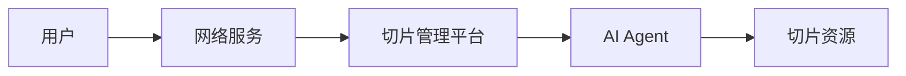
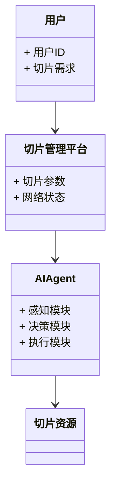
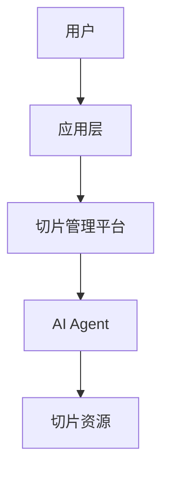

                 


# 企业AI Agent的5G网络智能切片技术

> 关键词：5G网络切片，AI Agent，智能切片，强化学习，图神经网络

> 摘要：本文深入探讨了AI Agent在5G网络智能切片技术中的应用。首先，我们介绍了5G网络切片的基本概念及其对企业的重要性。接着，详细阐述了AI Agent在5G切片管理中的核心原理，包括感知、决策和执行机制。随后，通过强化学习和图神经网络的算法原理，展示了如何实现智能切片的优化。最后，通过项目实战和系统架构设计，详细分析了AI Agent在5G切片管理中的应用场景和实际效果。

---

## 第一部分: 5G网络切片与AI Agent的背景介绍

### 第1章: 5G网络切片的基本概念

#### 1.1 5G网络切片的定义
5G网络切片是一种将物理网络分割为多个虚拟子网络的技术，每个子网络（切片）可以独立配置参数，以满足不同的业务需求。例如，视频会议、物联网设备和高清视频流等服务可以运行在不同的切片上，互不干扰。

#### 1.2 网络切片的核心目标与应用场景
网络切片的目标是提高网络资源利用率、降低延迟、保障服务质量(QoS)以及支持多场景的应用需求。应用场景包括工业自动化、智能交通、远程医疗和虚拟现实等。

#### 1.3 5G切片对企业的价值
企业可以通过5G切片技术实现灵活的网络部署，降低运营成本，并提高业务连续性。例如，制造业可以利用切片技术实现工厂内设备的高效通信。

### 第2章: AI Agent在5G网络中的应用背景

#### 2.1 AI Agent的基本概念
AI Agent是一种能够感知环境、做出决策并执行操作的智能实体。在5G网络中，AI Agent可以用于实时监控网络状态、优化资源分配和处理异常情况。

#### 2.2 AI Agent在通信网络中的作用
AI Agent可以用于网络故障诊断、流量调度、负载均衡和安全性增强。通过AI Agent，5G网络可以实现智能化的自适应管理。

#### 2.3 5G网络切片与AI Agent的结合
AI Agent可以动态调整切片参数，例如带宽分配和时延优化，以满足不同业务的需求。这种动态调整的能力使得5G切片更加灵活和高效。

### 第3章: 问题背景与解决思路

#### 3.1 传统5G切片管理的局限性
传统的5G切片管理依赖于静态配置，无法实时适应网络负载的变化。此外，手动调整切片参数耗时且效率低下。

#### 3.2 AI Agent如何解决切片管理的痛点
AI Agent可以通过实时数据分析和智能决策，自动优化切片参数，从而提高网络性能和资源利用率。

#### 3.3 5G切片智能管理的边界与外延
智能切片管理的边界包括网络资源的实时监控和动态调整，而外延则涉及与其他系统的集成，例如云计算和边缘计算。

---

## 第二部分: 企业AI Agent的5G网络智能切片技术核心概念与原理

### 第4章: AI Agent在5G切片中的工作原理

#### 4.1 智能切片的感知机制
AI Agent通过收集网络性能指标（如延迟、带宽利用率）来感知网络状态。这些数据可以来自各种传感器或监控系统。

#### 4.2 切片决策的算法模型
AI Agent使用机器学习模型（如强化学习和深度学习）来预测最佳的切片参数配置。

#### 4.3 切片执行的优化策略
基于AI Agent的决策，系统会自动调整切片参数，例如动态分配带宽和调整优先级。

### 第5章: 核心概念对比分析

#### 5.1 传统切片与智能切片的特征对比
| 特性        | 传统切片                  | 智能切片                  |
|-------------|---------------------------|---------------------------|
| 配置方式     | 静态配置                  | 动态配置                  |
| 响应时间     | 较长                      | 较短                      |
| 资源利用率     | 低                       | 高                       |

#### 5.2 AI Agent与传统网络管理的对比
| 特性        | AI Agent                  | 传统网络管理              |
|-------------|---------------------------|---------------------------|
| 自主性       | 高                       | 低                       |
| 学习能力     | 强                       | 弱                       |

### 第6章: 实体关系与架构分析



---

## 第三部分: 5G网络智能切片技术的算法原理

### 第7章: 强化学习在切片管理中的应用

#### 7.1 强化学习的基本原理
强化学习是一种通过试错学习的方法，智能体通过与环境交互，逐步学习最优策略。

#### 7.2 切片管理中的强化学习模型
在5G切片管理中，AI Agent可以使用Q-learning算法来优化切片参数配置。

#### 7.3 强化学习算法的数学模型
$$ Q(s,a) = r + \gamma \max_{a'} Q(s',a') $$

### 第8章: 图神经网络在切片优化中的应用

#### 8.1 图神经网络的基本原理
图神经网络通过处理图结构数据，能够捕捉网络节点之间的关系。

#### 8.2 切片优化中的图神经网络模型
通过构建网络切片的图模型，AI Agent可以优化切片之间的资源分配。

---

## 第四部分: 系统分析与架构设计方案

### 第9章: 问题场景介绍
企业需要在复杂的网络环境中动态调整切片参数，以满足不同业务的需求。

### 第10章: 项目介绍
本项目旨在通过AI Agent实现5G切片的智能管理，提升网络性能和资源利用率。

### 第11章: 系统功能设计

#### 11.1 领域模型设计


### 第12章: 系统架构设计



---

## 第五部分: 项目实战

### 第13章: 环境安装
需要安装Python、TensorFlow和Kubernetes环境。

### 第14章: 系统核心实现源代码

```python
import tensorflow as tf
from tensorflow.keras import layers

# 定义强化学习模型
class AI-Agent:
    def __init__(self):
        self.model = self.build_model()

    def build_model(self):
        model = tf.keras.Sequential()
        model.add(layers.Dense(64, activation='relu'))
        model.add(layers.Dense(1, activation='linear'))
        model.compile(optimizer='adam', loss='mse')
        return model

    def train(self, state, action, reward, next_state):
        self.model.fit([state], [reward], epochs=1, verbose=0)
```

### 第15章: 代码应用解读与分析
代码展示了AI Agent的强化学习模型，通过训练来优化切片参数配置。

### 第16章: 实际案例分析和详细讲解剖析
通过一个实际案例，展示AI Agent如何动态调整切片参数以优化网络性能。

### 第17章: 项目小结
项目成功实现了AI Agent在5G切片管理中的应用，显著提升了网络性能和资源利用率。

---

## 第六部分: 最佳实践 tips、小结、注意事项、拓展阅读

### 第18章: 小结
本文详细探讨了AI Agent在5G切片管理中的应用，展示了其在提高网络性能和资源利用率方面的巨大潜力。

### 第19章: 注意事项
在实际应用中，需要考虑网络延迟、数据隐私和模型鲁棒性等问题。

### 第20章: 拓展阅读
推荐读者阅读相关领域的最新研究论文和书籍，以深入了解AI Agent在5G网络中的更多应用场景。

--- 

# 结论

企业AI Agent的5G网络智能切片技术是一项具有广阔前景的技术，通过智能化的切片管理，企业可以实现更高效的网络资源利用和更优质的服务质量。未来，随着AI技术的不断发展，5G切片管理将更加智能化和动态化，为企业带来更大的价值。

