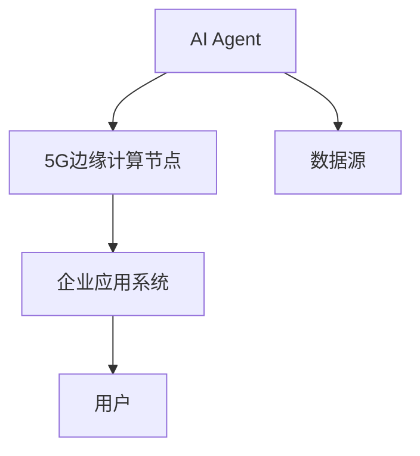
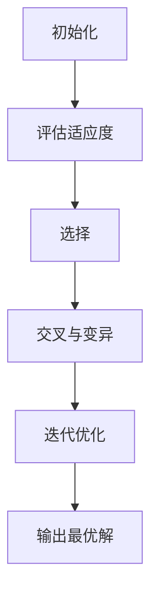
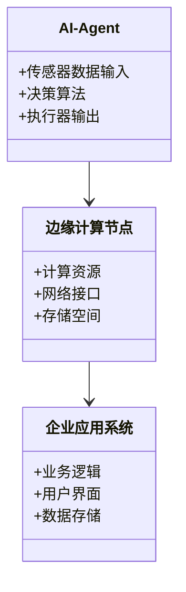
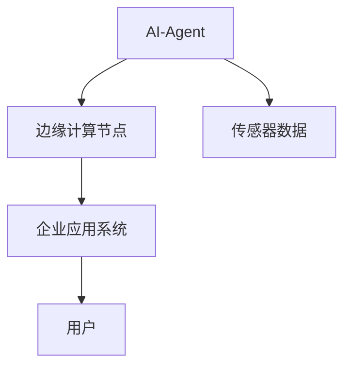
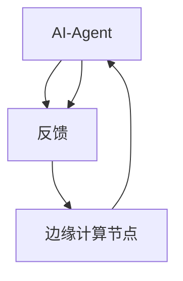

                 


# 企业AI Agent的5G边缘计算策略

## 关键词：
企业AI Agent，5G边缘计算，AI算法，边缘智能，分布式计算

## 摘要：
随着5G技术的普及和边缘计算的快速发展，企业AI Agent在5G边缘计算中的应用日益广泛。本文从企业AI Agent的基本概念出发，深入分析其与5G边缘计算的结合方式，探讨其在企业数字化转型中的应用前景。通过详细的技术分析，本文揭示了企业AI Agent的5G边缘计算策略的核心原理、算法实现和系统架构设计，并通过实际案例展示了其在企业中的具体应用。最后，本文总结了该策略的优势与挑战，并提出了相关的最佳实践建议。

---

# 第一部分: 企业AI Agent与5G边缘计算的背景与概念

# 第1章: 企业AI Agent的概述

## 1.1 AI Agent的基本概念

### 1.1.1 AI Agent的定义
AI Agent（人工智能代理）是一种能够感知环境、执行任务并做出决策的智能实体。它能够通过传感器获取信息，利用算法进行分析和推理，并通过执行器完成目标操作。

### 1.1.2 AI Agent的核心特征
- **自主性**：能够在没有外部干预的情况下自主运行。
- **反应性**：能够实时感知环境变化并做出相应反应。
- **学习能力**：能够通过数据和经验不断优化自身的决策能力。
- **分布式协作**：能够与其他AI Agent或系统进行协作。

### 1.1.3 企业级AI Agent的应用场景
- **智能制造**：用于生产过程的优化和设备监控。
- **智能客服**：提供个性化的客户支持服务。
- **供应链管理**：优化物流路径和库存管理。

## 1.2 5G边缘计算的概述

### 1.2.1 5G网络的基本特性
5G网络具有高带宽、低延迟和大规模设备连接的特点，为边缘计算提供了强大的网络支持。

### 1.2.2 边缘计算的概念与优势
边缘计算是指将计算能力从云端移到靠近数据源的边缘设备，具有低延迟、高带宽和本地化数据处理的优势。

### 1.2.3 5G边缘计算在企业中的应用潜力
- **实时数据处理**：能够在边缘快速处理数据，减少延迟。
- **本地化决策**：支持边缘设备的自主决策，降低对云端的依赖。
- **大规模连接**：能够支持大量的边缘设备同时接入。

## 1.3 AI Agent与5G边缘计算的结合

### 1.3.1 AI Agent在边缘计算中的作用
AI Agent可以在边缘设备上运行，实时感知环境并做出决策，从而实现边缘计算的智能化。

### 1.3.2 5G边缘计算为AI Agent提供的技术支撑
5G网络的低延迟和高带宽为AI Agent在边缘设备上的运行提供了良好的网络环境。

### 1.3.3 企业AI Agent的5G边缘计算策略的核心价值
通过将AI Agent部署在5G边缘计算环境中，企业可以实现数据的实时处理和智能化决策，提升业务效率和用户体验。

## 1.4 本章小结
本章介绍了企业AI Agent和5G边缘计算的基本概念，并探讨了它们的结合方式和在企业中的应用潜力。

---

# 第2章: 企业AI Agent的5G边缘计算策略背景

## 2.1 企业数字化转型的现状与挑战

### 2.1.1 数字化转型的核心需求
企业数字化转型需要实现业务流程的智能化、数据的实时处理和跨系统的协同工作。

### 2.1.2 传统企业IT架构的局限性
传统IT架构通常依赖于云端计算，存在延迟高、带宽受限和数据传输成本高等问题。

### 2.1.3 边缘计算对企业数字化转型的推动作用
边缘计算能够将计算能力下沉到边缘设备，减少数据传输的延迟和成本，支持实时决策。

## 2.2 5G技术对企业边缘计算的推动

### 2.2.1 5G网络的低延迟与高带宽优势
5G网络的低延迟和高带宽为边缘计算提供了强大的网络支持，能够满足企业对实时数据处理的需求。

### 2.2.2 边缘计算在5G时代的应用场景
- **智能制造**：支持生产设备的实时监控和优化。
- **智能交通**：实现车辆与道路设施的实时通信和协作。
- **智能安防**：支持边缘设备的实时监控和快速响应。

### 2.2.3 5G边缘计算对企业AI Agent的支撑作用
5G边缘计算为AI Agent提供了低延迟、高带宽的网络环境，支持其在边缘设备上的高效运行。

## 2.3 AI Agent在企业边缘计算中的应用前景

### 2.3.1 AI Agent在边缘计算中的典型应用案例
- **智能工厂**：AI Agent用于设备监控和生产优化。
- **智能物流**：AI Agent用于路径规划和货物追踪。
- **智能客服**：AI Agent用于实时响应客户需求。

### 2.3.2 企业AI Agent的5G边缘计算策略的必要性
随着企业对实时数据处理和智能化决策的需求不断增加，部署AI Agent的5G边缘计算策略成为企业数字化转型的重要选择。

### 2.3.3 该策略对企业竞争力的提升作用
通过部署AI Agent的5G边缘计算策略，企业可以实现业务流程的智能化和实时化，提升竞争力和市场响应速度。

## 2.4 本章小结
本章分析了企业数字化转型的现状与挑战，探讨了5G技术对企业边缘计算的推动作用，并展望了AI Agent在企业边缘计算中的应用前景。

---

# 第3章: 企业AI Agent的5G边缘计算策略的核心概念与联系

## 3.1 核心概念的原理分析

### 3.1.1 AI Agent的智能决策机制
AI Agent通过感知环境、分析数据并做出决策，实现对任务的自主执行。

### 3.1.2 5G边缘计算的分布式架构
5G边缘计算将计算能力分布在边缘设备上，形成一种分布式架构，能够支持大规模设备的接入和实时数据处理。

### 3.1.3 两者的协同工作原理
AI Agent在边缘设备上运行，利用5G网络的低延迟和高带宽优势，实现数据的实时处理和智能决策。

## 3.2 核心概念的对比分析

### 3.2.1 AI Agent与传统边缘计算的对比
| 特性       | AI Agent          | 传统边缘计算       |
|------------|--------------------|--------------------|
| 智能性     | 高                 | 低或无             |
| 决策能力   | 强                 | 依赖于预设规则       |
| 学习能力   | 有                 | 无                 |

### 3.2.2 5G网络特性对AI Agent性能的影响
5G网络的低延迟和高带宽特性显著提升了AI Agent在边缘设备上的运行效率和决策能力。

### 3.2.3 企业AI Agent的5G边缘计算策略与传统策略的差异
传统的边缘计算策略主要依赖于预设规则，而AI Agent的5G边缘计算策略则通过智能决策和学习优化，实现更高效的业务处理。

## 3.3 实体关系图（ER图）分析



## 3.4 本章小结
本章分析了企业AI Agent和5G边缘计算的核心概念及其协同工作原理，并通过对比和实体关系图展示了它们之间的联系。

---

# 第4章: 企业AI Agent的5G边缘计算策略的算法原理

## 4.1 多目标优化算法在AI Agent中的应用

### 4.1.1 多目标优化算法的定义
多目标优化算法是一种在多个目标之间寻找最优解的优化方法，常用于AI Agent的决策过程中。

### 4.1.2 多目标优化算法的数学模型
$$ \text{目标函数：} f(x) = (x_1, x_2, \dots, x_n) $$
$$ \text{约束条件：} g_i(x) \leq 0, i = 1, 2, \dots, m $$

### 4.1.3 多目标优化算法的实现步骤
1. **初始化**：设置初始参数和种群。
2. **评估适应度**：计算每个个体的适应度值。
3. **选择**：根据适应度值选择优秀个体。
4. **交叉与变异**：进行遗传操作，生成新个体。
5. **迭代优化**：重复评估、选择、交叉和变异过程，直到满足终止条件。

### 4.1.4 多目标优化算法的流程图



### 4.1.5 多目标优化算法的Python实现示例

```python
import numpy as np

def multi_objective_optimization():
    # 初始化参数
    n = 10
    pop = np.random.rand(n, 2)
    
    # 评估适应度
    fitness = np.sum(pop, axis=1)
    
    # 选择
    selected = np.argsort(fitness)[:5]
    
    # 交叉
    parent1 = pop[selected[0]]
    parent2 = pop[selected[1]]
    child = np.mean([parent1, parent2], axis=0)
    
    # 变异
    child += np.random.randn(2) * 0.1
    
    return child

# 调用函数
result = multi_objective_optimization()
print(result)
```

## 4.2 多目标优化算法在AI Agent中的具体应用

### 4.2.1 在资源分配中的应用
AI Agent可以通过多目标优化算法优化资源分配，实现资源利用效率的最大化。

### 4.2.2 在任务调度中的应用
AI Agent可以通过多目标优化算法优化任务调度，实现任务执行效率的提升。

### 4.2.3 在决策优化中的应用
AI Agent可以通过多目标优化算法优化决策过程，实现决策的最优性。

## 4.3 本章小结
本章详细介绍了多目标优化算法在AI Agent中的应用，包括其数学模型、实现步骤和具体应用案例。

---

# 第5章: 企业AI Agent的5G边缘计算策略的系统分析与架构设计

## 5.1 问题场景介绍
企业需要通过AI Agent在5G边缘计算环境中实现数据的实时处理和智能化决策。

## 5.2 系统功能设计

### 5.2.1 领域模型设计



### 5.2.2 系统架构设计



### 5.2.3 系统交互设计



## 5.3 系统架构设计

### 5.3.1 系统架构图


### 5.3.2 系统接口设计
- **输入接口**：接收传感器数据和用户请求。
- **输出接口**：输出决策结果和执行指令。
- **通信接口**：与边缘计算节点和企业应用系统进行数据交互。

## 5.4 系统交互设计

### 5.4.1 系统交互流程图


### 5.4.2 系统交互过程
1. 用户发起请求，企业应用系统接收请求。
2. 企业应用系统将请求转发到边缘计算节点。
3. 边缘计算节点调用AI-Agent进行决策。
4. AI-Agent返回决策结果，边缘计算节点将结果反馈给企业应用系统。
5. 企业应用系统将结果反馈给用户。

## 5.5 本章小结
本章通过系统分析和架构设计，详细描述了企业AI Agent的5G边缘计算策略的实现方案，包括系统功能设计、架构设计和交互设计。

---

# 第6章: 企业AI Agent的5G边缘计算策略的项目实战

## 6.1 环境安装

### 6.1.1 系统环境要求
- 操作系统：Linux或Windows
- 5G网络环境：支持5G网络的设备
- 边缘计算框架：如Kubernetes、Docker等

### 6.1.2 安装依赖包
```bash
pip install numpy pandas scikit-learn
```

## 6.2 系统核心实现源代码

### 6.2.1 AI-Agent的核心代码

```python
class AI_Agent:
    def __init__(self):
        self.sensors = []
        self actuators = []
        self.decision_algorithm = None

    def感知环境(self):
        # 获取传感器数据
        data = [sensor.read() for sensor in self.sensors]
        return data

    def 决策(self, data):
        # 调用决策算法
        result = self.decision_algorithm.optimize(data)
        return result

    def 执行(self, result):
        # 调用执行器执行操作
        for actuator in self.actuators:
            actuator.execute(result)
```

### 6.2.2 边缘计算节点的代码

```python
class Edge_Node:
    def __init__(self):
        self agents = []
        self.compute_resources = []

    def 调用AI-Agent(self, data):
        # 调用AI-Agent进行决策
        for agent in self.agents:
            result = agent感知环境(data)
            self.compute_resources.update(result)
        return self.compute_resources

    def 返回结果(self, result):
        # 返回决策结果
        return result
```

### 6.2.3 企业应用系统的代码

```python
class Enterprise_App:
    def __init__(self):
        self.edge_nodes = []
        self.users = []

    def 接收请求(self, request):
        # 接收用户请求
        for node in self.edge_nodes:
            response = node.调用AI-Agent(request)
            self.users反馈(response)

    def 反馈(self, response):
        # 返回反馈给用户
        pass
```

## 6.3 代码应用解读与分析

### 6.3.1 AI-Agent的核心代码解读
- **感知环境**：通过传感器获取环境数据。
- **决策**：调用决策算法对数据进行优化，生成决策结果。
- **执行**：通过执行器完成决策结果的执行。

### 6.3.2 边缘计算节点的代码解读
- **调用AI-Agent**：将数据传递给AI-Agent，获取决策结果。
- **返回结果**：将决策结果返回给企业应用系统。

### 6.3.3 企业应用系统的代码解读
- **接收请求**：接收用户的请求，并将其传递给边缘计算节点。
- **反馈**：将边缘计算节点的决策结果反馈给用户。

## 6.4 实际案例分析和详细讲解剖析
假设某企业需要优化其物流系统的路径规划，可以通过部署AI-Agent的5G边缘计算策略实现实时路径优化和货物追踪。

## 6.5 本章小结
本章通过实际案例分析和代码实现，详细展示了企业AI Agent的5G边缘计算策略在项目中的具体应用。

---

# 第7章: 企业AI Agent的5G边缘计算策略的总结与展望

## 7.1 最佳实践 Tips
- **数据隐私**：在边缘计算环境中，需要特别注意数据的隐私和安全。
- **算法优化**：通过不断优化算法，提升AI Agent的决策效率和准确性。
- **系统扩展性**：设计系统时，需要考虑其扩展性和可维护性。

## 7.2 小结
本文从企业AI Agent的基本概念出发，深入分析了其与5G边缘计算的结合方式，并探讨了其在企业数字化转型中的应用前景。通过详细的技术分析，本文揭示了企业AI Agent的5G边缘计算策略的核心原理、算法实现和系统架构设计，并通过实际案例展示了其在企业中的具体应用。

## 7.3 注意事项
- 部署AI Agent的5G边缘计算策略时，需要充分考虑网络环境、数据安全和系统兼容性等问题。
- 在实际应用中，需要根据具体需求调整算法和系统架构设计。

## 7.4 拓展阅读
- 《边缘计算：原理与实践》
- 《人工智能代理：算法与应用》
- 《5G网络技术与应用》

---

# 结语
企业AI Agent的5G边缘计算策略为企业数字化转型提供了新的思路和解决方案。通过本文的详细分析和实际案例，读者可以更好地理解该策略的核心思想和技术实现。未来，随着5G技术和AI算法的不断进步，企业AI Agent的5G边缘计算策略将在更多领域得到广泛应用。

