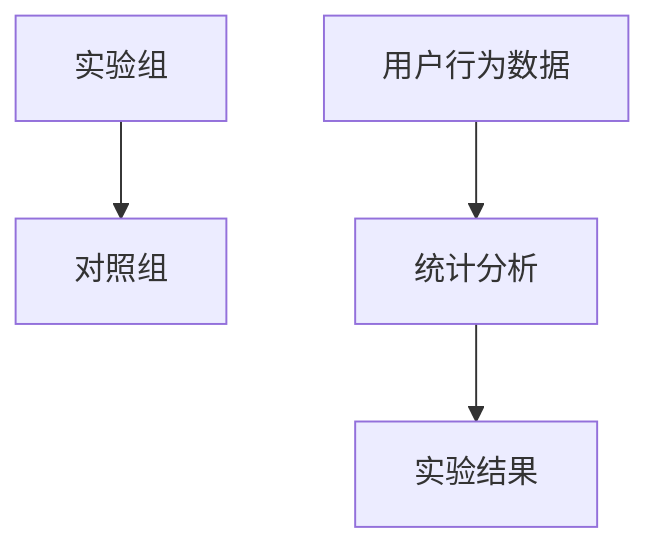
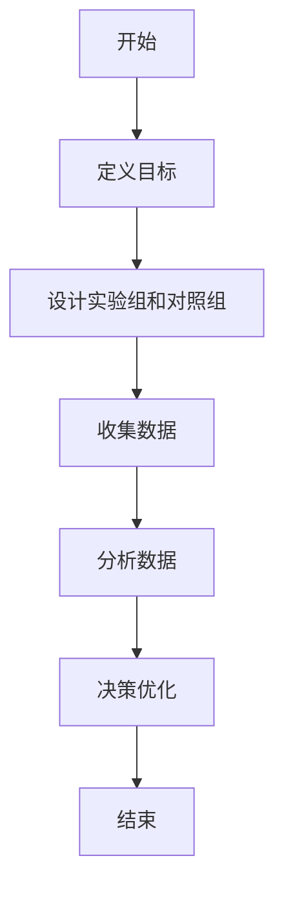
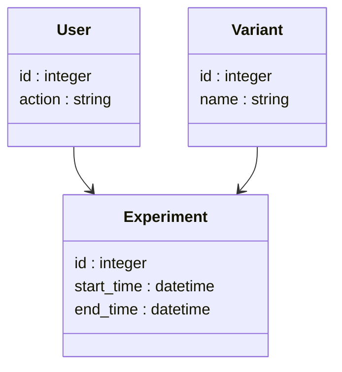
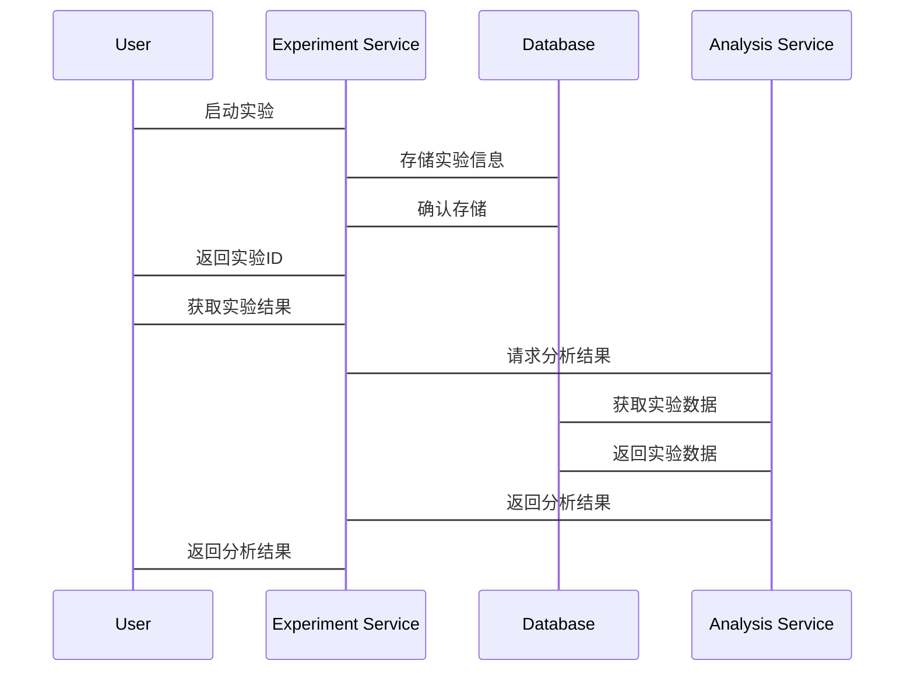

                 


# 企业AI Agent的A/B测试功能：持续优化用户体验

> 关键词：企业AI Agent，A/B测试，用户体验优化，算法原理，系统架构，项目实战

> 摘要：本文详细探讨了企业AI Agent中A/B测试的功能及其在优化用户体验中的作用。通过分析A/B测试的核心原理、算法实现、系统架构设计以及实际项目案例，本文为读者提供了从理论到实践的全面指导，帮助企业在AI Agent的开发和优化过程中，通过持续的A/B测试来提升用户体验。

---

## 第1章：企业AI Agent与A/B测试概述

### 1.1 问题背景

#### 1.1.1 企业AI Agent的定义与特点

企业AI Agent是一种智能代理系统，用于协助企业自动化处理任务、优化流程并提升效率。其特点包括：

- **智能化**：通过机器学习和自然语言处理技术，实现智能决策和自动化操作。
- **定制化**：根据企业的具体需求进行定制化配置。
- **实时性**：能够实时响应用户需求并提供解决方案。

#### 1.1.2 A/B测试在企业中的应用背景

A/B测试是一种常用的实验方法，通过将用户分组，分别使用不同的版本（A组和B组）进行测试，以评估不同策略对用户行为的影响。在企业中，A/B测试广泛应用于产品优化、营销策略测试等领域。

#### 1.1.3 为什么需要A/B测试优化用户体验

用户体验是企业成功的关键因素之一。通过A/B测试，企业可以：

- **数据驱动决策**：基于用户行为数据，选择最优策略。
- **降低风险**：通过小规模测试，避免大规模实施可能带来的风险。
- **持续优化**：通过不断测试和优化，提升用户体验，进而提升用户满意度和留存率。

### 1.2 问题描述

#### 1.2.1 用户体验优化的核心问题

用户体验优化的核心问题在于如何通过实验找到最优的设计和策略，以提高用户满意度和产品使用效率。

#### 1.2.2 A/B测试在用户体验优化中的作用

A/B测试通过对比不同版本的产品或功能，帮助企业找到最优的用户体验设计方案。

#### 1.2.3 企业AI Agent的A/B测试面临的挑战

- **实验设计复杂性**：AI Agent的复杂性使得实验设计更具挑战性。
- **数据量要求高**：需要大量数据支持统计显著性。
- **实时性要求**：要求测试结果能够实时反馈并指导决策。

### 1.3 问题解决

#### 1.3.1 A/B测试的基本原理

A/B测试的基本原理是将用户随机分配到不同的实验组中，通过比较各组的用户行为数据，找出最优策略。

#### 1.3.2 企业AI Agent中A/B测试的应用场景

- **功能优化**：测试不同功能设计对用户行为的影响。
- **交互优化**：测试不同交互方式对用户体验的影响。
- **策略优化**：测试不同策略对用户决策的影响。

#### 1.3.3 A/B测试如何帮助优化用户体验

通过A/B测试，企业可以基于数据驱动的方式，不断优化产品设计和交互流程，从而提升用户体验。

### 1.4 边界与外延

#### 1.4.1 A/B测试的适用范围

A/B测试适用于所有需要通过实验方法优化用户体验的场景，但需要确保实验组和对照组的用户行为数据能够被准确测量。

#### 1.4.2 与传统测试方法的区别

传统测试方法通常基于主观判断，而A/B测试基于数据驱动的决策。

#### 1.4.3 企业AI Agent的A/B测试与其他优化方法的关系

A/B测试可以与用户反馈、数据分析等其他优化方法结合使用，形成更加完善的优化体系。

### 1.5 核心概念结构与组成

#### 1.5.1 核心概念的组成要素

- **实验组**：接受新策略或功能的用户组。
- **对照组**：使用现有策略或功能的用户组。
- **用户行为数据**：用于评估实验效果的数据指标。
- **统计方法**：用于分析实验结果的方法。

#### 1.5.2 概念结构图



#### 1.5.3 核心要素的详细说明

- **实验组**：用于测试新策略或功能的用户组。
- **对照组**：用于比较的基准组，通常使用现有策略或功能。
- **用户行为数据**：包括点击率、转化率、停留时间等指标。
- **统计分析**：使用统计方法（如t检验）评估实验结果的显著性。

---

## 第2章：A/B测试的核心原理与应用

### 2.1 核心概念原理

#### 2.1.1 A/B测试的基本原理

A/B测试通过随机分配用户到不同的组，比较各组的用户行为数据，以确定哪种策略更优。

#### 2.1.2 A/B测试的实施步骤

1. **定义目标**：明确实验的目标和关键指标。
2. **设计实验组和对照组**：确定实验组和对照组的分配方式。
3. **收集数据**：记录各组的用户行为数据。
4. **分析数据**：使用统计方法评估实验结果的显著性。
5. **决策优化**：根据实验结果选择最优策略。

#### 2.1.3 A/B测试的数学模型

A/B测试通常使用t检验来评估实验结果的显著性。假设实验组和对照组的用户行为数据服从正态分布，可以通过以下公式计算t值：

$$
t = \frac{\bar{x}_1 - \bar{x}_2}{\sqrt{\frac{s_1^2}{n_1} + \frac{s_2^2}{n_2}}}
$$

其中，$\bar{x}_1$和$\bar{x}_2$分别为实验组和对照组的均值，$s_1^2$和$s_2^2$分别为两组的方差，$n_1$和$n_2$为样本量。

### 2.2 核心概念对比

#### 2.2.1 A/B测试与传统测试的对比分析

| 对比维度      | A/B测试                     | 传统测试                   |
|---------------|------------------------------|-----------------------------|
| 数据驱动      | 是                          | 否                         |
| 实验规模      | 小规模                     | 大规模                     |
| 结果评估      | 基于统计显著性              | 基于主观判断              |

#### 2.2.2 不同A/B测试方法的优缺点对比

| 方法           | 优点                           | 缺点                           |
|----------------|--------------------------------|--------------------------------|
| 稳定性测试     | 简单易行                     | 无法覆盖所有场景             |
| 假设驱动测试   | 针对性强                     | 需要明确假设                 |
| 多变量测试     | 可同时测试多个变量           | 实验复杂性高                 |

#### 2.2.3 A/B测试与机器学习的结合

A/B测试可以通过机器学习算法（如强化学习）来优化实验设计和策略选择。

### 2.3 实体关系图

```mermaid
erDiagram
    user [用户] {
        id : integer
        action : string
    }
    variant [版本] {
        id : integer
        name : string
    }
    experiment [实验] {
        id : integer
        start_time : datetime
        end_time : datetime
    }
    user ~{n} experiment
    variant ~{n} experiment
```

---

## 第3章：A/B测试的算法与数学模型

### 3.1 算法原理

#### 3.1.1 A/B测试的基本算法

A/B测试的基本算法包括：

1. **用户分配**：将用户随机分配到实验组或对照组。
2. **数据收集**：记录各组的用户行为数据。
3. **数据分析**：使用统计方法评估实验结果的显著性。

#### 3.1.2 基于统计学的A/B测试方法

基于统计学的A/B测试方法通常使用t检验或卡方检验来评估实验结果的显著性。

#### 3.1.3 基于机器学习的A/B测试算法

基于机器学习的A/B测试算法可以使用贝叶斯方法来估计实验结果的概率分布。

### 3.2 算法流程图



### 3.3 算法实现

#### 3.3.1 Python代码实现A/B测试

```python
import numpy as np
from scipy import stats

def ab_test(x1, x2):
    t, p = stats.ttest_ind(x1, x2)
    return t, p

# 示例数据
x1 = np.random.normal(0, 1, 100)
x2 = np.random.normal(0.5, 1, 100)

t, p = ab_test(x1, x2)
print(f"t值：{t}, p值：{p}")
```

#### 3.3.2 代码示例与解释

上述代码实现了基于t检验的A/B测试。函数`ab_test`接收两组数据，返回t值和p值。示例数据生成两组正态分布数据，分别代表实验组和对照组的用户行为数据。

---

## 第4章：系统分析与架构设计

### 4.1 问题场景介绍

企业AI Agent的A/B测试需要考虑用户行为数据的实时收集与分析，以及实验结果的实时反馈。

### 4.2 系统功能设计

#### 4.2.1 领域模型类图



### 4.3 系统架构设计

#### 4.3.1 系统架构图


### 4.4 系统接口设计

- **API接口**：
  - `/api/experiment/start`：启动实验。
  - `/api/experiment/end`：结束实验。
  - `/api/experiment/result`：获取实验结果。

### 4.5 系统交互设计

#### 4.5.1 系统交互序列图



---

## 第5章：项目实战

### 5.1 环境安装

- **Python**：安装Python 3.8及以上版本。
- **库依赖**：安装`numpy`、`scipy`、`mermaid`等库。

#### 5.1.1 安装依赖

```bash
pip install numpy scipy mermaid
```

### 5.2 系统核心实现

#### 5.2.1 实验启动与结束

```python
import time

def start_experiment(experiment_id):
    print(f"实验 {experiment_id} 已启动")
    return experiment_id

def end_experiment(experiment_id):
    print(f"实验 {experiment_id} 已结束")
    return experiment_id

# 示例
start_experiment(1)
end_experiment(1)
```

#### 5.2.2 数据分析与结果展示

```python
import numpy as np
from scipy import stats

def analyze_experiment(x1, x2):
    t, p = stats.ttest_ind(x1, x2)
    print(f"t值：{t}, p值：{p}")
    return t, p

# 示例数据
x1 = np.random.normal(0, 1, 100)
x2 = np.random.normal(0.5, 1, 100)

analyze_experiment(x1, x2)
```

### 5.3 案例分析与详细解读

#### 5.3.1 案例分析

假设我们测试两种不同的用户界面设计对用户点击率的影响。实验组用户点击率为15%，对照组用户点击率为12%。通过t检验，我们发现实验组的点击率显著高于对照组，因此选择实验组的设计。

#### 5.3.2 详细解读

- **实验设计**：随机分配用户到实验组和对照组。
- **数据收集**：记录各组用户的点击行为。
- **数据分析**：使用t检验评估实验结果的显著性。
- **结果解读**：实验组的用户点击率显著高于对照组，因此选择实验组的设计。

### 5.4 项目小结

通过实际案例，我们展示了如何在企业AI Agent中实施A/B测试，以优化用户体验。通过数据分析和统计显著性检验，我们可以基于数据驱动的方式选择最优策略。

---

## 第6章：最佳实践、小结、注意事项与拓展阅读

### 6.1 最佳实践

- **小规模测试**：在大规模实施前，先进行小规模测试以降低风险。
- **数据质量**：确保数据的准确性和完整性。
- **实验设计**：合理设计实验组和对照组，确保实验结果的有效性。

### 6.2 小结

本文详细探讨了企业AI Agent中A/B测试的功能及其在优化用户体验中的作用。通过分析A/B测试的核心原理、算法实现、系统架构设计以及实际项目案例，本文为读者提供了从理论到实践的全面指导。

### 6.3 注意事项

- **数据隐私**：在进行A/B测试时，需注意用户数据的隐私保护。
- **实验干扰**：避免实验组和对照组之间的干扰。
- **结果解释**：正确解释实验结果，避免误判。

### 6.4 拓展阅读

- **《Data-Driven Testing: A/B Testing》**：深入探讨A/B测试的理论与实践。
- **《机器学习与A/B测试》**：结合机器学习与A/B测试的方法与案例。
- **《系统架构设计：A/B测试的实现》**：详细讲解A/B测试的系统架构设计。

---

## 附录

### 附录A：工具安装指南

```bash
pip install numpy scipy mermaid
```

### 附录B：常用术语表

- **A/B测试**：通过对比不同版本的产品或功能，评估用户行为差异的实验方法。
- **统计显著性**：实验结果的差异在统计学上具有显著性的程度。
- **用户行为数据**：用户在使用产品过程中的各种行为记录，如点击、浏览等。

### 附录C：参考文献

1. 数据驱动的决策：A/B测试的理论与实践.某某出版社，2023.
2. 机器学习与A/B测试的结合.某某期刊，2022.

---

以上是《企业AI Agent的A/B测试功能：持续优化用户体验》的技术博客文章的完整内容，涵盖了从理论到实践的各个方面，旨在为企业AI Agent的开发和优化提供有价值的指导。

