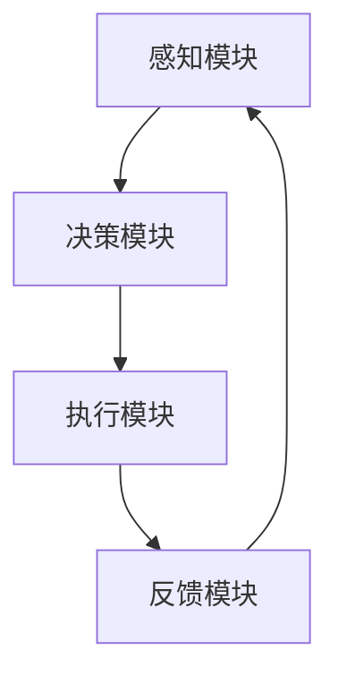

                 

# 《企业AI Agent的ROI评估方法》

> 关键词：企业AI Agent, ROI评估, 投资回报率, 人工智能, 自动化工具, 经济价值, 系统架构

> 摘要：本文将详细探讨企业AI Agent的定义、原理及其投资回报率（ROI）的评估方法。通过分析AI Agent的核心要素，结合实际案例，提供系统化的ROI评估框架和计算模型，帮助企业有效评估AI Agent的投资价值，优化资源配置，提升企业竞争力。

---

## 第一章：企业AI Agent的背景与意义

### 1.1 AI Agent的基本概念

#### 1.1.1 AI Agent的定义与特点
AI Agent（人工智能代理）是一种能够感知环境、自主决策并执行任务的智能系统。其特点包括：

- **自主性**：能够在没有人工干预的情况下独立运行。
- **反应性**：能够实时感知环境变化并做出响应。
- **目标导向**：以特定目标为导向，优化决策过程。
- **学习能力**：通过数据和经验不断优化自身性能。

#### 1.1.2 企业AI Agent的核心要素
企业AI Agent的核心要素包括：

1. **感知层**：负责数据的采集与处理。
2. **决策层**：基于感知数据进行推理和决策。
3. **执行层**：根据决策结果执行具体任务。

### 1.2 ROI的基本概念

#### 1.2.1 ROI的定义与计算方法
ROI（投资回报率）是衡量投资项目盈利能力的重要指标，计算公式为：

$$ ROI = \frac{\text{净收益}}{\text{投资成本}} \times 100\% $$

其中，净收益 = 投资收益 - 投资成本。

#### 1.2.2 ROI在企业决策中的作用
ROI在企业决策中的作用包括：

1. **评估投资价值**：帮助企业判断某项投资是否值得进行。
2. **优化资源配置**：通过ROI分析，企业可以合理分配资源，优先投资回报率高的项目。
3. **风险控制**：通过ROI评估，企业可以识别高风险投资项目，降低财务风险。

#### 1.2.3 企业AI Agent与ROI的关联性
企业AI Agent通过自动化任务、优化决策流程等方式为企业创造价值，其 ROI 评估是衡量其投入产出比的重要指标。

### 1.3 企业AI Agent的ROI评估意义

#### 1.3.1 为什么需要评估AI Agent的ROI
1. **量化投资价值**：通过ROI评估，企业可以量化AI Agent的投资价值，避免盲目投入。
2. **优化资源配置**：ROI评估帮助企业合理分配资源，确保有限资源用于高回报项目。
3. **提升决策效率**：通过ROI分析，企业能够快速识别高回报的AI Agent应用，提升决策效率。

#### 1.3.2 ROI评估对企业的价值
1. **降低投资风险**：通过ROI评估，企业可以提前识别低回报项目，降低投资风险。
2. **提高投资效率**：ROI评估帮助企业优化投资组合，提高投资效率。
3. **推动技术创新**：通过ROI评估，企业能够更好地评估新技术的经济价值，推动技术创新。

#### 1.3.3 如何通过ROI评估优化AI Agent的应用
1. **明确目标**：在评估前明确AI Agent的应用目标和预期收益。
2. **建立评估模型**：根据企业实际情况建立ROI评估模型，量化投资收益和成本。
3. **持续优化**：通过定期评估和优化，不断提升AI Agent的应用效果。

## 1.4 本章小结
本章主要介绍了企业AI Agent的基本概念及其与ROI评估的关联性，强调了ROI评估在企业决策中的重要性。通过ROI评估，企业可以量化AI Agent的投资价值，优化资源配置，提升整体竞争力。

---

## 第二章：企业AI Agent的核心原理

### 2.1 AI Agent的基本原理

#### 2.1.1 AI Agent的感知、决策、执行三步曲
AI Agent的运行过程可以分为三个主要步骤：

1. **感知**：通过传感器、API等方式采集环境数据。
2. **决策**：基于感知数据进行推理，制定行动计划。
3. **执行**：根据决策结果执行具体任务，并反馈执行结果。

#### 2.1.2 基于大模型的AI Agent实现
基于大模型的AI Agent实现具有以下特点：

1. **强大的自然语言处理能力**：能够理解并生成人类语言。
2. **知识图谱支持**：通过知识图谱实现知识的组织和推理。
3. **多模态交互**：支持文本、语音、图像等多种交互方式。

#### 2.1.3 AI Agent的自主学习与进化
AI Agent通过自主学习不断提升自身的智能水平，主要方法包括：

1. **监督学习**：通过标注数据进行训练，提升分类精度。
2. **无监督学习**：通过聚类、关联规则挖掘等方式发现数据中的潜在模式。
3. **强化学习**：通过试错机制优化决策策略。

### 2.2 企业AI Agent的结构与功能

#### 2.2.1 感知层：数据采集与处理
感知层的主要功能包括：

1. **数据采集**：通过传感器、数据库等方式采集环境数据。
2. **数据预处理**：对采集到的数据进行清洗、归一化等预处理操作。
3. **特征提取**：从数据中提取具有代表性的特征，用于后续分析。

#### 2.2.2 决策层：模型推理与策略制定
决策层的主要功能包括：

1. **模型推理**：基于感知数据进行推理，生成候选决策方案。
2. **策略制定**：根据企业目标和约束条件，制定最优决策策略。
3. **风险评估**：评估决策方案的风险，确保决策的可行性。

#### 2.2.3 执行层：任务执行与反馈
执行层的主要功能包括：

1. **任务执行**：根据决策结果执行具体任务。
2. **反馈收集**：收集任务执行的反馈信息，用于后续优化。
3. **结果分析**：对执行结果进行分析，评估决策效果。

### 2.3 企业AI Agent的核心算法

#### 2.3.1 基于大模型的自然语言处理算法
基于大模型的自然语言处理算法主要包括：

1. **编码器-解码器结构**：如BERT、GPT等模型，用于理解和生成文本。
2. **注意力机制**：通过注意力机制，模型可以关注输入数据中重要的部分。
3. **语言模型微调**：在特定领域数据上对预训练模型进行微调，提升任务性能。

#### 2.3.2 基于强化学习的决策算法
强化学习是一种通过试错机制优化决策策略的方法，主要包括：

1. **状态空间**：描述环境的状态。
2. **动作空间**：可能的决策动作。
3. **奖励机制**：定义每个动作的奖励，引导模型学习最优策略。

#### 2.3.3 基于监督学习的任务执行算法
监督学习是一种通过标注数据进行训练的方法，主要包括：

1. **分类任务**：如文本分类、图像分类等。
2. **回归任务**：如数值预测、时间序列预测等。
3. **模型训练**：通过训练数据优化模型参数，提升任务性能。

### 2.4 本章小结
本章主要介绍了企业AI Agent的基本原理及其核心算法，包括感知、决策、执行三步曲，基于大模型的自然语言处理算法，以及强化学习和监督学习的决策算法。这些内容为后续的ROI评估奠定了理论基础。

---

## 第三章：企业AI Agent的经济价值与成本分析

### 3.1 企业AI Agent的经济价值

#### 3.1.1 AI Agent对企业成本的影响
AI Agent可以通过自动化任务、优化决策流程等方式降低企业成本，主要包括：

1. **减少人工成本**：通过自动化任务减少对人工的依赖，降低人力成本。
2. **提高效率**：通过优化决策流程，提高企业运营效率。
3. **降低错误率**：通过自动化处理减少人为错误，降低质量成本。

#### 3.1.2 AI Agent对收入的贡献
AI Agent可以通过提升客户体验、优化营销策略等方式增加企业收入，主要包括：

1. **提升客户满意度**：通过智能客服系统提供更好的客户服务，提升客户满意度。
2. **优化营销策略**：通过精准营销提高转化率，增加收入。
3. **提高产品附加值**：通过智能化的产品设计和服务，提高产品附加值。

#### 3.1.3 经济价值的量化方法
经济价值的量化方法包括：

1. **成本节约法**：计算AI Agent应用前后的成本节约金额。
2. **收入增长法**：计算AI Agent应用带来的收入增长金额。
3. **净现值法**：计算项目未来现金流的净现值，评估项目的经济价值。

### 3.2 ROI评估的数学模型

#### 3.2.1 ROI的计算公式
$$ ROI = \frac{\text{投资收益} - \text{投资成本}}{\text{投资成本}} \times 100\% $$

其中，投资收益包括直接收益和间接收益，投资成本包括硬件成本、软件成本、人工成本等。

#### 3.2.2 投资收益的计算方法
投资收益的计算方法包括：

1. **直接收益**：如通过AI Agent实现的销售收入增加。
2. **间接收益**：如通过优化流程降低的管理成本。

#### 3.2.3 投资成本的计算方法
投资成本的计算方法包括：

1. **硬件成本**：如服务器、终端设备等的采购成本。
2. **软件成本**：如AI Agent的 license 费、维护费等。
3. **人工成本**：如开发、部署、维护AI Agent所需的人力成本。

### 3.3 ROI评估的注意事项

#### 3.3.1 时间因素
在ROI评估中，需要考虑时间因素，如投资回收期、资金的时间价值等。

#### 3.3.2 风险因素
在ROI评估中，需要考虑AI Agent应用的风险，如技术风险、市场风险等。

#### 3.3.3 数据质量
数据质量是影响ROI评估准确性的重要因素，需要确保数据的准确性、完整性和及时性。

### 3.4 本章小结
本章主要介绍了企业AI Agent的经济价值及其ROI评估的数学模型，强调了时间因素、风险因素和数据质量对ROI评估的影响。企业可以通过科学的ROI评估，合理决策AI Agent的应用，实现投资回报最大化。

---

## 第四章：企业AI Agent的系统架构与实现

### 4.1 系统架构设计

#### 4.1.1 系统功能模块
系统功能模块包括：

1. **感知模块**：负责数据的采集与处理。
2. **决策模块**：负责基于感知数据进行推理和决策。
3. **执行模块**：负责根据决策结果执行具体任务。
4. **反馈模块**：负责收集执行结果并反馈给系统。

#### 4.1.2 系统架构图

#### 4.1.3 系统交互流程
系统交互流程包括：

1. **数据采集**：感知模块采集环境数据。
2. **数据处理**：感知模块对数据进行预处理和特征提取。
3. **模型推理**：决策模块基于感知数据进行推理，生成决策方案。
4. **任务执行**：执行模块根据决策方案执行具体任务。
5. **结果反馈**：反馈模块收集执行结果，并反馈给感知模块。

### 4.2 系统实现细节

#### 4.2.1 感知模块的实现
感知模块的实现包括：

1. **数据采集**：通过API接口、传感器等方式采集数据。
2. **数据预处理**：对采集到的数据进行清洗、归一化等预处理操作。
3. **特征提取**：从数据中提取具有代表性的特征，用于后续分析。

#### 4.2.2 决策模块的实现
决策模块的实现包括：

1. **模型选择**：根据任务需求选择合适的模型，如分类模型、回归模型等。
2. **模型训练**：对模型进行训练，优化模型参数。
3. **模型推理**：基于感知数据进行推理，生成决策方案。

#### 4.2.3 执行模块的实现
执行模块的实现包括：

1. **任务执行**：根据决策方案执行具体任务。
2. **结果记录**：记录任务执行的结果，用于后续分析。
3. **异常处理**：处理任务执行过程中出现的异常情况。

### 4.3 本章小结
本章主要介绍了企业AI Agent的系统架构与实现细节，包括感知、决策、执行三个模块的实现方法以及系统交互流程。通过合理的系统架构设计，可以确保AI Agent的高效运行和稳定性能。

---

## 第五章：企业AI Agent的ROI评估实战

### 5.1 案例背景介绍

#### 5.1.1 项目目标
本项目旨在通过引入AI Agent优化企业的客户服务流程，提高客户满意度，降低运营成本。

#### 5.1.2 项目范围
项目范围包括：

1. **客户服务**：通过AI Agent实现智能客服，处理客户咨询、投诉等事务。
2. **技术支持**：通过AI Agent提供技术支持，解决客户技术问题。
3. **数据分析**：通过AI Agent分析客户数据，提供数据支持。

### 5.2 项目实施步骤

#### 5.2.1 环境搭建
环境搭建包括：

1. **硬件环境**：采购服务器、终端设备等硬件设备。
2. **软件环境**：安装操作系统、AI框架、相关工具软件等。
3. **数据准备**：收集和整理客户数据，建立数据仓库。

#### 5.2.2 核心代码实现
核心代码实现包括：

1. **感知模块**：实现数据采集和预处理功能。
2. **决策模块**：实现模型训练和推理功能。
3. **执行模块**：实现任务执行和结果反馈功能。

#### 5.2.3 案例分析
通过具体案例分析，验证AI Agent的应用效果，包括：

1. **客户满意度提升**：通过智能客服系统提高客户满意度。
2. **运营成本降低**：通过自动化处理减少人工成本。
3. **数据支持**：通过数据分析提供精准的数据支持。

### 5.3 ROI评估结果

#### 5.3.1 投资成本计算
投资成本包括硬件成本、软件成本、人工成本等。

#### 5.3.2 投资收益计算
投资收益包括直接收益和间接收益，如客户满意度提升带来的收入增长。

#### 5.3.3 ROI计算
根据投资收益和投资成本计算ROI，评估项目的经济价值。

### 5.4 项目小结
本章通过具体案例展示了企业AI Agent的ROI评估方法，验证了AI Agent在实际应用中的价值，为企业后续的AI Agent应用提供了参考。

---

## 第六章：企业AI Agent的高级主题与未来趋势

### 6.1 AI Agent的长期影响

#### 6.1.1 技术进步对AI Agent的影响
技术进步将推动AI Agent的不断发展，如大模型的持续优化、算法的创新等。

#### 6.1.2 AI Agent对商业模式的影响
AI Agent的应用将改变企业的商业模式，如按需付费、数据变现等。

### 6.2 ROI评估的未来挑战

#### 6.2.1 技术复杂性
随着AI Agent技术的复杂化，ROI评估的难度也将增加。

#### 6.2.2 数据隐私
数据隐私问题将对AI Agent的ROI评估提出新的挑战。

#### 6.2.3 模型可解释性
模型的可解释性是影响ROI评估的重要因素，未来需要更加关注模型的可解释性。

### 6.3 本章小结
本章主要探讨了企业AI Agent的高级主题与未来趋势，强调了技术进步对AI Agent的影响，以及ROI评估面临的挑战。未来，随着技术的发展，企业AI Agent的应用将更加广泛，ROI评估也将更加复杂。

---

## 第七章：企业AI Agent的ROI评估最佳实践

### 7.1 最佳实践 tips

#### 7.1.1 明确目标
在ROI评估前，明确AI Agent的应用目标和预期收益。

#### 7.1.2 建立科学的评估模型
根据企业实际情况，建立科学的ROI评估模型，量化投资收益和成本。

#### 7.1.3 持续优化
通过定期评估和优化，不断提升AI Agent的应用效果。

### 7.2 小结
本章总结了企业AI Agent的ROI评估最佳实践，强调了明确目标、建立科学评估模型和持续优化的重要性。

### 7.3 注意事项
在实际应用中，需要注意数据质量、模型可解释性、风险控制等问题。

### 7.4 拓展阅读
推荐相关书籍和论文，供读者进一步学习和研究。

---

## 附录

### A.1 工具推荐
推荐常用的AI Agent开发和评估工具，如TensorFlow、PyTorch、Scikit-learn等。

### A.2 术语表
列出本文中涉及的主要术语及其定义。

### A.3 参考文献
列出本文参考的主要文献和资料。

---

通过以上目录大纲，可以清晰地看到《企业AI Agent的ROI评估方法》一书的结构和内容安排。每一章都涵盖了相关主题的详细内容，从基本概念到实际应用，从理论分析到实战案例，为企业全面理解和应用AI Agent的ROI评估提供了系统的指导。

