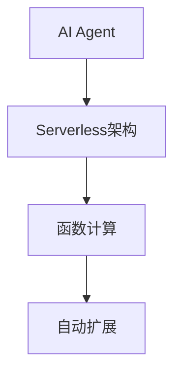
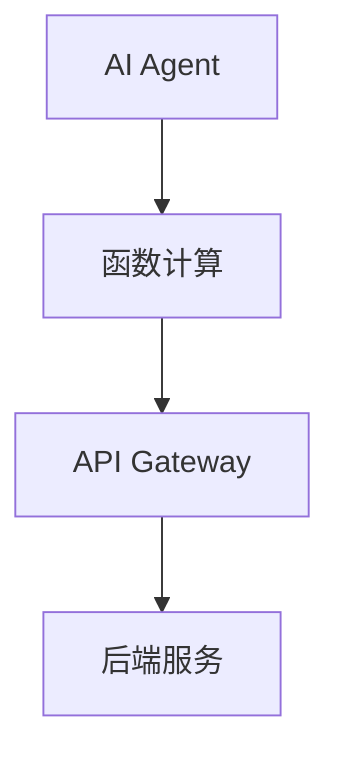
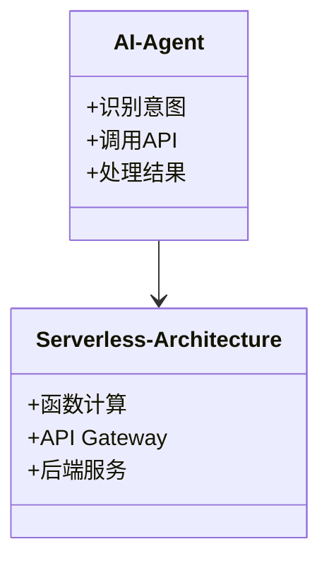
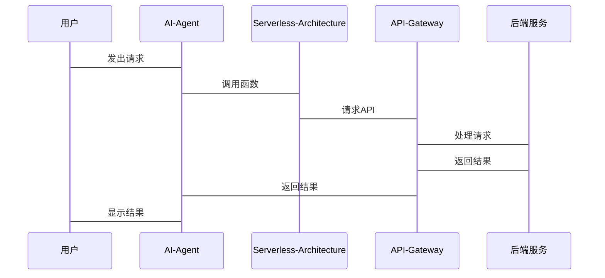

                 


# 企业AI Agent的Serverless架构设计

> 关键词：企业AI Agent, Serverless架构, 无服务器计算, 函数计算, 事件驱动

> 摘要：本文深入探讨了企业AI Agent在Serverless架构下的设计与实现。通过分析Serverless架构的核心原理，结合企业AI Agent的系统需求，提出了一种基于Serverless的解决方案，并通过实际案例展示了其在资源利用率、扩展性以及灵活性方面的优势。

---

## 第一章: 企业AI Agent的Serverless架构概述

### 1.1 问题背景与问题描述

#### 1.1.1 传统企业AI Agent架构的痛点
传统的企业AI Agent架构通常依赖于重型服务器和固定资源分配，存在以下问题：
- **资源浪费**：在低负载情况下，服务器资源利用率低。
- **扩展性差**：在高负载情况下，难以快速扩展资源。
- **运维复杂**：需要手动管理服务器的启动、停止和扩展。

#### 1.1.2 Serverless架构的兴起与优势
Serverless架构作为一种新兴的计算模型，通过将计算资源抽象为函数，提供了以下优势：
- **按需扩展**：自动根据请求量扩展计算资源。
- **无运维负担**：云服务提供商负责资源管理。
- **成本优化**：按使用量付费，减少资源浪费。

#### 1.1.3 企业AI Agent与Serverless架构的结合
将企业AI Agent部署在Serverless架构上，可以充分发挥Serverless的优势，解决传统架构的痛点。

### 1.2 问题解决与边界定义

#### 1.2.1 问题解决的核心目标
通过Serverless架构实现企业AI Agent的：
- **动态扩展**：根据请求量自动调整资源。
- **成本优化**：按需使用计算资源，降低运维成本。
- **简化运维**：无需管理底层服务器。

#### 1.2.2 Serverless架构的边界与外延
- **边界**：Serverless架构仅负责计算资源的提供和管理，网络、存储等其他资源需另行考虑。
- **外延**：Serverless架构可以与云函数、API Gateway等服务无缝集成。

#### 1.2.3 企业AI Agent的系统架构与核心要素
- **核心要素**：
  - 用户请求
  - AI Agent处理逻辑
  - Serverless函数计算
  - API Gateway

### 1.3 核心概念与联系

#### 1.3.1 AI Agent的核心概念与原理
AI Agent是一种能够理解用户意图、执行任务的智能代理，通常包括：
- **意图识别**：通过自然语言处理理解用户需求。
- **任务执行**：调用API或执行脚本完成任务。

#### 1.3.2 Serverless架构的核心概念与原理
Serverless架构通过函数计算提供无服务器环境，核心包括：
- **函数计算**：用户编写函数代码，云平台自动管理运行环境。
- **事件驱动**：函数由事件触发，如HTTP请求、数据库变化等。

#### 1.3.3 AI Agent与Serverless架构的关系


### 1.4 核心概念对比与ER图

#### 1.4.1 AI Agent与传统AI的区别
| 特性 | 传统AI | AI Agent |
|------|--------|----------|
| 功能 | 单任务处理 | 多任务协同 |
| 智能性 | 被动执行 | 主动决策 |
| 交互性 | 单向输入 | 双向交互 |

#### 1.4.2 Serverless架构与传统架构的对比
| 特性 | 传统架构 | Serverless架构 |
|------|----------|----------------|
| 资源管理 | 手动管理 | 自动管理 |
| 扩展性 | 有限 | 高度灵活 |
| 成本 | 固定 | 按需付费 |

#### 1.4.3 ER实体关系图


## 第二章: Serverless架构的核心原理与实现

### 2.1 Serverless架构的核心原理

#### 2.1.1 函数计算的原理
函数计算是Serverless架构的核心，用户只需编写函数代码，云平台自动处理：
- **资源分配**：根据请求量动态分配计算资源。
- **执行环境**：提供隔离的运行环境，确保函数互不影响。

#### 2.1.2 无服务器扩展的机制
无服务器扩展通过以下步骤实现：
1. **请求接收**：API Gateway接收用户请求。
2. **函数触发**：请求触发对应的函数。
3. **资源分配**：云平台自动分配计算资源。
4. **函数执行**：函数代码执行并返回结果。
5. **资源释放**：请求处理完成后，释放资源。

#### 2.1.3 事件驱动的触发方式
事件驱动是Serverless架构的关键特征，常见事件包括：
- **HTTP请求**：通过API Gateway触发函数。
- **数据库变化**：通过数据库触发函数。
- **消息队列**：通过消息队列触发函数。

### 2.2 Serverless架构的实现细节

#### 2.2.1 函数计算的资源分配
函数计算的资源分配遵循以下规则：
- **冷启动**：首次请求时需要启动函数，可能带来延迟。
- **热函数**：频繁请求的函数会被缓存，减少启动时间。

#### 2.2.2 无服务器扩展的实现流程
无服务器扩展的实现流程如下：
1. **监控负载**：通过监控系统实时检测负载情况。
2. **判断是否需要扩展**：如果负载超过阈值，触发扩展逻辑。
3. **自动扩展**：云平台自动增加计算资源。
4. **动态缩容**：在负载降低后，自动释放多余资源。

#### 2.2.3 事件驱动的触发逻辑
事件驱动的触发逻辑包括：
- **事件接收**：函数通过订阅事件源接收触发事件。
- **事件处理**：函数处理事件并返回结果。
- **事件反馈**：处理结果反馈给事件源。

### 2.3 Serverless架构的数学模型

#### 2.3.1 函数计算的资源分配公式
函数计算的资源分配可以通过以下公式计算：
$$
资源分配 = \frac{函数调用次数}{最大函数容量}
$$

#### 2.3.2 无服务器扩展的扩展策略
无服务器扩展的扩展策略可以表示为：
$$
扩展策略 = \begin{cases} 
自动扩展 & \text{如果 } 负载超过阈值 \\
手动扩展 & \text{否则}
\end{cases}
$$

### 2.4 本章小结

---

## 第三章: 企业AI Agent的系统分析与架构设计

### 3.1 系统分析

#### 3.1.1 项目背景
企业AI Agent需要处理复杂的业务逻辑，包括：
- **用户交互**：通过自然语言处理与用户交互。
- **任务执行**：调用后端服务完成任务。
- **结果反馈**：将处理结果反馈给用户。

#### 3.1.2 系统功能设计
系统功能设计包括：
- **意图识别**：识别用户的意图并生成处理逻辑。
- **任务执行**：调用后端服务完成任务。
- **结果反馈**：将处理结果反馈给用户。

### 3.2 系统架构设计

#### 3.2.1 系统架构图


#### 3.2.2 系统交互序列图


### 3.3 本章小结

---

## 第四章: 项目实战

### 4.1 环境安装

#### 4.1.1 安装步骤
1. 安装云函数平台（如AWS Lambda）。
2. 安装API Gateway。
3. 安装后端服务。

### 4.2 核心代码实现

#### 4.2.1 函数计算代码
```python
def handle_request(event, context):
    # 识别意图
    intent = event['intent']
    # 调用API
    response = call_api(intent)
    # 返回结果
    return response
```

#### 4.2.2 事件驱动代码
```python
def handle_event(event, context):
    # 处理事件
    result = process_event(event)
    # 返回结果
    return result
```

### 4.3 代码解读与分析

#### 4.3.1 函数计算代码解读
- **event**：函数的输入参数，包含用户请求信息。
- **context**：函数的运行上下文，包含环境信息。
- **call_api**：调用后端API的函数。

#### 4.3.2 事件驱动代码解读
- **event**：函数的输入参数，包含事件信息。
- **context**：函数的运行上下文，包含环境信息。
- **process_event**：处理事件的函数。

### 4.4 案例分析

#### 4.4.1 实际案例
假设用户请求处理一个订单，AI Agent会：
1. 识别用户的意图。
2. 调用后端API处理订单。
3. 返回处理结果。

#### 4.4.2 调优分析
通过分析请求日志，发现高峰时段函数调用频繁，可以优化代码，提高处理效率。

### 4.5 本章小结

---

## 第五章: 总结与最佳实践

### 5.1 本章小结
本文详细探讨了企业AI Agent在Serverless架构下的设计与实现，展示了Serverless架构在资源利用率、扩展性和灵活性方面的优势。

### 5.2 注意事项
- **性能优化**：合理设计函数逻辑，减少不必要的计算。
- **资源管理**：合理配置资源，避免浪费。
- **安全性**：确保函数代码的安全性，防止漏洞。

### 5.3 拓展阅读
建议读者进一步阅读以下内容：
- 《Serverless Computing: A Tutorial》
- 《AI Agent Design and Implementation》

### 5.4 本章小结

---

## 结语
企业AI Agent的Serverless架构设计为企业智能化转型提供了新的思路，通过Serverless架构的动态扩展和按需付费的特点，能够显著提高系统的资源利用率和扩展性。未来，随着云计算技术的不断发展，企业AI Agent的Serverless架构将会更加成熟，为企业带来更多的价值。

