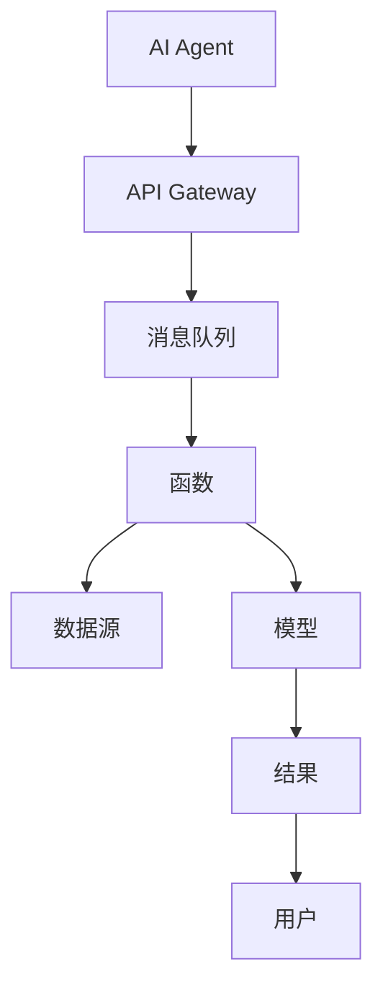
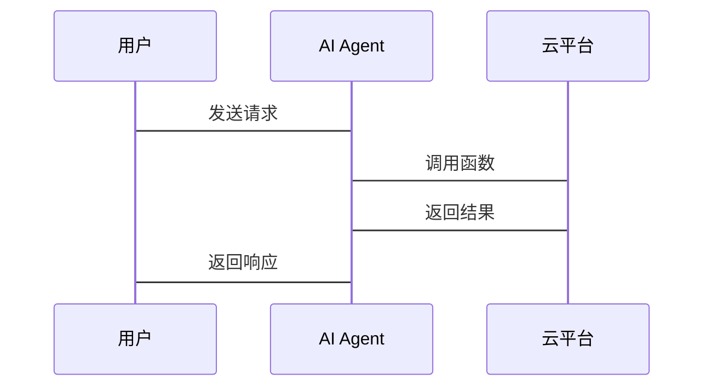

                 


# 企业AI Agent的serverless计算架构

> 关键词：AI Agent, serverless架构, 无服务器计算, 企业应用, 云计算, 事件驱动

> 摘要：本文详细探讨了企业AI Agent在serverless计算架构中的应用，从背景介绍、核心概念、算法原理到系统设计和项目实战，全面解析了企业AI Agent与serverless架构的结合方式及其优势。文章通过详细的技术分析和实际案例，为读者提供了从理论到实践的完整指南。

---

# 第一部分: 企业AI Agent的背景与概念

## 第1章: 企业AI Agent的基本概念

### 1.1 AI Agent的定义与特点

AI Agent（人工智能代理）是一种能够感知环境、自主决策并执行任务的智能实体。它能够通过与环境交互，实现特定目标，例如数据处理、决策支持或自动化操作。

- **感知环境**：AI Agent通过传感器或API获取外部数据。
- **自主决策**：基于获取的数据，AI Agent利用算法做出决策。
- **执行任务**：通过执行预定义的操作或调用其他服务完成任务。

### 1.2 企业AI Agent的核心功能

- **数据处理**：从企业系统中获取数据并进行分析。
- **决策支持**：基于分析结果提供决策建议。
- **自动化操作**：根据决策结果执行自动化任务。
- **协同工作**：与其他AI Agent或系统协同完成复杂任务。

### 1.3 企业AI Agent的应用场景

- **智能客服**：通过自然语言处理（NLP）技术为用户提供支持。
- **自动化运维**：监控系统状态并自动修复问题。
- **智能调度**：优化资源分配和任务调度。
- **风险管理**：实时监控并预警潜在风险。

---

## 第2章: serverless计算架构的定义与特点

### 2.1 serverless计算的定义

serverless计算是一种无服务器架构，允许开发者专注于编写代码，而无需管理底层服务器。资源由第三方平台（如AWS Lambda、Azure Functions）提供，按需弹性扩展。

- **无服务器化**：开发者无需管理服务器，代码直接运行在云平台上。
- **按需扩展**：根据请求量自动调整资源分配。
- **事件驱动**：通过触发器启动函数执行。

### 2.2 serverless计算的优势

- **成本优化**：按需付费，避免资源浪费。
- **快速部署**：无需配置服务器，代码编写后即可运行。
- **高可用性**：云平台提供自动容错机制。

### 2.3 serverless计算的实现机制

- **函数存储**：代码和依赖项存储在云平台。
- **触发机制**：通过API网关、消息队列或定时任务触发函数执行。
- **资源管理**：云平台自动分配计算资源，包括CPU和内存。

---

## 第3章: 企业AI Agent与serverless架构的结合

### 3.1 企业AI Agent对serverless架构的需求

- **弹性扩展**：AI Agent的请求量可能波动较大，serverless架构能够自动扩展资源。
- **按需计算**：AI Agent的任务执行时间不确定，serverless架构能够灵活应对。
- **快速部署**：企业AI Agent需要快速上线，serverless架构简化了部署流程。

### 3.2 serverless架构对AI Agent的支持

- **事件驱动**：AI Agent的任务可以通过事件触发，例如接收到新的数据后立即执行分析。
- **异步处理**：serverless架构支持异步执行，适合处理大量数据或复杂任务。
- **资源隔离**：每个AI Agent任务运行在独立的环境中，避免资源竞争。

### 3.3 企业AI Agent在serverless架构中的应用优势

- **高效资源利用**：serverless架构按需分配资源，避免浪费。
- **快速响应**：通过事件驱动机制，AI Agent能够实时响应请求。
- **高可用性**：云平台提供的高可用性保障了AI Agent的稳定运行。

---

# 第二部分: 企业AI Agent的serverless计算架构核心概念与联系

## 第4章: AI Agent的核心概念原理

### 4.1 AI Agent的决策机制

AI Agent的决策机制通常基于强化学习或监督学习。以下是一个简单的强化学习流程：

1. **环境感知**：AI Agent通过传感器或API获取环境数据。
2. **状态评估**：基于当前状态，AI Agent评估可能的动作。
3. **动作选择**：根据评估结果选择最优动作。
4. **执行动作**：AI Agent执行选择的动作，并观察环境的变化。
5. **奖励反馈**：环境对AI Agent的动作给予奖励或惩罚。

### 4.2 AI Agent的通信协议

AI Agent之间或与外部系统通信时，通常使用HTTP、WebSocket或gRPC等协议。以下是一个简单的HTTP通信流程：

1. **请求发送**：AI Agent向服务器发送请求。
2. **服务器处理**：服务器接收请求并处理。
3. **响应返回**：服务器返回处理结果。

### 4.3 AI Agent的任务分配与协同

AI Agent的任务分配与协同可以通过分布式系统或消息队列实现。以下是一个简单的任务分配流程：

1. **任务发布**：主AI Agent将任务发布到消息队列。
2. **任务接收**：从AI Agent接收任务并执行。
3. **任务完成**：从AI Agent完成任务后，将结果反馈给主AI Agent。

---

## 第5章: serverless架构的核心概念原理

### 5.1 serverless架构的无服务器计算模型

serverless架构的核心是函数即服务（FaaS，Function as a Service）。每个函数都是独立的，由触发器启动。以下是一个简单的函数执行流程：

1. **触发器触发**：当触发器（如API请求或消息队列）触发函数。
2. **函数执行**：函数代码开始执行。
3. **资源分配**：云平台为函数分配计算资源。
4. **函数完成**：函数执行完毕后，资源释放。

### 5.2 serverless架构的事件驱动机制

serverless架构通过事件驱动机制实现按需执行。以下是一个简单的事件驱动流程：

1. **事件触发**：事件（如API请求或消息队列消息）触发函数。
2. **函数执行**：函数代码开始执行。
3. **事件处理**：函数处理事件并返回结果。
4. **事件完成**：事件处理完毕，函数停止。

### 5.3 serverless架构的资源弹性扩展

serverless架构通过弹性扩展实现资源的动态分配。以下是一个简单的弹性扩展流程：

1. **请求增加**：系统请求量突然增加。
2. **资源分配**：云平台自动分配更多资源以处理请求。
3. **请求减少**：系统请求量恢复到正常水平。
4. **资源回收**：云平台回收多余的资源。

---

## 第6章: AI Agent与serverless架构的关系

### 6.1 AI Agent在serverless架构中的角色

AI Agent在serverless架构中通常作为函数，通过事件触发的方式执行任务。例如：

- **数据处理**：AI Agent作为函数，接收数据后进行分析并返回结果。
- **决策支持**：AI Agent作为函数，接收请求后提供决策建议。
- **自动化操作**：AI Agent作为函数，接收触发器后执行自动化任务。

### 6.2 serverless架构对AI Agent性能的影响

serverless架构对AI Agent的性能影响主要体现在以下几个方面：

- **启动时间**：由于函数需要冷启动，AI Agent的执行可能会有延迟。
- **资源限制**：每个函数的计算资源有限，复杂的任务可能需要拆分处理。
- **成本优化**：按需付费的模式降低了企业的运维成本。

### 6.3 AI Agent与serverless架构的协同优化

AI Agent与serverless架构的协同优化可以通过以下方式实现：

- **事件驱动设计**：通过事件驱动机制，AI Agent可以实时响应请求。
- **资源优化配置**：根据任务需求动态分配资源，提高执行效率。
- **异步处理**：通过异步处理机制，提高系统的吞吐量。

---

# 第三部分: 企业AI Agent的serverless计算架构算法原理

## 第7章: AI Agent的核心算法

### 7.1 基于强化学习的AI Agent算法

强化学习是一种通过试错方式优化决策策略的算法。以下是一个简单的强化学习流程：

1. **状态感知**：AI Agent感知当前状态。
2. **动作选择**：基于当前状态选择一个动作。
3. **环境反馈**：执行动作后，环境给予反馈。
4. **策略优化**：根据反馈调整策略，优化决策。

### 7.2 基于监督学习的AI Agent算法

监督学习是一种通过已知数据训练模型的算法。以下是一个简单的监督学习流程：

1. **数据获取**：AI Agent获取训练数据。
2. **模型训练**：基于训练数据训练模型。
3. **模型评估**：通过测试数据评估模型性能。
4. **模型优化**：根据评估结果优化模型。

---

## 第8章: serverless架构中的AI Agent算法优化

### 8.1 算法优化的目标

- **提高执行效率**：通过优化算法减少计算时间。
- **降低资源消耗**：通过优化算法减少资源使用。
- **提高准确率**：通过优化算法提高决策准确率。

### 8.2 算法优化的实现方法

- **并行计算**：通过并行计算提高执行效率。
- **模型压缩**：通过模型压缩减少资源消耗。
- **增量学习**：通过增量学习提高模型适应性。

---

# 第四部分: 企业AI Agent的serverless计算架构系统分析与架构设计

## 第9章: 系统分析与架构设计方案

### 9.1 问题场景介绍

- **需求分析**：企业需要一个高效的AI Agent系统，支持实时数据处理和决策。
- **技术选型**：选择serverless架构作为实现基础。
- **系统设计**：设计一个基于serverless架构的AI Agent系统，支持数据采集、分析、决策和执行。

### 9.2 系统功能设计

#### 9.2.1 数据采集模块

- **功能描述**：从企业系统中采集数据。
- **实现方式**：通过API接口获取数据。
- **交互流程**：AI Agent通过API获取数据，进行分析。

#### 9.2.2 数据分析模块

- **功能描述**：对采集到的数据进行分析。
- **实现方式**：使用机器学习算法进行数据分析。
- **交互流程**：AI Agent接收数据后，调用分析算法，返回分析结果。

#### 9.2.3 决策支持模块

- **功能描述**：基于分析结果提供决策建议。
- **实现方式**：通过强化学习算法优化决策策略。
- **交互流程**：AI Agent接收分析结果，调用决策算法，返回决策建议。

#### 9.2.4 自动化执行模块

- **功能描述**：根据决策建议执行自动化操作。
- **实现方式**：通过触发器启动自动化任务。
- **交互流程**：AI Agent接收决策建议后，调用自动化任务，执行操作。

---

## 第10章: 系统架构设计

### 10.1 系统架构图

以下是一个基于serverless架构的AI Agent系统架构图：



---

## 第11章: 系统接口设计

### 11.1 系统接口设计

- **API接口**：AI Agent通过API接口与外部系统交互。
- **消息队列接口**：AI Agent通过消息队列接收触发事件。
- **数据库接口**：AI Agent通过数据库接口存储和获取数据。

---

## 第12章: 系统交互设计

### 12.1 系统交互序列图

以下是一个基于serverless架构的AI Agent系统交互序列图：



---

# 第五部分: 企业AI Agent的serverless计算架构项目实战

## 第13章: 项目实战

### 13.1 环境安装

- **安装Python**：安装Python 3.8及以上版本。
- **安装Jupyter Notebook**：用于算法开发和测试。
- **安装云平台SDK**：安装AWS SDK、Azure SDK等。

### 13.2 核心代码实现

#### 13.2.1 数据处理代码

```python
def process_data(data):
    # 数据预处理代码
    return processed_data
```

#### 13.2.2 数据分析代码

```python
def analyze_data(data):
    # 数据分析算法
    return analysis_result
```

#### 13.2.3 决策支持代码

```python
def decision_support(result):
    # 决策支持算法
    return decision_result
```

#### 13.2.4 自动化执行代码

```python
def execute_action(action):
    # 自动化执行代码
    return execution_result
```

### 13.3 代码解读与分析

- **数据处理代码**：用于对原始数据进行清洗和转换，以便后续分析。
- **数据分析代码**：基于预处理后的数据，使用机器学习算法进行分析。
- **决策支持代码**：基于分析结果，使用强化学习算法提供决策建议。
- **自动化执行代码**：根据决策结果，执行预定义的自动化任务。

### 13.4 实际案例分析

假设我们有一个智能客服系统，AI Agent需要实时响应用户请求。以下是实现步骤：

1. **用户请求**：用户发送一个请求到智能客服系统。
2. **API Gateway**：API Gateway接收请求，并将其转发到AI Agent。
3. **消息队列**：AI Agent通过消息队列接收请求。
4. **函数执行**：AI Agent调用函数，进行数据处理、分析、决策和执行。
5. **返回结果**：AI Agent将处理结果返回给用户。

---

## 第14章: 项目小结

通过项目实战，我们可以看到基于serverless架构的AI Agent系统具有以下优势：

- **快速部署**：通过serverless架构，AI Agent可以快速上线。
- **弹性扩展**：通过serverless架构，AI Agent可以自动扩展资源。
- **按需付费**：通过serverless架构，企业可以按需付费，降低运维成本。

---

# 第六部分: 企业AI Agent的serverless计算架构最佳实践

## 第15章: 最佳实践

### 15.1 优化建议

- **选择合适的云平台**：根据企业需求选择适合的云平台，如AWS、Azure、阿里云等。
- **合理设计触发器**：根据任务需求合理设计触发器，避免资源浪费。
- **优化算法性能**：通过算法优化提高AI Agent的执行效率。

### 15.2 小结

通过本文的详细讲解和实际案例分析，我们可以看到基于serverless架构的AI Agent系统具有许多优势。企业可以根据自身需求，选择适合的架构和技术，实现高效的AI Agent系统。

### 15.3 注意事项

- **数据安全**：在设计AI Agent系统时，必须考虑数据安全问题。
- **资源限制**：由于serverless架构的资源限制，复杂的任务可能需要拆分处理。
- **冷启动问题**：由于函数的冷启动问题，AI Agent的执行可能会有延迟。

### 15.4 拓展阅读

- **云平台文档**：阅读AWS Lambda、Azure Functions等云平台的官方文档，了解更多细节。
- **serverless书籍**：阅读《Serverless Applications on AWS》等书籍，深入理解serverless架构。
- **AI Agent论文**：阅读相关论文，了解AI Agent的最新研究进展。

---

# 结语

通过本文的详细讲解，我们可以看到基于serverless架构的AI Agent系统具有许多优势。企业可以根据自身需求，选择适合的架构和技术，实现高效的AI Agent系统。希望本文能够为读者提供有价值的参考和启发。

--- 

**注**：以上内容为示例性内容，实际编写时需要根据具体技术细节进行补充和完善。

