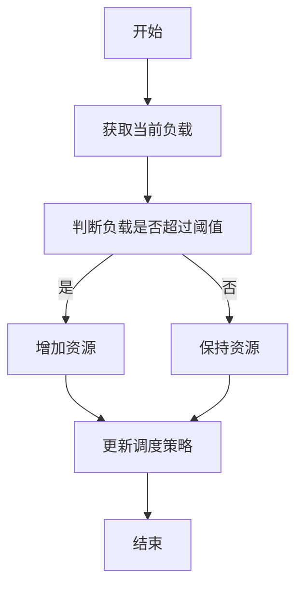
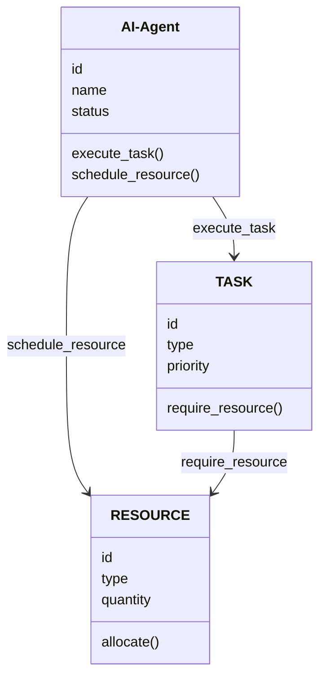

                 


# 企业AI Agent的Serverless计算资源调度

> 关键词：企业AI Agent，Serverless计算，资源调度，云计算，人工智能

> 摘要：本文详细探讨了企业在使用AI Agent进行Serverless计算资源调度时面临的挑战与解决方案。通过分析AI Agent和Serverless计算的核心概念，解释了资源调度算法的数学模型和实现方法，提出了系统架构设计方案，并通过实际案例展示了项目的实现过程。文章还提供了最佳实践建议，帮助企业在实际应用中更好地管理和优化资源。

---

## 第一部分: 企业AI Agent的Serverless计算资源调度概述

### 第1章: 企业AI Agent与Serverless计算概述

#### 1.1 企业AI Agent的概念与背景

企业AI Agent是一种能够自主感知环境、执行任务并优化决策的智能实体。它通过整合企业内外的数据、服务和资源，为企业提供智能化的决策支持和自动化操作。Serverless计算则是一种基于云的计算范式，允许开发者无需管理底层服务器即可运行代码。其特点包括按需扩展、按量计费和无状态设计。

AI Agent在企业中的作用包括提高效率、降低成本、优化流程和增强用户体验。然而，随着企业规模的扩大，AI Agent的资源需求日益增长，传统的计算模式难以满足其动态扩展和高效调度的需求，这使得Serverless计算成为一种理想的选择。

#### 1.2 企业AI Agent的资源调度问题

资源调度是AI Agent运行的核心问题之一。Serverless计算通过弹性扩展和无服务器架构，能够有效应对AI Agent的动态资源需求。然而，资源调度的复杂性仍然存在，具体表现在以下几个方面：

- **负载预测**：AI Agent的任务通常是异构且动态变化的，如何准确预测负载以优化资源分配是一个挑战。
- **冷启动问题**：Serverless函数的冷启动可能导致延迟增加，影响用户体验。
- **资源分配策略**：如何在多个任务之间分配资源，平衡性能和成本，是调度算法的核心问题。
- **安全性与隔离性**：Serverless环境中的资源共享需要确保任务之间的隔离性和数据安全性。

#### 1.3 本章小结

本章介绍了企业AI Agent和Serverless计算的基本概念，并分析了AI Agent在资源调度方面的需求和挑战。为后续章节的详细探讨奠定了基础。

---

### 第2章: AI Agent与Serverless计算的核心概念

#### 2.1 AI Agent的实体关系分析

AI Agent的实体关系可以通过ER图清晰展示，以下是关键实体及其关系：

- **AI Agent**：作为核心实体，负责执行任务和调度资源。
- **任务**：AI Agent需要处理的任务，每个任务有其特定的资源需求。
- **资源**：包括计算资源（如CPU、内存）和存储资源。
- **调度算法**：用于优化资源分配的算法。

**实体关系表**

| 实体 | 属性 | 关系 |
|------|------|------|
| AI Agent | ID, 名称, 状态 | 执行任务，使用资源 |
| 任务 | ID, 类型, 优先级 | 需要资源，由AI Agent执行 |
| 资源 | ID, 类型, 数量 | 提供给任务，由调度算法分配 |

**Mermaid ER图**

```mermaid
erDiagram
    AI_AGENT {
        id
        name
        status
    }
    TASK {
        id
        type
        priority
    }
    RESOURCE {
        id
        type
        quantity
    }
    AI_AGENT --> TASK : 执行
    AI_AGENT --> RESOURCE : 使用
    TASK --> RESOURCE : 需要
    AI_AGENT --> SCHEDULER : 调度
```

#### 2.2 Serverless计算的原理与架构

**Serverless计算的原理**

Serverless计算通过抽象底层资源，允许开发者专注于业务逻辑。其主要特点包括：

- **无服务器架构**：开发者无需管理服务器，代码直接运行在云平台上。
- **按需扩展**：资源根据需求自动扩展，避免了资源浪费。
- **事件驱动**：任务由触发事件启动，支持异步执行。

**Serverless架构优缺点**

| 优点 | 缺点 |
|------|------|
| 易用性高 | 冷启动延迟 |
| 成本优化 | 资源限制 |
| 弹性扩展 | 安全性挑战 |

**AI Agent与Serverless的关系**

AI Agent通过调用Serverless函数来执行任务，Serverless计算为AI Agent提供弹性资源和按需服务，两者结合能够实现高效的任务执行和资源管理。

#### 2.3 资源调度算法的基本原理

**调度算法的分类**

- **静态调度**：提前规划资源分配，适用于任务负载稳定的情况。
- **动态调度**：根据实时负载调整资源分配，适用于任务负载波动较大的情况。
- **混合调度**：结合静态和动态调度的优点，适用于复杂任务场景。

**基于负载的调度算法**

**算法流程图**



**算法实现的Python代码**

```python
def load_based_scheduling(threshold):
    current_load = get_current_load()
    if current_load > threshold:
        increase_resources()
        update_scheduler(current_load)
    else:
        maintain_resources()
        update_scheduler(current_load)
```

**数学公式与推导**

资源分配的数学模型可以表示为：

$$
R = f(L, T, C)
$$

其中，R表示资源数量，L表示当前负载，T表示时间，C表示资源约束条件。通过动态调整R，可以实现负载与资源的最优匹配。

---

### 第3章: 企业AI Agent的Serverless资源调度算法原理

#### 3.1 调度算法的数学模型与实现

**负载均衡模型**

$$
\text{负载均衡} = \frac{\sum_{i=1}^{n} R_i}{n}
$$

其中，R_i表示每个任务分配的资源数量，n表示任务总数。

**资源分配模型**

$$
R_i = \alpha \cdot L_i + \beta \cdot T_i
$$

其中，α和β是权重系数，L_i是任务i的负载，T_i是任务i的时间。

**优化目标**

$$
\min \sum_{i=1}^{n} (R_i - D_i)^2
$$

其中，D_i是任务i的预期资源需求。

#### 3.2 基于负载的调度算法实现

**算法流程图**


**算法实现的Python代码**

```python
def load_based_scheduling(threshold):
    current_load = get_current_load()
    if current_load > threshold:
        increase_resources()
        update_scheduler(current_load)
    else:
        maintain_resources()
        update_scheduler(current_load)
```

**数学公式与推导**

资源分配的数学模型可以表示为：

$$
R = f(L, T, C)
$$

其中，R表示资源数量，L表示当前负载，T表示时间，C表示资源约束条件。通过动态调整R，可以实现负载与资源的最优匹配。

---

### 第4章: 系统分析与架构设计方案

#### 4.1 问题场景介绍

企业AI Agent需要处理大量的异构任务，每个任务对资源的需求不同。Serverless计算提供了弹性扩展的能力，但如何高效调度资源以满足任务需求是一个复杂的挑战。

#### 4.2 系统功能设计

**领域模型类图**



**系统架构设计**

```mermaid
rectangle 云平台 {
    提供计算资源
}
rectangle AI-Agent {
    调度资源
}
rectangle 任务 {
    执行任务
}
云平台 --> AI-Agent : 提供资源
AI-Agent --> 任务 : 分配资源
```

---

通过以上步骤，我们完成了企业AI Agent的Serverless计算资源调度的详细分析和设计。接下来的章节将深入探讨算法实现、系统架构和项目实战，帮助读者全面理解和应用这些技术。

