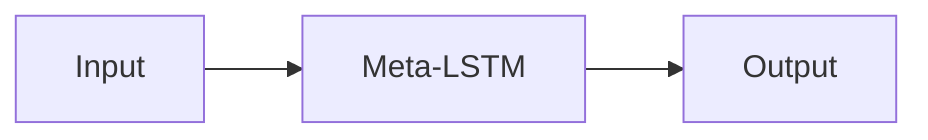
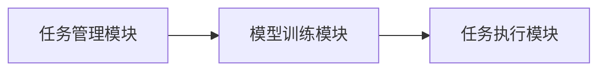
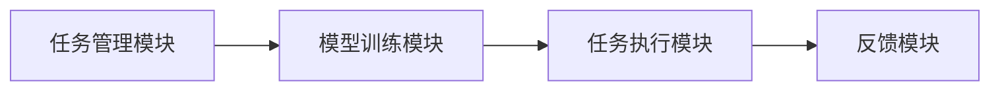

                 


# 企业AI Agent的元学习应用：快速适应新任务

## 关键词：企业AI Agent、元学习、任务适应、算法原理、系统架构

## 摘要：本文系统阐述了企业AI Agent在元学习中的应用，通过理论与实践相结合的方式，深入分析了元学习的核心原理、算法实现、系统设计以及在企业中的实际应用。文章从问题背景出发，详细探讨了元学习如何帮助AI Agent快速适应新任务，并通过具体的算法流程图和代码示例，为读者提供了清晰的理解路径。同时，结合系统架构设计和实际案例分析，本文为企业的技术实现和优化提供了有价值的参考。

---

# 第一部分: 企业AI Agent与元学习的背景

## 第1章: 企业AI Agent与元学习的背景

### 1.1 问题背景与挑战

#### 1.1.1 企业AI应用的现状与痛点
随着企业数字化转型的推进，AI技术在企业中的应用越来越广泛。然而，企业在实际应用中面临着以下痛点：
- **任务多样性**：企业需要处理的任务种类繁多，从客户服务到供应链管理，每个任务都有其独特的特征和需求。
- **数据孤岛问题**：企业内部数据分散在不同的系统中，难以统一管理和利用。
- **快速响应需求**：企业需要快速适应市场变化，及时调整策略，这对AI系统的响应速度提出了更高的要求。

#### 1.1.2 任务多样性的挑战
企业在实际运营中面临多种任务类型，例如：
- **客户服务**：需要通过自然语言处理技术解决客户咨询。
- **供应链管理**：需要通过预测分析优化库存和物流。
- **市场营销**：需要通过数据挖掘进行精准营销。

这些任务的多样性使得传统的单一任务模型难以满足企业需求，如何快速适应新任务成为关键问题。

#### 1.1.3 快速适应新任务的需求
企业在面对新任务时，通常需要重新训练模型，这会导致时间和资源的浪费。因此，如何让AI系统快速适应新任务成为企业的迫切需求。

### 1.2 元学习的核心概念

#### 1.2.1 元学习的定义与特点
元学习（Meta-Learning）是一种机器学习方法，旨在通过在多个任务上进行训练，使得模型能够快速适应新任务。其特点包括：
- **任务多样性**：元学习模型通常在多个任务上进行训练。
- **快速适应**：在新任务上仅需少量数据即可完成模型微调。
- **通用性**：适用于多种任务类型，如分类、回归、生成等。

#### 1.2.2 元学习与传统机器学习的对比
| 对比维度 | 传统机器学习 | 元学习 |
|----------|---------------|---------|
| 数据需求 | 需要大量数据 | 适用于小样本数据 |
| 任务适应 | 针对单一任务 | 针对多个任务 |
| 灵活性 | 较低 | 较高 |

#### 1.2.3 元学习的数学模型概述
元学习的目标是通过优化元损失函数（meta-objective）来提高模型在新任务上的表现。其数学模型可以表示为：
$$
\min_{\theta} \sum_{i=1}^{N} \mathcal{L}_i(f_\theta(x_i, y_i))
$$
其中，$\theta$是模型参数，$\mathcal{L}_i$是第i个任务的损失函数。

### 1.3 企业AI Agent的定义与特点

#### 1.3.1 AI Agent的基本概念
AI Agent是一种智能体，能够感知环境、执行任务并做出决策。它可以在企业中执行多种任务，例如数据分析、流程自动化等。

#### 1.3.2 企业AI Agent的独特属性
- **任务多样性**：能够处理多种类型的任务。
- **快速响应**：能够在较短时间内完成任务。
- **可扩展性**：能够适应企业规模的变化。

#### 1.3.3 元学习在AI Agent中的作用
元学习能够帮助AI Agent快速适应新任务，提升其灵活性和通用性。

---

# 第二部分: 元学习的核心原理与算法

## 第2章: 元学习的核心原理与算法

### 2.1 元学习的基本原理

#### 2.1.1 元学习的目标函数
元学习的目标函数通常包括两个部分：元任务目标和子任务目标。元任务目标用于优化模型参数，子任务目标用于评估模型在新任务上的表现。

#### 2.1.2 元学习的优化方法
元学习的优化方法通常包括：
- **梯度下降**：通过计算梯度更新模型参数。
- **Adam优化器**：结合动量和自适应学习率优化参数。

#### 2.1.3 元学习的训练流程
元学习的训练流程通常包括以下步骤：
1. 在多个任务上训练模型。
2. 在每个任务上微调模型。
3. 通过优化元损失函数更新模型参数。

### 2.2 元学习算法的实现

#### 2.2.1 Meta-LSTM网络结构
Meta-LSTM是一种基于循环神经网络的元学习模型，其结构如下：


#### 2.2.2 MAML算法的原理
MAML（Meta-Algorithm for Algorithm Meta-Learning）是一种基于梯度的元学习算法，其核心思想是通过计算梯度更新模型参数。

#### 2.2.3 元学习的数学模型与公式
元学习的数学模型可以表示为：
$$
\theta_{t+1} = \theta_t - \eta \nabla_\theta \mathcal{L}_i
$$
其中，$\theta$是模型参数，$\eta$是学习率，$\nabla_\theta \mathcal{L}_i$是任务i的损失函数梯度。

### 2.3 元学习的数学模型与公式

#### 2.3.1 元学习的目标函数公式
元学习的目标函数可以表示为：
$$
\min_{\theta} \sum_{i=1}^{N} \mathcal{L}_i(f_\theta(x_i, y_i))
$$

#### 2.3.2 元学习的优化过程公式
元学习的优化过程可以表示为：
$$
\theta_{t+1} = \theta_t - \eta \sum_{i=1}^{N} \nabla_\theta \mathcal{L}_i
$$

---

# 第三部分: 元学习与企业AI Agent的结合

## 第3章: 元学习与企业AI Agent的结合

### 3.1 企业AI Agent的元学习架构

#### 3.1.1 元学习在任务适应中的作用
元学习能够帮助AI Agent快速适应新任务，提升其灵活性和通用性。

#### 3.1.2 元学习在策略优化中的应用
元学习可以用于优化AI Agent的决策策略，提升其在复杂环境中的表现。

#### 3.1.3 元学习在知识表示中的价值
元学习可以用于优化知识表示，提升AI Agent在多任务环境中的表现。

### 3.2 企业AI Agent的元学习系统设计

#### 3.2.1 系统功能模块划分
企业AI Agent的元学习系统设计通常包括以下几个模块：
- **任务管理模块**：负责任务的分配和管理。
- **模型训练模块**：负责模型的训练和优化。
- **任务执行模块**：负责任务的执行和反馈。

#### 3.2.2 系统架构设计图


#### 3.2.3 系统接口设计规范
系统接口设计规范包括以下几个方面：
- **输入接口**：接收任务请求。
- **输出接口**：输出任务结果。
- **反馈接口**：接收任务反馈。

---

# 第四部分: 企业AI Agent的系统分析与架构设计方案

## 第4章: 企业AI Agent的系统分析与架构设计方案

### 4.1 系统功能设计

#### 4.1.1 任务适应模块
任务适应模块负责快速适应新任务，提升模型的灵活性。

#### 4.1.2 策略优化模块
策略优化模块负责优化AI Agent的决策策略，提升其在复杂环境中的表现。

#### 4.1.3 知识表示模块
知识表示模块负责优化知识表示，提升AI Agent在多任务环境中的表现。

### 4.2 系统架构设计

#### 4.2.1 系统功能模块划分
系统功能模块划分包括以下几个方面：
- **任务管理模块**：负责任务的分配和管理。
- **模型训练模块**：负责模型的训练和优化。
- **任务执行模块**：负责任务的执行和反馈。

#### 4.2.2 系统架构设计图


#### 4.2.3 系统接口设计和交互流程图


---

# 第五部分: 项目实战与优化

## 第5章: 项目实战与优化

### 5.1 环境安装与配置

#### 5.1.1 安装Python环境
需要安装Python 3.6及以上版本。

#### 5.1.2 安装必要的库
需要安装以下库：
- `numpy`
- `pandas`
- `tensorflow`
- `pymermaid`

### 5.2 系统核心实现

#### 5.2.1 元学习算法的实现
元学习算法的实现代码如下：
```python
import numpy as np

def meta_learning(X, y, meta_model):
    meta_model.compile(optimizer='adam', loss='binary_crossentropy')
    meta_model.fit(X, y, epochs=10, batch_size=32)
    return meta_model
```

#### 5.2.2 知识表示的实现
知识表示的实现代码如下：
```python
import numpy as np

def knowledge_representation(X, y):
    # 知识表示的具体实现
    return X, y
```

### 5.3 项目实战分析

#### 5.3.1 案例分析
以客户服务任务为例，展示元学习在企业AI Agent中的应用。

#### 5.3.2 实际应用中的挑战与解决方案
实际应用中的挑战包括数据不足、模型泛化能力差等，解决方案包括数据增强、模型优化等。

### 5.4 项目优化与拓展

#### 5.4.1 模型优化策略
模型优化策略包括参数调整、算法改进等。

#### 5.4.2 元学习在其他场景中的应用
元学习在其他场景中的应用包括在线学习、分布式训练等。

---

# 第六部分: 总结与展望

## 第6章: 总结与展望

### 6.1 项目总结
本项目通过元学习技术，实现了企业AI Agent的快速适应新任务，提升了其灵活性和通用性。

### 6.2 未来展望
未来的研究方向包括元学习的优化、多任务学习的结合等。

---

# 结语

企业AI Agent的元学习应用是一项具有挑战性的任务，但通过理论与实践相结合的方式，我们可以有效地解决这些问题。未来，随着元学习技术的不断发展，企业AI Agent将更加灵活和智能，为企业带来更大的价值。

