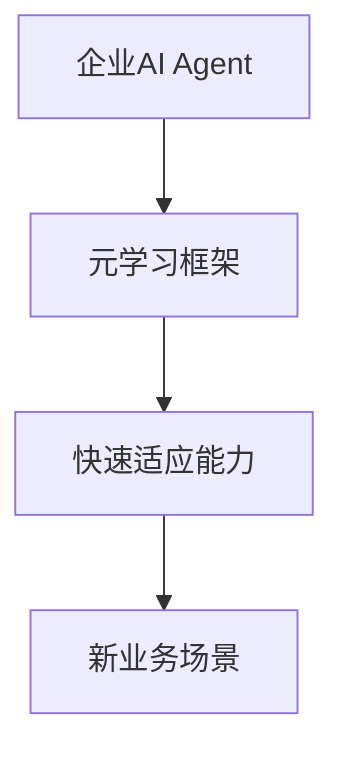
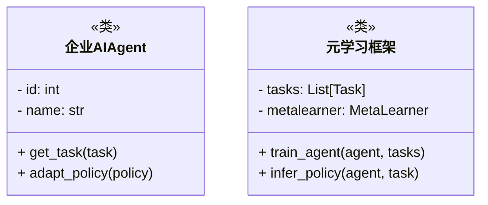
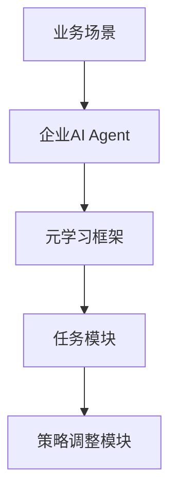
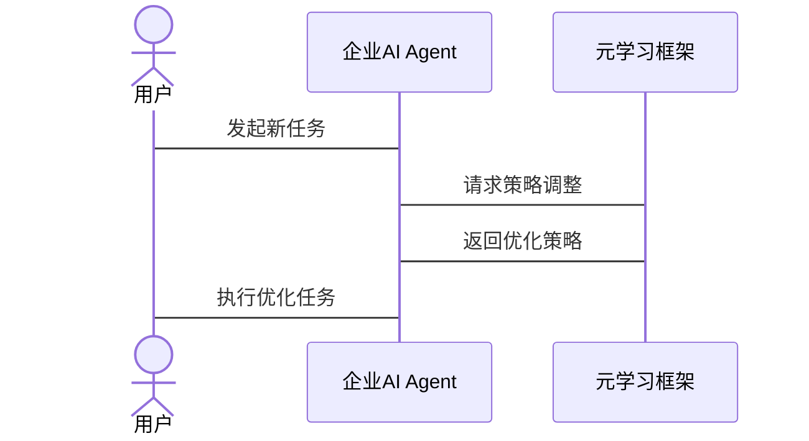

                 

# 企业AI Agent的元学习框架：快速适应新业务场景的能力培养

**关键词**：企业AI Agent，元学习，快速适应，业务场景，自适应机制

**摘要**：  
随着企业数字化转型的深入，AI Agent（人工智能代理）在各类业务场景中的应用日益广泛。然而，AI Agent需要快速适应新业务场景的需求也日益迫切。元学习（Meta-Learning）作为一种新兴的机器学习范式，能够使AI Agent在面对新任务时快速调整策略，无需从头开始训练，从而显著提升其适应能力。本文将深入探讨企业AI Agent的元学习框架，分析其核心概念、算法原理、系统架构，并结合实际案例，展示如何通过元学习框架快速培养AI Agent在新业务场景中的适应能力。我们还将展望未来的发展趋势，为企业技术决策者提供参考。

---

## 目录大纲

### 第一章: 企业AI Agent的背景与问题背景

1.1 问题背景  
1.1.1 企业AI Agent的概念与定义  
1.1.2 元学习的核心问题与挑战  
1.1.3 业务场景快速变化的需求  

1.2 问题描述  
1.2.1 传统AI Agent的局限性  
1.2.2 快速适应新业务场景的需求  
1.2.3 元学习框架的必要性  

1.3 问题解决  
1.3.1 元学习框架的设计目标  
1.3.2 快速适应新场景的实现路径  
1.3.3 企业级AI Agent的架构优化  

1.4 边界与外延  
1.4.1 元学习框架的适用范围  
1.4.2 与传统机器学习的区分  
1.4.3 与其他AI技术的关联  

1.5 概念结构与核心要素  
1.5.1 元学习框架的核心要素  
1.5.2 企业AI Agent的能力组成  
1.5.3 元学习与业务场景的映射关系  

---

### 第二章: 元学习框架的核心概念与联系

2.1 元学习框架的核心概念  
2.1.1 元学习的定义与特点  
2.1.2 快速适应机制的实现原理  
2.1.3 企业AI Agent的自适应能力  

2.2 核心概念的属性特征对比  
表2-1: 元学习框架与传统机器学习的对比  

2.3 ER实体关系图  

---

### 第三章: 元学习框架的算法原理

3.1 元学习算法的核心原理  
3.1.1 元学习的基本思想  
3.1.2 快速适应新任务的数学模型  

3.2 基于MAML（Meta-Algorithm for Meta-Learning）的元学习算法  
3.2.1 MAML算法的数学推导  
3.2.2 算法流程图的详细解析  
3.2.3 Python代码实现与解读  

3.3 ReMAML（Refine Meta-Learning）算法的优化与改进  
3.3.1 ReMAML的核心思想  
3.3.2 算法优化策略与数学模型  
3.3.3 算法代码示例与实际应用场景  

---

### 第四章: 元学习框架的系统分析与架构设计

4.1 系统分析  
4.1.1 问题场景的识别与分析  
4.1.2 系统功能需求的提取  

4.2 系统架构设计  
4.2.1 领域模型设计与类图分析  

4.2.2 系统架构的分层与模块化设计  

4.3 系统交互设计  
4.3.1 交互流程的详细描述  
4.3.2 交互序列图的绘制  

---

### 第五章: 企业AI Agent元学习框架的项目实战

5.1 项目环境与工具安装  
5.1.1 环境配置与依赖管理  
5.1.2 开发工具与库的安装  

5.2 核心代码实现  
5.2.1 元学习框架的代码结构  
5.2.2 快速适应模块的实现细节  

5.3 案例分析与解读  
5.3.1 实际业务场景的案例分析  
5.3.2 元学习框架在案例中的具体应用  

5.4 项目小结  
5.4.1 项目成果与经验总结  
5.4.2 可能遇到的问题与解决方案  

---

### 第六章: 企业AI Agent元学习框架的成功案例分析

6.1 成功案例介绍  
6.1.1 案例背景与目标  
6.1.2 元学习框架的应用效果  

6.2 成功经验总结  
6.2.1 架构设计的关键点  
6.2.2 算法选择的优化策略  

6.3 挑战与解决方案  
6.3.1 实际应用中的挑战分析  
6.3.2 解决方案与改进建议  

---

### 第七章: 企业AI Agent元学习框架的未来趋势与挑战

7.1 未来发展趋势  
7.1.1 元学习算法的进一步优化  
7.1.2 与大语言模型的结合  
7.1.3 边缘计算环境下的应用拓展  

7.2 当前面临的主要挑战  
7.2.1 算法的通用性与效率问题  
7.2.2 数据隐私与安全风险  
7.2.3 人机协作的用户体验优化  

7.3 应对策略与建议  
7.3.1 技术层面的优化路径  
7.3.2 业务层面的适应策略  
7.3.3 伦理与安全的考虑  

---

### 第八章: 总结与展望

8.1 全文总结  
8.1.1 核心观点的回顾  
8.1.2 元学习框架的优势与不足  

8.2 未来研究方向  
8.2.1 元学习算法的创新  
8.2.2 企业级AI Agent的生态构建  
8.2.3 元学习在更多业务场景中的应用探索  

---

通过以上目录大纲，我们可以清晰地看到，企业AI Agent的元学习框架将从理论到实践，从算法到系统，全面展开讲解，帮助企业技术团队快速掌握并应用这一前沿技术。

