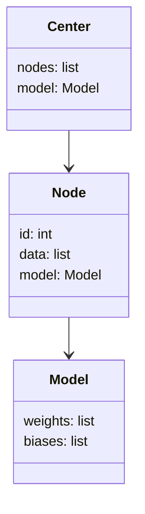
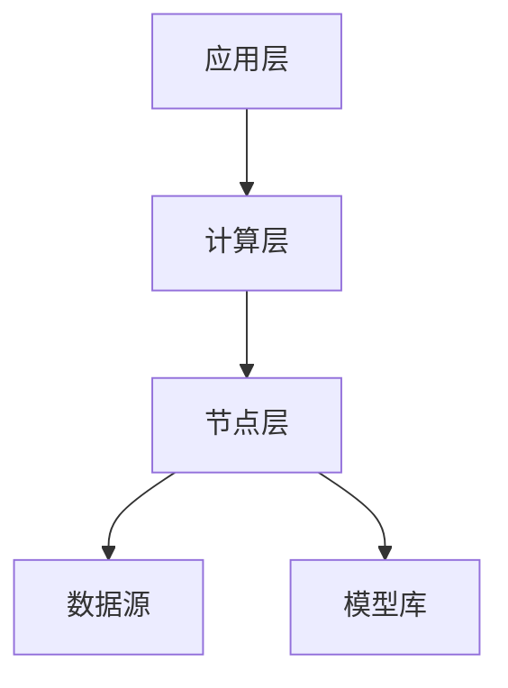

                 


# 企业AI Agent的分布式学习平台设计

> 关键词：企业AI Agent、分布式学习平台、机器学习、算法设计、系统架构、系统实现

> 摘要：本文详细探讨了企业AI Agent的分布式学习平台设计，从背景介绍、核心概念、算法原理、系统架构到项目实战，全面解析了该平台的设计思路与实现方法。通过实际案例分析和代码实现，展示了如何在企业环境中构建高效的分布式学习平台。

---

# 第1章: 企业AI Agent与分布式学习平台概述

## 1.1 企业AI Agent的基本概念

### 1.1.1 什么是企业AI Agent
企业AI Agent（Artificial Intelligence Agent）是一种能够感知环境、执行任务并做出决策的智能实体。它通常用于企业内部自动化处理数据、优化流程、辅助决策等场景。

**核心特点：**
- **自主性**：能够自主决策，无需人工干预。
- **反应性**：能够实时感知环境变化并做出反应。
- **学习能力**：通过数据和经验不断优化自身行为。

### 1.1.2 AI Agent的核心功能与特点
AI Agent的核心功能包括数据处理、任务执行、决策优化等。其特点如下：
- **模块化**：功能模块化设计，便于扩展和维护。
- **高效性**：能够快速处理大量数据并做出决策。
- **可定制化**：支持根据不同企业需求进行定制化配置。

### 1.1.3 分布式学习平台的定义与作用
分布式学习平台是一种基于分布式计算技术，支持多节点协作学习的平台。其作用包括：
- **提升计算效率**：通过分布式计算加速模型训练。
- **优化资源利用**：充分利用企业内部的计算资源。
- **增强模型泛化能力**：通过多节点协作学习，提升模型的泛化能力。

## 1.2 分布式学习平台的背景与发展趋势

### 1.2.1 分布式计算与AI的结合
随着企业数据量的爆炸式增长，单机计算已无法满足需求，分布式计算逐渐成为主流。通过分布式计算技术，企业可以更高效地处理海量数据，提升AI模型的训练效率。

### 1.2.2 企业级AI应用的挑战
企业AI应用面临以下挑战：
- **数据规模大**：单机计算无法处理海量数据。
- **计算资源不足**：企业通常需要利用现有资源进行计算。
- **模型优化难度大**：需要在多节点环境下优化模型。

### 1.2.3 分布式学习平台的行业需求
行业需求包括：
- **提升企业效率**：通过分布式学习平台，企业可以更快地训练模型。
- **降低成本**：利用现有资源进行分布式计算，降低计算成本。
- **提升模型性能**：通过多节点协作学习，提升模型的性能和泛化能力。

## 1.3 企业AI Agent分布式学习平台的目标与意义

### 1.3.1 平台设计的目标
平台设计目标包括：
- **高效性**：提升模型训练效率。
- **可扩展性**：支持大规模数据处理。
- **易用性**：提供友好的用户界面和API接口。

### 1.3.2 平台对企业AI应用的价值
平台价值体现在：
- **提升企业竞争力**：通过高效模型训练，提升企业竞争力。
- **优化企业流程**：通过自动化处理，优化企业内部流程。
- **降低成本**：通过资源优化，降低企业的计算成本。

### 1.3.3 平台的技术创新与实践意义
技术创新体现在：
- **分布式计算技术**：采用分布式计算技术，提升模型训练效率。
- **多节点协作学习**：通过多节点协作学习，提升模型的泛化能力。
- **资源优化配置**：通过资源优化配置，降低企业的计算成本。

---

## 1.4 本章小结

---

# 第2章: 企业AI Agent的分布式学习机制

## 2.1 分布式学习的基本原理

### 2.1.1 分布式计算的核心思想
分布式计算的核心思想是将任务分解为多个子任务，分别在不同的节点上执行，最后将结果汇总。这种计算方式可以有效提升计算效率。

### 2.1.2 分布式学习的流程与特点
分布式学习的流程包括：
1. 数据分发：将数据分发到不同的节点。
2. 模型初始化：在各个节点上初始化模型。
3. 分布式训练：各个节点独立训练模型。
4. 模型聚合：将各个节点的模型参数汇总，得到最终模型。

### 2.1.3 分布式学习与集中式学习的对比

| 对比维度         | 分布式学习                          | 集中式学习                          |
|------------------|------------------------------------|------------------------------------|
| 资源利用         | 利用多个节点的计算资源               | 仅利用单个节点的计算资源             |
| 计算效率         | 分布式计算可以提升计算效率           | 计算效率较低                         |
| 模型性能         | 通过多节点协作学习，模型性能更优     | 模型性能受单节点计算能力限制           |
| 扩展性           | 支持扩展到更多的节点                | 难以扩展到更多的节点                |

---

## 2.2 企业AI Agent的分布式学习架构

### 2.2.1 分布式学习的层次结构
分布式学习的层次结构包括：
1. 应用层：提供用户界面和API接口。
2. 计算层：负责数据分发和模型训练。
3. 节点层：实际执行计算任务的节点。

### 2.2.2 企业AI Agent的协作机制
协作机制包括：
1. 数据分发机制：将数据分发到不同的节点。
2. 模型同步机制：定期将各个节点的模型参数同步到中心节点。
3. 任务分配机制：根据节点的负载情况动态分配任务。

### 2.2.3 分布式学习中的通信与同步
通信与同步机制包括：
1. 通信机制：节点之间通过网络进行通信。
2. 同步机制：定期将各个节点的模型参数同步到中心节点。

---

## 2.3 分布式学习中的挑战与解决方案

### 2.3.1 数据一致性问题
数据一致性问题是指不同节点上的数据可能不一致，导致模型训练出现问题。解决方案包括：
1. 数据预处理：对数据进行清洗和预处理，确保数据一致性。
2. 数据分片：将数据分成多个分片，每个节点处理一个分片。

### 2.3.2 网络延迟与计算资源分配
网络延迟和计算资源分配问题可以通过以下方式解决：
1. 优化网络通信：使用低延迟的网络协议和通信方式。
2. 负载均衡：根据节点的负载情况动态分配任务。

### 2.3.3 分布式训练中的收敛性问题
收敛性问题是指分布式训练过程中模型可能无法收敛到全局最优解。解决方案包括：
1. 增加模型正则化：通过正则化技术防止模型过拟合。
2. 使用同步算法：采用同步算法确保各个节点的模型参数一致。

---

## 2.4 本章小结

---

# 第3章: 分布式学习平台的核心算法与数学模型

## 3.1 分布式学习算法概述

### 3.1.1 分布式机器学习算法的分类
分布式机器学习算法可以分为以下几类：
1. 分布式数据并行：将数据分发到不同的节点，每个节点独立训练模型。
2. 分布式模型并行：将模型的不同部分分发到不同的节点，每个节点独立训练模型。

### 3.1.2 常见的分布式学习算法
常见的分布式学习算法包括：
1. 分布式随机梯度下降（Distributed Stochastic Gradient Descent, D-SGD）。
2. 分布式参数服务器（Distributed Parameter Server, DPS）。
3. 分布式模型平均（Distributed Model Averaging, DMA）。

### 3.1.3 分布式学习算法的优缺点
| 对比维度         | 分布式随机梯度下降（D-SGD）         | 分布式参数服务器（DPS）         |
|------------------|------------------------------------|------------------------------------|
| 优点             | 实现简单，计算效率高               | 可扩展性强，适合大规模数据       |
| 缺点             | 需要频繁通信，网络开销大           | 实现复杂，维护成本高             |

---

## 3.2 分布式学习的数学模型与公式

### 3.2.1 分布式优化的目标函数
目标函数为：
$$ f(x) = \frac{1}{n}\sum_{i=1}^{n} f_i(x) $$

其中，$x$ 表示模型参数，$f_i(x)$ 表示第 $i$ 个节点的损失函数。

### 3.2.2 分布式梯度下降算法
分布式梯度下降算法的伪代码如下：

```python
初始化模型参数 x
while not 收敛:
    将数据分发到各个节点
    各个节点独立计算梯度
    将各个节点的梯度汇总到中心节点
    更新模型参数 x = x - 学习率 * 汇总梯度
```

### 3.2.3 分布式模型平均算法
分布式模型平均算法的伪代码如下：

```python
初始化模型参数 x
while not 收敛:
    将数据分发到各个节点
    各个节点独立训练模型
    将各个节点的模型参数汇总到中心节点
    更新模型参数 x = 汇总模型参数的平均值
```

---

## 3.3 本章小结

---

# 第4章: 分布式学习平台的系统架构设计

## 4.1 系统概述

### 4.1.1 问题场景介绍
企业AI Agent的分布式学习平台需要解决以下问题：
1. 如何高效地分发数据到多个节点。
2. 如何确保各个节点的模型参数能够同步。
3. 如何优化网络通信，减少延迟。

### 4.1.2 项目介绍
本项目旨在设计一个高效的分布式学习平台，支持企业内部的AI Agent进行分布式学习。

---

## 4.2 系统功能设计

### 4.2.1 领域模型设计
领域模型如下：



### 4.2.2 系统架构设计



### 4.2.3 系统接口设计
系统接口包括：
1. 数据接口：用于数据的分发和接收。
2. 模型接口：用于模型参数的同步和更新。
3. 控制接口：用于任务的分配和节点的管理。

---

## 4.3 本章小结

---

# 第5章: 分布式学习平台的项目实战

## 5.1 环境安装

### 5.1.1 安装Python
安装Python 3.8及以上版本。

### 5.1.2 安装依赖库
安装以下依赖库：
```bash
pip install numpy pandas scikit-learn
```

---

## 5.2 系统核心实现

### 5.2.1 分布式数据分发

```python
import numpy as np

def distribute_data(data, num_nodes):
    return [data[i::num_nodes] for i in range(num_nodes)]
```

### 5.2.2 模型同步

```python
def average_models(models):
    return np.mean(models, axis=0)
```

### 5.2.3 分布式训练

```python
import numpy as np
from sklearn.linear_model import SGDClassifier

def train_model(local_data, labels, num_epochs=100):
    model = SGDClassifier()
    for _ in range(num_epochs):
        model.partial_fit(local_data, labels)
    return model

def distributed_train(data, labels, num_nodes=2):
    data_partitions = distribute_data(data, num_nodes)
    models = []
    for i in range(num_nodes):
        model = train_model(data_partitions[i], labels)
        models.append(model)
    averaged_model = average_models(models)
    return averaged_model
```

---

## 5.3 代码解读与分析

### 5.3.1 分布式数据分发
`distribute_data`函数将数据分成多个子集，每个子集分配给一个节点。

### 5.3.2 模型同步
`average_models`函数将各个节点的模型参数取平均值，得到最终的模型参数。

### 5.3.3 分布式训练
`distributed_train`函数将数据分发到各个节点，每个节点独立训练模型，最后将各个节点的模型参数取平均值，得到最终的模型。

---

## 5.4 实际案例分析

### 5.4.1 数据准备
假设有1000条数据，2个节点。

### 5.4.2 数据分发
节点1处理前500条数据，节点2处理后500条数据。

### 5.4.3 模型训练
每个节点独立训练模型，最后将两个节点的模型参数取平均值，得到最终的模型。

---

## 5.5 本章小结

---

# 第6章: 分布式学习平台的最佳实践

## 6.1 小结

### 6.1.1 核心要点总结
- 分布式学习可以有效提升模型训练效率。
- 通过多节点协作学习，可以提升模型的泛化能力。
- 数据一致性问题和网络延迟问题是分布式学习的主要挑战。

### 6.1.2 未来趋势
随着企业数据量的不断增加，分布式学习平台将越来越重要。

---

## 6.2 注意事项

### 6.2.1 数据一致性问题
数据一致性问题可能会影响模型的训练效果，需要通过数据预处理和数据分片来解决。

### 6.2.2 网络延迟问题
网络延迟可能会影响分布式训练的效率，需要通过优化网络通信和负载均衡来解决。

---

## 6.3 拓展阅读

### 6.3.1 推荐书籍
1. 《分布式系统：概念与设计》
2. 《机器学习实战》

### 6.3.2 推荐论文
1. "Distributed Machine Learning" by Alex Smola
2. "Large-Scale Distributed SGD" by H. Rowley

---

## 6.4 本章小结

---

# 第7章: 总结与展望

## 7.1 总结
本文详细探讨了企业AI Agent的分布式学习平台设计，从背景介绍、核心概念、算法原理到系统架构和项目实战，全面解析了该平台的设计思路与实现方法。

## 7.2 未来展望
未来，随着企业数据量的不断增加，分布式学习平台将变得越来越重要。同时，分布式学习技术也将不断进步，为企业AI Agent的应用提供更多可能性。

---

# 结束语

企业AI Agent的分布式学习平台设计是一个复杂而重要的课题。通过本文的探讨，我们希望读者能够对分布式学习平台的设计有更深入的理解，并能够将其应用到实际的企业AI场景中。

---

**感谢您的阅读！**

