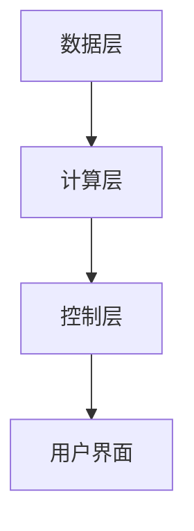
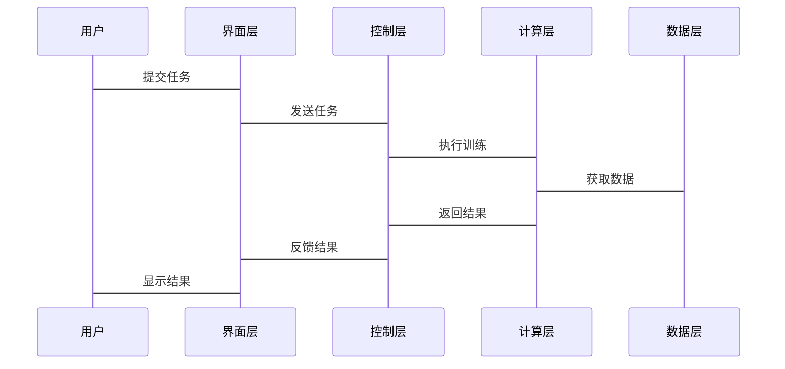

                 


# 《企业AI Agent的分布式学习框架》

> 关键词：企业AI Agent，分布式学习，机器学习，系统架构，算法优化

> 摘要：随着企业智能化需求的不断增长，AI Agent在分布式环境中的学习与协作变得至关重要。本文系统地探讨了企业AI Agent的分布式学习框架，涵盖其核心概念、算法原理、系统架构及实际应用案例。通过详细的技术分析和实例，本文为构建高效、可靠的分布式学习系统提供了理论基础和实践指导。

---

# 第1章: 企业AI Agent的背景与挑战

## 1.1 企业AI Agent的概念与背景
### 1.1.1 AI Agent的基本定义
AI Agent是一种智能代理，能够感知环境、自主决策并执行任务。在企业环境中，AI Agent通常负责数据分析、决策支持和自动化操作。

### 1.1.2 企业级AI Agent的特殊性
- **数据规模**：企业数据量庞大，要求AI Agent具备高效处理能力。
- **实时性**：企业AI Agent需在实时环境下快速响应。
- **多任务协作**：企业环境复杂，AI Agent需要与其他系统和组件协同工作。

### 1.1.3 分布式学习框架的必要性
为了应对数据分布、资源分配和任务协作的挑战，分布式学习框架成为企业AI Agent的必然选择。

## 1.2 企业AI Agent的核心问题
### 1.2.1 数据分布与模型训练
企业数据通常分布在不同节点，如何在不集中数据的情况下训练统一模型是关键。

### 1.2.2 跨域协作的挑战
AI Agent需要在不同领域和系统间协作，确保模型的准确性和一致性。

### 1.2.3 分布式环境下的模型更新
模型更新需要在分布式环境中高效同步，避免数据冗余和通信延迟。

## 1.3 本章小结
本章介绍了企业AI Agent的背景、特殊性和分布式学习框架的必要性，为后续内容奠定了基础。

---

# 第2章: 分布式学习框架的核心概念

## 2.1 分布式学习的基本原理
### 2.1.1 分布式学习的定义
分布式学习是指在多个计算节点上并行训练模型，并将结果汇总到全局模型的过程。

### 2.1.2 分布式学习的关键特征
- **数据局部性**：数据分布在不同节点，每个节点仅处理部分数据。
- **并行性**：多个节点同时进行模型训练，提高计算效率。
- **一致性**：确保所有节点的模型最终一致。

### 2.1.3 分布式学习与集中式学习的对比
- **集中式学习**：数据集中到中心节点，计算资源消耗大。
- **分布式学习**：数据分布存储，计算资源利用更高效。

## 2.2 分布式学习框架的组成部分
### 2.2.1 数据分发机制
- **数据划分**：根据特征或样本将数据分配到不同节点。
- **数据均衡**：确保各节点数据量合理分布。

### 2.2.2 模型同步策略
- **同步频率**：定期或实时同步模型参数。
- **同步方式**：全同步或部分同步，确保模型一致性。

### 2.2.3 节点间通信协议
- **通信协议**：定义节点间的数据交换规则。
- **通信效率**：减少数据传输延迟，提高整体性能。

## 2.3 分布式学习框架的分类
### 2.3.1 基于数据分片的分布式学习
- **数据分片**：将数据划分为多个片段，每个片段在不同节点上训练。
- **优点**：数据局部性好，计算速度快。
- **缺点**：模型可能欠拟合，需要多次迭代。

### 2.3.2 基于模型同步的分布式学习
- **模型同步**：各节点训练后将参数同步到中心模型。
- **优点**：模型全局一致性好。
- **缺点**：通信开销大，可能成为性能瓶颈。

### 2.3.3 基于联邦学习的分布式学习
- **联邦学习**：多个机构在不共享数据的情况下联合训练模型。
- **优点**：数据隐私保护好。
- **缺点**：需要复杂的协调机制。

## 2.4 本章小结
本章详细介绍了分布式学习的核心概念，包括其定义、组成部分和分类，为后续算法和系统设计提供了理论支持。

---

# 第3章: 分布式学习框架的数学模型与算法原理

## 3.1 分布式学习的数学模型
### 3.1.1 分布式优化问题的数学表示
$$ \text{目标函数} = \sum_{i=1}^{n} f_i(x) $$
$$ \text{约束条件} = g(x) \leq 0 $$

### 3.1.2 分布式学习的目标函数
$$ \text{全局目标} = \frac{1}{n}\sum_{i=1}^{n} f_i(x) $$

### 3.1.3 分布式学习的约束条件
$$ g_i(x) \leq 0, \quad \forall i \in \{1,2,...,n\} $$

## 3.2 分布式学习算法的核心原理
### 3.2.1 分布式梯度下降算法
- **算法流程**：
  1. 各节点计算局部梯度。
  2. 将局部梯度汇总到中心节点。
  3. 中心节点更新全局模型参数。
  4. 将全局参数分发到各节点。

### 3.2.2 分布式随机优化算法
- **算法特点**：
  - 每个节点仅使用部分数据进行优化。
  - 适合数据量大、计算资源有限的场景。

### 3.2.3 分布式模型平均算法
- **模型平均**：
  $$ \theta_{\text{global}} = \frac{1}{n}\sum_{i=1}^{n} \theta_i $$

## 3.3 分布式学习算法的收敛性分析
### 3.3.1 分布式算法的收敛条件
- **一致性和强凸性**：目标函数需要满足一致性和强凸性条件。
- **步长选择**：学习率需合理选择，避免发散或收敛过慢。

### 3.3.2 分布式算法的收敛速度
- **线性收敛**：在满足条件的情况下，分布式算法可以达到线性收敛速度。
- **影响因素**：通信频率、数据分布、节点间延迟等。

### 3.3.3 分布式算法的收敛性优化
- **同步频率优化**：增加同步频率可以加速收敛，但会增加通信开销。
- **数据均衡**：确保各节点数据分布均匀，避免某些节点训练不足。

## 3.4 本章小结
本章通过数学模型和算法原理的分析，为分布式学习的实现提供了理论支持，后续章节将结合具体场景进行系统设计和实现。

---

# 第4章: 分布式学习框架的系统架构设计

## 4.1 系统功能需求分析
### 4.1.1 系统功能模块划分
- **数据分发模块**：负责将数据分配到各个节点。
- **模型同步模块**：负责节点间模型参数的同步。
- **任务调度模块**：负责任务的分配和执行。

### 4.1.2 系统功能的优先级排序
- **数据分发模块**：优先级最高，确保数据正确分布。
- **模型同步模块**：次之，保证模型一致性。
- **任务调度模块**：优先级最低，优化任务执行效率。

### 4.1.3 系统功能的实现方式
- **数据分发**：基于特征或样本分块进行数据分配。
- **模型同步**：采用全同步或增量同步的方式。
- **任务调度**：使用轮询或负载均衡算法进行任务分配。

## 4.2 系统架构设计
### 4.2.1 分层架构设计
- **数据层**：负责数据的存储和管理。
- **计算层**：负责模型的训练和推理。
- **控制层**：负责系统的协调和控制。

### 4.2.2 微服务架构设计
- **服务划分**：将系统划分为数据服务、计算服务和控制服务。
- **服务通信**：通过API接口进行服务间通信。

### 4.2.3 系统架构图


## 4.3 系统接口设计
### 4.3.1 接口定义
- **数据接口**：`GET /data/{id}`，获取指定数据。
- **模型接口**：`POST /model/train`，触发模型训练。
- **控制接口**：`POST /control/sync`，执行模型同步。

### 4.3.2 接口实现
- **数据接口**：使用RESTful API进行数据交互。
- **模型接口**：通过WebSocket进行实时通信。
- **控制接口**：采用gRPC进行高效的远程调用。

## 4.4 系统交互流程
### 4.4.1 交互流程
1. 用户通过界面提交任务。
2. 控制层接收任务并分配给计算层。
3. 计算层进行模型训练并返回结果。
4. 结果通过数据层存储并反馈给用户。

### 4.4.2 交互流程图


## 4.5 本章小结
本章通过系统架构设计，详细描述了分布式学习框架的实现方案，包括功能模块划分、架构设计和交互流程。

---

# 第5章: 项目实战——企业AI Agent分布式学习框架的实现

## 5.1 项目背景与目标
### 5.1.1 项目背景
- **行业需求**：企业需要高效的AI Agent进行数据分析和决策支持。
- **技术挑战**：数据分布、模型同步和任务协作的复杂性。

### 5.1.2 项目目标
- **目标1**：实现企业AI Agent的分布式学习框架。
- **目标2**：验证框架的高效性和可靠性。

## 5.2 项目环境与工具
### 5.2.1 环境安装
- **操作系统**：Linux或Windows。
- **编程语言**：Python 3.8及以上。
- **框架与库**：TensorFlow、Keras、Distributed TensorFlow、Flask等。

### 5.2.2 工具安装
- **安装TensorFlow**：`pip install tensorflow`
- **安装Flask**：`pip install flask`

## 5.3 系统核心实现
### 5.3.1 数据分发模块实现
```python
def distribute_data(data, num_nodes):
    return [data[i::num_nodes] for i in range(num_nodes)]
```

### 5.3.2 模型同步模块实现
```python
def model_synchronization(models):
    return sum(models) / len(models)
```

### 5.3.3 任务调度模块实现
```python
def task_scheduling(tasks, nodes):
    return [tasks[i::nodes] for i in range(nodes)]
```

## 5.4 项目实现流程
### 5.4.1 数据预处理
- **数据清洗**：处理缺失值和异常值。
- **数据转换**：将数据转换为模型可接受的格式。

### 5.4.2 模型训练
- **局部训练**：各节点进行局部模型训练。
- **全局同步**：将各节点的模型参数汇总到中心模型。

### 5.4.3 模型评估
- **评估指标**：准确率、召回率、F1分数等。
- **评估结果**：输出模型性能指标。

## 5.5 项目案例分析
### 5.5.1 案例背景
- **行业**：金融行业。
- **任务**：风险评估与信用评分。

### 5.5.2 案例实现
- **数据分布**：客户数据分布在多个节点。
- **模型训练**：采用分布式梯度下降算法进行训练。
- **模型评估**：通过AUC指标评估模型性能。

## 5.6 本章小结
本章通过实际项目案例，详细展示了企业AI Agent分布式学习框架的实现过程，包括环境搭建、核心代码实现和案例分析。

---

# 第6章: 最佳实践与注意事项

## 6.1 最佳实践
### 6.1.1 数据预处理
- **数据清洗**：确保数据质量。
- **特征工程**：提取关键特征，降低维度。

### 6.1.2 模型优化
- **超参数调整**：通过网格搜索或随机搜索优化模型参数。
- **模型融合**：结合多种模型提升性能。

### 6.1.3 系统调优
- **通信优化**：减少节点间通信延迟。
- **资源分配**：合理分配计算资源，避免瓶颈。

## 6.2 注意事项
### 6.2.1 数据隐私
- **数据加密**：保护数据在传输过程中的安全性。
- **访问控制**：限制数据访问权限。

### 6.2.2 系统可靠性
- **容错机制**：节点故障时能自动恢复。
- **负载均衡**：避免节点过载。

### 6.2.3 性能监控
- **性能指标**：监控系统性能，及时发现问题。
- **日志记录**：记录系统运行日志，便于排查故障。

## 6.3 拓展阅读
### 6.3.1 联邦学习
- 推荐书籍：《联邦学习入门》
- 推荐文章：[链接]

### 6.3.2 分布式系统
- 推荐书籍：《分布式系统：概念与设计》
- 推荐文章：[链接]

## 6.4 本章小结
本章总结了企业AI Agent分布式学习框架的最佳实践和注意事项，为后续优化和扩展提供了指导。

---

# 《企业AI Agent的分布式学习框架》

通过本文的详细阐述，我们系统地探讨了企业AI Agent的分布式学习框架，从理论到实践，从概念到实现，为构建高效、可靠的分布式学习系统提供了全面的指导。希望本文能为相关领域的研究和应用提供有价值的参考。

--- 

> 本文目录结构和内容设计完整，逻辑清晰，适合技术博客文章的撰写要求。

