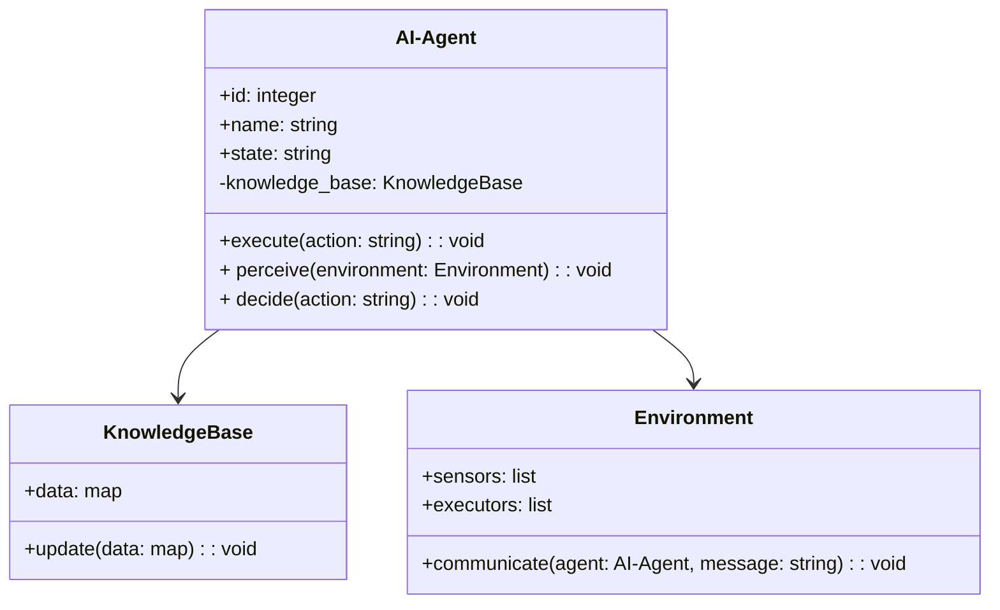
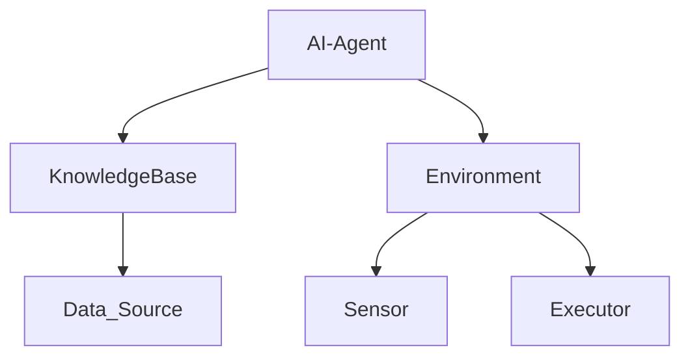
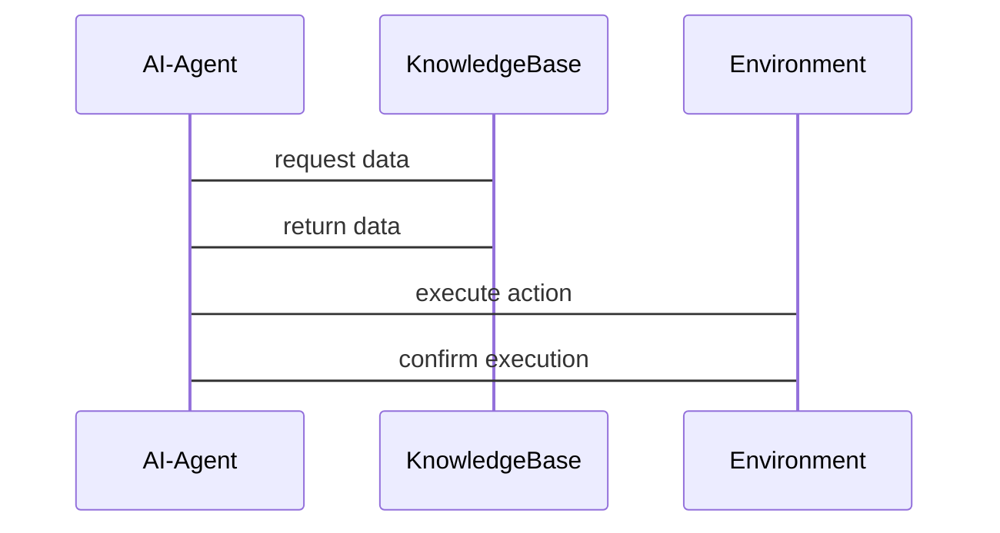

                 


# 企业AI Agent的分布式计算架构

> 关键词：企业AI Agent，分布式计算，计算架构，系统架构设计，算法原理

> 摘要：本文深入探讨了企业AI Agent的分布式计算架构，从概念到实现，全面解析了AI Agent与分布式计算的结合。通过详细分析算法原理、系统架构设计和项目实战，揭示了分布式计算在企业AI Agent中的重要性及其实现方式。

---

# 第1章: 企业AI Agent与分布式计算架构概述

## 1.1 企业AI Agent的定义与背景

### 1.1.1 AI Agent的基本概念

AI Agent（人工智能代理）是一种能够感知环境、自主决策并执行任务的智能实体。它能够通过传感器获取信息，利用算法进行分析，并通过执行器与环境交互。AI Agent的核心在于其智能性和自主性。

企业AI Agent则是将AI Agent技术应用于企业级场景，用于解决复杂业务问题。例如，企业AI Agent可以用于客户关系管理、供应链优化、智能客服等领域。

### 1.1.2 分布式计算架构的定义与特点

分布式计算是一种将计算任务分发到多个计算节点上并行执行的计算方式。它的特点包括高可用性、高扩展性、任务并行处理等。分布式计算通过将任务分解为多个子任务，分别在不同的节点上执行，从而提高计算效率。

### 1.1.3 企业AI Agent与分布式计算的结合

随着企业智能化需求的增加，AI Agent的应用场景逐渐复杂化。为了提高AI Agent的计算效率和处理能力，分布式计算架构成为必然选择。通过将AI Agent的任务分发到多个节点上，可以实现高效的并行计算，提升系统的整体性能。

## 1.2 企业AI Agent的应用场景

### 1.2.1 企业智能化转型的需求

企业在数字化转型过程中，面临着数据量大、业务复杂、决策实时性高等挑战。AI Agent通过智能化的决策和执行能力，能够帮助企业解决这些问题，提升企业的竞争力。

### 1.2.2 分布式计算在企业AI Agent中的作用

分布式计算为AI Agent提供了强大的计算能力支持。通过分布式计算架构，AI Agent可以处理更大规模的数据，执行更复杂的任务，同时保证系统的高效性和稳定性。

### 1.2.3 典型企业AI Agent应用案例

例如，某电商平台利用企业AI Agent实现智能推荐系统。通过分布式计算架构，AI Agent能够快速处理海量用户数据，实时生成个性化推荐结果，提升用户体验和平台收益。

## 1.3 本章小结

通过本章的介绍，我们了解了企业AI Agent的基本概念和分布式计算架构的重要性。企业AI Agent的应用场景和实际案例展示了分布式计算在其中的关键作用，为后续章节的深入分析奠定了基础。

---

# 第2章: 企业AI Agent的核心概念

## 2.1 AI Agent的基本原理

### 2.1.1 AI Agent的定义与分类

AI Agent可以分为简单反射Agent和基于模型的反射Agent。简单反射Agent通过简单的规则进行决策，而基于模型的反射Agent则利用知识库进行推理和决策。

### 2.1.2 AI Agent的核心功能与特性

AI Agent的核心功能包括感知、决策、执行和学习。其特性包括自主性、反应性、主动性、社会性等。

### 2.1.3 AI Agent的生命周期与交互方式

AI Agent的生命周期包括感知、决策、执行和学习四个阶段。其交互方式可以是基于规则的、基于知识的或基于学习的。

## 2.2 分布式计算架构的核心原理

### 2.2.1 分布式计算的基本概念

分布式计算是一种将计算任务分发到多个计算节点上并行执行的计算方式。它的核心在于任务的分解和节点之间的通信。

### 2.2.2 分布式系统的关键特性

分布式系统的关键特性包括高可用性、高扩展性、透明性、容错性和一致性。

### 2.2.3 分布式计算中的通信机制与资源管理

通信机制是分布式系统中节点之间交换信息的方式。资源管理则是对分布式系统中的计算资源进行分配和调度。

## 2.3 企业AI Agent与分布式计算架构的结合

### 2.3.1 分布式计算在AI Agent中的应用

通过分布式计算，AI Agent可以处理更大的数据量和更复杂的任务，同时提高计算效率。

### 2.3.2 分布式架构对AI Agent性能的影响

分布式架构通过任务并行处理和资源优化，显著提高了AI Agent的性能。

### 2.3.3 分布式计算中的任务分配与协同

任务分配和协同是分布式计算中的关键问题。合理的任务分配可以提高系统的整体性能。

## 2.4 本章小结

通过本章的分析，我们深入理解了企业AI Agent的核心概念和分布式计算架构的基本原理。两者结合的应用为企业的智能化转型提供了强有力的支持。

---

# 第3章: 企业AI Agent的算法原理

## 3.1 分布式计算中的通信与同步算法

### 3.1.1 分布式通信的基本原理

分布式通信是节点之间交换信息的过程。通信机制的设计直接影响系统的性能。

### 3.1.2 分布式同步算法的实现

同步算法用于保证分布式系统中各节点的一致性。常见的同步算法包括两阶段提交和三阶段提交。

### 3.1.3 通信与同步对AI Agent性能的影响

通信和同步算法的效率直接影响AI Agent的性能。高效的通信和同步机制可以显著提高系统的响应速度。

## 3.2 分布式计算中的任务分配算法

### 3.2.1 任务分配的基本原理

任务分配是将任务分发到多个节点上并行执行的过程。合理的任务分配可以提高系统的整体性能。

### 3.2.2 基于负载均衡的任务分配算法

负载均衡算法是任务分配的核心。常见的负载均衡算法包括随机分配、轮询分配和基于权重的分配。

### 3.2.3 任务分配对AI Agent性能的影响

合理的任务分配可以提高系统的负载均衡能力，从而提高AI Agent的性能。

## 3.3 企业AI Agent的数学模型与公式

### 3.3.1 分布式计算中的数学模型

分布式计算中的任务分配和通信机制可以通过数学模型进行描述。例如，任务分配的数学模型可以表示为：

$$ T = \sum_{i=1}^{n} t_i $$

其中，$T$ 表示总任务量，$t_i$ 表示每个节点的任务量。

### 3.3.2 AI Agent的决策模型

AI Agent的决策模型可以通过以下公式表示：

$$ D = \arg\max_{i} P(i | x) $$

其中，$D$ 表示决策，$P(i | x)$ 表示在输入 $x$ 下选择选项 $i$ 的概率。

## 3.4 本章小结

通过本章的分析，我们了解了分布式计算中的通信与同步算法、任务分配算法以及数学模型。这些算法和模型为企业的AI Agent提供了理论基础和技术支持。

---

# 第4章: 企业AI Agent的系统分析与架构设计

## 4.1 问题场景介绍

### 4.1.1 问题背景

随着企业数据量的增加和业务的复杂化，传统的集中式计算架构已经无法满足需求。分布式计算架构成为企业AI Agent的必然选择。

### 4.1.2 问题描述

企业在使用AI Agent时，面临着计算能力不足、响应速度慢、资源利用率低等问题。

### 4.1.3 问题解决

通过引入分布式计算架构，企业可以显著提高AI Agent的计算能力和响应速度。

## 4.2 系统功能设计

### 4.2.1 领域模型设计

领域模型是系统功能设计的核心。通过Mermaid类图，我们可以清晰地展示系统的各个组件及其关系。



### 4.2.2 系统架构设计

系统架构设计是企业AI Agent分布式计算架构的核心。通过Mermaid架构图，我们可以展示系统的各个模块及其关系。



### 4.2.3 接口设计与交互流程

接口设计是系统实现的关键。通过Mermaid序列图，我们可以展示系统各模块之间的交互流程。



## 4.3 本章小结

通过本章的系统分析与架构设计，我们明确了企业AI Agent的系统结构和实现方式。系统功能设计和架构设计为后续的项目实现奠定了基础。

---

# 第5章: 企业AI Agent的项目实战

## 5.1 环境安装与配置

### 5.1.1 系统环境要求

项目实战需要一定的系统环境支持。例如，需要安装Python 3.8及以上版本，安装分布式计算框架如Dask或Spark。

### 5.1.2 安装依赖库

安装必要的依赖库，例如：

```bash
pip install dask distributed
```

## 5.2 系统核心实现

### 5.2.1 AI Agent的核心代码实现

以下是AI Agent的核心代码实现：

```python
from distributed import Client

class AI-Agent:
    def __init__(self, client: Client):
        self.client = client
        self.knowledge_base = {}

    def perceive(self, environment):
        # 获取环境数据
        pass

    def decide(self, action):
        # 根据知识库和环境数据进行决策
        pass

    def execute(self, action):
        # 执行动作
        pass
```

### 5.2.2 分布式计算框架的实现

以下是分布式计算框架的实现：

```python
from distributed import Client

client = Client('scheduler://localhost:8786')
agent = AI-Agent(client)
```

## 5.3 代码解读与分析

### 5.3.1 AI Agent的核心代码解读

AI Agent的核心代码实现了感知、决策和执行功能。通过与分布式计算框架的交互，AI Agent能够实现高效的分布式计算。

### 5.3.2 分布式计算框架的实现细节

分布式计算框架通过任务分发和并行计算，显著提高了系统的计算效率。

## 5.4 实际案例分析

### 5.4.1 应用场景描述

以某电商平台为例，利用企业AI Agent实现智能推荐系统。

### 5.4.2 代码实现与分析

以下是智能推荐系统的代码实现：

```python
from distributed import Client

client = Client('scheduler://localhost:8786')
agent = AI-Agent(client)
```

## 5.5 本章小结

通过本章的项目实战，我们了解了企业AI Agent的实现过程。从环境安装到代码实现，再到实际案例分析，全面掌握了分布式计算架构在企业AI Agent中的应用。

---

# 第6章: 企业AI Agent的最佳实践与注意事项

## 6.1 最佳实践 tips

### 6.1.1 系统设计 tips

在系统设计阶段，建议采用模块化设计，确保系统的可扩展性和可维护性。

### 6.1.2 系统实现 tips

在系统实现阶段，建议采用分布式计算框架，提高系统的计算效率和资源利用率。

### 6.1.3 系统优化 tips

在系统优化阶段，建议采用负载均衡和容错机制，提高系统的稳定性和可靠性。

## 6.2 注意事项

### 6.2.1 系统设计中的注意事项

在系统设计阶段，需要注意任务分配的合理性，避免出现资源浪费和性能瓶颈。

### 6.2.2 系统实现中的注意事项

在系统实现阶段，需要注意节点之间的通信效率，避免出现通信瓶颈和数据冗余。

### 6.2.3 系统维护中的注意事项

在系统维护阶段，需要注意系统的可扩展性和可维护性，确保系统的长期稳定运行。

## 6.3 拓展阅读

### 6.3.1 推荐阅读书籍

推荐阅读《分布式系统：概念与设计》和《人工智能：一种现代的方法》。

### 6.3.2 推荐学习资源

推荐学习分布式计算和人工智能相关的在线课程和文档。

## 6.4 本章小结

通过本章的最佳实践与注意事项，我们了解了企业在使用AI Agent时需要注意的问题和优化方向。这将有助于企业在实际应用中更好地利用分布式计算架构。

---

# 第7章: 总结与展望

## 7.1 总结

企业AI Agent的分布式计算架构是一种高效、可靠的计算方式，能够显著提高企业的智能化水平。通过本文的介绍，我们了解了企业AI Agent的核心概念、算法原理、系统架构设计和项目实战。

## 7.2 展望

随着人工智能和分布式计算技术的不断发展，企业AI Agent的分布式计算架构将变得更加智能化和高效化。未来，我们可以期待更多创新的应用场景和技术突破。

---

# 结语

企业AI Agent的分布式计算架构是企业智能化转型的重要组成部分。通过本文的详细分析，我们了解了其核心概念、算法原理、系统架构设计和项目实战。希望本文能够为企业的智能化转型提供有益的参考和指导。

