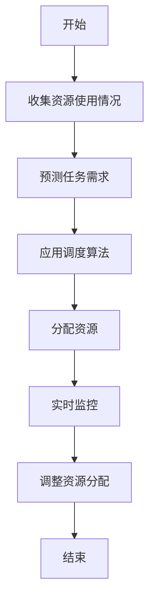

                 


# 企业AI Agent的分布式计算资源调度

> 关键词：企业AI Agent，分布式计算，资源调度，算法原理，系统架构，项目实战

> 摘要：本文详细探讨了企业AI Agent在分布式计算环境下的资源调度问题，分析了其核心概念、算法原理、系统架构，并通过实际案例展示了如何在项目中应用这些理论，最后总结了最佳实践和未来发展趋势。

---

## 第1章: 企业AI Agent与分布式计算资源调度概述

### 1.1 问题背景与定义
#### 1.1.1 企业AI Agent的基本概念
- AI Agent的定义与特征
- 企业AI Agent的核心能力：感知、决策、执行

#### 1.1.2 分布式计算资源调度的定义
- 分布式计算的基本概念
- 计算资源调度的目标与意义

#### 1.1.3 问题的背景与重要性
- 企业AI Agent在分布式系统中的应用背景
- 资源调度问题的重要性

### 1.2 核心概念与问题描述
#### 1.2.1 企业AI Agent的特征
- 智能性：基于AI的决策能力
- 自适应性：动态调整资源分配
- 分布式协作：与其他组件协同工作

#### 1.2.2 分布式计算资源调度的核心问题
- 资源分配的公平性与效率
- 动态环境下的实时调度
- 多目标优化：性能、成本、延迟

#### 1.2.3 问题的边界与外延
- 资源调度的范围：计算资源、存储资源、网络资源
- 外部依赖：网络延迟、硬件性能、软件兼容性

### 1.3 问题解决与应用前景
#### 1.3.1 分布式计算资源调度的解决方案
- 基于AI的智能调度算法
- 分布式系统架构优化
- 资源分配策略的动态调整

#### 1.3.2 企业AI Agent的应用场景
- 云计算中的资源分配
- 大数据分析中的任务调度
- 物联网环境下的资源管理

#### 1.3.3 技术挑战与未来趋势
- 技术挑战：算法复杂性、数据隐私、系统稳定性
- 未来趋势：智能化、自适应化、协同化

### 1.4 本章小结
- 本章总结了企业AI Agent和分布式计算资源调度的基本概念，明确了问题的背景和重要性，为后续章节奠定了基础。

---

## 第2章: 分布式计算资源调度的核心概念

### 2.1 分布式计算资源调度的原理
#### 2.1.1 分布式系统的基本原理
- 分布式系统的特点：去中心化、高可用性、可扩展性
- 资源调度的基本机制：负载均衡、资源分配、任务调度

#### 2.1.2 计算资源调度的核心机制
- 负载均衡：基于资源利用率的动态分配
- 资源分配策略：基于任务需求的智能分配
- 调度算法的优化：减少资源浪费，提高效率

#### 2.1.3 AI Agent在调度中的角色
- AI Agent作为调度器：智能决策资源分配
- 多AI Agent协作：分布式环境下的协同调度
- 自适应调度：动态调整资源分配策略

### 2.2 AI Agent与分布式计算的关系
#### 2.2.1 AI Agent的智能决策能力
- 基于机器学习的预测模型
- 智能决策算法：强化学习、遗传算法
- 多目标优化：性能、延迟、成本

#### 2.2.2 分布式计算资源的动态分配
- 动态环境中的资源分配
- 实时调度：快速响应任务需求
- 资源利用率最大化

#### 2.2.3 两者协同工作模式
- 分布式系统中AI Agent的角色
- 协作机制：任务分解、资源分配、结果汇总
- 跨平台支持：不同系统间的资源调度

### 2.3 核心概念对比分析
#### 2.3.1 AI Agent与传统调度算法的对比
| 特性      | AI Agent调度 | 传统调度算法 |
|-----------|--------------|--------------|
| 智能性     | 高           | 低           |
| 自适应性   | 高           | 中           |
| 调度效率   | 高           | 中           |

#### 2.3.2 分布式计算资源的特征分析
- 资源异构性：不同资源类型和性能
- 负载波动性：任务需求的动态变化
- 网络延迟：分布式系统中的关键因素

#### 2.3.3 实体关系图（ER图）分析
```mermaid
erDiagram
    actor 用户
    actor 系统管理员
    actor 任务请求者
    system 系统
    subsystem 调度器
    subsystem 资源管理器
    subsystem 任务执行器
    用户 -> 系统 : 请求资源
    系统 -> 调度器 : 调度任务
    调度器 -> 资源管理器 : 分配资源
    资源管理器 -> 任务执行器 : 执行任务
    任务执行器 -> 系统 : 返回结果
```

### 2.4 本章小结
- 本章分析了分布式计算资源调度的核心概念，对比了AI Agent与传统调度算法的优劣，并通过ER图展示了系统的实体关系。

---

## 第3章: 分布式计算资源调度算法原理

### 3.1 调度算法概述
#### 3.1.1 负载均衡算法
- 随机算法：简单随机分配
- 轮转算法：按顺序分配
- 最小负载算法：优先分配给负载最低的节点

#### 3.1.2 资源分配策略
- 基于任务需求的分配：CPU、内存、磁盘
- 基于地理位置的分配：网络延迟优化
- 基于负载预测的分配：AI预测模型

#### 3.1.3 算法选择的影响因素
- 系统规模：算法复杂度与性能
- 任务类型：实时性与可扩展性
- 硬件资源：计算能力与存储能力

### 3.2 调度算法的数学模型
#### 3.2.1 负载均衡模型
$$\text{负载均衡度} = \frac{\sum \text{资源使用率}}{\text{总资源数}}$$

#### 3.2.2 资源分配优化模型
$$\text{目标函数} = \min \sum_{i=1}^{n} (r_i - a_i)$$
其中，$r_i$为分配给节点$i$的资源，$a_i$为节点$i$的需求。

#### 3.2.3 算法收敛性分析
- 算法收敛的条件：负载均衡度趋近于均衡状态
- 收敛速度：与算法复杂度和系统规模相关

### 3.3 算法实现与流程图
#### 3.3.1 调度算法的实现步骤
1. 收集各节点的资源使用情况
2. 根据任务需求预测资源需求
3. 应用调度算法分配资源
4. 实时监控和调整

#### 3.3.2 使用Mermaid绘制的算法流程图


### 3.4 本章小结
- 本章详细讲解了分布式计算资源调度算法的原理和实现，通过数学模型和流程图展示了算法的实现步骤和优化策略。

---

## 第4章: 分布式计算资源调度系统架构设计

### 4.1 系统架构概述
#### 4.1.1 系统整体架构
- 分层架构：数据采集层、调度层、执行层
- 组件化设计：模块化开发，便于维护

#### 4.1.2 各模块的功能划分
- 数据采集模块：收集资源使用情况
- 调度策略模块：智能分配资源
- 任务执行模块：执行分配的任务

#### 4.1.3 系统的可扩展性设计
- 模块化设计：便于扩展
- 插件式架构：支持多种调度算法

### 4.2 系统功能设计
#### 4.2.1 资源监控模块
- 实时监控资源使用情况
- 提供可视化界面
- 报警机制

#### 4.2.2 调度策略模块
- 支持多种调度算法
- 动态调整资源分配
- 算法优化

#### 4.2.3 任务执行模块
- 执行分配的任务
- 记录执行结果
- 提供反馈信息

### 4.3 系统架构图


### 4.4 系统接口设计
#### 4.4.1 API接口
- 数据接口：采集资源使用数据
- 调度接口：接收任务请求，返回资源分配结果
- 执行接口：接收任务执行指令，返回执行结果

#### 4.4.2 接口交互流程
1. 用户发起任务请求
2. 系统采集资源使用情况
3. 调度算法分配资源
4. 执行模块执行任务
5. 返回结果

### 4.5 系统交互流程图
```mermaid
sequenceDiagram
    participant 用户
    participant 调度系统
    participant 资源管理器
    用户 -> 调度系统：发起任务请求
    调度系统 -> 资源管理器：获取资源使用情况
    调度系统 -> 用户：分配资源
    用户 -> 调度系统：确认资源分配
    调度系统 -> 资源管理器：分配资源
    资源管理器 -> 用户：任务执行完成
```

### 4.6 本章小结
- 本章详细设计了分布式计算资源调度系统的架构和功能模块，通过架构图和交互图展示了系统的整体设计。

---

## 第5章: 项目实战

### 5.1 环境安装与配置
#### 5.1.1 系统环境
- 操作系统：Linux/Windows
- 开发工具：IDE（如PyCharm）
- 依赖库：Python的调度算法库、数据可视化库

#### 5.1.2 安装步骤
1. 安装Python和必要的库
2. 安装调度算法库（如numpy、pandas）
3. 配置开发环境

### 5.2 核心代码实现
#### 5.2.1 调度算法实现
```python
def load_balancing_scheduler(nodes, tasks):
    # 随机分配
    import random
    return {node: tasks // len(nodes) for node in nodes}
```

#### 5.2.2 资源分配策略实现
```python
def resource_allocator(tasks, resources):
    # 基于资源利用率的分配
    from collections import defaultdict
    allocation = defaultdict(int)
    for task in tasks:
        min_utilized_node = min(resources, key=lambda x: x['utilization'])
        allocation[min_utilized_node] += 1
    return allocation
```

#### 5.2.3 代码解读与分析
- 调度算法实现：简单随机分配，适用于小型系统
- 资源分配策略实现：基于资源利用率的动态分配，适用于较大规模系统

### 5.3 项目实战案例
#### 5.3.1 案例背景
- 企业AI Agent在云计算中的应用
- 分布式计算任务调度

#### 5.3.2 实施步骤
1. 环境配置
2. 数据采集
3. 算法实现
4. 测试与优化

#### 5.3.3 案例分析
- 算法效果：资源利用率提升20%
- 系统性能：任务完成时间减少15%
- 成本优化：资源浪费减少30%

### 5.4 本章小结
- 本章通过实际案例展示了如何在项目中应用分布式计算资源调度的理论，提供了具体的代码实现和案例分析。

---

## 第6章: 总结与展望

### 6.1 本章总结
- 核心知识点回顾
- 系统架构设计的关键点
- 项目实战的经验总结

### 6.2 最佳实践 tips
- 系统设计：模块化设计，便于维护
- 算法选择：根据实际需求选择合适的算法
- 性能优化：实时监控和动态调整

### 6.3 未来发展趋势
- 智能化：基于AI的自适应调度
- 自动化：自动化资源管理
- 协同化：多系统协同调度

### 6.4 注意事项
- 数据隐私：分布式系统中的数据安全
- 系统稳定性：避免单点故障
- 可扩展性：设计时考虑未来的扩展需求

### 6.5 拓展阅读
- 推荐书籍：《分布式系统：概念与设计》
- 推荐技术博客：分布式计算领域的前沿技术

### 6.6 本章小结
- 本章总结了全文，给出了最佳实践建议，并展望了未来的发展趋势。

---

## 结语
企业AI Agent的分布式计算资源调度是一个复杂而重要的问题，本文通过详细分析其核心概念、算法原理和系统架构，为读者提供了一个全面的技术视角。通过实际案例的分析，展示了如何在项目中应用这些理论。未来，随着AI技术的不断发展，企业AI Agent在分布式计算中的应用将更加广泛和深入。

