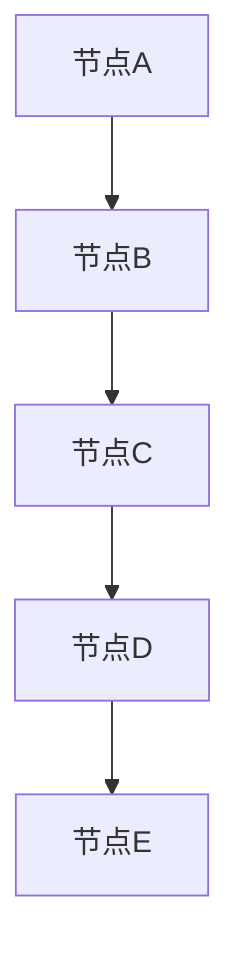
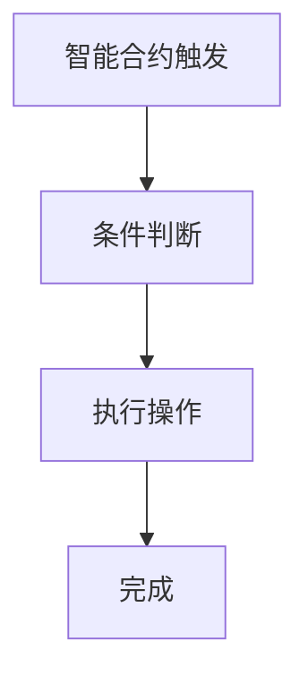
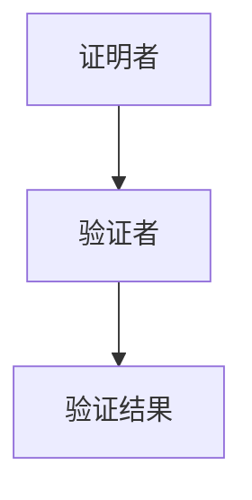
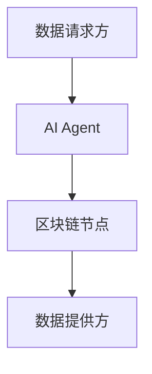
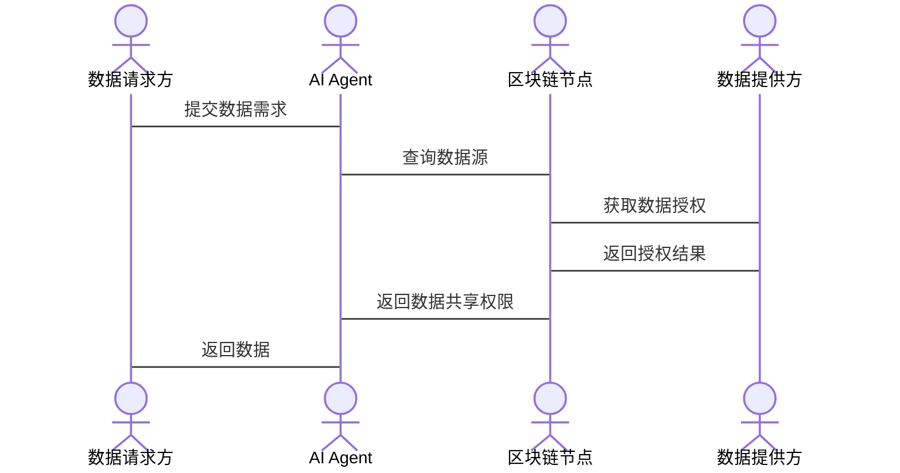

                 


# 《企业AI Agent的区块链数据共享与隐私保护》

> 关键词：企业AI Agent，区块链，数据共享，隐私保护，智能合约，共识机制，零知识证明

> 摘要：  
本文深入探讨了企业AI Agent与区块链技术在数据共享与隐私保护中的结合。通过分析数据共享的核心问题，介绍了AI Agent和区块链的核心概念与技术原理，详细讲解了如何通过区块链的共识机制与隐私保护技术（如零知识证明）来实现企业数据的安全共享。本文还提供了系统架构设计与实际项目案例，展示了如何将理论应用于实践，并总结了相关最佳实践与未来发展方向。

---

# 第1章: 企业AI Agent的背景与问题背景

## 1.1 问题背景

### 1.1.1 企业数据共享的现状与挑战
企业之间的数据共享是提升协作效率和业务创新能力的重要手段。然而，传统数据共享方式存在以下问题：
- 数据孤岛：企业间数据难以互联互通，数据利用率低。
- 数据隐私泄露：在共享过程中，数据可能被未经授权的第三方访问或篡改。
- 数据可信度问题：缺乏有效的机制来验证数据的真实性和完整性。

### 1.1.2 数据隐私保护的重要性
随着数据成为企业的重要资产，数据隐私保护已成为合规和法律要求的关键问题。企业需要在数据共享的同时，确保数据的安全性和隐私性，避免因数据泄露带来的法律风险和经济损失。

### 1.1.3 AI Agent在企业数据共享中的作用
AI Agent是一种能够自主决策和执行任务的智能体，能够帮助企业自动化处理数据共享中的复杂逻辑。通过结合区块链技术，AI Agent可以在数据共享过程中实现以下功能：
- 自动匹配数据需求与数据供给。
- 智能协商数据共享的条件和权限。
- 实时监控数据共享的安全性。

## 1.2 问题描述

### 1.2.1 数据共享中的隐私泄露风险
企业在共享数据时，可能因为技术漏洞或管理不善导致数据泄露。例如，未经加密的敏感数据可能被恶意攻击者窃取。

### 1.2.2 数据孤岛问题对企业效率的影响
数据孤岛导致企业间的协作效率低下，难以形成统一的数据生态，限制了企业业务的扩展和创新。

### 1.2.3 AI Agent在数据共享中的应用需求
企业需要一种高效、安全的数据共享机制，能够在保证数据隐私的前提下，实现数据的高效流通和利用。

## 1.3 问题解决思路

### 1.3.1 区块链技术在数据共享中的优势
区块链技术通过去中心化、不可篡改和可追溯的特性，为数据共享提供了一种安全、透明的解决方案。

### 1.3.2 AI Agent如何实现数据共享与隐私保护
AI Agent可以作为数据共享的智能中间件，利用区块链技术实现数据的安全存储、智能合约的自动执行，以及隐私保护技术（如零知识证明）来确保数据共享的安全性。

### 1.3.3 结合AI与区块链的解决方案
通过将AI Agent与区块链技术相结合，可以构建一个高效、安全、智能的企业数据共享平台，实现数据的可信共享与隐私保护。

## 1.4 边界与外延

### 1.4.1 企业AI Agent的边界
企业AI Agent专注于数据共享与隐私保护，其边界包括数据的获取、存储、共享和使用，但不涉及企业的核心业务逻辑。

### 1.4.2 区块链数据共享的外延
区块链数据共享的外延包括数据的存证、溯源、智能合约执行等，能够扩展到供应链管理、金融支付等多个领域。

### 1.4.3 本章小结
本章从企业数据共享的现状和挑战出发，分析了数据隐私保护的重要性，并提出了结合AI Agent和区块链技术的解决方案。

---

# 第2章: 核心概念与联系

## 2.1 核心概念原理

### 2.1.1 AI Agent的基本原理
AI Agent是一种智能体，能够通过感知环境、自主决策和执行任务来实现目标。在企业数据共享中，AI Agent可以作为数据的管理者和协调者。

### 2.1.2 区块链技术的核心机制
区块链通过去中心化的账本、共识机制和智能合约，实现了数据的安全存储和可信共享。

### 2.1.3 数据共享与隐私保护的平衡点
在数据共享中，需要在数据的可用性和隐私性之间找到平衡点，既要保证数据的共享价值，又要防止数据泄露。

## 2.2 核心概念属性特征对比

| **特性**       | **AI Agent**           | **区块链**             |
|-----------------|-----------------------|-----------------------|
| 数据存储方式   | 分散存储              | 去中心化存储          |
| 数据共享方式   | 智能化共享            | 去中心化共享          |
| 数据隐私保护   | 基于AI的隐私保护      | 基于密码学的隐私保护  |
| 可扩展性       | 高                    | 高                    |
| 可维护性       | 高                    | 中                    |

### 2.2.1 AI Agent与传统AI的区别
AI Agent具有自主决策能力，能够根据环境变化动态调整行为，而传统AI仅限于固定的算法和规则。

### 2.2.2 区块链与传统数据库的对比
区块链通过去中心化和不可篡改的特性，解决了传统数据库的信任问题。

### 2.2.3 数据共享与隐私保护的权衡
在数据共享中，隐私保护越严格，数据的可用性可能越低，因此需要找到平衡点。

## 2.3 ER实体关系图

```mermaid
er
  actor(Agent, role: "数据请求方")
  actor(User, role: "数据提供方")
  actor(Admin, role: "系统管理员")
  entity(Data, role: "共享数据")
  entity(Transaction, role: "数据共享记录")
  en
```

---

# 第3章: 算法原理讲解

## 3.1 区块链共识机制

### 3.1.1 共识机制的原理
共识机制（如PoW、PoS）用于保证区块链网络中所有节点对数据的一致性达成共识。

### 3.1.2 共识机制的流程图



### 3.1.3 共识机制的数学模型
$$
\text{共识机制的目标是确保所有节点达成一致，通过概率和时间复杂度进行评估。}
$$

## 3.2 智能合约原理

### 3.2.1 智能合约的定义
智能合约是区块链上的自动执行程序，用于实现数据共享的条件和权限。

### 3.2.2 智能合约的流程图



### 3.2.3 智能合约的实现
```python
def smart_contract():
    # 条件判断
    if condition:
        # 执行操作
        execute_operation()
    else:
        # 拒绝操作
        deny_operation()
```

## 3.3 零知识证明

### 3.3.1 零知识证明的原理
零知识证明是一种加密技术，允许一方证明数据的存在或真实性，而不透露数据的细节。

### 3.3.2 零知识证明的流程图



### 3.3.3 零知识证明的数学模型
$$
\text{零知识证明基于数论和密码学原理，通过交互式验证确保数据隐私。}
$$

---

# 第4章: 系统分析与架构设计方案

## 4.1 系统应用场景

### 4.1.1 数据共享平台
企业通过数据共享平台实现跨机构的数据协作。

### 4.1.2 数据隐私保护
通过区块链和零知识证明技术，确保数据共享过程中的隐私安全。

## 4.2 系统功能设计

### 4.2.1 数据存储与管理
- 数据存入区块链：确保数据的不可篡改性。
- 数据分类与标签：便于数据的检索和共享。

### 4.2.2 数据共享与访问控制
- AI Agent智能匹配数据需求：根据数据需求方的条件，自动匹配合适的数据源。
- 智能合约控制访问权限：基于数据提供方的授权，动态调整数据访问权限。

### 4.2.3 数据隐私保护
- 使用零知识证明技术：在数据共享过程中，验证数据的存在性，而不泄露数据的具体内容。
- 数据加密与解密：通过加密技术保护数据隐私。

## 4.3 系统架构设计

### 4.3.1 系统架构图



### 4.3.2 系统接口设计
- 数据请求方接口：提交数据需求，获取数据共享权限。
- 数据提供方接口：设置数据共享条件，管理数据访问权限。
- AI Agent接口：智能匹配数据需求，执行智能合约。

## 4.4 系统交互流程图



---

# 第5章: 项目实战

## 5.1 环境安装

### 5.1.1 安装区块链环境
- 使用以太坊或其他区块链平台搭建测试环境。
- 安装智能合约开发工具（如Solidity、Web3.js）。

### 5.1.2 安装AI Agent开发环境
- 安装Python或Java开发环境。
- 配置AI框架（如TensorFlow、PyTorch）。

## 5.2 核心代码实现

### 5.2.1 区块链智能合约实现
```solidity
// Solidity代码示例：智能合约用于数据共享权限管理
contract DataShare {
    mapping(address => bool) private authorized;

    function requestPermission(address _ requester) external {
        authorized[_requester] = true;
    }

    function isAuthorized(address _ requester) external view returns (bool) {
        return authorized[_requester];
    }
}
```

### 5.2.2 AI Agent实现
```python
class AI-Agent:
    def __init__(self):
        self.blockchain_node = BlockchainNode()
        self.data_storage = DataStorage()

    def request_data(self, data_request):
        # 匹配数据需求
        self.blockchain_node.query_data_source(data_request)
        # 获取数据授权
        permission = self.blockchain_node.check_permission(data_request.sender)
        if permission:
            return self.data_storage.get_data(data_request)
        else:
            return None
```

## 5.3 代码解读与分析

### 5.3.1 区块链智能合约解读
- `requestPermission`方法：允许指定地址的数据请求方访问数据。
- `isAuthorized`方法：验证数据请求方的权限。

### 5.3.2 AI Agent代码解读
- `AI-Agent`类：负责处理数据请求，匹配数据需求，获取数据授权，并从数据存储中获取数据。

## 5.4 实际案例分析

### 5.4.1 案例背景
某企业希望与其他企业共享供应链数据，通过区块链和AI Agent实现数据的安全共享。

### 5.4.2 案例实现步骤
1. 数据提供方部署智能合约，设置数据共享权限。
2. 数据请求方通过AI Agent提交数据需求。
3. AI Agent匹配数据源，并通过智能合约验证数据请求方的权限。
4. 数据提供方授权后，AI Agent从数据存储中获取数据并返回给数据请求方。

## 5.5 项目小结
通过实际案例，展示了如何将区块链和AI Agent技术结合，实现企业数据的安全共享与隐私保护。

---

# 第6章: 最佳实践

## 6.1 小结
- 企业AI Agent与区块链技术结合，能够有效解决数据共享中的隐私保护和可信性问题。
- 通过智能合约和零知识证明等技术，实现了数据的安全共享与隐私保护。

## 6.2 注意事项
- 数据隐私保护需要结合具体业务需求，选择合适的隐私保护技术。
- 系统设计时需要考虑性能优化和可扩展性。
- 智能合约的编写和部署需要严格测试，避免逻辑漏洞。

## 6.3 拓展阅读
- 区块链技术：深入理解共识机制、智能合约等核心概念。
- 零知识证明：研究其在数据隐私保护中的应用。
- AI Agent：探索其在更多领域的应用，如智能合约自动执行、自动化决策等。

---

# 附录: 数学公式与算法代码

## 1. 区块链共识机制的数学模型
$$
\text{共识机制的目标是确保所有节点达成一致，通过概率和时间复杂度进行评估。}
$$

## 2. 零知识证明的数学模型
$$
\text{零知识证明基于数论和密码学原理，通过交互式验证确保数据隐私。}
$$

---

# 结语
企业AI Agent与区块链技术的结合，为企业数据共享与隐私保护提供了新的解决方案。通过智能合约、零知识证明等技术，能够实现数据的安全共享与隐私保护。未来，随着技术的不断发展，企业AI Agent将在更多领域发挥重要作用。

