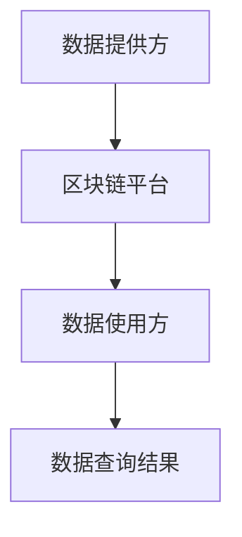
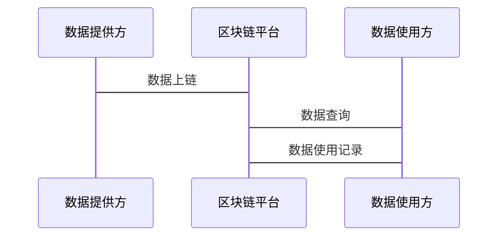

                 


# 企业AI Agent的区块链数据共享机制

> 关键词：企业AI Agent, 区块链, 数据共享, 分布式系统, 联邦学习, 跨链技术

> 摘要：本文探讨了企业AI Agent在区块链数据共享机制中的应用，详细分析了区块链技术如何支持企业AI Agent的数据共享需求，提出了基于区块链的AI Agent数据共享机制的设计与实现方案。文章从背景、概念、算法、系统架构到项目实战，全面解析了企业AI Agent的区块链数据共享机制的核心内容。

---

## 第一部分: 企业AI Agent与区块链数据共享机制概述

### 第1章: 企业AI Agent与区块链概述

#### 1.1 企业AI Agent的基本概念
- **AI Agent的定义与特点**
  - AI Agent是具备自主决策和问题解决能力的智能实体。
  - 具备感知环境、推理、规划和执行的能力。
- **企业AI Agent的应用场景**
  - 数据分析与决策支持
  - 自动化流程处理
  - 智能客服与助手
- **区块链技术的基本原理**
  - 去中心化、不可篡改、可追溯的特性。

#### 1.2 区块链与数据共享的关系
- **区块链的去中心化特性**
  - 解决数据孤岛问题，实现数据共享的可信机制。
- **区块链在数据共享中的优势**
  - 数据隐私保护
  - 数据来源可追溯
  - 高效的数据共享效率。
- **企业AI Agent与区块链的结合**
  - 利用区块链技术保障AI Agent的数据安全与共享。

### 第2章: 企业AI Agent的区块链数据共享机制背景

#### 2.1 数据共享的挑战与痛点
- **数据孤岛问题**
  - 数据分散在不同系统中，难以统一利用。
- **数据隐私与安全**
  - 数据在共享过程中面临泄露风险。
- **数据共享的效率低下**
  - 传统数据共享机制流程复杂，效率低。

#### 2.2 区块链技术在数据共享中的应用前景
- **区块链技术的核心优势**
  - 分布式账本确保数据一致性
  - 智能合约实现自动化数据授权
  - 加密技术保护数据隐私。
- **企业AI Agent与区块链的结合**
  - 利用区块链技术实现AI Agent的可信数据共享。
- **数据共享机制的创新点**
  - 基于区块链的点对点数据共享
  - 数据使用权限的智能合约管理
  - 数据共享的安全性与可追溯性。

### 第3章: 企业AI Agent的区块链数据共享机制的核心概念

#### 3.1 数据共享机制的构成要素
- **数据提供方**
  - 数据提供方的职责：数据上链、数据授权。
- **数据使用方**
  - 数据使用方的职责：数据查询、数据使用。
- **区块链平台**
  - 区块链平台的职责：数据存储、智能合约执行、数据验证。

#### 3.2 核心概念的属性特征对比
- **数据提供方与数据使用方的对比**
  | 属性 | 数据提供方 | 数据使用方 |
  |------|------------|------------|
  | 职责 | 数据上链   | 数据查询   |
  | 权限 | 数据拥有权 | 数据使用权 |
  | 记录 | 数据上链记录 | 使用记录 |
- **区块链平台的功能特性**
  - 分布式存储
  - 加密签名
  - 智能合约。
- **数据共享机制的流程特征**
  - 数据提供方发起数据共享请求
  - 区块链平台验证数据权限
  - 数据使用方获取数据。

#### 3.3 ER实体关系图

```mermaid
erDiagram
    actor 数据提供方 {
        <属性> 数据ID
        <属性> 数据内容
        <属性> 数据权限
    }
    actor 数据使用方 {
        <属性> 使用方ID
        <属性> 使用权限
        <属性> 使用记录
    }
    actor 区块链平台 {
        <属性> 区块链ID
        <属性> 区块链地址
        <属性> 智能合约
    }
    数据提供方 --> 数据使用方 : 数据共享
    数据提供方 --> 区块链平台 : 数据上链
    数据使用方 --> 区块链平台 : 数据查询
```

---

## 第二部分: 企业AI Agent的区块链数据共享机制设计

### 第4章: 企业AI Agent的区块链数据共享机制设计

#### 4.1 数据共享机制的设计目标
- **数据可用性**
  - 确保数据在授权范围内可用。
- **数据隐私性**
  - 保护数据提供方的隐私权益。
- **数据可追溯性**
  - 记录数据共享的全过程，便于审计。

#### 4.2 数据共享机制的实现方案
- **数据加密**
  - 使用公私钥加密技术，确保数据在传输和存储过程中的安全性。
- **智能合约**
  - 通过智能合约实现数据使用权限的自动管理。
- **数据分片存储**
  - 将数据分割存储在区块链的不同节点，提高数据冗余性和可用性。

#### 4.3 数据共享机制的流程设计
1. 数据提供方发起数据共享请求，区块链平台验证数据权限。
2. 数据提供方将数据加密后上传至区块链平台。
3. 数据使用方通过智能合约申请数据使用权限。
4. 区块链平台验证数据使用方的权限，并将数据解密后返回给数据使用方。
5. 数据共享过程记录在区块链中，确保数据可追溯。

### 第5章: 基于区块链的AI Agent数据共享机制的算法原理

#### 5.1 算法原理概述
- **基于图论的多代理协作算法**
  - 利用图论模型描述AI Agent之间的协作关系。
  - 通过分布式算法实现数据共享的高效性。

#### 5.2 算法实现步骤
1. 初始化区块链网络，部署智能合约。
2. 数据提供方将数据加密后上传至区块链。
3. 数据使用方通过智能合约申请数据使用权限。
4. 区块链平台验证数据使用方的权限，并将数据解密后返回。

#### 5.3 算法的数学模型与公式
- **数据权限验证公式**
  $$ \text{权限验证} = \text{智能合约}(\text{数据使用方}, \text{数据权限}) $$
- **数据共享流程图**



#### 5.4 算法实现代码示例
```python
# 区块链平台初始化
class BlockchainPlatform:
    def __init__(self):
        self.nodes = []
        self.smart_contract = None

    def add_node(self, node):
        self.nodes.append(node)

# 数据提供方类
class DataProvider:
    def __init__(self, data):
        self.data = data
        self.key_pair = generate_key_pair()

    def upload_data(self, blockchain):
        blockchain.add_node(self)
        blockchain.smart_contract.execute("upload", self.data, self.key_pair)

# 数据使用方类
class DataUser:
    def __init__(self, user_id):
        self.user_id = user_id
        self.permission = None

    def request_data(self, blockchain, data_provider):
        blockchain.smart_contract.execute("authorize", self.user_id, data_provider.data)
```

---

## 第三部分: 企业AI Agent的区块链数据共享机制的系统架构设计

### 第6章: 系统架构设计

#### 6.1 系统功能设计
- **数据提供方模块**
  - 数据上链
  - 数据权限管理
- **数据使用方模块**
  - 数据查询
  - 数据使用记录
- **区块链平台模块**
  - 数据存储
  - 智能合约执行
  - 数据验证。

#### 6.2 系统架构图


#### 6.3 系统交互图



#### 6.4 系统接口设计
- **数据上链接口**
  - 接口名称：upload_data
  - 请求参数：data, key_pair
  - 返回结果：success_flag
- **数据查询接口**
  - 接口名称：query_data
  - 请求参数：user_id, data_id
  - 返回结果：data_content

---

## 第四部分: 项目实战

### 第7章: 项目实战

#### 7.1 环境安装
- 安装区块链平台（以太坊、Hyperledger等）
- 安装Python开发环境
- 安装相关依赖库（如Web3.py）

#### 7.2 核心代码实现
```python
# 智能合约部署
from web3 import Web3

w3 = Web3(Web3.HTTPProvider("http://localhost:8545"))

# 智能合约地址
contract_address = w3.toChecksumAddress("0x123456789...")
contract = w3.eth.contract(contract_address, abi=abi)

# 数据提供方上传数据
def upload_data(data):
    tx_hash = contract.functions.upload(data).transact()
    receipt = w3.eth.waitForTransactionReceipt(tx_hash)
    return receipt

# 数据使用方查询数据
def query_data(data_id):
    data = contract.functions.query(data_id).call()
    return data
```

#### 7.3 实际案例分析
- **案例背景**
  - 某企业需要共享客户数据，但需保护客户隐私。
- **解决方案**
  - 使用区块链平台部署智能合约，数据提供方上传数据，数据使用方通过智能合约申请数据使用权限。
- **实现步骤**
  1. 数据提供方上传数据至区块链平台。
  2. 数据使用方通过智能合约申请数据使用权限。
  3. 区块链平台验证数据使用方的权限，并将数据解密后返回。

---

## 第五部分: 总结与展望

### 第8章: 总结与展望

#### 8.1 机制的优势与不足
- **优势**
  - 数据共享的安全性高
  - 数据共享的效率高
  - 数据共享的可追溯性好。
- **不足**
  - 区块链性能问题
  - 数据隐私保护的挑战
  - 智能合约的复杂性。

#### 8.2 未来的发展方向
- **跨链技术的应用**
  - 解决不同区块链平台之间的数据共享问题。
- **联邦学习的结合**
  - 在保护数据隐私的前提下，实现数据的联合分析与利用。
- **数据共享的合规性**
  - 遵循相关法律法规，确保数据共享的合法性。

#### 8.3 最佳实践 tips
- 数据共享前，需确保数据的合法性和合规性。
- 数据使用方需具备数据使用能力，避免数据滥用。
- 数据共享机制需结合企业实际需求，灵活调整。

---

# 结语
企业AI Agent的区块链数据共享机制为企业提供了高效、安全、可信的数据共享解决方案。通过区块链技术的支持，AI Agent能够更好地实现数据的协同与共享，推动企业智能化发展。未来，随着区块链技术的不断进步，企业AI Agent的区块链数据共享机制将更加完善，应用范围也将更加广泛。

