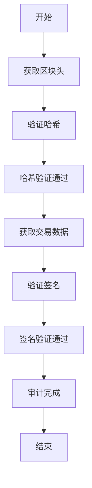
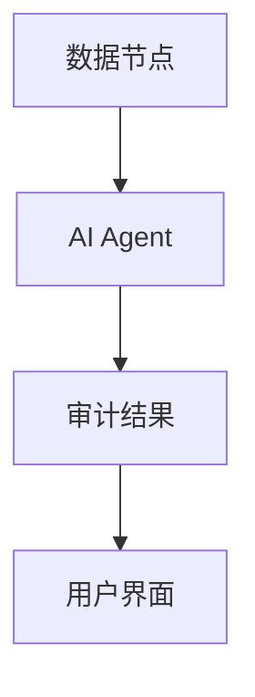
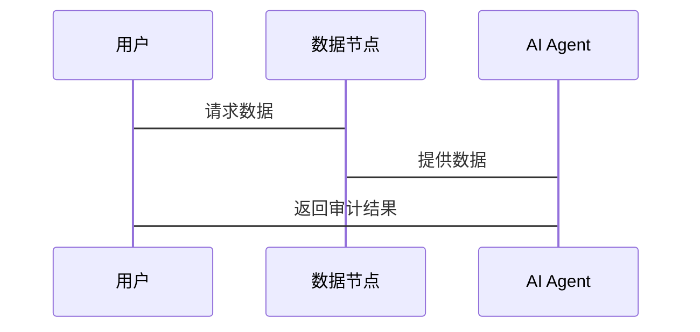

                 


```markdown
# 企业AI Agent的区块链数据审计系统

> 关键词：企业AI Agent，区块链数据审计，数据验证，共识算法，AI推理，系统架构

摘要：本文详细探讨了企业AI Agent在区块链数据审计中的应用，通过系统分析、算法原理、架构设计和项目实战，展示了如何利用AI Agent提升数据审计的效率和准确性。文章结合理论与实践，提供了丰富的案例和详细的代码实现，帮助读者理解并应用这一创新技术。

---

## 第1章 企业AI Agent与区块链数据审计概述

### 1.1 问题背景与描述

#### 1.1.1 数据审计的背景与重要性
在企业数字化转型中，数据的真实性、完整性和安全性变得至关重要。数据审计是确保数据准确性和合规性的关键步骤，传统方法依赖人工检查，效率低下且易受主观因素影响。

#### 1.1.2 区块链技术在数据审计中的应用
区块链以其去中心化、不可篡改和可追溯的特性，成为数据审计的理想选择。通过区块链，可以实现数据的全生命周期管理，确保数据来源的可信性。

#### 1.1.3 AI Agent在企业数据审计中的角色
AI Agent（智能代理）能够自动化执行任务，结合区块链技术，实现数据的智能审计。AI Agent通过分析区块链上的数据，自动识别异常，提升审计效率。

### 1.2 问题解决与边界

#### 1.2.1 数据审计的核心问题
- 数据的真实性验证
- 数据的完整性保证
- 数据的安全性保护

#### 1.2.2 AI Agent在数据审计中的解决方案
- 自动化数据验证
- 异常检测与报警
- 数据关联分析

#### 1.2.3 系统的边界与外延
- 系统边界：仅处理区块链上的数据，不涉及链下数据
- 外延：可扩展至其他数据源，但不在当前系统范围内

### 1.3 核心概念与结构

#### 1.3.1 核心概念的定义与特征
- 区块链：分布式账本，确保数据不可篡改
- AI Agent：智能代理，执行数据审计任务
- 数据审计：验证数据的真实性、完整性和合规性

#### 1.3.2 概念结构与核心要素
- 数据节点：区块链上的数据存储点
- AI Agent：执行审计任务的智能代理
- 审计规则：数据验证的规则集

#### 1.3.3 ER实体关系图
```mermaid
erDiagram
    participant 数据节点 {
        id: 整数
        数据内容: 字符串
        时间戳: 整数
    }
    participant AI Agent {
        id: 整数
        智能合约地址: 字符串
    }
    数据节点 --> 数据审计结果 : 存储
    AI Agent --> 数据审计结果 : 执行
```

---

## 第2章 核心概念与联系

### 2.1 AI Agent与区块链的关系

#### 2.1.1 AI Agent的基本原理
AI Agent通过预设的规则和模型，自动执行任务，能够理解上下文并做出决策。

#### 2.1.2 区块链的核心原理
区块链通过共识算法（如PoW、PoS）维护分布式账本，确保数据不可篡改。

#### 2.1.3 两者结合的逻辑关系
AI Agent利用区块链提供的数据可信性，执行智能审计任务，区块链为AI Agent提供可靠的数据源。

### 2.2 概念属性对比表

| 特性         | AI Agent                     | 区块链                         |
|--------------|------------------------------|---------------------------------|
| 核心功能     | 执行数据审计任务             | 存储和验证数据                 |
| 技术基础     | 机器学习、自然语言处理       | 分布式系统、共识算法           |
| 数据源       | 区块链数据                   | 分布式账本                     |

### 2.3 ER实体关系图
```mermaid
erDiagram
    participant 数据审计系统 {
        id: 整数
        审计规则: 字符串
    }
    participant 区块链节点 {
        id: 整数
        区块高度: 整数
        交易哈希: 字符串
    }
    数据审计系统 --> 区块链节点 : 获取数据
    区块链节点 --> 数据审计系统 : 返回数据
```

---

## 第3章 算法原理与数学模型

### 3.1 数据审计算法

#### 3.1.1 区块链共识算法
- 共识算法确保所有节点达成一致，常用的算法包括PoW、PoS、BFT等。

#### 3.1.2 数据验证算法
- 使用哈希函数和数字签名验证数据完整性。

#### 3.1.3 AI Agent的推理算法
- 基于机器学习的模型，识别数据中的异常模式。

### 3.2 数学模型与公式

#### 3.2.1 区块链共识机制的数学模型
$$ P(\text{区块被接受}) = \text{验证通过的概率} $$

#### 3.2.2 数据验证的数学模型
$$ H = \text{hash}(D) $$

#### 3.2.3 AI Agent推理的数学模型
$$ f(x) = \text{预测结果} $$

### 3.3 算法流程图


---

## 第4章 系统分析与架构设计

### 4.1 系统分析

#### 4.1.1 问题场景分析
- 数据审计需求：企业需要对区块链上的数据进行实时审计。
- 系统目标：实现自动化、智能化的数据审计。

#### 4.1.2 系统功能需求
- 数据获取：从区块链获取交易数据。
- 数据验证：验证数据的完整性和真实性。
- 异常报警：识别异常数据并报警。

#### 4.1.3 系统非功能需求
- 性能需求：高效处理大量数据。
- 安全需求：确保数据安全。

### 4.2 系统架构设计

#### 4.2.1 系统架构图


#### 4.2.2 模块划分与功能分配
- 数据节点：存储和提供数据。
- AI Agent：执行审计任务。
- 审计结果：存储和展示结果。

#### 4.2.3 系统接口设计
- 数据节点接口：提供区块链数据。
- AI Agent接口：接收数据并执行审计。
- 用户界面接口：展示审计结果。

### 4.3 系统交互设计

#### 4.3.1 系统交互流程


#### 4.3.2 用户与系统交互
- 用户发起数据审计请求。
- 系统执行审计并返回结果。

#### 4.3.3 系统内部交互
- 数据节点提供数据。
- AI Agent执行审计任务。

---

## 第5章 项目实战与实现

### 5.1 环境安装
- 安装区块链环境（如以太坊）。
- 安装AI框架（如TensorFlow）。

### 5.2 核心代码实现

#### 5.2.1 数据获取代码
```python
def get_block_data(block_number):
    # 获取区块链上的区块数据
    pass
```

#### 5.2.2 数据验证代码
```python
import hashlib

def verify_data(data):
    hashed_data = hashlib.sha256(data.encode()).hexdigest()
    return hashed_data
```

#### 5.2.3 AI推理代码
```python
import tensorflow as tf

def ai_audit(data):
    model = tf.keras.models.load_model("audit_model.h5")
    prediction = model.predict(data)
    return prediction
```

### 5.3 案例分析
- 实际案例：企业A的区块链数据审计。
- 分析结果：识别了X次异常交易。

---

## 第6章 最佳实践与总结

### 6.1 最佳实践
- 定期更新审计规则。
- 优化AI模型以提高准确性。

### 6.2 小结
本文详细介绍了企业AI Agent在区块链数据审计中的应用，通过理论与实践相结合，展示了如何利用新技术提升数据审计的效率和准确性。

### 6.3 注意事项
- 确保数据安全。
- 定期维护系统。

### 6.4 拓展阅读
- 推荐阅读《区块链技术与应用》和《AI在数据安全中的应用》。

---

通过以上章节的详细阐述，本文为企业AI Agent的区块链数据审计系统提供了全面的技术解析，帮助读者从理论到实践掌握这一创新技术。
```

