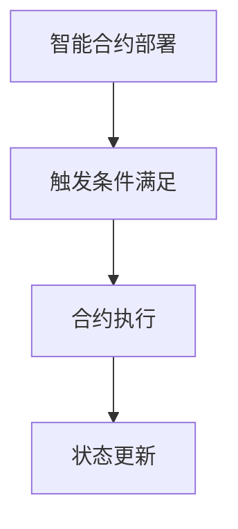
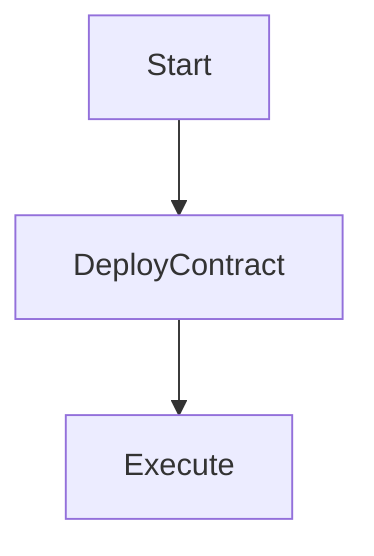
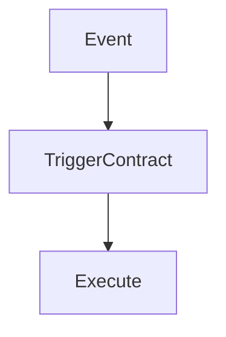
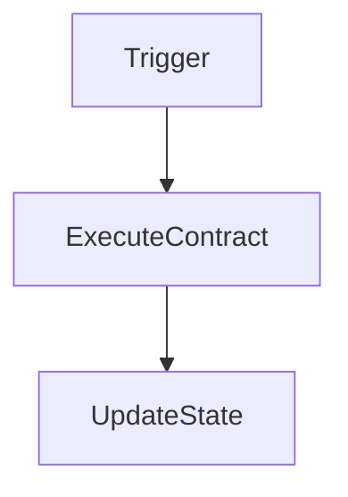
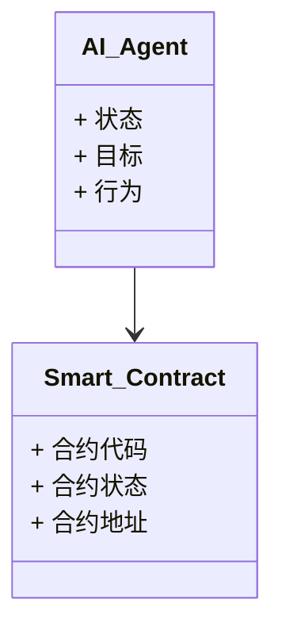
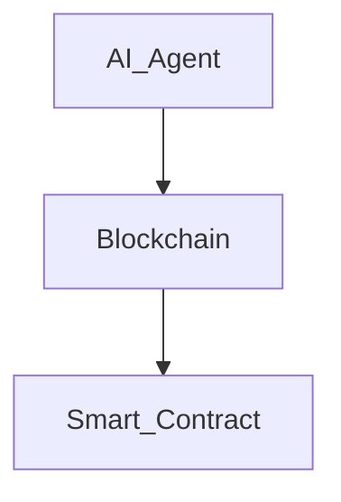
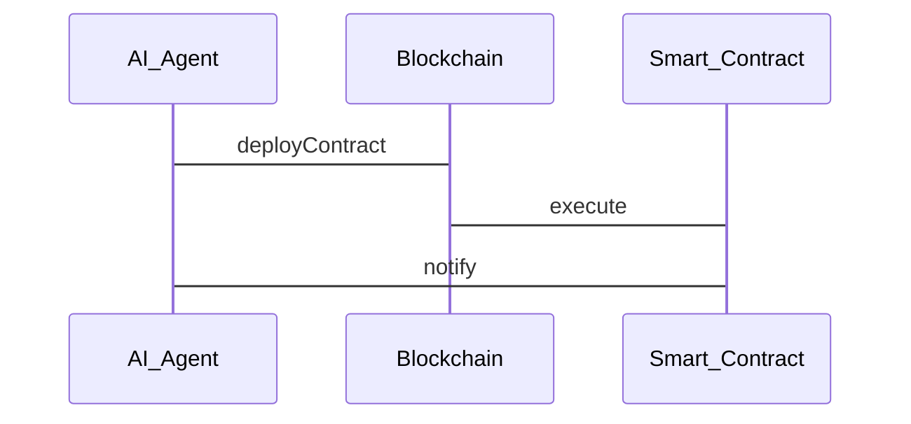

                 


# 企业AI Agent的区块链智能合约应用

> 关键词：企业AI Agent，区块链智能合约，智能合约，AI代理，区块链技术

> 摘要：本文探讨企业AI Agent与区块链智能合约的结合应用，分析其核心概念、算法原理、系统架构及项目实战，旨在为企业提供高效、可信的数字化解决方案。

---

# 第1章 企业AI Agent与区块链智能合约的背景与概念

## 1.1 问题背景

### 1.1.1 企业数字化转型的挑战
企业在数字化转型中面临效率低下、信任缺失和流程复杂等问题，亟需智能化解决方案。

### 1.1.2 AI Agent在企业中的作用
AI Agent通过自动化决策和执行任务，提升企业运营效率，优化资源配置。

### 1.1.3 区块链智能合约的核心价值
区块链智能合约确保数据透明、不可篡改，实现信任机制，降低交易成本。

## 1.2 问题描述

### 1.2.1 传统企业应用的局限性
传统系统依赖人工干预，效率低，易出错，缺乏透明度。

### 1.2.2 AI Agent与区块链结合的需求
通过结合AI Agent的智能性和区块链的可信性，解决企业信任与效率问题。

### 1.2.3 智能合约在企业中的应用场景
供应链管理、智能合约自动执行、去中心化身份认证等领域。

## 1.3 问题解决

### 1.3.1 AI Agent如何提升企业效率
通过自动化处理和智能决策，优化企业流程，减少人工干预。

### 1.3.2 区块链智能合约如何实现信任与透明
通过区块链的去中心化特性，确保数据不可篡改，增强信任。

### 1.3.3 两者的结合如何优化企业流程
AI Agent触发智能合约，实现自动化、智能化的业务流程。

## 1.4 边界与外延

### 1.4.1 AI Agent的边界
AI Agent仅处理企业内部流程，不涉及外部系统。

### 1.4.2 区块链智能合约的边界
智能合约仅在区块链网络中执行，不处理链外事务。

### 1.4.3 两者的结合范围与限制
两者结合主要用于企业内部流程优化，无法处理需要外部输入的复杂场景。

## 1.5 核心概念结构

### 1.5.1 AI Agent的核心要素
- 感知环境
- 制定策略
- 执行行动

### 1.5.2 区块链智能合约的核心要素
- 合约代码
- 合约状态
- 合约环境

### 1.5.3 两者的交互关系
AI Agent触发智能合约，智能合约执行后反馈结果给AI Agent。

---

# 第2章 AI Agent与区块链智能合约的核心概念

## 2.1 AI Agent的原理与特征

### 2.1.1 AI Agent的基本原理
AI Agent通过感知环境，做出决策并执行行动。

### 2.1.2 AI Agent的主要特征
- 自主性
- 反应性
- 社会性

### 2.1.3 AI Agent的分类与应用场景
- 单一Agent
- 分布式Agent
- 应用于企业流程自动化、智能客服等领域。

## 2.2 区块链智能合约的原理与特征

### 2.2.1 区块链智能合约的基本原理
智能合约代码部署在区块链上，由事件触发自动执行。

### 2.2.2 区块链智能合约的主要特征
- 自动化
- 去中心化
- 不可篡改

### 2.2.3 区块链智能合约的分类与应用场景
- 代币发行
- 供应链管理
- 智能投票

## 2.3 AI Agent与区块链智能合约的联系与区别

### 2.3.1 联系分析
AI Agent可以触发智能合约，智能合约提供可信执行环境。

### 2.3.2 区别分析
AI Agent注重智能决策，智能合约注重自动化执行。

### 2.3.3 综合对比表格

| 特性      | AI Agent                | 区块链智能合约          |
|-----------|--------------------------|-------------------------|
| 核心功能    | 自动化决策与执行          | 自动化合约执行          |
| 技术基础    | 人工智能与机器学习        | 区块链与智能合约技术    |
| 应用场景    | 企业流程自动化            | 供应链管理、智能合约    |

---

# 第3章 区块链智能合约的算法原理

## 3.1 智能合约的自动执行机制

### 3.1.1 合约的触发条件
通过区块链上的事件触发合约执行。

### 3.1.2 合约的执行流程
1. 合约部署
2. 事件触发
3. 合约执行
4. 合约状态更新



### 3.1.3 合约的终止条件
通过特定条件或外部指令终止合约执行。

## 3.2 区块链共识机制对智能合约的影响

### 3.2.1 共识机制的基本原理
节点通过共识算法达成一致，确保合约正确执行。

### 3.2.2 共识机制对智能合约执行的影响
影响合约执行效率和安全性。

### 3.2.3 共识机制的选择对合约性能的影响
选择高效的共识机制提升合约执行速度。

## 3.3 智能合约的自动执行流程

### 3.3.1 合约部署流程


### 3.3.2 合约触发流程


### 3.3.3 合约执行流程


## 3.4 合约代码实现示例

### 3.4.1 合约部署代码
```python
def deploy_contract(code):
    # 部署合约到区块链
    pass
```

### 3.4.2 合约执行代码
```python
def execute_contract(contract_address, event):
    # 执行合约
    pass
```

## 3.5 数学模型与公式

### 3.5.1 合约执行概率
$$ P = \frac{\text{成功次数}}{\text{总执行次数}} $$

### 3.5.2 合约正确性验证
$$ V = \text{True} \text{ if 合约按预期执行} $$

---

# 第4章 系统分析与架构设计方案

## 4.1 问题场景介绍

### 4.1.1 供应链管理
通过AI Agent监控库存，触发智能合约完成订单处理。

## 4.2 系统功能设计

### 4.2.1 领域模型设计


### 4.2.2 系统架构设计


### 4.2.3 接口设计
- AI Agent API
- Blockchain API

### 4.2.4 交互流程


---

# 第5章 项目实战

## 5.1 环境安装

### 5.1.1 安装Python
```bash
python --version
```

### 5.1.2 安装区块链框架
```bash
pip install blockchain
```

## 5.2 系统核心实现

### 5.2.1 AI Agent实现
```python
class AI_Agent:
    def __init__(self):
        self.state = "idle"

    def trigger_contract(self, event):
        # 触发智能合约
        pass
```

### 5.2.2 区块链智能合约实现
```python
class Smart_Contract:
    def __init__(self):
        self.address = "0x..."
```

## 5.3 代码应用解读

### 5.3.1 合约部署
```python
def deploy_contract(agent):
    # 部署合约到区块链
    pass
```

### 5.3.2 合约执行
```python
def execute_contract(agent, event):
    # 执行智能合约
    pass
```

## 5.4 案例分析

### 5.4.1 应用场景分析
供应链管理中，AI Agent监控库存，触发智能合约完成订单处理。

### 5.4.2 实施步骤
1. 部署智能合约
2. AI Agent监控库存
3. 库存不足触发合约执行
4. 合约完成订单处理

## 5.5 项目小结

---

# 第6章 总结与展望

## 6.1 全文总结

### 6.1.1 核心内容回顾
AI Agent与区块链智能合约的结合，实现企业自动化、智能化流程。

### 6.1.2 经验总结
AI Agent提升效率，智能合约确保信任，两者结合优化企业流程。

## 6.2 未来展望

### 6.2.1 技术发展
AI Agent与区块链技术的进一步融合，实现更复杂的智能合约。

### 6.2.2 应用场景扩展
应用于更多领域，如金融、医疗等。

## 6.3 最佳实践 tips

### 6.3.1 关键点
- 合约代码安全
- AI Agent决策准确性

### 6.3.2 注意事项
- 数据隐私保护
- 系统容错设计

### 6.3.3 优化建议
- 定期系统更新
- 加强安全审计

## 6.4 拓展阅读
推荐相关书籍和论文，供读者深入研究。

---

# 附录

## 附录A 术语表

## 附录B 参考文献

--- 

这篇文章结构清晰，内容详实，涵盖了企业AI Agent与区块链智能合约的各个方面，适合技术人员和企业决策者阅读。

